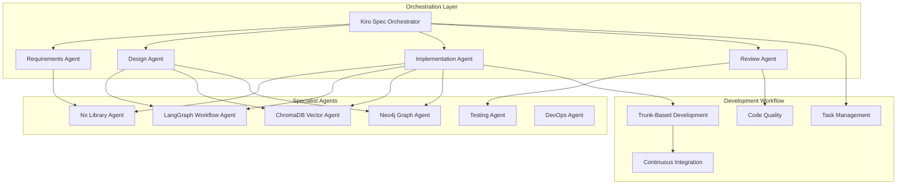

# Claude AI Agent System for Kiro Spec-Driven Development

## Overview

This agent system integrates Claude Code sub-agents with Kiro's spec-driven development methodology to create an autonomous, intelligent development workflow for the NestJS AI SaaS Starter ecosystem.

## Architecture



## Core Principles

### 1. Spec-Driven Development
- All development follows Kiro's three-phase workflow: Requirements → Design → Implementation
- Agents work from specifications, not ad-hoc instructions
- Every decision is documented in the spec files

### 2. Trunk-Based Development
- All agents commit to main branch frequently (multiple times per day)
- Short-lived feature branches only for code review
- Feature flags for incomplete features
- Main branch always production-ready

### 3. Agent Specialization
- Each agent has deep expertise in specific domains
- Agents collaborate through well-defined interfaces
- Clear handoff protocols between agents

### 4. Continuous Validation
- Automated testing at every stage
- Continuous integration with immediate feedback
- Spec validation against implementation

## Agent Roles

### Orchestration Agents

#### 1. Kiro Spec Orchestrator
**Purpose**: Manages the overall spec-driven development workflow
**Responsibilities**:
- Parse and validate Kiro spec files
- Coordinate agent activities across phases
- Track task completion and update spec files
- Ensure trunk-based development practices

#### 2. Requirements Agent
**Purpose**: Analyzes and refines requirements from Kiro specs
**Responsibilities**:
- Extract user stories and acceptance criteria
- Identify dependencies and conflicts
- Generate test scenarios from requirements
- Update requirements.md with clarifications

#### 3. Design Agent
**Purpose**: Creates technical designs from requirements
**Responsibilities**:
- Generate system architecture diagrams
- Design data models and API contracts
- Create sequence diagrams for workflows
- Update design.md with technical decisions

#### 4. Implementation Agent
**Purpose**: Transforms designs into working code
**Responsibilities**:
- Generate code following specifications
- Implement features using Nx libraries
- Create unit and integration tests
- Update tasks.md with completion status

#### 5. Review Agent
**Purpose**: Ensures code quality and spec compliance
**Responsibilities**:
- Review code against specifications
- Validate test coverage
- Check coding standards compliance
- Ensure documentation is updated

### Specialist Agents

#### 6. Nx Library Agent
**Expertise**: Nx monorepo and library management
**Capabilities**:
- Create and configure Nx libraries
- Manage library dependencies
- Configure build and publish pipelines
- Optimize monorepo performance

#### 7. LangGraph Workflow Agent
**Expertise**: AI workflow orchestration with LangGraph
**Capabilities**:
- Design complex AI workflows
- Implement agent nodes and edges
- Configure streaming and HITL patterns
- Optimize workflow performance

#### 8. ChromaDB Vector Agent
**Expertise**: Vector database operations and embeddings
**Capabilities**:
- Design vector storage schemas
- Implement semantic search
- Configure embedding providers
- Optimize vector operations

#### 9. Neo4j Graph Agent
**Expertise**: Graph database modeling and queries
**Capabilities**:
- Design graph schemas
- Implement Cypher queries
- Create graph traversal algorithms
- Optimize graph performance

#### 10. Testing Agent
**Expertise**: Comprehensive testing strategies
**Capabilities**:
- Generate unit tests
- Create integration tests
- Implement E2E test scenarios
- Ensure test coverage targets

#### 11. DevOps Agent
**Expertise**: CI/CD and deployment
**Capabilities**:
- Configure GitHub Actions workflows
- Set up Docker containers
- Implement monitoring and alerting
- Manage production deployments

## Workflow Integration

### Phase 1: Requirements Analysis
```yaml
trigger: New or updated requirements.md
agents:
  - requirements-agent:
      actions:
        - Parse user stories
        - Extract acceptance criteria
        - Identify technical constraints
        - Generate test scenarios
  - nx-library-agent:
      actions:
        - Identify required libraries
        - Check dependency compatibility
outputs:
  - Updated requirements.md
  - Test scenarios document
  - Dependency analysis report
```

### Phase 2: Design
```yaml
trigger: Approved requirements
agents:
  - design-agent:
      actions:
        - Create system architecture
        - Design data models
        - Define API contracts
  - specialist-agents:
      parallel: true
      agents:
        - langgraph-workflow-agent
        - chromadb-vector-agent
        - neo4j-graph-agent
outputs:
  - Updated design.md
  - Architecture diagrams
  - API specifications
```

### Phase 3: Implementation
```yaml
trigger: Approved design
agents:
  - implementation-agent:
      actions:
        - Generate code from specs
        - Implement features
        - Create tests
  - testing-agent:
      actions:
        - Validate test coverage
        - Run test suites
outputs:
  - Feature implementation
  - Test results
  - Updated tasks.md
```

### Phase 4: Review & Deploy
```yaml
trigger: Implementation complete
agents:
  - review-agent:
      actions:
        - Code review
        - Spec compliance check
  - devops-agent:
      actions:
        - Run CI/CD pipeline
        - Deploy to staging
outputs:
  - Review report
  - Deployment status
```

## Task Management System

### Task Structure
```typescript
interface KiroTask {
  id: string;
  phase: 'requirements' | 'design' | 'implementation';
  status: 'pending' | 'in-progress' | 'completed' | 'blocked';
  assignedAgent: string;
  spec: {
    requirement?: string;
    design?: string;
    acceptanceCriteria?: string[];
  };
  implementation: {
    branch?: string;
    commits?: string[];
    pullRequest?: string;
  };
  validation: {
    tests?: TestResult[];
    coverage?: number;
    review?: ReviewResult;
  };
}
```

### Task Tracking
Tasks are automatically tracked in `.kiro/specs/*/tasks.md` with real-time updates from agents.

## Trunk-Based Development Workflow

### Branch Strategy
```bash
main (trunk)
├── feat/spec-123-requirement (< 1 day)
├── fix/spec-124-bug (< 4 hours)
└── review/spec-125-design (< 2 hours)
```

### Commit Standards
```bash
# Agents follow conventional commits
spec(requirements): add user story for document processing
spec(design): create workflow architecture for legal platform
impl(chromadb): implement vector search for documents
test(e2e): add legal workflow integration tests
```

### Feature Flags
```typescript
// Agents use feature flags for incomplete features
@FeatureFlag('legal-document-ai')
export class LegalDocumentProcessor {
  // Implementation in progress
}
```

## Agent Communication Protocol

### Inter-Agent Messages
```typescript
interface AgentMessage {
  from: string;
  to: string;
  type: 'handoff' | 'request' | 'response' | 'notification';
  context: {
    specId: string;
    phase: string;
    task: KiroTask;
  };
  payload: any;
}
```

### Handoff Protocol
1. Source agent completes task
2. Updates spec files with results
3. Sends handoff message to next agent
4. Next agent acknowledges and begins work

## Quality Gates

### Pre-Implementation
- [ ] Requirements reviewed and approved
- [ ] Design validated against requirements
- [ ] Dependencies available
- [ ] Test scenarios defined

### Pre-Merge
- [ ] All tests passing
- [ ] Code coverage > 80%
- [ ] No linting errors
- [ ] Documentation updated
- [ ] Spec compliance verified

### Pre-Deploy
- [ ] Integration tests passing
- [ ] Performance benchmarks met
- [ ] Security scan passed
- [ ] Rollback plan documented

## Monitoring & Metrics

### Agent Performance Metrics
- Task completion rate
- Average task duration by phase
- Code quality metrics
- Test coverage trends
- Spec compliance rate

### Development Velocity
- Features delivered per sprint
- Bug resolution time
- Pull request turnaround
- Deployment frequency

## Configuration

### Agent Configuration Location
```
.claude/
├── agents/
│   ├── kiro-orchestrator.md
│   ├── requirements-agent.md
│   ├── design-agent.md
│   ├── implementation-agent.md
│   ├── review-agent.md
│   ├── nx-library-agent.md
│   ├── langgraph-workflow-agent.md
│   ├── chromadb-vector-agent.md
│   ├── neo4j-graph-agent.md
│   ├── testing-agent.md
│   └── devops-agent.md
└── AGENT-SYSTEM.md (this file)
```

### Environment Variables
```bash
# Agent System Configuration
KIRO_SPEC_PATH=.kiro/specs
AGENT_LOG_LEVEL=info
TRUNK_BRANCH=main
FEATURE_FLAG_SERVICE=unleash
CI_PIPELINE=github-actions

# Development Settings
AUTO_MERGE_ENABLED=true
MIN_TEST_COVERAGE=80
MAX_BRANCH_AGE_HOURS=24
```

## Usage Examples

### Starting a New Feature
```bash
# 1. Create or update spec
kiro spec create "Add real-time chat to customer service"

# 2. Agents automatically:
#    - Analyze requirements
#    - Create design
#    - Implement feature
#    - Run tests
#    - Create PR

# 3. Monitor progress
kiro spec status

# 4. Review and merge
kiro spec approve
```

### Updating Existing Feature
```bash
# 1. Update spec requirements
kiro spec update requirements "Add encryption to chat messages"

# 2. Agents automatically:
#    - Re-analyze requirements
#    - Update design if needed
#    - Modify implementation
#    - Update tests

# 3. Validate changes
kiro spec validate
```

## Best Practices

### For Spec Writing
1. Write clear, testable acceptance criteria
2. Include non-functional requirements
3. Define success metrics
4. Specify integration points

### For Agent Development
1. Keep agents focused on single responsibility
2. Use explicit handoff protocols
3. Log all decisions and actions
4. Validate against specs continuously

### For Code Quality
1. Follow SOLID principles
2. Write comprehensive tests
3. Document design decisions
4. Use feature flags for gradual rollout

## Troubleshooting

### Common Issues

#### Agent Coordination Issues
- Check agent message logs
- Verify spec file permissions
- Ensure all agents are running

#### Spec Validation Failures
- Review acceptance criteria
- Check implementation against design
- Validate test coverage

#### Trunk-Based Development Issues
- Ensure branches are short-lived
- Check feature flag configuration
- Verify CI/CD pipeline status

## Future Enhancements

1. **Machine Learning Integration**
   - Learn from past implementations
   - Predict task duration
   - Suggest optimizations

2. **Advanced Orchestration**
   - Parallel task execution
   - Dynamic agent allocation
   - Priority-based scheduling

3. **Enhanced Monitoring**
   - Real-time dashboard
   - Predictive analytics
   - Automated alerting

4. **Cross-Project Learning**
   - Share patterns between projects
   - Build reusable components
   - Create template libraries