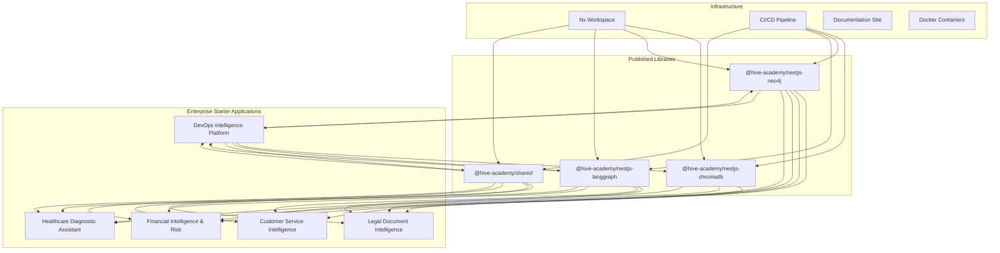

# AI SaaS Starter Ecosystem - Design Document

## Overview

This design document outlines the technical architecture for transforming our AI SaaS starter into a comprehensive ecosystem of publishable libraries and example applications. The system will provide developers with production-ready tools for building agentic AI applications.

## Architecture

### High-Level System Architecture



## Components and Interfaces

### 1. Library Publishing System

#### Nx Release Configuration

```typescript
// nx.json release configuration
{
  "release": {
    "projects": [
      "libs/nestjs-chromadb",
      "libs/nestjs-neo4j",
      "libs/nestjs-langgraph",
      "libs/shared"
    ],
    "version": {
      "conventionalCommits": true,
      "generatorOptions": {
        "packageRoot": "dist/libs/{projectName}",
        "currentVersionResolver": "git-tag"
      }
    },
    "changelog": {
      "workspaceChangelog": {
        "createRelease": "github",
        "file": "CHANGELOG.md",
        "renderer": "nx/changelog-renderer"
      },
      "projectChangelogs": {
        "createRelease": "github",
        "file": "CHANGELOG.md",
        "renderer": "nx/changelog-renderer"
      }
    },
    "git": {
      "commit": true,
      "tag": true,
      "commitMessage": "chore(release): publish {version}",
      "tagMessage": "v{version}"
    }
  }
}
```

#### Library Project Configuration

Each library will be converted to publishable with the following structure:

```typescript
// libs/nestjs-chromadb/project.json
{
  "name": "nestjs-chromadb",
  "projectType": "library",
  "sourceRoot": "libs/nestjs-chromadb/src",
  "targets": {
    "build": {
      "executor": "@nx/js:tsc",
      "outputs": ["{options.outputPath}"],
      "options": {
        "outputPath": "dist/libs/nestjs-chromadb",
        "main": "libs/nestjs-chromadb/src/index.ts",
        "tsConfig": "libs/nestjs-chromadb/tsconfig.lib.json",
        "assets": [
          "libs/nestjs-chromadb/*.md",
          {
            "input": "./libs/nestjs-chromadb",
            "glob": "**/*.!(ts)",
            "output": "./"
          }
        ]
      }
    },
    "publish": {
      "executor": "nx:run-commands",
      "options": {
        "command": "npm publish dist/libs/nestjs-chromadb --access public"
      },
      "dependsOn": ["build"]
    }
  }
}
```

### 2. Starter Applications Architecture

#### Enterprise Application Structure

```
apps/
├── legal-document-intelligence/   # Legal Tech Platform
│   ├── api/                      # NestJS Backend
│   │   ├── src/
│   │   │   ├── app/
│   │   │   │   ├── agents/       # Legal specialist agents
│   │   │   │   │   ├── contract-analyzer.agent.ts
│   │   │   │   │   ├── compliance-checker.agent.ts
│   │   │   │   │   └── legal-researcher.agent.ts
│   │   │   │   ├── workflows/    # Supervisor orchestrated workflows
│   │   │   │   │   ├── document-review.workflow.ts
│   │   │   │   │   └── legal-research.workflow.ts
│   │   │   │   ├── rag/          # Agentic RAG for legal research
│   │   │   │   ├── hitl/         # Human-in-the-loop approvals
│   │   │   │   └── compliance/   # Regulatory compliance
│   │   │   └── main.ts
│   │   └── Dockerfile
│   ├── frontend/                 # Angular Frontend
│   │   ├── src/
│   │   │   ├── app/
│   │   │   │   ├── case-management/
│   │   │   │   ├── document-analysis/
│   │   │   │   ├── legal-graph/
│   │   │   │   └── approval-dashboard/
│   │   │   └── main.ts
│   │   └── Dockerfile
│   └── docker-compose.yml
│
├── customer-service-intelligence/ # Customer Service Platform
│   ├── api/                      # NestJS Backend
│   │   ├── src/
│   │   │   ├── app/
│   │   │   │   ├── agents/       # Specialized service agents
│   │   │   │   │   ├── technical-support.agent.ts
│   │   │   │   │   ├── billing-specialist.agent.ts
│   │   │   │   │   └── product-expert.agent.ts
│   │   │   │   ├── supervisor/   # Supervisor agent orchestration
│   │   │   │   ├── streaming/    # Real-time agent streaming
│   │   │   │   ├── tools/        # Dynamic tool discovery
│   │   │   │   └── escalation/   # HITL escalation workflows
│   │   │   └── main.ts
│   │   └── Dockerfile
│   ├── frontend/                 # Angular Frontend
│   │   ├── src/
│   │   │   ├── app/
│   │   │   │   ├── agent-dashboard/
│   │   │   │   ├── customer-interactions/
│   │   │   │   ├── real-time-monitoring/
│   │   │   │   └── performance-analytics/
│   │   │   └── main.ts
│   │   └── Dockerfile
│   └── docker-compose.yml
│
├── financial-intelligence/       # Financial Analysis Platform
│   ├── api/                      # NestJS Backend
│   │   ├── src/
│   │   │   ├── app/
│   │   │   │   ├── agents/       # Financial specialist agents
│   │   │   │   │   ├── market-analyst.agent.ts
│   │   │   │   │   ├── risk-assessor.agent.ts
│   │   │   │   │   └── compliance-officer.agent.ts
│   │   │   │   ├── rag/          # Financial data RAG
│   │   │   │   ├── risk/         # Risk assessment workflows
│   │   │   │   ├── compliance/   # Regulatory compliance
│   │   │   │   └── trading/      # Trading decision support
│   │   │   └── main.ts
│   │   └── Dockerfile
│   ├── frontend/                 # Angular Frontend
│   │   ├── src/
│   │   │   ├── app/
│   │   │   │   ├── portfolio-dashboard/
│   │   │   │   ├── risk-monitoring/
│   │   │   │   ├── market-analysis/
│   │   │   │   └── compliance-tracking/
│   │   │   └── main.ts
│   │   └── Dockerfile
│   └── docker-compose.yml
│
├── healthcare-diagnostic/        # Healthcare AI Platform
│   ├── api/                      # NestJS Backend
│   │   ├── src/
│   │   │   ├── app/
│   │   │   │   ├── agents/       # Medical specialist agents
│   │   │   │   │   ├── diagnostician.agent.ts
│   │   │   │   │   ├── pharmacist.agent.ts
│   │   │   │   │   └── specialist.agent.ts
│   │   │   │   ├── medical-rag/  # Medical knowledge RAG
│   │   │   │   ├── diagnosis/    # Diagnostic workflows
│   │   │   │   ├── approval/     # Physician approval workflows
│   │   │   │   └── compliance/   # Medical ethics compliance
│   │   │   └── main.ts
│   │   └── Dockerfile
│   ├── frontend/                 # Angular Frontend
│   │   ├── src/
│   │   │   ├── app/
│   │   │   │   ├── patient-dashboard/
│   │   │   │   ├── diagnostic-assistant/
│   │   │   │   ├── medical-graph/
│   │   │   │   └── physician-approval/
│   │   │   └── main.ts
│   │   └── Dockerfile
│   └── docker-compose.yml
│
└── devops-intelligence/          # DevOps Automation Platform
    ├── api/                      # NestJS Backend
    │   ├── src/
    │   │   ├── app/
    │   │   │   ├── agents/       # DevOps specialist agents
    │   │   │   │   ├── sre.agent.ts
    │   │   │   │   ├── security.agent.ts
    │   │   │   │   └── performance.agent.ts
    │   │   │   ├── infrastructure/ # Infrastructure-as-code
    │   │   │   ├── incidents/    # Automated incident response
    │   │   │   ├── deployment/   # Continuous deployment
    │   │   │   └── monitoring/   # System monitoring
    │   │   └── main.ts
    │   └── Dockerfile
    ├── frontend/                 # Angular Frontend
    │   ├── src/
    │   │   ├── app/
    │   │   │   ├── infrastructure-dashboard/
    │   │   │   ├── incident-management/
    │   │   │   ├── deployment-pipeline/
    │   │   │   └── system-monitoring/
    │   │   └── main.ts
    │   └── Dockerfile
    └── docker-compose.yml
```

#### Shared Frontend Components Library

```typescript
// libs/ui-components/src/lib/components/
export interface ComponentLibrary {
  // Graph Visualization
  GraphVisualization: React.ComponentType<GraphVisualizationProps>;
  NetworkDiagram: React.ComponentType<NetworkDiagramProps>;

  // AI Workflow Components
  WorkflowDesigner: React.ComponentType<WorkflowDesignerProps>;
  AgentCard: React.ComponentType<AgentCardProps>;
  StreamingOutput: React.ComponentType<StreamingOutputProps>;

  // Document Processing
  DocumentUploader: React.ComponentType<DocumentUploaderProps>;
  SearchInterface: React.ComponentType<SearchInterfaceProps>;
  ResultsList: React.ComponentType<ResultsListProps>;

  // Common UI
  LoadingSpinner: React.ComponentType<LoadingSpinnerProps>;
  ErrorBoundary: React.ComponentType<ErrorBoundaryProps>;
  NotificationSystem: React.ComponentType<NotificationSystemProps>;
}
```

### 3. Integration Patterns

#### Multi-Library Integration Pattern

```typescript
// Example: Document Processing Service
@Injectable()
export class DocumentProcessingService {
  constructor(@InjectChromaDB() private chromaDB: ChromaDBService, @InjectNeo4j() private neo4j: Neo4jService, private workflowService: WorkflowGraphBuilderService) {}

  async processDocument(file: Express.Multer.File): Promise<ProcessingResult> {
    // 1. Create AI workflow for document processing
    const workflow = this.workflowService.createWorkflow('document-processing').addNode('extract-text', this.extractText).addNode('extract-entities', this.extractEntities).addNode('store-embeddings', this.storeEmbeddings).addNode('create-relationships', this.createRelationships).addEdge('extract-text', 'extract-entities').addEdge('extract-entities', 'store-embeddings').addEdge('extract-entities', 'create-relationships').build();

    // 2. Execute workflow
    const result = await workflow.execute({ file });

    return result;
  }

  private async storeEmbeddings(state: WorkflowState) {
    const { text, entities } = state;

    // Store document embeddings in ChromaDB
    await this.chromaDB.addDocuments('documents', [
      {
        id: state.documentId,
        document: text,
        metadata: { entities, timestamp: new Date() },
      },
    ]);

    return { ...state, embeddingsStored: true };
  }

  private async createRelationships(state: WorkflowState) {
    const { entities } = state;

    // Create entity relationships in Neo4j
    await this.neo4j.write(async (session) => {
      for (const entity of entities) {
        await session.run(
          `
          MERGE (e:Entity {name: $name, type: $type})
          MERGE (d:Document {id: $docId})
          MERGE (d)-[:CONTAINS]->(e)
        `,
          {
            name: entity.name,
            type: entity.type,
            docId: state.documentId,
          }
        );
      }
    });

    return { ...state, relationshipsCreated: true };
  }
}
```

## Data Models

### Document Processing Data Flow

```typescript
interface DocumentProcessingFlow {
  // Input
  document: {
    id: string;
    content: string;
    metadata: DocumentMetadata;
  };

  // ChromaDB Storage
  embeddings: {
    collection: 'documents';
    vectors: number[][];
    metadata: {
      entities: Entity[];
      relationships: Relationship[];
      timestamp: Date;
    };
  };

  // Neo4j Storage
  graph: {
    nodes: {
      Document: { id: string; title: string; type: string };
      Entity: { name: string; type: string; confidence: number };
    };
    relationships: {
      CONTAINS: { from: 'Document'; to: 'Entity' };
      RELATES_TO: { from: 'Entity'; to: 'Entity'; strength: number };
    };
  };

  // LangGraph Workflow
  workflow: {
    state: WorkflowState;
    nodes: WorkflowNode[];
    execution: ExecutionTrace;
  };
}
```

### AI Agent Workflow Data Model

```typescript
interface AgentWorkflowSystem {
  // Workflow Definition
  workflow: {
    id: string;
    name: string;
    description: string;
    nodes: WorkflowNode[];
    edges: WorkflowEdge[];
    agents: AgentAssignment[];
  };

  // Execution State
  execution: {
    id: string;
    workflowId: string;
    status: ExecutionStatus;
    currentNode: string;
    state: WorkflowState;
    history: ExecutionStep[];
    approvals: ApprovalRequest[];
  };

  // Agent Definitions
  agents: {
    [AgentType.RESEARCHER]: {
      tools: ['web_search', 'document_retrieval'];
      capabilities: ResearchCapabilities;
    };
    [AgentType.ANALYST]: {
      tools: ['data_analysis', 'visualization'];
      capabilities: AnalysisCapabilities;
    };
  };
}
```

## Error Handling

### Library Error Handling Strategy

```typescript
// Standardized error types across all libraries
export abstract class AnubisError extends Error {
  abstract readonly code: string;
  abstract readonly category: ErrorCategory;

  constructor(message: string, public readonly context?: Record<string, any>) {
    super(message);
    this.name = this.constructor.name;
  }
}

export class ChromaDBConnectionError extends AnubisError {
  readonly code = 'CHROMADB_CONNECTION_ERROR';
  readonly category = ErrorCategory.CONNECTION;
}

export class Neo4jQueryError extends AnubisError {
  readonly code = 'NEO4J_QUERY_ERROR';
  readonly category = ErrorCategory.QUERY;
}

export class WorkflowExecutionError extends AnubisError {
  readonly code = 'WORKFLOW_EXECUTION_ERROR';
  readonly category = ErrorCategory.EXECUTION;
}
```

### Application Error Handling

```typescript
// Global error handler for starter applications
@Catch()
export class GlobalExceptionFilter implements ExceptionFilter {
  catch(exception: unknown, host: ArgumentsHost) {
    const ctx = host.switchToHttp();
    const response = ctx.getResponse<Response>();
    const request = ctx.getRequest<Request>();

    let status = HttpStatus.INTERNAL_SERVER_ERROR;
    let message = 'Internal server error';
    let code = 'INTERNAL_ERROR';

    if (exception instanceof AnubisError) {
      status = this.mapErrorCategoryToHttpStatus(exception.category);
      message = exception.message;
      code = exception.code;
    }

    const errorResponse = {
      statusCode: status,
      timestamp: new Date().toISOString(),
      path: request.url,
      error: {
        code,
        message,
        context: exception instanceof AnubisError ? exception.context : undefined,
      },
    };

    response.status(status).json(errorResponse);
  }
}
```

## Testing Strategy

### Library Testing Approach

```typescript
// Integration testing pattern for libraries
describe('ChromaDB + Neo4j + LangGraph Integration', () => {
  let testingModule: TestingModule;
  let chromaService: ChromaDBService;
  let neo4jService: Neo4jService;
  let workflowService: WorkflowGraphBuilderService;

  beforeEach(async () => {
    testingModule = await Test.createTestingModule({
      imports: [ChromaDBModule.forRoot(testChromaConfig), Neo4jModule.forRoot(testNeo4jConfig), NestjsLanggraphModule.forRoot(testLangGraphConfig)],
    }).compile();

    chromaService = testingModule.get<ChromaDBService>(ChromaDBService);
    neo4jService = testingModule.get<Neo4jService>(Neo4jService);
    workflowService = testingModule.get<WorkflowGraphBuilderService>(WorkflowGraphBuilderService);
  });

  it('should process document through complete workflow', async () => {
    // Test complete integration flow
    const document = createTestDocument();
    const workflow = createDocumentProcessingWorkflow();

    const result = await workflow.execute({ document });

    // Verify ChromaDB storage
    const embeddings = await chromaService.getDocuments('test-collection', [document.id]);
    expect(embeddings).toHaveLength(1);

    // Verify Neo4j storage
    const graphData = await neo4jService.read((session) => session.run('MATCH (d:Document {id: $id}) RETURN d', { id: document.id }));
    expect(graphData.records).toHaveLength(1);

    // Verify workflow completion
    expect(result.status).toBe('completed');
  });
});
```

### Application Testing Strategy

```typescript
// E2E testing for starter applications
describe('Document Processing App E2E', () => {
  let app: INestApplication;
  let angularApp: AngularTestApp;

  beforeAll(async () => {
    // Start backend
    app = await createTestApp();
    await app.listen(3001);

    // Start frontend
    angularApp = await createAngularTestApp();
  });

  it('should complete document upload and processing flow', async () => {
    // 1. Upload document via frontend
    await angularApp.uploadDocument('test-document.pdf');

    // 2. Verify processing started
    const processingStatus = await angularApp.getProcessingStatus();
    expect(processingStatus).toBe('processing');

    // 3. Wait for completion
    await angularApp.waitForProcessingComplete();

    // 4. Verify results displayed
    const results = await angularApp.getProcessingResults();
    expect(results.entities).toHaveLength(greaterThan(0));
    expect(results.relationships).toHaveLength(greaterThan(0));

    // 5. Test search functionality
    const searchResults = await angularApp.searchSimilarDocuments('test query');
    expect(searchResults).toHaveLength(greaterThan(0));
  });
});
```

## Performance Considerations

### Library Optimization

1. **Connection Pooling**: All database connections use proper pooling
2. **Caching Strategy**: Implement Redis caching for frequently accessed data
3. **Batch Operations**: Optimize bulk operations for large datasets
4. **Streaming**: Use streaming for large file processing and real-time updates

### Application Optimization

1. **Lazy Loading**: Angular modules and routes are lazy-loaded
2. **Code Splitting**: Webpack code splitting for optimal bundle sizes
3. **CDN Integration**: Static assets served via CDN
4. **Database Indexing**: Proper indexing strategies for Neo4j and ChromaDB

## Security Architecture

### Authentication & Authorization

```typescript
// JWT-based authentication with role-based access control
@Injectable()
export class AuthGuard implements CanActivate {
  canActivate(context: ExecutionContext): boolean {
    const request = context.switchToHttp().getRequest();
    const user = request.user;

    // Check user permissions for AI operations
    return this.checkAIPermissions(user, request.route);
  }

  private checkAIPermissions(user: User, route: string): boolean {
    const requiredPermissions = this.getRoutePermissions(route);
    return user.permissions.some((p) => requiredPermissions.includes(p));
  }
}
```

### Data Security

1. **Encryption**: All sensitive data encrypted at rest and in transit
2. **API Security**: Rate limiting, input validation, and CORS configuration
3. **Database Security**: Proper access controls and query parameterization
4. **Audit Logging**: Complete audit trail for all AI operations

## Deployment Architecture

### Docker Configuration

```dockerfile
# Multi-stage build for production optimization
FROM node:18-alpine AS builder
WORKDIR /app
COPY package*.json ./
RUN npm ci --only=production

FROM node:18-alpine AS runtime
WORKDIR /app
COPY --from=builder /app/node_modules ./node_modules
COPY dist/ ./dist/
EXPOSE 3000
CMD ["node", "dist/main.js"]
```

### Kubernetes Deployment

```yaml
# Production deployment configuration
apiVersion: apps/v1
kind: Deployment
metadata:
  name: ai-saas-starter
spec:
  replicas: 3
  selector:
    matchLabels:
      app: ai-saas-starter
  template:
    metadata:
      labels:
        app: ai-saas-starter
    spec:
      containers:
        - name: api
          image: hive-academy/ai-saas-starter:latest
          ports:
            - containerPort: 3000
          env:
            - name: NODE_ENV
              value: 'production'
          resources:
            requests:
              memory: '512Mi'
              cpu: '250m'
            limits:
              memory: '1Gi'
              cpu: '500m'
```

This design provides a comprehensive foundation for building the AI SaaS starter ecosystem with proper separation of concerns, scalability, and maintainability.
