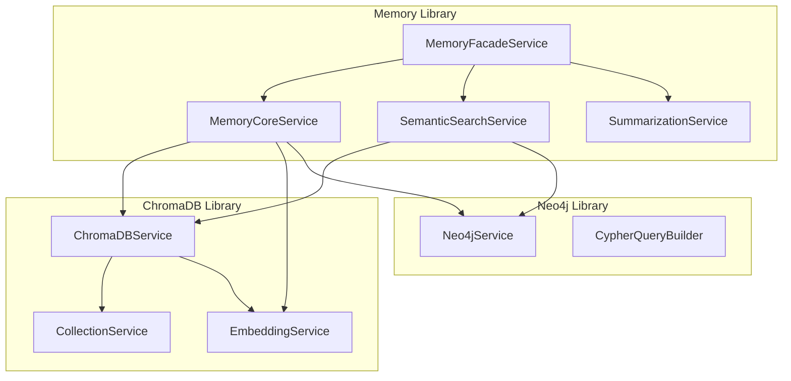

# Design Document

## Overview

This design outlines the refactoring of the memory library to eliminate duplicate functionality and properly integrate with the existing `nestjs-chromadb` and `nestjs-neo4j` libraries. The refactored architecture will maintain the high-level memory management API while delegating all storage operations to the specialized libraries.

## Architecture

### Current Architecture Issues

- **Duplicate Embedding Services**: MemoryEmbeddingService duplicates ChromaDB's EmbeddingService
- **Duplicate Storage Integration**: MemoryStorageService reimplements ChromaDB functionality
- **Duplicate Graph Integration**: MemoryRelationshipService reimplements Neo4j functionality
- **Inconsistent Types**: Multiple interface definitions for the same concepts
- **Direct Client Usage**: Services directly use ChromaDB client and Neo4j driver instead of service abstractions

### Target Architecture



### Service Responsibilities

- **MemoryFacadeService**: High-level orchestration and public API
- **MemoryCoreService**: Core memory operations, delegates to ChromaDB and Neo4j services
- **SemanticSearchService**: Advanced search combining vector and graph data
- **SummarizationService**: LLM-based conversation summarization (memory-specific)
- **ChromaDBService**: All vector storage and embedding operations
- **Neo4jService**: All graph database operations

## Components and Interfaces

### Memory Module Configuration

```typescript
interface MemoryModuleOptions {
  // Memory-specific configuration
  retention?: MemoryRetentionPolicy;
  enableSemanticSearch?: boolean;
  enableAutoSummarization?: boolean;

  // Delegate to underlying services
  chromadb: ChromaDBModuleOptions;
  neo4j: Neo4jModuleOptions;
}
```

### Service Integration Points

#### MemoryCoreService Integration

```typescript
@Injectable()
export class MemoryCoreService implements MemoryServiceInterface {
  constructor(private readonly chromaDBService: ChromaDBService, private readonly neo4jService: Neo4jService, private readonly configService: ConfigService) {}

  async store(threadId: string, content: string, metadata?: Partial<MemoryMetadata>): Promise<MemoryEntry> {
    // Use ChromaDBService for vector storage
    // Use Neo4jService for relationship storage
  }
}
```

#### SemanticSearchService Integration

```typescript
@Injectable()
export class SemanticSearchService {
  constructor(private readonly chromaDBService: ChromaDBService, private readonly neo4jService: Neo4jService) {}

  async hybridSearch(options: MemorySearchOptions): Promise<MemoryEntry[]> {
    // Use ChromaDBService for vector similarity search
    // Use Neo4jService for relationship-based search
    // Combine and rank results
  }
}
```

### Type System Consolidation

#### Unified Memory Interfaces

```typescript
// Remove duplicate interfaces, use single definitions
export interface MemoryEntry {
  id: string;
  threadId: string;
  content: string;
  embedding?: readonly number[];
  metadata: MemoryMetadata;
  createdAt: Date;
  lastAccessedAt?: Date;
  accessCount: number;
  relevanceScore?: number;
}

// Extend ChromaDB types where appropriate
export interface MemoryDocument extends ChromaDocument {
  threadId: string;
  accessCount: number;
  lastAccessedAt?: Date;
}
```

#### Service Interface Contracts

```typescript
// Use existing service interfaces from libraries
export interface MemoryStorageAdapter {
  chromaDBService: ChromaDBServiceInterface;
  neo4jService: Neo4jServiceInterface;
}
```

## Data Models

### Memory Storage Model

```typescript
// ChromaDB Collection Schema
interface MemoryVectorDocument {
  id: string; // Memory entry ID
  document: string; // Memory content
  embedding: number[]; // Generated by ChromaDB EmbeddingService
  metadata: {
    threadId: string;
    type: MemoryType;
    importance: number;
    createdAt: string;
    accessCount: number;
    tags: string[];
  };
}
```

### Memory Graph Model

```typescript
// Neo4j Node and Relationship Schema
interface MemoryNode {
  id: string;
  threadId: string;
  content: string;
  type: MemoryType;
  createdAt: Date;
  accessCount: number;
  importance: number;
}

interface MemoryRelationship {
  type: 'FOLLOWS' | 'SIMILAR_TO' | 'REFERENCES' | 'SUMMARIZES';
  similarity?: number;
  strength?: number;
  createdAt: Date;
}
```

## Error Handling

### Error Wrapping Strategy

```typescript
// Wrap underlying service errors with memory context
export class MemoryStorageError extends Error {
  constructor(message: string, public readonly cause: ChromaDBError | Neo4jError, public readonly context: MemoryErrorContext) {
    super(message);
  }
}

interface MemoryErrorContext {
  operation: string;
  threadId?: string;
  memoryId?: string;
  service: 'chromadb' | 'neo4j' | 'embedding';
}
```

### Error Recovery

- **ChromaDB Failures**: Fallback to basic storage without embeddings
- **Neo4j Failures**: Continue with vector-only operations
- **Embedding Failures**: Store content without semantic search capabilities
- **Configuration Errors**: Provide clear validation messages

## Testing Strategy

### Unit Testing

- **Service Integration**: Mock ChromaDBService and Neo4jService
- **Error Handling**: Test error wrapping and recovery scenarios
- **Type Safety**: Ensure all interfaces are properly typed
- **Configuration**: Test module configuration validation

### Integration Testing

- **End-to-End Memory Operations**: Test complete memory workflows
- **Service Coordination**: Test interaction between ChromaDB and Neo4j
- **Performance**: Test with realistic data volumes
- **Health Checks**: Test service connectivity and health monitoring

### API Testing

- **Clean API Design**: Test new API design for usability and consistency
- **Configuration Validation**: Test new configuration format validation
- **Data Operations**: Test all memory operations with realistic data

## Implementation Phases

### Phase 1: Service Integration

- Refactor MemoryCoreService to use ChromaDBService and Neo4jService
- Remove duplicate embedding functionality
- Update dependency injection and module configuration

### Phase 2: Type System Cleanup

- Consolidate duplicate interfaces
- Fix TypeScript compilation errors
- Update import/export statements

### Phase 3: Advanced Features

- Refactor SemanticSearchService for hybrid search
- Update SummarizationService integration
- Implement comprehensive error handling

### Phase 4: Testing and Validation

- Add comprehensive test coverage
- Validate backward compatibility
- Performance testing and optimization
