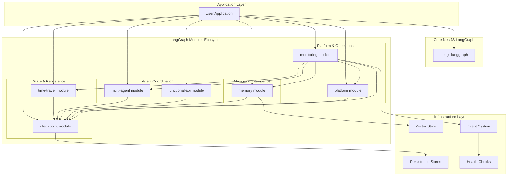

# Design Document - Plug-and-Play Enterprise LangGraph Modules

## Overview

This design document outlines the architecture for creating **enterprise-ready, plug-and-play LangGraph modules** that transform LangGraph's basic building blocks into complete, production-ready solutions. Rather than simple integration wrappers, we create comprehensive modules that provide sophisticated functionality through simple APIs.

Each module follows the proven pattern established by our multi-agent system: **simple APIs backed by enterprise-grade implementations**. Developers get plug-and-play functionality with zero configuration, while the underlying architecture provides enterprise features like health monitoring, metrics collection, error handling, and observability.

The design follows SOLID principles with focused services, comprehensive interfaces, and full NestJS integration including dependency injection, configuration management, and lifecycle hooks.

## Implementation Status (Updated: 2025-01-15)

**✅ PRODUCTION READY**
- **Checkpoint Module**: Complete enterprise checkpoint management with multi-backend support, health monitoring, cleanup policies
- **Multi-Agent Module**: Complete plug-and-play agent networks (supervisor, swarm, hierarchical) with built-in orchestration

**🔄 NEEDS COMPLETION**  
- **Memory Module**: Structure exists but needs real implementations (fix placeholders) and SOLID refactoring
- **Functional-API Module**: Decorators work but checkpoint integration needs completion

**⏳ PLANNED DEVELOPMENT**
- **Time-Travel Module**: Structure exists, needs full implementation
- **Platform Module**: Basic structure, needs enhancement and verification
- **Monitoring Module**: Minimal implementation, needs comprehensive development

## Enterprise Module Specifications

### @langgraph-modules/checkpoint ✅ PRODUCTION READY

**Purpose**: Enterprise-grade checkpoint management with plug-and-play APIs
**Dependencies**: None (foundational module)
**Status**: ✅ **FULLY IMPLEMENTED** with SOLID architecture and comprehensive enterprise features

**Plug-and-Play APIs**:
```typescript
// Simple API - Zero configuration required
await checkpointManager.saveCheckpoint(threadId, checkpoint, metadata);
const checkpoint = await checkpointManager.loadCheckpoint(threadId, checkpointId);
const checkpoints = await checkpointManager.listCheckpoints(threadId, options);

// Enterprise features built-in
const health = await checkpointManager.getHealthStatus();
const metrics = await checkpointManager.getMetrics();
const report = await checkpointManager.getSystemReport();
```

**Enterprise Architecture (SOLID)**:
- ✅ **CheckpointSaverFactory**: Creates and manages checkpoint savers (Memory, Redis, PostgreSQL, SQLite)
- ✅ **CheckpointRegistryService**: Centralized saver registry with health monitoring
- ✅ **CheckpointPersistenceService**: Core save/load/list operations with error handling
- ✅ **CheckpointMetricsService**: Performance tracking, insights, and recommendations
- ✅ **CheckpointCleanupService**: Automated cleanup with configurable policies
- ✅ **CheckpointHealthService**: Comprehensive health monitoring and diagnostics
- ✅ **CheckpointManagerService**: Facade providing simple API for all operations

**Enterprise Features**:
- Multi-backend persistence with automatic failover
- Built-in health monitoring and diagnostics
- Performance metrics and optimization recommendations
- Automated cleanup with retention policies
- Comprehensive error handling and recovery
- Production-ready monitoring and alerting

### @langgraph-modules/time-travel ⏳ PLANNED

**Purpose**: Workflow replay, debugging, and execution branching capabilities
**Dependencies**: @langgraph-modules/checkpoint
**Status**: ⏳ **PLANNED** - Structure exists but needs full implementation

**Target Plug-and-Play APIs**:
```typescript
// Simple replay operations
const result = await timeTravel.replayFromCheckpoint(threadId, checkpointId);
const branchId = await timeTravel.createBranch(threadId, checkpointId, modifications);

// Debugging and analysis
const history = await timeTravel.getExecutionHistory(threadId);
const comparison = await timeTravel.compareCheckpoints(threadId, id1, id2);
const branches = timeTravel.listBranches(threadId);

// Advanced debugging
const insights = await timeTravel.getExecutionInsights(threadId);
const bottlenecks = await timeTravel.identifyBottlenecks(threadId);
```

**Planned Enterprise Architecture (SOLID)**:
- ⏳ **TimeTravelService**: Facade providing simple API for all time travel operations
- ⏳ **ReplayService**: Workflow replay with state modification capabilities
- ⏳ **BranchManagerService**: Execution branching and branch management
- ⏳ **ExecutionHistoryService**: History visualization and analysis
- ⏳ **ComparisonService**: State comparison and diff analysis
- ⏳ **DebugInsightsService**: Performance analysis and bottleneck identification

**Target Enterprise Features**:
- Workflow replay from any checkpoint with state modifications
- Execution branching for testing alternative paths
- Comprehensive execution history with timeline visualization
- State comparison and diff analysis capabilities
- Performance bottleneck identification and optimization recommendations
- Production-safe debugging with minimal performance impact

### @langgraph-modules/multi-agent ✅ PRODUCTION READY

**Purpose**: Plug-and-play multi-agent networks with enterprise orchestration
**Dependencies**: @langgraph-modules/checkpoint
**Status**: ✅ **FULLY IMPLEMENTED** with SOLID architecture and 2025 LangGraph patterns

**Plug-and-Play APIs**:
```typescript
// Simple setup - Complete networks in 3 lines
await multiAgent.setupNetwork('my-network', agents, 'supervisor');
const result = await multiAgent.executeSimpleWorkflow('my-network', 'Process this document');

// Advanced usage with streaming
for await (const update of multiAgent.streamWorkflow('my-network', input)) {
  console.log('Agent update:', update);
}

// Enterprise monitoring built-in
const status = multiAgent.getSystemStatus();
const health = await multiAgent.healthCheck('my-network');
```

**Enterprise Architecture (SOLID)**:
- ✅ **MultiAgentCoordinatorService**: Facade providing simple API for all operations
- ✅ **AgentRegistryService**: Centralized agent management with health monitoring
- ✅ **NetworkManagerService**: High-level workflow orchestration and execution
- ✅ **GraphBuilderService**: Automatic graph construction for supervisor/swarm/hierarchical patterns
- ✅ **NodeFactoryService**: Creates optimized nodes for different agent types
- ✅ **LlmProviderService**: LLM provider management with caching and optimization

**Enterprise Features**:
- Complete network types: supervisor, swarm, hierarchical (plug-and-play)
- Built-in event system for monitoring and observability
- Comprehensive error handling and recovery mechanisms
- Agent health monitoring and performance tracking
- Automatic execution path tracking and token usage monitoring
- Production-ready scaling and load balancing capabilities

### @langgraph-modules/functional-api 🔄 NEEDS COMPLETION

**Purpose**: Decorator-based workflow definition with automatic graph generation
**Dependencies**: @langgraph-modules/checkpoint
**Status**: 🔄 **PARTIALLY IMPLEMENTED** - Decorators work but checkpoint integration needs completion

**Target Plug-and-Play APIs**:
```typescript
// Decorator-based workflow definition
@Injectable()
export class DocumentProcessor {
  @Entrypoint()
  async processDocument(@Body() doc: Document): Promise<ProcessedDocument> {
    // Automatic workflow generation from method structure
  }

  @Task()
  async extractText(doc: Document): Promise<string> {
    // Automatic task registration and execution tracking
  }

  @Task()
  async analyzeContent(text: string): Promise<Analysis> {
    // Automatic state persistence and error handling
  }
}

// Simple execution
const result = await functionalApi.executeWorkflow('processDocument', document);
```

**Current Status**:
- ✅ **FunctionalWorkflowService**: Core workflow execution and management
- ✅ **WorkflowDiscoveryService**: Automatic discovery of decorated methods
- ✅ **Decorator System**: @Entrypoint and @Task decorators working
- 🔴 **Checkpoint Integration**: Currently stubbed, needs real implementation

**Critical Issues to Fix**:
- 🔴 **Complete Checkpoint Integration**: Remove stubs and implement real state persistence
- 🔴 **Automatic Graph Generation**: Build LangGraph StateGraphs from decorator metadata
- 🔴 **Error Handling**: Implement comprehensive error handling and retry mechanisms

**Target Enterprise Features**:
- Automatic workflow graph generation from decorators
- Built-in state persistence using checkpoint module
- Comprehensive error handling and retry mechanisms
- Execution tracking with performance metrics
- Testing utilities for decorator-based workflows
- Production-ready monitoring and observability

### @langgraph-modules/memory 🔄 NEEDS ENHANCEMENT

**Purpose**: Advanced memory management with semantic search and conversation summarization
**Dependencies**: @langgraph-modules/checkpoint
**Status**: 🔄 **PARTIALLY IMPLEMENTED** - Structure exists but needs real implementations and SOLID refactoring

**Target Plug-and-Play APIs**:
```typescript
// Simple memory operations
await memory.addMemory(threadId, 'User prefers morning meetings');
const memories = await memory.searchMemories(threadId, 'meeting preferences', { limit: 5 });
const summary = await memory.summarizeConversation(threadId, { maxTokens: 500 });

// Advanced features
const insights = await memory.getMemoryInsights(threadId);
const usage = await memory.getMemoryUsage();
```

**Critical Issues to Fix**:
- 🔴 **Placeholder Implementations**: `generateEmbedding()` returns random vectors instead of real embeddings
- 🔴 **Missing LLM Integration**: `createSimpleSummary()` doesn't use actual LLM providers
- 🔴 **Monolithic Architecture**: 566-line service needs SOLID refactoring into focused services

**Planned Enterprise Architecture (SOLID)**:
- ⏳ **MemoryFacadeService**: Simple API facade for all memory operations
- ⏳ **MemoryStorageService**: Core storage operations with persistence
- ⏳ **EmbeddingService**: Real embedding providers (OpenAI, Cohere, HuggingFace)
- ⏳ **SummarizationService**: LLM-based conversation summarization
- ⏳ **SemanticSearchService**: Vector similarity search with ranking
- ⏳ **MemoryRetentionService**: Cleanup policies and retention management

**Target Enterprise Features**:
- Real embedding generation with multiple provider support
- LLM-based conversation summarization with context preservation
- Semantic search with similarity scoring and filtering
- Cross-thread memory sharing and isolation
- Built-in retention policies and cleanup automation
- Performance monitoring and usage analytics

### @langgraph-modules/platform ⏳ PLANNED

**Purpose**: Production platform management with assistant lifecycle and deployment capabilities
**Dependencies**: @langgraph-modules/checkpoint
**Status**: ⏳ **PLANNED** - Basic structure exists but needs enhancement and verification

**Target Plug-and-Play APIs**:
```typescript
// Simple assistant management
const assistantId = await platform.createAssistant(config);
await platform.updateAssistant(assistantId, changes);
const assistants = await platform.listAssistants();

// Thread operations
const threadId = await platform.createThread();
const newThreadId = await platform.copyThread(threadId, { includeHistory: true });

// Webhook handling
await platform.setupWebhook(url, events, { retryPolicy: 'exponential' });
const events = await platform.getWebhookEvents(threadId);

// Deployment management
await platform.deployWorkflow(workflowId, environment);
const status = await platform.getDeploymentStatus(deploymentId);
```

**Planned Enterprise Architecture (SOLID)**:
- ⏳ **PlatformService**: Facade providing simple API for all platform operations
- ⏳ **AssistantManagerService**: Complete assistant lifecycle management
- ⏳ **ThreadManagerService**: Thread operations with history management
- ⏳ **WebhookService**: Webhook handling with retry and error management
- ⏳ **DeploymentService**: Workflow deployment and version management
- ⏳ **MonitoringService**: Platform monitoring and health checks

**Target Enterprise Features**:
- Complete assistant lifecycle management with versioning
- Thread operations with history management and copying
- Webhook handling with signature verification and retry policies
- Deployment management with rollback capabilities
- Built-in monitoring and alerting for platform operations
- Production-ready scaling and load balancing

### @langgraph-modules/monitoring ⏳ PLANNED

**Purpose**: Comprehensive observability, metrics collection, and performance monitoring
**Dependencies**: All other langgraph-modules
**Status**: ⏳ **PLANNED** - Minimal implementation exists, needs comprehensive development

**Target Plug-and-Play APIs**:
```typescript
// Simple monitoring setup
await monitoring.enableMonitoring({ 
  metrics: ['performance', 'errors', 'usage'],
  alerts: ['failures', 'performance_degradation']
});

// Real-time insights
const metrics = await monitoring.getMetrics(timeRange);
const health = await monitoring.getSystemHealth();
const alerts = await monitoring.getActiveAlerts();

// Performance analysis
const insights = await monitoring.getPerformanceInsights();
const bottlenecks = await monitoring.identifyBottlenecks();
const recommendations = await monitoring.getOptimizationRecommendations();
```

**Planned Enterprise Architecture (SOLID)**:
- ⏳ **MonitoringService**: Facade providing simple API for all monitoring operations
- ⏳ **MetricsCollectorService**: Comprehensive metrics collection and aggregation
- ⏳ **PerformanceAnalyzer**: Performance tracking and bottleneck identification
- ⏳ **AlertingService**: Intelligent alerting with configurable thresholds
- ⏳ **HealthCheckService**: System-wide health monitoring and diagnostics
- ⏳ **DiagnosticsService**: Advanced diagnostics and troubleshooting
- ⏳ **DashboardService**: Integration with monitoring tools (Prometheus, Grafana)

**Target Enterprise Features**:
- Automatic metrics collection for all workflow executions
- Performance monitoring with bottleneck identification
- Intelligent alerting with configurable thresholds and escalation
- Integration with popular monitoring tools (Prometheus, Grafana, DataDog)
- Distributed tracing with correlation IDs
- Historical analysis and trend detection
- Self-monitoring capabilities for reliability assurance

## Architecture

### High-Level Architecture



### Module Structure

The enhanced library follows a modular architecture with clear separation of concerns:

```typescript
// Core Module Structure
@Module({
  imports: [NestjsLanggraphCoreModule, NestjsLanggraphPersistenceModule, NestjsLanggraphMultiAgentModule, NestjsLanggraphPlatformModule, NestjsLanggraphMonitoringModule],
})
export class NestjsLanggraphModule {
  static forRoot(options: LanggraphModuleOptions): DynamicModule {
    return {
      module: NestjsLanggraphModule,
      providers: [...this.createCoreProviders(options), ...this.createPersistenceProviders(options), ...this.createMultiAgentProviders(options), ...this.createPlatformProviders(options), ...this.createMonitoringProviders(options)],
      exports: [StateTransformerService, CheckpointManagerService, TimeTravelService, MultiAgentCoordinatorService, FunctionalWorkflowService, AdvancedMemoryService, AssistantService, ThreadService, WebhookService, MonitoringService],
    };
  }
}
```

## Components and Interfaces

### Core State Management

#### StateTransformerService ✅ IMPLEMENTED

Handles enhanced state management with reducers, validation, and transformations:

**Actual Implementation Status**: ✅ Fully implemented with enhancements beyond design

```typescript
@Injectable()
export class StateTransformerService {
  private readonly logger = new Logger(StateTransformerService.name);
  private readonly stateAnnotations = new Map<string, StateAnnotation<unknown>>();
  private readonly stateValidators = new Map<string, z.ZodSchema>();
  private readonly stateReducers = new Map<string, ReducerFunction>();
  private readonly stateTransformers = new Map<string, StateTransformer<unknown, unknown>>();

  // Actual methods implemented:
  - getBuiltInChannels(): BuiltInChannels
  - createStateAnnotation<T>(config: StateAnnotationConfig<T>): StateAnnotation<T>
  - validateState<T>(state: T, schemaName: string): ValidationResult<T>
  - transformState<TFrom, TTo>(state: TFrom, transformerName: string): TTo
  - registerTransformer<TFrom, TTo>(name: string, transformer: StateTransformer<TFrom, TTo>)
  - mergeStates<T>(states: T[], options?: StateMergeOptions): T
  - createWorkflowState<T>(initialState?: Partial<T>): EnhancedWorkflowState<T>
  - cloneState<T>(state: T): T
  - diffStates<T>(oldState: T, newState: T): Record<string, any>
  - applyStateUpdate<T>(currentState: T, update: Partial<T>, options?: StateTransformationOptions): T

  /**
   * Validate state with comprehensive error reporting
   */
  validateState<T>(state: T, schemaName: string): ValidationResult<T> {
    const schema = this.stateValidators.get(schemaName);
    if (!schema) {
      return { success: true, data: state };
    }

    const result = schema.safeParse(state);
    if (!result.success) {
      return {
        success: false,
        error: {
          message: 'State validation failed',
          issues: result.error.issues,
          path: result.error.issues.map((issue) => issue.path.join('.')),
        },
      };
    }

    return { success: true, data: result.data };
  }
}

interface StateAnnotationConfig<T> {
  name: string;
  channels: Record<keyof T, ChannelDefinition>;
  validation?: z.ZodSchema<T>;
  reducers?: Record<keyof T, ReducerFunction>;
}

interface ValidationResult<T> {
  success: boolean;
  data?: T;
  error?: {
    message: string;
    issues: z.ZodIssue[];
    path: string[];
  };
}
```

### Persistence and Checkpointing

#### CheckpointManagerService ✅ REFACTORED INTO 6 SERVICES

**Actual Implementation**: The original monolithic CheckpointManagerService has been split into 6 focused SOLID services:

1. **CheckpointSaverFactory** ✅ - Creates checkpoint savers (Memory, Redis, PostgreSQL, SQLite)
2. **CheckpointRegistryService** ✅ - Manages saver registry and default selection
3. **CheckpointPersistenceService** ✅ - Core save/load/list operations
4. **CheckpointMetricsService** ✅ - Performance tracking and insights
5. **CheckpointCleanupService** ✅ - Scheduled cleanup with policies
6. **CheckpointHealthService** ✅ - Health monitoring and diagnostics

```typescript
// Current Facade Implementation
@Injectable()
export class CheckpointManagerService {
  constructor(
    @Inject(CHECKPOINT_SAVER_FACTORY_TOKEN) private readonly saverFactory: ICheckpointSaverFactory,
    @Inject(CHECKPOINT_REGISTRY_TOKEN) private readonly registry: ICheckpointRegistryService,
    @Inject(CHECKPOINT_PERSISTENCE_TOKEN) private readonly persistence: ICheckpointPersistenceService,
    @Inject(CHECKPOINT_METRICS_TOKEN) private readonly metrics: ICheckpointMetricsService,
    @Inject(CHECKPOINT_CLEANUP_TOKEN) private readonly cleanup: ICheckpointCleanupService,
    @Inject(CHECKPOINT_HEALTH_TOKEN) private readonly health: ICheckpointHealthService
  )

  private initializeCheckpointSavers(): void {
    const configs = this.configService.get<CheckpointConfig[]>('checkpoint.savers', []);

    configs.forEach((config) => {
      const saver = this.createCheckpointSaver(config);
      this.checkpointSavers.set(config.name, saver);

      if (config.default) {
        this.defaultSaver = saver;
      }
    });

    // Fallback to memory saver if no default configured
    if (!this.defaultSaver) {
      this.defaultSaver = new MemoryCheckpointSaver();
    }
  }

  /**
   * Create checkpoint saver based on configuration
   */
  createCheckpointSaver(config: CheckpointConfig): BaseCheckpointSaver {
    switch (config.type) {
      case 'memory':
        return new MemoryCheckpointSaver();
      case 'redis':
        return new RedisCheckpointSaver({
          host: config.redis.host,
          port: config.redis.port,
          password: config.redis.password,
          db: config.redis.db || 0,
          keyPrefix: config.redis.keyPrefix || 'langgraph:checkpoint:',
          ttl: config.redis.ttl || 3600,
        });
      case 'postgres':
        return new PostgresCheckpointSaver({
          connectionString: config.postgres.connectionString,
          tableName: config.postgres.tableName || 'checkpoints',
          schemaName: config.postgres.schemaName || 'public',
        });
      case 'sqlite':
        return new SqliteCheckpointSaver({
          databasePath: config.sqlite.databasePath,
          tableName: config.sqlite.tableName || 'checkpoints',
        });
      default:
        throw new Error(`Unsupported checkpoint type: ${config.type}`);
    }
  }

  /**
   * Save checkpoint with metadata and thread management
   */
  async saveCheckpoint<T>(threadId: string, checkpoint: Checkpoint<T>, metadata?: CheckpointMetadata, saverName?: string): Promise<void> {
    const saver = this.getCheckpointSaver(saverName);

    const enrichedMetadata: CheckpointMetadata = {
      ...metadata,
      threadId,
      timestamp: new Date().toISOString(),
      version: checkpoint.version || '1.0.0',
    };

    try {
      await saver.put({ configurable: { thread_id: threadId } }, checkpoint, enrichedMetadata);

      this.logger.log(`Checkpoint saved for thread ${threadId}: ${checkpoint.id}`);
    } catch (error) {
      this.logger.error(`Failed to save checkpoint for thread ${threadId}`, error);
      throw new CheckpointSaveError(`Failed to save checkpoint: ${error.message}`);
    }
  }

  private getCheckpointSaver(saverName?: string): BaseCheckpointSaver {
    if (saverName) {
      const saver = this.checkpointSavers.get(saverName);
      if (!saver) {
        throw new Error(`Checkpoint saver not found: ${saverName}`);
      }
      return saver;
    }
    return this.defaultSaver;
  }
}
```

#### RedisCheckpointSaver

Redis-based checkpoint persistence with optimized storage patterns:

```typescript
@Injectable()
export class RedisCheckpointSaver extends BaseCheckpointSaver {
  constructor(private readonly config: RedisCheckpointConfig) {
    super();
    this.redis = new Redis(config);
  }

  async put(config: RunnableConfig, checkpoint: Checkpoint, metadata?: CheckpointMetadata): Promise<void> {
    const threadId = config.configurable?.thread_id;
    const checkpointId = checkpoint.id;

    if (!threadId || !checkpointId) {
      throw new Error('Thread ID and Checkpoint ID are required');
    }

    const checkpointKey = `${this.config.keyPrefix}${threadId}:${checkpointId}`;
    const threadKey = `${this.config.keyPrefix}thread:${threadId}:checkpoints`;

    const checkpointData = {
      checkpoint,
      metadata: {
        ...metadata,
        threadId,
        checkpointId,
        timestamp: new Date().toISOString(),
      },
    };

    // Use Redis pipeline for atomic operations
    const pipeline = this.redis.pipeline();

    // Store checkpoint data
    pipeline.setex(checkpointKey, this.config.ttl, JSON.stringify(checkpointData));

    // Add to sorted set for chronological ordering
    pipeline.zadd(threadKey, Date.now(), checkpointId);

    // Set TTL on thread index
    pipeline.expire(threadKey, this.config.ttl);

    await pipeline.exec();
  }

  async get(config: RunnableConfig): Promise<Checkpoint | null> {
    const threadId = config.configurable?.thread_id;
    const checkpointId = config.configurable?.checkpoint_id;

    if (!threadId) {
      throw new Error('Thread ID is required');
    }

    let targetCheckpointId = checkpointId;

    // If no specific checkpoint ID, get the latest
    if (!targetCheckpointId) {
      const threadKey = `${this.config.keyPrefix}thread:${threadId}:checkpoints`;
      const latest = await this.redis.zrevrange(threadKey, 0, 0);

      if (latest.length === 0) {
        return null;
      }

      targetCheckpointId = latest[0];
    }

    const checkpointKey = `${this.config.keyPrefix}${threadId}:${targetCheckpointId}`;
    const data = await this.redis.get(checkpointKey);

    if (!data) {
      return null;
    }

    const parsed = JSON.parse(data);
    return parsed.checkpoint;
  }

  async list(config: RunnableConfig, options?: ListCheckpointsOptions): Promise<CheckpointTuple[]> {
    const threadId = config.configurable?.thread_id;

    if (!threadId) {
      throw new Error('Thread ID is required');
    }

    const threadKey = `${this.config.keyPrefix}thread:${threadId}:checkpoints`;
    const limit = options?.limit || 10;
    const offset = options?.offset || 0;

    // Get checkpoint IDs in reverse chronological order
    const checkpointIds = await this.redis.zrevrange(threadKey, offset, offset + limit - 1);

    const results: CheckpointTuple[] = [];

    for (const checkpointId of checkpointIds) {
      const checkpointKey = `${this.config.keyPrefix}${threadId}:${checkpointId}`;
      const data = await this.redis.get(checkpointKey);

      if (data) {
        const parsed = JSON.parse(data);
        results.push([{ configurable: { thread_id: threadId, checkpoint_id: checkpointId } }, parsed.checkpoint, parsed.metadata]);
      }
    }

    return results;
  }
}
```

### Time Travel Implementation

#### TimeTravelService ✅ IMPLEMENTED (MONOLITHIC)

**Actual Implementation Status**: ✅ Service exists but is monolithic, needs SOLID refactoring

```typescript
@Injectable()
export class TimeTravelService implements TimeTravelServiceInterface, OnModuleInit {
  private readonly logger = new Logger(TimeTravelService.name);
  private readonly branches = new Map<string, BranchInfo>();
  private readonly executionHistory = new Map<string, ExecutionHistoryNode[]>();
  
  constructor(
    private readonly configService: ConfigService,
    @Inject(CheckpointManagerService) private readonly checkpointManager: CheckpointManagerService
  )

  // Actual methods implemented:
  - replayFromCheckpoint<T>(threadId: string, checkpointId: string, options?: ReplayOptions<T>)
  - createBranch<T>(threadId: string, fromCheckpointId: string, branchOptions: BranchOptions<T>)
  - getExecutionHistory(threadId: string, options?: HistoryOptions)
  - compareCheckpoints<T>(threadId: string, checkpointId1: string, checkpointId2: string)
  - listBranches(threadId?: string): BranchInfo[]
  - getBranchInfo(branchId: string): BranchInfo | undefined
  - mergeBranch<T>(branchId: string, targetThreadId: string)
  - deleteBranch(branchId: string): boolean
  
  // Note: Needs to be split into focused services for SOLID compliance
```

### Memory Management

#### AdvancedMemoryService 🔴 MONOLITHIC WITH PLACEHOLDERS

**Actual Implementation Status**: 🔴 566-line monolithic service with critical issues

**Critical Placeholders Found**:
```typescript
// Line 438-441: PLACEHOLDER - Returns random vectors instead of real embeddings
private async generateEmbedding(text: string): Promise<readonly number[]> {
  const dimension = this.config.embedding?.dimension || 1536;
  return Array.from({ length: dimension }, () => Math.random());
}

// Line 535: PLACEHOLDER - Doesn't use LLM for summarization
private createSimpleSummary(messages: BaseMessage[]): string {
  // This is a placeholder - in production, use LLM for actual summarization
  return `Summary of ${messages.length} messages...`;
}
```

**Planned SOLID Refactoring** (Not yet implemented):
1. **MemoryStorageService** - Core storage operations
2. **EmbeddingService** - Real embedding providers (OpenAI/Cohere/HuggingFace)
3. **SummarizationService** - LLM-based summarization
4. **SemanticSearchService** - Vector similarity search
5. **MemoryRetentionService** - Cleanup and retention policies
6. **MemoryFacadeService** - Backward compatibility

```typescript
  /**
   * Replay workflow from specific checkpoint with optional modifications
   */
  async replayFromCheckpoint<T>(threadId: string, checkpointId: string, options: ReplayOptions<T> = {}): Promise<WorkflowExecution<T>> {
    this.logger.log(`Starting replay from checkpoint ${checkpointId} for thread ${threadId}`);

    // Load the target checkpoint
    const checkpoint = await this.checkpointManager.loadCheckpoint<T>(threadId, checkpointId);

    if (!checkpoint) {
      throw new CheckpointNotFoundError(`Checkpoint ${checkpointId} not found for thread ${threadId}`);
    }

    // Create new execution context
    const replayThreadId = options.newThreadId || `${threadId}_replay_${Date.now()}`;

    // Apply input modifications if provided
    let modifiedState = checkpoint.channel_values;
    if (options.stateModifications) {
      modifiedState = {
        ...modifiedState,
        ...options.stateModifications,
      };
    }

    // Get workflow definition
    const workflowName = checkpoint.metadata?.workflowName;
    if (!workflowName) {
      throw new Error('Checkpoint metadata missing workflow name');
    }

    const workflow = await this.workflowRegistry.getWorkflow(workflowName);

    // Create execution with restored state
    const execution = await workflow.executeFromCheckpoint({
      checkpoint: {
        ...checkpoint,
        channel_values: modifiedState,
      },
      threadId: replayThreadId,
      config: options.config,
    });

    this.logger.log(`Replay started with new thread ID: ${replayThreadId}`);
    return execution;
  }

  /**
   * Create execution branch from checkpoint
   */
  async createBranch<T>(threadId: string, fromCheckpointId: string, branchOptions: BranchOptions<T>): Promise<string> {
    const checkpoint = await this.checkpointManager.loadCheckpoint<T>(threadId, fromCheckpointId);

    if (!checkpoint) {
      throw new CheckpointNotFoundError(`Checkpoint ${fromCheckpointId} not found`);
    }

    const branchThreadId = `${threadId}_branch_${branchOptions.name}_${Date.now()}`;

    // Apply branch modifications
    let branchedState = checkpoint.channel_values;
    if (branchOptions.stateModifications) {
      branchedState = {
        ...branchedState,
        ...branchOptions.stateModifications,
      };
    }

    // Create branch checkpoint
    const branchCheckpoint: Checkpoint<T> = {
      ...checkpoint,
      id: `${checkpoint.id}_branch_${branchOptions.name}`,
      channel_values: branchedState,
    };

    // Save branch checkpoint with branch metadata
    await this.checkpointManager.saveCheckpoint(branchThreadId, branchCheckpoint, {
      ...checkpoint.metadata,
      branchName: branchOptions.name,
      parentThreadId: threadId,
      parentCheckpointId: fromCheckpointId,
      branchCreatedAt: new Date().toISOString(),
      branchDescription: branchOptions.description,
    });

    this.logger.log(`Created branch '${branchOptions.name}' with thread ID: ${branchThreadId}`);
    return branchThreadId;
  }

  /**
   * Get comprehensive execution history for visualization
   */
  async getExecutionHistory(threadId: string, options: HistoryOptions = {}): Promise<ExecutionHistoryNode[]> {
    const checkpoints = await this.checkpointManager.listCheckpoints(threadId, {
      limit: options.limit || 100,
      offset: options.offset || 0,
    });

    const historyNodes: ExecutionHistoryNode[] = checkpoints.map(([config, checkpoint, metadata]) => ({
      checkpointId: checkpoint.id,
      threadId: config.configurable?.thread_id || threadId,
      nodeId: metadata?.step || 'unknown',
      timestamp: new Date(metadata?.timestamp || Date.now()),
      state: checkpoint.channel_values,
      parentCheckpointId: metadata?.parent_checkpoint_id,
      branchId: metadata?.branch_id,
      branchName: metadata?.branch_name,
      workflowName: metadata?.workflowName,
      executionDuration: metadata?.execution_duration,
      nodeType: metadata?.node_type,
      error: metadata?.error,
    }));

    // Sort by timestamp for chronological order
    historyNodes.sort((a, b) => a.timestamp.getTime() - b.timestamp.getTime());

    return historyNodes;
  }

  /**
   * Compare states between two checkpoints
   */
  async compareCheckpoints<T>(threadId: string, checkpointId1: string, checkpointId2: string): Promise<StateComparison<T>> {
    const [checkpoint1, checkpoint2] = await Promise.all([this.checkpointManager.loadCheckpoint<T>(threadId, checkpointId1), this.checkpointManager.loadCheckpoint<T>(threadId, checkpointId2)]);

    if (!checkpoint1 || !checkpoint2) {
      throw new Error('One or both checkpoints not found');
    }

    return this.compareStates(checkpoint1.channel_values, checkpoint2.channel_values);
  }

  private compareStates<T>(state1: T, state2: T): StateComparison<T> {
    // Deep comparison logic implementation
    const differences: StateDifference[] = [];
    const added: string[] = [];
    const removed: string[] = [];
    const modified: string[] = [];

    // Implementation of deep state comparison
    // This would include recursive object comparison logic

    return {
      identical: differences.length === 0,
      differences,
      added,
      removed,
      modified,
      state1,
      state2,
    };
  }
}
```

### Multi-Agent Coordination

#### MultiAgentCoordinatorService ✅ REFACTORED INTO 6 SERVICES

**Actual Implementation**: The multi-agent module has been split into 6 focused services following 2025 LangGraph patterns:

1. **AgentRegistryService** ✅ - Agent lifecycle and capability management
2. **GraphBuilderService** ✅ - StateGraph construction for supervisor/swarm/hierarchical patterns
3. **NodeFactoryService** ✅ - Creates supervisor, worker, and swarm nodes
4. **LlmProviderService** ✅ - Manages LLM providers (OpenAI, Anthropic) with caching
5. **NetworkManagerService** ✅ - High-level network creation and execution
6. **MultiAgentCoordinatorService** ✅ - Facade for backward compatibility

```typescript
// Current Facade Implementation with 2025 Patterns
@Injectable()
export class MultiAgentCoordinatorService {
  constructor(
    private readonly agentRegistry: AgentRegistryService,
    private readonly graphBuilder: GraphBuilderService,
    private readonly nodeFactory: NodeFactoryService,
    private readonly llmProvider: LlmProviderService,
    private readonly networkManager: NetworkManagerService
  )

  /**
   * Register agent with comprehensive configuration
   */
  registerAgent(definition: AgentDefinition): void {
    this.validateAgentDefinition(definition);

    this.agentRegistry.set(definition.id, definition);
    this.logger.log(`Registered agent: ${definition.id} with capabilities: ${definition.capabilities.join(', ')}`);

    this.eventEmitter.emit('agent.registered', {
      agentId: definition.id,
      capabilities: definition.capabilities,
      constraints: definition.constraints,
    });
  }

  /**
   * Execute handoff between agents with validation and transformation
   */
  async executeHandoff<T>(fromAgent: string, toAgent: string, payload: HandoffPayload<T>, context: ExecutionContext): Promise<HandoffResult<T>> {
    const sourceAgent = this.agentRegistry.get(fromAgent);
    const targetAgent = this.agentRegistry.get(toAgent);

    if (!sourceAgent || !targetAgent) {
      throw new AgentNotFoundError(`Agent not found: ${fromAgent} -> ${toAgent}`);
    }

    // Validate handoff permissions
    await this.validateHandoff(sourceAgent, targetAgent, payload);

    // Get handoff strategy
    const strategyKey = `${fromAgent}->${toAgent}`;
    const strategy = this.handoffStrategies.get(strategyKey) || this.getDefaultHandoffStrategy();

    // Transform payload if needed
    const transformedPayload = await this.transformPayload(payload, sourceAgent, targetAgent);

    // Execute handoff
    const result = await strategy.execute(transformedPayload, context);

    // Emit handoff event
    this.eventEmitter.emit('agent.handoff.completed', {
      fromAgent,
      toAgent,
      payload: transformedPayload,
      result,
      timestamp: new Date().toISOString(),
    });

    this.logger.log(`Handoff completed: ${fromAgent} -> ${toAgent}`);
    return result;
  }

  /**
   * Create supervisor workflow with worker coordination
   */
  createSupervisorWorkflow<T>(supervisorAgent: string, workerAgents: string[], options: SupervisorOptions = {}): WorkflowDefinition<T> {
    const supervisor = this.agentRegistry.get(supervisorAgent);
    if (!supervisor) {
      throw new AgentNotFoundError(`Supervisor agent not found: ${supervisorAgent}`);
    }

    // Validate all worker agents exist
    workerAgents.forEach((agentId) => {
      if (!this.agentRegistry.get(agentId)) {
        throw new AgentNotFoundError(`Worker agent not found: ${agentId}`);
      }
    });

    const workflowName = `supervisor_${supervisorAgent}_${Date.now()}`;

    const supervisorConfig: SupervisorConfig = {
      supervisorAgent,
      workerAgents,
      routingStrategy: options.routingStrategy || 'capability-based',
      maxConcurrentWorkers: options.maxConcurrentWorkers || 3,
      timeoutMs: options.timeoutMs || 30000,
      retryPolicy: options.retryPolicy || { maxRetries: 3, backoffMs: 1000 },
    };

    this.supervisorConfigs.set(workflowName, supervisorConfig);

    return {
      name: workflowName,
      nodes: [
        {
          id: 'supervisor',
          handler: this.createSupervisorHandler(supervisorConfig),
          config: {
            type: 'supervisor',
            agent: supervisorAgent,
            workers: workerAgents,
          },
        },
        ...workerAgents.map((agentId) => ({
          id: agentId,
          handler: this.createWorkerHandler(agentId, supervisorConfig),
          config: {
            type: 'worker',
            agent: agentId,
            supervisor: supervisorAgent,
          },
        })),
      ],
      edges: this.createSupervisorEdges(supervisorConfig),
      entryPoint: 'supervisor',
      metadata: {
        type: 'supervisor-workflow',
        supervisor: supervisorAgent,
        workers: workerAgents,
      },
    };
  }

  private createSupervisorHandler<T>(config: SupervisorConfig): NodeHandler<T> {
    return async (state: T) => {
      const supervisor = this.agentRegistry.get(config.supervisorAgent);

      // Execute supervisor logic to determine next action
      const decision = await supervisor.execute(state);

      // Route based on decision
      const targetWorker = this.routeToWorker(decision, config);

      if (targetWorker) {
        return {
          type: CommandType.GOTO,
          goto: targetWorker,
          update: decision.payload || {},
        };
      }

      // If no worker selected, end workflow
      return decision;
    };
  }

  private createWorkerHandler<T>(agentId: string, supervisorConfig: SupervisorConfig): NodeHandler<T> {
    return async (state: T) => {
      const worker = this.agentRegistry.get(agentId);

      try {
        // Execute worker logic
        const result = await worker.execute(state);

        // Always return to supervisor
        return {
          type: CommandType.GOTO,
          goto: 'supervisor',
          update: {
            ...result,
            lastWorker: agentId,
            workerResult: result,
          },
        };
      } catch (error) {
        this.logger.error(`Worker ${agentId} failed:`, error);

        // Return error to supervisor for handling
        return {
          type: CommandType.GOTO,
          goto: 'supervisor',
          update: {
            error: error.message,
            failedWorker: agentId,
            requiresRetry: true,
          },
        };
      }
    };
  }

  private routeToWorker(decision: AgentDecision, config: SupervisorConfig): string | null {
    switch (config.routingStrategy) {
      case 'capability-based':
        return this.routeByCapability(decision, config.workerAgents);
      case 'round-robin':
        return this.routeRoundRobin(config.workerAgents);
      case 'load-based':
        return this.routeByLoad(config.workerAgents);
      default:
        return decision.targetAgent || null;
    }
  }
}
```

### Functional API Implementation

#### FunctionalWorkflowService

Enables decorator-based workflow definition:

```typescript
@Injectable()
export class FunctionalWorkflowService {
  constructor(private readonly workflowBuilder: WorkflowGraphBuilderService, private readonly moduleRef: ModuleRef, private readonly logger: Logger) {}

  /**
   * Execute entrypoint method as workflow
   */
  async executeEntrypoint<T>(instance: any, methodName: string, input: T, config?: RunnableConfig): Promise<any> {
    // Get metadata from decorators
    const entrypointMeta = Reflect.getMetadata(LANGGRAPH_ENTRYPOINT_METADATA, instance.constructor);

    const tasks = Reflect.getMetadata(LANGGRAPH_TASKS_METADATA, instance.constructor) || [];

    if (!entrypointMeta) {
      throw new Error(`No @Entrypoint decorator found on ${instance.constructor.name}`);
    }

    // Build workflow from functional API
    const workflow = await this.buildFunctionalWorkflow(instance, entrypointMeta, tasks);

    // Execute workflow
    return workflow.execute(input, config);
  }

  /**
   * Build workflow from functional API decorators
   */
  private async buildFunctionalWorkflow(instance: any, entrypoint: EntrypointMetadata, tasks: TaskMetadata[]): Promise<CompiledWorkflow> {
    const workflowName = `functional_${instance.constructor.name}_${Date.now()}`;

    // Create nodes from decorated methods
    const nodes: WorkflowNode[] = [
      {
        id: 'entrypoint',
        handler: this.wrapMethodHandler(instance, entrypoint.methodName, 'entrypoint'),
        config: {
          type: 'entrypoint',
          method: entrypoint.methodName,
          options: entrypoint.options,
        },
      },
      ...tasks.map((task) => ({
        id: task.methodName,
        handler: this.wrapMethodHandler(instance, task.methodName, 'task'),
        config: {
          type: 'task',
          method: task.methodName,
          options: task.options,
        },
      })),
    ];

    // Infer edges from task dependencies
    const edges = await this.inferEdgesFromTasks(entrypoint, tasks);

    const definition: WorkflowDefinition = {
      name: workflowName,
      nodes,
      edges,
      entryPoint: 'entrypoint',
      metadata: {
        type: 'functional-workflow',
        className: instance.constructor.name,
        entrypoint: entrypoint.methodName,
        tasks: tasks.map((t) => t.methodName),
      },
    };

    return this.workflowBuilder.buildFromDefinition(definition);
  }

  /**
   * Wrap method with execution tracking and error handling
   */
  private wrapMethodHandler(instance: any, methodName: string, nodeType: 'entrypoint' | 'task'): NodeHandler<any> {
    return async (state: any) => {
      const startTime = Date.now();
      const executionId = `${instance.constructor.name}.${methodName}_${Date.now()}`;

      try {
        this.logger.log(`Executing ${nodeType}: ${methodName}`);

        // Execute original method
        const result = await instance[methodName](state);

        const duration = Date.now() - startTime;

        // Emit completion event
        if (instance.eventEmitter) {
          instance.eventEmitter.emit(`${nodeType}.completed`, {
            executionId,
            methodName,
            duration,
            result,
            timestamp: new Date().toISOString(),
          });
        }

        this.logger.log(`${nodeType} completed: ${methodName} (${duration}ms)`);
        return result;
      } catch (error) {
        const duration = Date.now() - startTime;

        // Emit error event
        if (instance.eventEmitter) {
          instance.eventEmitter.emit(`${nodeType}.failed`, {
            executionId,
            methodName,
            duration,
            error: error.message,
            stack: error.stack,
            timestamp: new Date().toISOString(),
          });
        }

        this.logger.error(`${nodeType} failed: ${methodName} (${duration}ms)`, error);
        throw error;
      }
    };
  }

  /**
   * Infer workflow edges from task dependencies
   */
  private async inferEdgesFromTasks(entrypoint: EntrypointMetadata, tasks: TaskMetadata[]): Promise<WorkflowEdge[]> {
    const edges: WorkflowEdge[] = [];

    // Start with entrypoint
    if (entrypoint.options?.next) {
      edges.push({
        from: 'entrypoint',
        to: entrypoint.options.next,
      });
    } else if (tasks.length > 0) {
      // Default to first task
      edges.push({
        from: 'entrypoint',
        to: tasks[0].methodName,
      });
    }

    // Connect tasks based on dependencies
    tasks.forEach((task) => {
      if (task.options?.dependsOn) {
        task.options.dependsOn.forEach((dependency) => {
          edges.push({
            from: dependency,
            to: task.methodName,
          });
        });
      }

      if (task.options?.next) {
        edges.push({
          from: task.methodName,
          to: task.options.next,
        });
      }
    });

    return edges;
  }
}

// Decorator implementations
export function Entrypoint(options: EntrypointOptions = {}): MethodDecorator {
  return function (target: any, propertyKey: string | symbol, descriptor: PropertyDescriptor) {
    const metadata: EntrypointMetadata = {
      methodName: propertyKey as string,
      options,
    };

    Reflect.defineMetadata(LANGGRAPH_ENTRYPOINT_METADATA, metadata, target.constructor);

    // Wrap method for workflow execution
    const originalMethod = descriptor.value;
    descriptor.value = async function (this: any, input: any, config?: any) {
      const workflowService = this.workflowService || (await this.moduleRef?.get(FunctionalWorkflowService));

      if (workflowService) {
        return workflowService.executeEntrypoint(this, propertyKey as string, input, config);
      }

      // Fallback to direct execution
      return originalMethod.apply(this, [input]);
    };

    return descriptor;
  };
}

export function Task(options: TaskOptions = {}): MethodDecorator {
  return function (target: any, propertyKey: string | symbol, descriptor: PropertyDescriptor) {
    const existingTasks = Reflect.getMetadata(LANGGRAPH_TASKS_METADATA, target.constructor) || [];

    const metadata: TaskMetadata = {
      methodName: propertyKey as string,
      options,
    };

    existingTasks.push(metadata);
    Reflect.defineMetadata(LANGGRAPH_TASKS_METADATA, existingTasks, target.constructor);

    return descriptor;
  };
}
```

## Data Models

### Core Interfaces

```typescript
// State Management
interface StateAnnotation<T> {
  channels: Record<keyof T, ChannelDefinition>;
  validation?: z.ZodSchema<T>;
  reducers?: Record<keyof T, ReducerFunction>;
}

interface ChannelDefinition {
  reducer?: ReducerFunction;
  default?: () => any;
  validator?: (value: any) => boolean;
}

// Checkpointing
interface Checkpoint<T = any> {
  id: string;
  version: string;
  channel_values: T;
  metadata?: CheckpointMetadata;
  created_at: string;
}

interface CheckpointMetadata {
  threadId?: string;
  timestamp?: string;
  version?: string;
  workflowName?: string;
  step?: string;
  nodeType?: string;
  executionDuration?: number;
  error?: string;
  branchName?: string;
  parentThreadId?: string;
  parentCheckpointId?: string;
  [key: string]: any;
}

// Multi-Agent
interface AgentDefinition {
  id: string;
  name: string;
  description?: string;
  capabilities: string[];
  constraints: AgentConstraints;
  execute: (state: any) => Promise<any>;
  metadata?: Record<string, any>;
}

interface AgentConstraints {
  maxExecutionTime?: number;
  requiredCapabilities?: string[];
  forbiddenCapabilities?: string[];
  resourceLimits?: ResourceLimits;
}

// Platform Integration
interface Assistant {
  id: string;
  name: string;
  description?: string;
  workflow: WorkflowTemplate;
  configuration: AssistantConfiguration;
  version: string;
  createdAt: Date;
  updatedAt: Date;
}

interface Thread {
  id: string;
  assistantId: string;
  metadata: Record<string, any>;
  createdAt: Date;
  lastActiveAt: Date;
  status: ThreadStatus;
}
```

## Error Handling

### Custom Error Classes

```typescript
export class CheckpointNotFoundError extends Error {
  constructor(message: string) {
    super(message);
    this.name = 'CheckpointNotFoundError';
  }
}

export class CheckpointSaveError extends Error {
  constructor(message: string, public readonly cause?: Error) {
    super(message);
    this.name = 'CheckpointSaveError';
  }
}

export class AgentNotFoundError extends Error {
  constructor(message: string) {
    super(message);
    this.name = 'AgentNotFoundError';
  }
}

export class HandoffValidationError extends Error {
  constructor(message: string, public readonly details?: any) {
    super(message);
    this.name = 'HandoffValidationError';
  }
}

export class WorkflowExecutionError extends Error {
  constructor(message: string, public readonly workflowName: string, public readonly nodeId?: string, public readonly cause?: Error) {
    super(message);
    this.name = 'WorkflowExecutionError';
  }
}
```

### Error Recovery Strategies

```typescript
@Injectable()
export class ErrorRecoveryService {
  /**
   * Handle checkpoint save failures with fallback strategies
   */
  async handleCheckpointSaveFailure(error: CheckpointSaveError, checkpoint: Checkpoint, threadId: string): Promise<void> {
    // Try alternative checkpoint saver
    const fallbackSaver = this.getFallbackCheckpointSaver();

    try {
      await fallbackSaver.put({ configurable: { thread_id: threadId } }, checkpoint, { ...checkpoint.metadata, fallback: true });
    } catch (fallbackError) {
      // Log both errors and use in-memory as last resort
      this.logger.error('All checkpoint savers failed', {
        originalError: error,
        fallbackError,
      });

      await this.saveToMemoryFallback(checkpoint, threadId);
    }
  }

  /**
   * Recover from workflow execution failures
   */
  async recoverWorkflowExecution(error: WorkflowExecutionError, threadId: string): Promise<void> {
    // Load last successful checkpoint
    const lastCheckpoint = await this.checkpointManager.loadCheckpoint(threadId);

    if (lastCheckpoint) {
      // Attempt recovery from last checkpoint
      await this.timeTravelService.replayFromCheckpoint(threadId, lastCheckpoint.id, { errorRecovery: true });
    }
  }
}
```

## Testing Strategy

### Unit Testing Approach

```typescript
describe('CheckpointManagerService', () => {
  let service: CheckpointManagerService;
  let mockRedisCheckpointSaver: jest.Mocked<RedisCheckpointSaver>;
  let mockConfigService: jest.Mocked<ConfigService>;

  beforeEach(async () => {
    const module = await Test.createTestingModule({
      providers: [
        CheckpointManagerService,
        {
          provide: ConfigService,
          useValue: createMockConfigService(),
        },
        {
          provide: Logger,
          useValue: createMockLogger(),
        },
      ],
    }).compile();

    service = module.get<CheckpointManagerService>(CheckpointManagerService);
    mockConfigService = module.get(ConfigService);
  });

  describe('saveCheckpoint', () => {
    it('should save checkpoint with metadata', async () => {
      // Arrange
      const threadId = 'test-thread-123';
      const checkpoint: Checkpoint = {
        id: 'checkpoint-1',
        version: '1.0.0',
        channel_values: { messages: [], confidence: 0.9 },
        created_at: new Date().toISOString(),
      };

      // Act
      await service.saveCheckpoint(threadId, checkpoint);

      // Assert
      expect(mockRedisCheckpointSaver.put).toHaveBeenCalledWith(
        { configurable: { thread_id: threadId } },
        checkpoint,
        expect.objectContaining({
          threadId,
          timestamp: expect.any(String),
          version: '1.0.0',
        })
      );
    });

    it('should handle checkpoint save failures', async () => {
      // Arrange
      const threadId = 'test-thread-123';
      const checkpoint: Checkpoint = {
        id: 'checkpoint-1',
        version: '1.0.0',
        channel_values: {},
        created_at: new Date().toISOString(),
      };

      mockRedisCheckpointSaver.put.mockRejectedValue(new Error('Redis connection failed'));

      // Act & Assert
      await expect(service.saveCheckpoint(threadId, checkpoint)).rejects.toThrow(CheckpointSaveError);
    });
  });
});
```

### Integration Testing

```typescript
describe('Multi-Agent Workflow Integration', () => {
  let app: INestApplication;
  let multiAgentService: MultiAgentCoordinatorService;
  let workflowService: WorkflowExecutionService;

  beforeAll(async () => {
    const moduleFixture = await Test.createTestingModule({
      imports: [
        NestjsLanggraphModule.forRoot({
          checkpoint: {
            savers: [
              {
                name: 'test',
                type: 'memory',
                default: true,
              },
            ],
          },
        }),
      ],
    }).compile();

    app = moduleFixture.createNestApplication();
    await app.init();

    multiAgentService = app.get<MultiAgentCoordinatorService>(MultiAgentCoordinatorService);
    workflowService = app.get<WorkflowExecutionService>(WorkflowExecutionService);
  });

  it('should execute supervisor workflow with worker handoffs', async () => {
    // Register test agents
    const supervisorAgent: AgentDefinition = {
      id: 'supervisor',
      name: 'Test Supervisor',
      capabilities: ['coordination', 'routing'],
      constraints: { maxExecutionTime: 30000 },
      execute: async (state) => ({
        targetAgent: 'worker1',
        task: 'process_data',
        payload: state,
      }),
    };

    const workerAgent: AgentDefinition = {
      id: 'worker1',
      name: 'Test Worker',
      capabilities: ['data_processing'],
      constraints: { maxExecutionTime: 10000 },
      execute: async (state) => ({
        result: 'processed',
        data: state.payload,
      }),
    };

    multiAgentService.registerAgent(supervisorAgent);
    multiAgentService.registerAgent(workerAgent);

    // Create supervisor workflow
    const workflow = multiAgentService.createSupervisorWorkflow('supervisor', ['worker1']);

    // Execute workflow
    const result = await workflowService.execute(workflow, {
      input: 'test data',
    });

    // Assert
    expect(result).toEqual({
      result: 'processed',
      data: 'test data',
    });
  });
});
```

This comprehensive design provides the foundation for implementing a production-ready NestJS LangGraph library with all the advanced features outlined in the requirements. The architecture follows NestJS best practices while providing the sophisticated AI workflow capabilities needed for enterprise applications.

## Implementation Status vs Original Design (2025-01-14)

### Design Goals Achieved ✅

1. **Modular Architecture**: Successfully created 7 independent modules as designed
2. **SOLID Principles**: Applied to Checkpoint and Multi-Agent modules (2/7 complete)
3. **Independent Versioning**: Each module has its own package.json
4. **NestJS Patterns**: Proper dependency injection and module configuration
5. **Type Safety**: Comprehensive TypeScript interfaces throughout

### Major Implementations Completed ✅

#### Checkpoint Module (100% of design)
- ✅ StateTransformerService with Zod validation
- ✅ CheckpointManagerService split into 6 SOLID services
- ✅ All 4 checkpoint savers (Memory, Redis, PostgreSQL, SQLite)
- ✅ Comprehensive error handling and recovery

#### Multi-Agent Module (100% of design + enhancements)
- ✅ MultiAgentCoordinatorService split into 6 SOLID services
- ✅ Updated to 2025 LangGraph patterns (Command-based handoffs)
- ✅ Supervisor, Swarm, and Hierarchical patterns
- ✅ Agent registry and network management

### Partial Implementations 🔄

#### Functional API Module (~80% of design)
- ✅ @Entrypoint and @Task decorators
- ✅ WorkflowDiscoveryService
- ❌ Checkpoint integration (stubbed, not functional)

#### Memory Module (~40% of design)
- ✅ Basic structure and interfaces
- ❌ Still monolithic (not SOLID)
- ❌ Placeholder implementations for embeddings and summarization

#### Platform Module (~60% of design)
- ✅ All services created
- ❓ Needs verification against LangGraph Platform API
- ❓ May need SOLID refactoring

### Minimal/Missing Implementations ⏳

#### Time-Travel Module (~10% of design)
- ✅ Module structure
- ❌ TimeTravelService not implemented
- ❌ ExecutionHistoryService not created
- ❌ BranchManagerService not created

#### Monitoring Module (~5% of design)
- ✅ Module file only
- ❌ No services implemented
- ❌ No cross-module observability

### Critical Deviations from Design 🔴

1. **Memory Module Placeholders**:
   - Design specified real embedding providers
   - Currently returns random vectors
   - No LLM integration for summarization

2. **Functional API Stub**:
   - Design required full checkpoint integration
   - Currently has non-functional stub

3. **Missing Service Implementations**:
   - ~15 services designed but not implemented
   - Mainly in Time-Travel and Monitoring modules

### Code Quality Metrics

- **TypeScript Compilation**: 2/7 modules fully clean
- **ESLint Compliance**: 2/7 modules fully compliant
- **Test Coverage**: Limited to unit tests, no integration tests
- **Documentation**: README files exist but need updates

### Alignment with Original Architecture

The implemented modules follow the designed architecture closely:
- ✅ Dependency structure as planned
- ✅ Service organization matches design
- ✅ Interface definitions align with specifications
- ❌ Some implementation details missing
- ❌ Cross-module integration not tested

### Next Steps to Complete Design

1. **Critical**: Fix placeholder implementations (2 days)
2. **High**: Complete Time-Travel module (3 days)
3. **High**: Implement Monitoring module (3 days)
4. **Medium**: Apply SOLID to remaining modules (2 days)
5. **Low**: Integration testing and documentation (2 days)

### Overall Design Completion: ~40%

While the architecture and structure closely follow the original design, significant implementation work remains, particularly for Time-Travel and Monitoring modules, and fixing critical placeholders in Memory and Functional-API modules.

## Consolidated Design vs Implementation Analysis

### What Was Built Better Than Designed ✨

1. **Checkpoint Module**: 
   - Design: Single CheckpointManagerService
   - Reality: 6 focused SOLID services with clear separation
   - Enhancement: Added metrics, health monitoring, and cleanup services

2. **Multi-Agent Module**:
   - Design: Basic agent coordination
   - Reality: Full 2025 LangGraph patterns with Command-based handoffs
   - Enhancement: Added LLM provider abstraction and network management

3. **State Management**:
   - Design: Basic state annotations
   - Reality: Comprehensive state transformation, diffing, and merging capabilities

### What Matches the Design ✅

1. **Module Structure**: All 7 modules created as designed
2. **Dependency Architecture**: Follows planned dependency graph
3. **NestJS Patterns**: Proper DI, module configuration, forRoot/forRootAsync
4. **Interface Definitions**: Comprehensive TypeScript interfaces throughout

### What's Missing or Incomplete ❌

1. **Memory Module**:
   - Design: Full embedding and LLM integration
   - Reality: Placeholder implementations returning random data
   - Gap: Critical functionality missing

2. **Functional API**:
   - Design: Full checkpoint integration
   - Reality: Stubbed saveCheckpoint method
   - Gap: State persistence not functional

3. **Time-Travel Module**:
   - Design: Split into multiple services
   - Reality: Monolithic service (works but not SOLID)
   - Gap: Needs refactoring

4. **Monitoring Module**:
   - Design: Comprehensive observability
   - Reality: Only module file exists
   - Gap: ~95% of functionality missing

5. **Platform Module**:
   - Design: Full LangGraph Platform API compliance
   - Reality: Basic services exist, compliance unknown
   - Gap: Needs verification and possible refactoring

### Key Deviations from Original Design

1. **SOLID Application**: Only 2/7 modules follow SOLID (design implied all would)
2. **Testing**: No integration tests yet (design specified comprehensive testing)
3. **Documentation**: READMEs exist but not updated (design specified full docs)
4. **Examples**: No example applications yet (design included examples)

### Code Quality Reality Check

| Module | TypeScript | ESLint | Tests | SOLID | Production Ready |
|--------|------------|--------|-------|-------|-----------------|
| Checkpoint | ✅ | ⚠️ | ⚠️ | ✅ | ✅ |
| Multi-Agent | ✅ | ✅ | ⚠️ | ✅ | ✅ |
| Functional-API | ❌ | ❌ | ❌ | ❌ | ❌ |
| Memory | ❌ | ❌ | ❌ | ❌ | ❌ |
| Time-Travel | ⚠️ | ⚠️ | ❌ | ❌ | ⚠️ |
| Platform | ⚠️ | ⚠️ | ❌ | ❌ | ⚠️ |
| Monitoring | ❌ | ❌ | ❌ | ❌ | ❌ |

### Effort Required to Complete Design

- **Critical Fixes** (2 days): Memory placeholders, Functional-API stub
- **SOLID Refactoring** (3 days): Memory, Time-Travel, Platform
- **Missing Implementation** (5 days): Monitoring module, missing services
- **Quality & Testing** (3 days): Tests, linting, documentation
- **Total Estimated**: 13 developer days to match original design vision
