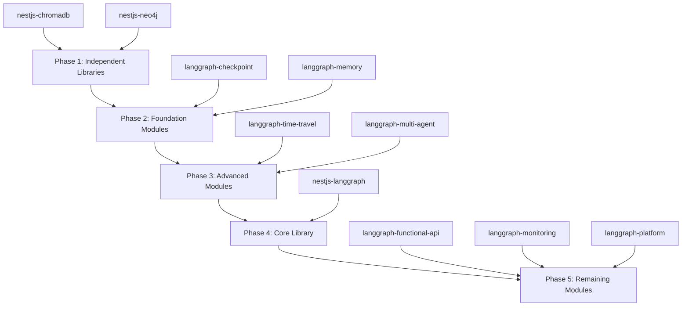

# TypeScript Fixes Design Document

## Overview

This design document outlines the systematic approach to fixing 3,000+ TypeScript and ESLint issues across the NestJS AI SaaS Starter monorepo. The solution implements a phased, dependency-aware strategy that ensures 100% type safety while maintaining backward compatibility and performance.

## Architecture

### Dependency-Based Execution Model

The fix strategy follows a dependency graph approach where libraries are organized into phases based on their interdependencies:



### Type Safety Architecture

The type system design follows a hierarchical approach:

1. **Base Types Layer** - Fundamental interfaces and utility types
2. **Domain Types Layer** - Library-specific type definitions
3. **Integration Types Layer** - Cross-library type compatibility
4. **Consumer Types Layer** - Public API type exports

## Components and Interfaces

### Core Type System Components

#### 1. Type Definition Generator

```typescript
interface TypeDefinitionGenerator {
  generateInterfaceFromAny(anyType: any, context: GenerationContext): TypeDefinition;
  inferGenericConstraints(genericUsage: GenericUsage[]): GenericConstraint[];
  createUnionTypes(possibleValues: unknown[]): UnionTypeDefinition;
}
```

#### 2. Code Quality Enforcer

```typescript
interface CodeQualityEnforcer {
  addAccessibilityModifiers(classMembers: ClassMember[]): ClassMember[];
  reorderClassMembers(members: ClassMember[]): ClassMember[];
  replaceLogicalOrWithNullish(expressions: Expression[]): Expression[];
  extractMagicNumbers(codeBlock: CodeBlock): { constants: Constant[]; updatedCode: CodeBlock };
}
```

#### 3. Library-Specific Type Handlers

##### ChromaDB Type Handler

```typescript
interface ChromaDBTypeHandler {
  createEmbeddingTypes(): EmbeddingTypeDefinitions;
  createMetadataTypes(): MetadataTypeDefinitions;
  createQueryTypes(): QueryTypeDefinitions;
  createCollectionTypes(): CollectionTypeDefinitions;
}

interface ChromaMetadata {
  readonly [key: string]: string | number | boolean | null;
}

interface EmbeddingVector {
  readonly values: readonly number[];
  readonly dimension: number;
}

interface ChromaQuery<TMetadata extends ChromaMetadata = ChromaMetadata> {
  readonly queryEmbeddings?: readonly EmbeddingVector[];
  readonly queryTexts?: readonly string[];
  readonly nResults?: number;
  readonly where?: MetadataFilter<TMetadata>;
  readonly whereDocument?: DocumentFilter;
}
```

##### Neo4j Type Handler

```typescript
interface Neo4jTypeHandler {
  createSessionTypes(): SessionTypeDefinitions;
  createQueryTypes(): QueryTypeDefinitions;
  createResultTypes(): ResultTypeDefinitions;
  createTransactionTypes(): TransactionTypeDefinitions;
}

interface Neo4jQueryResult<TRecord = Record<string, unknown>> {
  readonly records: readonly Neo4jRecord<TRecord>[];
  readonly summary: QuerySummary;
}

interface Neo4jSession {
  run<TRecord = Record<string, unknown>>(query: string, parameters?: Record<string, unknown>): Promise<Neo4jQueryResult<TRecord>>;

  beginTransaction(): Promise<Neo4jTransaction>;
  close(): Promise<void>;
}
```

##### LangGraph Type Handler

```typescript
interface LangGraphTypeHandler {
  createWorkflowTypes(): WorkflowTypeDefinitions;
  createStateTypes(): StateTypeDefinitions;
  createCheckpointTypes(): CheckpointTypeDefinitions;
  createAgentTypes(): AgentTypeDefinitions;
}

interface WorkflowState<TData = Record<string, unknown>> {
  readonly data: TData;
  readonly metadata: WorkflowMetadata;
  readonly version: number;
  readonly timestamp: Date;
}

interface CheckpointData<TState = WorkflowState> {
  readonly state: TState;
  readonly checkpointId: string;
  readonly parentCheckpointId?: string;
  readonly createdAt: Date;
}

interface AgentCommunicationProtocol<TMessage = unknown> {
  sendMessage(agentId: string, message: TMessage): Promise<void>;
  receiveMessage(): Promise<TMessage>;
  broadcast(message: TMessage): Promise<void>;
}
```

### Validation and Quality Assurance Components

#### 1. Type Safety Validator

```typescript
interface TypeSafetyValidator {
  validateNoAnyTypes(sourceFiles: SourceFile[]): ValidationResult[];
  validateGenericConstraints(generics: GenericDeclaration[]): ValidationResult[];
  validateNullSafety(expressions: Expression[]): ValidationResult[];
  validateTypeExports(moduleExports: ModuleExport[]): ValidationResult[];
}
```

#### 2. Code Quality Validator

```typescript
interface CodeQualityValidator {
  validateAccessibilityModifiers(classes: ClassDeclaration[]): ValidationResult[];
  validateMemberOrdering(classes: ClassDeclaration[]): ValidationResult[];
  validateComplexity(functions: FunctionDeclaration[]): ValidationResult[];
  validateFileLength(sourceFiles: SourceFile[]): ValidationResult[];
}
```

#### 3. Build Integration Validator

```typescript
interface BuildIntegrationValidator {
  validateCompilation(project: Project): CompilationResult;
  validateLinting(project: Project): LintingResult;
  validateBundleSize(buildOutput: BuildOutput): BundleSizeResult;
  validatePerformance(benchmarks: PerformanceBenchmark[]): PerformanceResult;
}
```

## Data Models

### Fix Strategy Data Model

```typescript
interface FixStrategy {
  readonly phase: ExecutionPhase;
  readonly library: LibraryIdentifier;
  readonly dependencies: readonly LibraryIdentifier[];
  readonly estimatedDuration: Duration;
  readonly priority: Priority;
  readonly fixPatterns: readonly FixPattern[];
}

interface FixPattern {
  readonly name: string;
  readonly description: string;
  readonly automatable: boolean;
  readonly riskLevel: RiskLevel;
  readonly validationSteps: readonly ValidationStep[];
}

interface ValidationStep {
  readonly name: string;
  readonly command: string;
  readonly expectedResult: ExpectedResult;
  readonly failureAction: FailureAction;
}
```

### Progress Tracking Data Model

```typescript
interface ProgressTracker {
  readonly libraryProgress: Map<LibraryIdentifier, LibraryProgress>;
  readonly overallProgress: OverallProgress;
  readonly metrics: ProgressMetrics;
}

interface LibraryProgress {
  readonly libraryId: LibraryIdentifier;
  readonly status: ProgressStatus;
  readonly errorsFixed: number;
  readonly warningsFixed: number;
  readonly totalIssues: number;
  readonly startTime: Date;
  readonly completionTime?: Date;
}

interface ProgressMetrics {
  readonly errorCount: number;
  readonly warningCount: number;
  readonly typeCoverage: number;
  readonly buildTime: Duration;
  readonly bundleSize: number;
}
```

## Error Handling

### Error Classification System

```typescript
enum ErrorSeverity {
  CRITICAL = 'critical', // Blocks compilation
  HIGH = 'high', // Type safety issues
  MEDIUM = 'medium', // Code quality issues
  LOW = 'low', // Style issues
}

interface TypeScriptError {
  readonly code: string;
  readonly message: string;
  readonly severity: ErrorSeverity;
  readonly file: string;
  readonly line: number;
  readonly column: number;
  readonly fixStrategy: FixStrategy;
}
```

### Error Recovery Strategies

1. **Compilation Errors** - Must be fixed before proceeding
2. **Type Safety Errors** - Require immediate attention with proper type definitions
3. **Code Quality Errors** - Can be batch-fixed with automated tools
4. **Style Errors** - Lowest priority, can be addressed with linting rules

### Rollback Mechanism

```typescript
interface RollbackManager {
  createCheckpoint(libraryId: LibraryIdentifier): CheckpointId;
  rollbackToCheckpoint(checkpointId: CheckpointId): Promise<RollbackResult>;
  validateRollback(rollbackResult: RollbackResult): ValidationResult;
}
```

## Testing Strategy

### Multi-Level Testing Approach

#### 1. Unit Testing

- **Type Definition Tests** - Validate interface contracts
- **Service Logic Tests** - Ensure functionality remains intact
- **Error Handling Tests** - Verify proper error propagation

#### 2. Integration Testing

- **Cross-Library Compatibility** - Test type compatibility between libraries
- **NestJS Module Integration** - Validate dependency injection works correctly
- **Database Integration** - Ensure ChromaDB and Neo4j types work with actual databases

#### 3. Type-Only Testing

```typescript
// Example type-only tests
type TestChromaMetadata = ChromaMetadata;
type TestEmbeddingVector = EmbeddingVector;

// Compile-time type validation
const validMetadata: TestChromaMetadata = {
  category: 'document',
  score: 0.95,
  isActive: true,
  tags: null,
};

// This should cause a compilation error
// const invalidMetadata: TestChromaMetadata = {
//   invalidProperty: new Date() // Error: Date not allowed
// };
```

#### 4. Performance Testing

- **Build Time Benchmarks** - Ensure compilation doesn't slow down significantly
- **Bundle Size Analysis** - Verify type additions don't bloat bundles
- **Runtime Performance** - Confirm no performance regressions

### Automated Testing Pipeline

```typescript
interface TestingPipeline {
  runTypeChecking(library: LibraryIdentifier): Promise<TypeCheckResult>;
  runUnitTests(library: LibraryIdentifier): Promise<UnitTestResult>;
  runIntegrationTests(library: LibraryIdentifier): Promise<IntegrationTestResult>;
  runPerformanceTests(library: LibraryIdentifier): Promise<PerformanceTestResult>;
  generateTestReport(results: TestResult[]): TestReport;
}
```

## Implementation Phases

### Phase 1: Independent Libraries (Parallel Execution)

**Target Libraries:**

- `@hive-academy/nestjs-chromadb` (~383 issues)
- `@hive-academy/nestjs-neo4j` (~300 issues)

**Key Activities:**

1. Replace all `any` types with proper interfaces
2. Add accessibility modifiers to all class members
3. Implement proper error handling types
4. Create comprehensive type exports
5. Add JSDoc documentation for public APIs

### Phase 2: Foundation Modules (Sequential)

**Target Libraries:**

- `@hive-academy/langgraph-checkpoint` (~200 issues)
- `@hive-academy/langgraph-memory` (~150 issues)

**Key Activities:**

1. Define state serialization types
2. Create checkpoint data structures
3. Implement memory context typing
4. Establish base types for dependent modules

### Phase 3: Advanced Modules

**Target Libraries:**

- `@hive-academy/langgraph-time-travel` (~143 issues)
- `@hive-academy/langgraph-multi-agent` (~180 issues)

**Key Activities:**

1. Implement snapshot and rollback types
2. Define agent communication protocols
3. Create time-travel state management types
4. Establish multi-agent coordination interfaces

### Phase 4: Core Library

**Target Library:**

- `@hive-academy/nestjs-langgraph` (~1,800 issues)

**Key Activities:**

1. Integrate all module types
2. Define workflow orchestration types
3. Implement tool registry typing
4. Create streaming operation types
5. Establish NestJS integration patterns

### Phase 5: Remaining Modules

**Target Libraries:**

- `@hive-academy/langgraph-functional-api`
- `@hive-academy/langgraph-monitoring`
- `@hive-academy/langgraph-platform`

**Key Activities:**

1. Apply consistent typing patterns
2. Ensure API compatibility
3. Complete documentation
4. Final validation and testing

## Monitoring and Metrics

### Real-Time Progress Dashboard

```typescript
interface ProgressDashboard {
  readonly currentPhase: ExecutionPhase;
  readonly libraryStatuses: Map<LibraryIdentifier, LibraryStatus>;
  readonly overallMetrics: OverallMetrics;
  readonly estimatedCompletion: Date;
}

interface OverallMetrics {
  readonly totalErrors: number;
  readonly errorsFixed: number;
  readonly totalWarnings: number;
  readonly warningsFixed: number;
  readonly typeCoverage: number;
  readonly buildSuccessRate: number;
}
```

### Quality Gates

Each phase must pass these quality gates before proceeding:

1. **Zero Compilation Errors** - All TypeScript compilation must succeed
2. **Zero ESLint Errors** - All linting rules must pass
3. **Type Coverage > 95%** - Minimal use of `any` types
4. **All Tests Passing** - No regression in functionality
5. **Performance Baseline** - No significant performance degradation

## Risk Mitigation

### Technical Risks

1. **Breaking Changes** - Mitigated by clear migration guides and major version bump
2. **Performance Regression** - Mitigated by continuous benchmarking
3. **Complex Dependencies** - Mitigated by phased approach
4. **Type Complexity** - Mitigated by incremental type improvements

### Process Risks

1. **Scope Creep** - Mitigated by strict requirements adherence
2. **Resource Constraints** - Mitigated by parallel execution where possible
3. **Integration Issues** - Mitigated by continuous integration testing
4. **Quality Degradation** - Mitigated by automated quality gates

This design provides a comprehensive, systematic approach to achieving 100% TypeScript compliance across the entire monorepo while maintaining code quality, performance, and backward compatibility.
