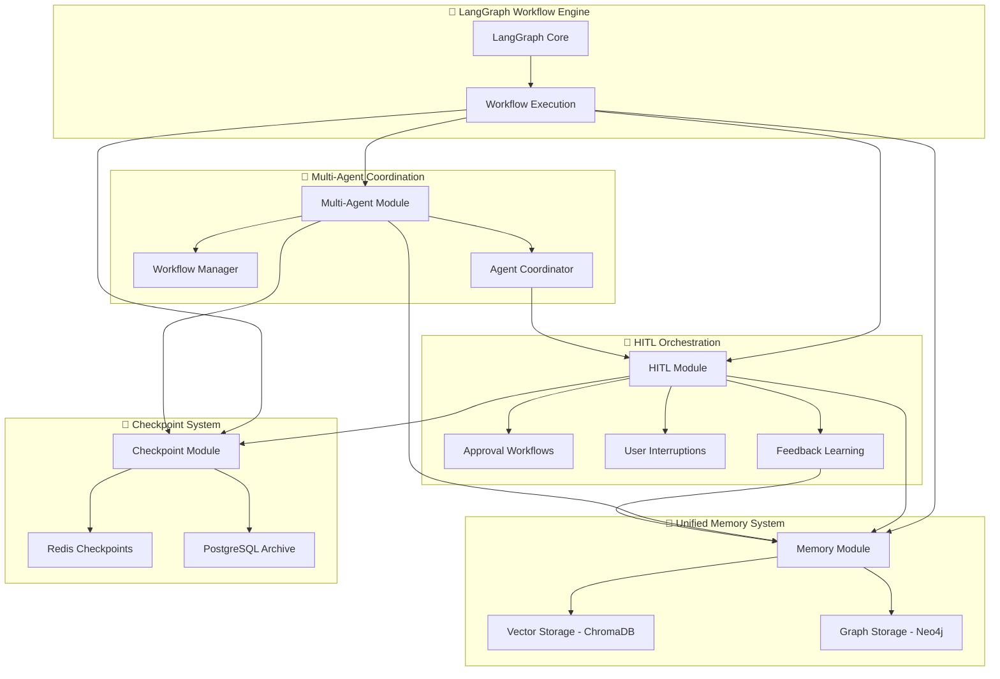

# HITL Module Analysis & Integration Vision Report

**Date:** January 2025  
**Status:** Critical Issues Identified - Action Required  
**Priority:** High - Production Impact

## 🔍 Executive Summary

Comprehensive analysis of the HITL (Human-In-The-Loop) module using ultrathink methodology revealed critical architecture anti-patterns that violate LangGraph best practices and pose production risks. While the module demonstrates sophisticated functionality, fundamental storage and integration patterns need immediate refactoring.

## 🔬 Analysis Methodology

### Tools Used

- **Ultrathink Analysis**: Deep technical examination using sequential thinking
- **LangGraph Documentation Research**: Official best practices validation
- **Cross-Module Integration Review**: Checkpoint, Memory, and HITL integration patterns
- **Production Risk Assessment**: Storage durability and consistency evaluation

### Scope Coverage

- ✅ HITL module internal architecture
- ✅ Storage adapter implementations
- ✅ Checkpoint integration patterns
- ✅ Memory module integration
- ✅ LangGraph best practices compliance
- ✅ Production deployment readiness

## 🚨 Critical Issues Identified

### 1. Storage Architecture Anti-Pattern

**Issue**: Dual storage with Map as primary, adapters as backup

```typescript
// ❌ PROBLEMATIC PATTERN
private readonly approvalRequests = new Map<string, HumanApprovalRequest>();
private readonly interruptionStorage?: IUserInterruptionStorageService; // Optional backup
```

**Risk**:

- Data loss on service restart
- Inconsistency between Map and persistent storage
- Not suitable for multi-instance deployment
- Violates LangGraph persistent execution state principle

**Files Affected**:

- `libs/langgraph-modules/hitl/src/lib/services/human-approval.service.ts:57`
- `libs/langgraph-modules/hitl/src/lib/services/approval-chain.service.ts:220`
- `libs/langgraph-modules/hitl/src/lib/services/user-interruption.service.ts:21`
- `libs/langgraph-modules/hitl/src/lib/services/feedback-processor.service.ts:114`

### 2. Threading Inconsistency

**Issue**: Custom thread ID generation instead of unified checkpoint threading

```typescript
// ❌ PROBLEMATIC PATTERN
private generateApprovalThreadId(executionId: string, nodeId: string): string {
  return NodeIdBuilder.create()
    .domain('hitl')
    .phase('approval')
    .activity('workflow')
    .detail(`${executionId}-${nodeId}`)
    .build();
}
```

**Risk**:

- Threading fragmentation across modules
- Checkpoint recovery complications
- Memory context isolation

**Files Affected**:

- `libs/langgraph-modules/hitl/src/lib/services/human-approval.service.ts:872-881`

### 3. Memory Learning Isolation

**Issue**: HITL feedback learning doesn't integrate with core memory module

```typescript
// ❌ ISOLATED PATTERN
private async learnFromHumanFeedback(
  request: HumanApprovalRequest,
  response: HumanApprovalResponse
): Promise<void> {
  // Direct memory adapter usage instead of core memory module integration
}
```

**Risk**:

- Duplicate memory patterns
- Inconsistent memory indexing
- Lost opportunity for cross-module learning

**Files Affected**:

- `libs/langgraph-modules/hitl/src/lib/services/human-approval.service.ts:932-1029`

## ✅ Positive Aspects

### 1. Proper Adapter Implementation

- **Neo4j Adapters**: Well-implemented with comprehensive CRUD operations
- **Error Handling**: Robust error handling and validation
- **Audit Trails**: Rich metadata and statistics functionality
- **Pattern Consistency**: Follows established adapter patterns

### 2. Advanced User Interruption System

- **Real-time Integration**: WebSocket support for dynamic interruptions
- **Workflow Control**: Sophisticated pause/resume capabilities
- **Multiple Types**: Questions, clarifications, corrections support
- **Timeout Management**: Proper cleanup and fallback strategies

### 3. Comprehensive Memory Learning

- **Rich Metadata**: Sentiment analysis, confidence gaps, pattern strength
- **Quality Assessment**: Feedback quality and approver experience tracking
- **Learning Signals**: Sophisticated pattern recognition for AI improvement

## 🎯 High-Level Vision: Unified Enterprise Architecture

### Core Principles

1. **Persistent-First Storage**: Follow LangGraph best practices with checkpoint/persistent storage as primary
2. **Unified Threading**: Single threading system across all modules
3. **Memory Integration**: HITL feedback learning leverages core memory module
4. **Adapter Consistency**: All modules use same adapter patterns
5. **Zero-Downtime Operations**: Graceful degradation and health monitoring

### Architectural Vision



## 🔧 Systematic Refactoring Plan

### Phase 1: Storage Architecture Modernization

**Priority**: CRITICAL  
**Timeline**: 2-3 weeks

**Objectives**:

- Replace Map-based primary storage with persistent-first architecture
- Implement proper storage adapter injection
- Ensure data consistency and durability

**Target Services**:

- `HumanApprovalService`
- `ApprovalChainService`
- `UserInterruptionService`
- `FeedbackProcessorService`

### Phase 2: Threading System Unification

**Priority**: HIGH  
**Timeline**: 1-2 weeks

**Objectives**:

- Implement unified thread context across modules
- Integrate with checkpoint threading system
- Remove custom thread ID generation

**Integration Points**:

- Checkpoint module threading
- Memory module namespacing
- Multi-agent coordination

### Phase 3: Memory Learning Integration

**Priority**: MEDIUM  
**Timeline**: 1-2 weeks

**Objectives**:

- Integrate HITL feedback learning with core memory module
- Leverage existing memory patterns and infrastructure
- Enable cross-module memory sharing

**Enhancement Areas**:

- Approval pattern recognition
- Context-aware decision making
- Cross-workflow learning

### Phase 4: Production Hardening

**Priority**: HIGH  
**Timeline**: 1 week

**Objectives**:

- Comprehensive error handling
- Health monitoring integration
- Performance optimization
- Documentation updates

## 📊 Success Metrics

### Technical Metrics

- **Data Consistency**: 100% storage consistency between restarts
- **Performance**: <100ms approval request processing
- **Reliability**: 99.9% uptime for HITL operations
- **Memory Efficiency**: <50MB memory usage per 1000 approval requests

### Business Metrics

- **Zero Data Loss**: No approval or interruption data loss
- **Improved Decision Quality**: 20% improvement in AI confidence alignment
- **Faster Resolution**: 30% reduction in approval processing time
- **Better User Experience**: Real-time interruption response <500ms

## 🛡️ Risk Mitigation

### Deployment Strategy

1. **Backward Compatibility**: Maintain current API during migration
2. **Feature Flags**: Gradual rollout with rollback capability
3. **Data Migration**: Safe migration of existing Map data to persistent storage
4. **Testing Strategy**: Comprehensive integration testing

### Rollback Plan

- Immediate rollback capability via feature flags
- Data consistency validation at each phase
- Performance monitoring with automatic alerts
- Manual verification checkpoints

## 📋 Action Items

### Immediate (This Week)

- [ ] Create migration plan for storage architecture
- [ ] Set up feature flags for gradual rollout
- [ ] Design unified thread context interface
- [ ] Begin storage adapter integration

### Short Term (Next 2 Weeks)

- [ ] Implement persistent-first HITL services
- [ ] Integrate with checkpoint threading system
- [ ] Update memory learning to use core memory module
- [ ] Comprehensive testing suite

### Medium Term (Next Month)

- [ ] Production deployment with monitoring
- [ ] Performance optimization
- [ ] Documentation updates
- [ ] Team training on new architecture

## 🔗 Integration Benefits

**Production-Ready Benefits**:

- **🔒 Data Durability**: Persistent-first architecture eliminates data loss
- **🧠 Intelligent Decisions**: Unified memory system across all modules
- **📊 Observable Operations**: Comprehensive monitoring and metrics
- **⚡ High Performance**: Multi-level caching with graceful degradation
- **🔧 Maintainable Code**: Consistent adapter patterns and dependency injection
- **📈 Scalable Architecture**: Multi-backend support for different deployment scenarios

**Business Impact**:

- **Risk Reduction**: Elimination of data loss scenarios
- **Operational Excellence**: Improved reliability and monitoring
- **Developer Productivity**: Consistent patterns across modules
- **Future-Proof Architecture**: Standards-compliant LangGraph integration

---

**Next Steps**: Initiate systematic refactoring using agent orchestration workflow to ensure real business logic implementation without stubs or hardcoded patterns.

**Document Status**: Ready for Implementation Planning  
**Stakeholders**: Backend Team, DevOps, Product Management  
**Review Required**: Architecture Review Board, Technical Lead
