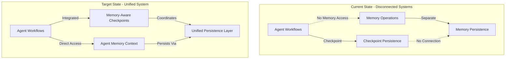

# Memory & Checkpoint Architecture Analysis: The Two-Layer Persistence Challenge

## Executive Summary

You've identified a critical architectural challenge: **Memory and Checkpoint are two separate persistence layers** that need careful coordination and integration into your agentic workflows. The Memory module currently exists in isolation with powerful adapters but lacks native integration with your agent ecosystem.

## 🔍 Current State Analysis

### Memory Module Reality

#### What Exists:

1. **Sophisticated Adapters** (`apps/dev-brand-api/src/app/adapters/memory/`)

   - `ChromaVectorAdapter`: Vector storage for semantic search
   - `Neo4jGraphAdapter`: Graph relationships for memory connections
   - Both properly implement IVectorService and IGraphService interfaces

2. **Memory Service Implementation** (`libs/langgraph-modules/memory/`)

   - Orchestrates vector and graph storage
   - Provides search, retrieval, summarization
   - User pattern analysis

3. **Business-Level Memory** (`PersonalBrandMemoryService`)
   - Direct ChromaDB and Neo4j usage (bypassing Memory module!)
   - Custom domain-specific memory management
   - Not using the publishable Memory module patterns

#### What's Missing:

- **NO integration with agent workflows** (Multi-Agent, HITL, Functional-API)
- **NO checkpoint coordination** (two separate persistence systems)
- **NO native agentic memory** (agents don't have memory context)
- **NO cross-module memory sharing** (isolated memory silos)

### The Two-Layer Persistence Problem



## 🎯 LangChain/LangGraph Pattern Analysis

Based on the official documentation, LangChain distinguishes between:

### 1. **Short-term Memory (Thread-Scoped)**

- Lives within conversation thread
- Persisted via checkpoints
- Part of agent state
- Includes conversation history, uploaded files, retrieved docs

### 2. **Long-term Memory (Cross-Thread)**

- Spans multiple conversations
- Recalled "at any time" and "in any thread"
- Organized in namespaces
- Types: Semantic (facts), Episodic (experiences), Procedural (rules)

### Our Current Gap:

- ✅ We have checkpoints (short-term, thread-scoped)
- ✅ We have memory infrastructure (vector + graph)
- ❌ Memory is NOT integrated with agents
- ❌ Memory is NOT coordinated with checkpoints
- ❌ Agents can't access memory during execution

## 🏗️ Comprehensive Integration Architecture

### Phase 1: Memory-Checkpoint Coordination

```typescript
// Enhanced Memory Module with Checkpoint Awareness
interface MemoryCheckpointIntegration {
  // Checkpoint-aware memory operations
  saveMemoryWithCheckpoint(threadId: string, memory: MemoryEntry, checkpointId: string): Promise<void>;

  // Restore memory context from checkpoint
  restoreMemoryFromCheckpoint(threadId: string, checkpointId: string): Promise<MemoryContext>;

  // Coordinate memory cleanup with checkpoint lifecycle
  syncMemoryWithCheckpoint(threadId: string, checkpointMetadata: CheckpointMetadata): Promise<void>;
}
```

### Phase 2: Agent Memory Integration

```typescript
// Agent with Native Memory Access
@Agent({
  id: 'memory-aware-agent',
  memoryEnabled: true, // Enable memory for this agent
  memoryConfig: {
    scope: 'thread', // thread | user | global
    retention: 'session', // session | persistent
    namespace: 'agent-specific',
  },
})
export class MemoryAwareAgent {
  constructor(
    private readonly memory: MemoryService, // Injected memory access
    @Inject('ICheckpointAdapter') private readonly checkpoint?: ICheckpointAdapter
  ) {}

  async nodeFunction(state: AgentState): Promise<Partial<AgentState>> {
    // Access memory during execution
    const context = await this.memory.searchForContext(state.query, state.threadId, state.userId);

    // Use memory to inform decisions
    const response = await this.generateResponseWithMemory(state, context);

    // Store new memories
    await this.memory.store(state.threadId, response.content, { type: 'conversation', importance: 0.8 });

    return {
      messages: [new AIMessage(response.content)],
      metadata: { memoryUsed: true, contextSize: context.relevantMemories.length },
    };
  }
}
```

### Phase 3: Unified Persistence Layer

```typescript
// Unified Persistence Orchestrator
@Injectable()
export class UnifiedPersistenceService {
  constructor(private readonly memory: MemoryService, private readonly checkpoint: ICheckpointAdapter, private readonly nodeIdBuilder: NodeIdBuilder) {}

  // Save both memory and checkpoint atomically
  async persistState(executionId: string, state: WorkflowState, memories: MemoryEntry[]): Promise<void> {
    const threadId = this.nodeIdBuilder.create().addScope('unified').addScope('state').addIdentifier(executionId).build();

    // Transaction-like coordination
    try {
      // Save checkpoint
      await this.checkpoint.saveCheckpoint(
        threadId,
        {
          channel_values: state,
        },
        {
          timestamp: new Date().toISOString(),
          memoryCount: memories.length,
        }
      );

      // Save associated memories
      await this.memory.storeBatch(threadId, memories);

      // Create cross-reference
      await this.createMemoryCheckpointLink(threadId, memories);
    } catch (error) {
      // Rollback logic
      await this.rollbackPersistence(threadId);
      throw error;
    }
  }

  // Restore complete context
  async restoreContext(
    executionId: string,
    checkpointId?: string
  ): Promise<{
    state: WorkflowState;
    memories: MemoryEntry[];
    patterns: UserMemoryPatterns;
  }> {
    const checkpoint = await this.checkpoint.loadCheckpoint(executionId, checkpointId);

    const memories = await this.memory.retrieve(executionId);
    const patterns = await this.memory.getUserPatterns(checkpoint.channel_values.userId);

    return {
      state: checkpoint.channel_values,
      memories,
      patterns,
    };
  }
}
```

## 🔄 Implementation Strategy

### Step 1: Fix Memory Module Configuration (1-2 days)

```typescript
// apps/dev-brand-api/src/app/app.module.ts
MemoryModule.forRootAsync({
  useFactory: async (
    checkpointAdapter: ICheckpointAdapter, // ADD checkpoint integration
    streamingAdapter: IStreamingService // ADD streaming support
  ) => ({
    ...getMemoryConfig(),
    adapters: {
      vector: ChromaVectorAdapter,
      graph: Neo4jGraphAdapter,
      checkpoint: checkpointAdapter, // NEW: Checkpoint coordination
    },
    streaming: streamingAdapter, // NEW: Real-time memory updates
  }),
  inject: ['ICheckpointAdapter', 'IStreamingService'],
});
```

### Step 2: Create Memory-Agent Bridge (2-3 days)

```typescript
// New service: libs/langgraph-modules/memory/src/lib/services/agent-memory-bridge.service.ts
@Injectable()
export class AgentMemoryBridgeService {
  // Provide memory context to agents
  async getAgentMemoryContext(agentId: string, threadId: string, userId?: string): Promise<AgentMemoryContext>;

  // Store agent-generated memories
  async storeAgentMemory(agentId: string, memory: AgentMemory): Promise<void>;

  // Coordinate with checkpoints
  async syncWithCheckpoint(threadId: string, checkpointId: string): Promise<void>;
}
```

### Step 3: Update Agent Decorators (2-3 days)

```typescript
// Enhanced @Agent decorator with memory support
export function Agent(
  options: AgentOptions & {
    memory?: {
      enabled: boolean;
      scope?: 'thread' | 'user' | 'global';
      retention?: 'session' | 'persistent';
      searchLimit?: number;
    };
  }
) {
  // Decorator implementation that injects memory service
}
```

### Step 4: Implement Unified Persistence (3-4 days)

- Create UnifiedPersistenceService
- Coordinate memory and checkpoint operations
- Handle transaction-like semantics
- Implement rollback mechanisms

## 🚨 Critical Decisions Required

### 1. **Memory Scope Strategy**

**Option A: Thread-Scoped Memory (Aligned with Checkpoints)**

- Memories tied to specific conversation threads
- Easy coordination with checkpoints
- Limited cross-thread learning

**Option B: User-Scoped Memory (Cross-Thread)**

- Memories span multiple conversations
- Better personalization
- Complex checkpoint coordination

**Option C: Hybrid Approach** ⭐ Recommended

- Thread memories for conversation context
- User memories for personalization
- Global memories for shared knowledge

### 2. **Integration Priority**

**Option A: Memory-First**

- Fix memory module integration first
- Then coordinate with checkpoints
- Risk: Two separate systems longer

**Option B: Unified-First** ⭐ Recommended

- Design unified persistence layer first
- Implement memory and checkpoint together
- Benefit: Cohesive architecture from start

### 3. **Agent Memory Access Pattern**

**Option A: Explicit Memory Injection**

```typescript
constructor(private readonly memory: MemoryService) {}
```

**Option B: Decorator-Based** ⭐ Recommended

```typescript
@Agent({ memory: { enabled: true } })
```

**Option C: State-Based**

```typescript
state.memory = await this.loadMemory(state.threadId);
```

## 📊 Impact Analysis

### Current Problems This Solves:

1. **Conversation Continuity**: Agents remember context across interactions
2. **Personalization**: User preferences and patterns inform responses
3. **Learning**: System improves through memory accumulation
4. **Debugging**: Complete state including memory for replay
5. **Performance**: Cached memory reduces repeated computations

### Architectural Benefits:

1. **Unified Persistence**: Single source of truth for state
2. **Atomic Operations**: Memory and checkpoint save together
3. **Consistent Recovery**: Complete context restoration
4. **Cross-Module Sharing**: Agents share memory context
5. **Enterprise Features**: Audit trail, compliance, data governance

## 🎯 Recommended Implementation Plan

### Week 1: Foundation

1. **Day 1-2**: Design unified persistence architecture
2. **Day 3-4**: Update Memory module configuration with checkpoint adapter
3. **Day 5**: Create AgentMemoryBridge service

### Week 2: Integration

1. **Day 1-2**: Implement memory-aware agent decorators
2. **Day 3-4**: Update Multi-Agent coordinator for memory access
3. **Day 5**: Integrate with HITL for approval memory

### Week 3: Unification

1. **Day 1-2**: Implement UnifiedPersistenceService
2. **Day 3-4**: Coordinate memory-checkpoint operations
3. **Day 5**: Testing and validation

### Week 4: Production

1. **Day 1-2**: Migration utilities for existing data
2. **Day 3-4**: Performance optimization
3. **Day 5**: Documentation and examples

## 🔑 Key Architectural Principles

1. **Separation of Concerns**: Memory and Checkpoint remain separate but coordinated
2. **Graceful Degradation**: System works without memory if unavailable
3. **Performance First**: Memory access must not slow agent execution
4. **Consistency**: Atomic operations for related memory and checkpoint
5. **Extensibility**: Easy to add new memory types and storage backends

## 🚀 Next Steps

1. **Validate Architecture**: Review with team for alignment
2. **Proof of Concept**: Implement basic memory-agent integration
3. **Performance Testing**: Ensure no degradation with memory access
4. **Migration Plan**: Strategy for existing workflows
5. **Documentation**: Comprehensive guides for memory-enabled agents

This architecture addresses the fundamental challenge of having two separate persistence layers (Memory and Checkpoint) and provides a path to unify them while maintaining the flexibility and power of both systems.
