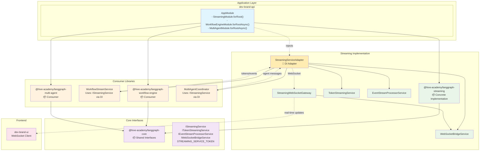

# Streaming Integration Blueprint - DI Adapter Pattern

This document outlines how to implement the proven **Dependency Injection Adapter Pattern** used by our checkpoint library for seamless integration between our streaming library (`@hive-academy/langgraph-streaming`) and consumer libraries (`@hive-academy/langgraph-workflow-engine`, `@hive-academy/langgraph-multi-agent`, etc.).

## Current Architecture Analysis

### Checkpoint Library Pattern (Proven Success)

The checkpoint library uses a sophisticated DI adapter pattern that enables:

**🎯 Optional Dependencies**: Consumer libraries work with or without checkpoint functionality
**🔧 Flexible Configuration**: Enable/disable per environment without code changes
**📦 Package Independence**: Each library remains publishable and self-contained
**🎨 Developer Experience**: Zero boilerplate in consumer applications

#### Key Components

1. **@hive-academy/langgraph-checkpoint** - Provides CheckpointManagerService
2. **CheckpointManagerAdapter** - Bridge between consumer libraries and checkpoint service
3. **Consumer Libraries** - Use optional dependency injection via forRootAsync()
4. **Application Module** - Wires everything together with simple configuration

## Current Streaming Problem

### The Disconnect Issue

**Backend generates tokens** ✅ (seen in log.md)
**Decorators use console.log** ❌ (not connected to WebSocket)
**UI receives no real-time updates** ❌ (WebSocket connected but silent)

### Root Cause

The streaming decorators (`@StreamToken`, `@StreamEvent`, `@StreamProgress`) in workflow-engine are hardcoded to use `console.log` instead of connecting to the actual streaming service from `@hive-academy/langgraph-streaming`.

## Solution: Streaming DI Adapter Pattern

### Architecture Overview



## Implementation Steps

### Step 1: langgraph-core Interfaces (@hive-academy/langgraph-core)

**File**: `libs/langgraph-modules/langgraph-core/src/lib/interfaces/streaming.interface.ts`

```typescript
export interface IStreamingService {
  // Token streaming
  initializeTokenStream(options: TokenStreamOptions): Promise<void>;
  streamToken(executionId: string, nodeId: string, token: string, metadata?: Record<string, unknown>): void;
  flushTokens(executionId: string, nodeId: string): Promise<void>;

  // Event streaming  
  streamEvent(executionId: string, nodeId: string, event: StreamEventData): void;
  
  // Progress streaming
  streamProgress(executionId: string, nodeId: string, progress: ProgressData): void;

  // WebSocket integration
  broadcastToExecution(executionId: string, data: any): Promise<void>;
  sendToClient(clientId: string, data: any): Promise<void>;
}

export interface ITokenStreamingService {
  initializeTokenStream(options: TokenStreamOptions): Promise<void>;
  streamToken(executionId: string, nodeId: string, token: string, metadata?: Record<string, unknown>): void;
  flushTokens(executionId: string, nodeId: string): Promise<void>;
  closeTokenStream(executionId: string, nodeId: string): void;
}

export interface IEventStreamProcessorService {
  streamEvent(executionId: string, nodeId: string, event: StreamEventData): void;
  processBatch(events: StreamUpdate[]): void;
}

export interface IWebSocketBridgeService {
  broadcastToExecution(executionId: string, data: any): Promise<void>;
  sendToClient(clientId: string, data: any): Promise<void>;
  registerClient(clientId: string, executionId: string): void;
  unregisterClient(clientId: string): void;
}

// Supporting interfaces
export interface TokenStreamOptions {
  executionId: string;
  nodeId: string;
  config: StreamTokenDecoratorMetadata;
}

export interface StreamEventData {
  type: string;
  data: any;
  metadata?: Record<string, unknown>;
}

export interface ProgressData {
  progress: number;
  message?: string;
  metadata?: Record<string, unknown>;
}

// Decorator metadata (re-exported for convenience)
export interface StreamTokenDecoratorMetadata {
  enabled: boolean;
  bufferSize?: number;
  flushInterval?: number;
  format?: 'text' | 'json' | 'structured';
  processor?: (token: string, metadata?: any) => string;
  filter?: TokenFilter;
}

export interface TokenFilter {
  minLength?: number;
  maxLength?: number;
  excludeWhitespace?: boolean;
  pattern?: RegExp;
}

// No-op implementations for default behavior
export class NoOpStreamingService implements IStreamingService {
  async initializeTokenStream(): Promise<void> { /* no-op */ }
  streamToken(): void { /* no-op */ }
  async flushTokens(): Promise<void> { /* no-op */ }
  streamEvent(): void { /* no-op */ }
  streamProgress(): void { /* no-op */ }
  async broadcastToExecution(): Promise<void> { /* no-op */ }
  async sendToClient(): Promise<void> { /* no-op */ }
}

// Dependency injection tokens
export const STREAMING_SERVICE_TOKEN = 'STREAMING_SERVICE_TOKEN';
export const TOKEN_STREAMING_SERVICE_TOKEN = 'TOKEN_STREAMING_SERVICE_TOKEN';
export const EVENT_STREAM_PROCESSOR_SERVICE_TOKEN = 'EVENT_STREAM_PROCESSOR_SERVICE_TOKEN';
export const WEBSOCKET_BRIDGE_SERVICE_TOKEN = 'WEBSOCKET_BRIDGE_SERVICE_TOKEN';
```

### Step 2: Concrete Adapter (@hive-academy/langgraph-streaming)

**File**: `libs/langgraph-modules/streaming/src/lib/adapters/streaming-service.adapter.ts`

```typescript
import { Injectable, Inject } from '@nestjs/common';
import {
  IStreamingService,
  ITokenStreamingService,
  IEventStreamProcessorService,
  IWebSocketBridgeService,
  TokenStreamOptions,
  StreamEventData,
  ProgressData,
} from '@hive-academy/langgraph-core';
import { TokenStreamingService } from '../services/token-streaming.service';
import { EventStreamProcessorService } from '../services/event-stream-processor.service';
import { WebSocketBridgeService } from '../services/websocket-bridge.service';

@Injectable()
export class StreamingServiceAdapter implements IStreamingService {
  constructor(
    private readonly tokenStreamingService: TokenStreamingService,
    private readonly eventStreamProcessor: EventStreamProcessorService,
    private readonly webSocketBridge: WebSocketBridgeService,
  ) {}

  async initializeTokenStream(options: TokenStreamOptions): Promise<void> {
    return this.tokenStreamingService.initializeTokenStream(options);
  }

  streamToken(executionId: string, nodeId: string, token: string, metadata?: Record<string, unknown>): void {
    return this.tokenStreamingService.streamToken(executionId, nodeId, token, metadata);
  }

  async flushTokens(executionId: string, nodeId: string): Promise<void> {
    return this.tokenStreamingService.flushTokens(executionId, nodeId);
  }

  streamEvent(executionId: string, nodeId: string, event: StreamEventData): void {
    // Convert to internal event format and stream
    this.eventStreamProcessor.processEvent({
      type: event.type as any,
      data: event.data,
      metadata: {
        timestamp: new Date(),
        executionId,
        nodeId,
        ...event.metadata,
      },
    });
  }

  streamProgress(executionId: string, nodeId: string, progress: ProgressData): void {
    this.streamEvent(executionId, nodeId, {
      type: 'progress',
      data: progress,
      metadata: { progressType: 'node_progress' },
    });
  }

  async broadcastToExecution(executionId: string, data: any): Promise<void> {
    return this.webSocketBridge.broadcastToExecution(executionId, data);
  }

  async sendToClient(clientId: string, data: any): Promise<void> {
    return this.webSocketBridge.sendToClient(clientId, data);
  }
}

// Individual service adapters for granular control
@Injectable()
export class TokenStreamingServiceAdapter implements ITokenStreamingService {
  constructor(private readonly tokenStreamingService: TokenStreamingService) {}

  async initializeTokenStream(options: TokenStreamOptions): Promise<void> {
    return this.tokenStreamingService.initializeTokenStream(options);
  }

  streamToken(executionId: string, nodeId: string, token: string, metadata?: Record<string, unknown>): void {
    return this.tokenStreamingService.streamToken(executionId, nodeId, token, metadata);
  }

  async flushTokens(executionId: string, nodeId: string): Promise<void> {
    return this.tokenStreamingService.flushTokens(executionId, nodeId);
  }

  closeTokenStream(executionId: string, nodeId: string): void {
    return this.tokenStreamingService.closeTokenStream(executionId, nodeId);
  }
}
```

**Update**: `libs/langgraph-modules/streaming/src/lib/streaming.module.ts`

```typescript
import { Module, DynamicModule } from '@nestjs/common';
import { EventEmitterModule } from '@nestjs/event-emitter';
import { TokenStreamingService } from './services/token-streaming.service';
import { EventStreamProcessorService } from './services/event-stream-processor.service';
import { WebSocketBridgeService } from './services/websocket-bridge.service';
import { StreamingWebSocketGateway } from './services/streaming-websocket-gateway.service';
import { WebSocketGatewayConfig } from './interfaces/websocket-gateway.interface';
import { 
  StreamingServiceAdapter,
  TokenStreamingServiceAdapter,
} from './adapters/streaming-service.adapter';
import {
  STREAMING_SERVICE_TOKEN,
  TOKEN_STREAMING_SERVICE_TOKEN,
  EVENT_STREAM_PROCESSOR_SERVICE_TOKEN,
  WEBSOCKET_BRIDGE_SERVICE_TOKEN,
} from '@hive-academy/langgraph-core';

export interface StreamingModuleOptions {
  websocket?: {
    enabled: boolean;
    port?: number;
  };
  defaultBufferSize?: number;
  gateway?: WebSocketGatewayConfig;
}

@Module({})
export class StreamingModule {
  static forRoot(options?: StreamingModuleOptions): DynamicModule {
    const providers: any[] = [
      TokenStreamingService,
      EventStreamProcessorService,
      WebSocketBridgeService,
      {
        provide: 'STREAMING_OPTIONS',
        useValue: options || {},
      },
      
      // Concrete implementations
      StreamingServiceAdapter,
      TokenStreamingServiceAdapter,
      
      // Interface tokens - providing concrete implementations
      {
        provide: STREAMING_SERVICE_TOKEN,
        useExisting: StreamingServiceAdapter,
      },
      {
        provide: TOKEN_STREAMING_SERVICE_TOKEN,
        useExisting: TokenStreamingServiceAdapter,
      },
      {
        provide: EVENT_STREAM_PROCESSOR_SERVICE_TOKEN,
        useExisting: EventStreamProcessorService,
      },
      {
        provide: WEBSOCKET_BRIDGE_SERVICE_TOKEN,
        useExisting: WebSocketBridgeService,
      },
    ];

    const exports: any[] = [
      TokenStreamingService,
      EventStreamProcessorService,
      WebSocketBridgeService,
      StreamingServiceAdapter,
      TokenStreamingServiceAdapter,
      
      // Export interface tokens for consumer injection
      STREAMING_SERVICE_TOKEN,
      TOKEN_STREAMING_SERVICE_TOKEN,
      EVENT_STREAM_PROCESSOR_SERVICE_TOKEN,
      WEBSOCKET_BRIDGE_SERVICE_TOKEN,
    ];

    // Add WebSocket gateway if enabled
    const gatewayEnabled = options?.gateway?.enabled ?? options?.websocket?.enabled ?? false;

    if (gatewayEnabled) {
      providers.push(StreamingWebSocketGateway, {
        provide: 'WEBSOCKET_GATEWAY_CONFIG',
        useValue: {
          enabled: gatewayEnabled,
          port: options?.websocket?.port,
          ...options?.gateway,
        },
      });
      exports.push(StreamingWebSocketGateway);
    }

    return {
      module: StreamingModule,
      imports: [EventEmitterModule.forRoot({ /* config */ })],
      providers,
      exports,
      global: true, // Make streaming services globally available
    };
  }
}
```

### Step 3: Consumer Library Updates (@hive-academy/langgraph-workflow-engine)

**Update**: `libs/langgraph-modules/workflow-engine/src/lib/workflow-engine.module.ts`

```typescript
import { Module, DynamicModule, InjectionToken } from '@nestjs/common';
import { ConfigModule } from '@nestjs/config';
import { WorkflowGraphBuilderService } from './core/workflow-graph-builder.service';
import { MetadataProcessorService } from './core/metadata-processor.service';
import { SubgraphManagerService } from './core/subgraph-manager.service';
import { WorkflowStreamService } from './streaming/workflow-stream.service';
import { 
  IStreamingService,
  STREAMING_SERVICE_TOKEN,
  NoOpStreamingService,
} from '@hive-academy/langgraph-core';

export interface WorkflowEngineModuleOptions {
  compilation?: {
    cacheEnabled?: boolean;
    cacheTTL?: number;
    optimizeGraphs?: boolean;
  };
  execution?: {
    defaultTimeout?: number;
    streamingEnabled?: boolean;
    parallelExecution?: boolean;
    maxConcurrency?: number;
  };
  debugging?: {
    enabled?: boolean;
    logLevel?: string;
    traceExecution?: boolean;
  };
  
  // Optional streaming adapter - this is the key part!
  streamingAdapter?: IStreamingService;
}

@Module({})
export class WorkflowEngineModule {
  /**
   * Configure the workflow engine module with options
   */
  public static forRoot(options: WorkflowEngineModuleOptions = {}): DynamicModule {
    return {
      module: WorkflowEngineModule,
      imports: [ConfigModule],
      providers: [
        {
          provide: 'WORKFLOW_ENGINE_MODULE_OPTIONS',
          useValue: options,
        },
        // Core services
        WorkflowGraphBuilderService,
        MetadataProcessorService,
        SubgraphManagerService,
        WorkflowStreamService,
        
        // Streaming adapter - use provided adapter or default to no-op
        {
          provide: STREAMING_SERVICE_TOKEN,
          useValue: options.streamingAdapter || new NoOpStreamingService(),
        },
      ],
      exports: [
        WorkflowGraphBuilderService,
        MetadataProcessorService,
        SubgraphManagerService,
        WorkflowStreamService,
        STREAMING_SERVICE_TOKEN,
      ],
      global: true,
    };
  }

  /**
   * Configure the workflow engine module asynchronously with streaming injection
   */
  public static forRootAsync(options: {
    useFactory: (...args: unknown[]) => Promise<WorkflowEngineModuleOptions> | WorkflowEngineModuleOptions;
    inject?: InjectionToken[];
  }): DynamicModule {
    return {
      module: WorkflowEngineModule,
      imports: [ConfigModule],
      providers: [
        {
          provide: 'WORKFLOW_ENGINE_MODULE_OPTIONS',
          useFactory: options.useFactory,
          inject: options.inject ?? [],
        },
        // Core services
        WorkflowGraphBuilderService,
        MetadataProcessorService,
        SubgraphManagerService,
        WorkflowStreamService,
        
        // Streaming adapter - injected via factory
        {
          provide: STREAMING_SERVICE_TOKEN,
          useFactory: async (...args: unknown[]) => {
            const moduleOptions = await options.useFactory(...args);
            return moduleOptions.streamingAdapter || new NoOpStreamingService();
          },
          inject: options.inject ?? [],
        },
      ],
      exports: [
        WorkflowGraphBuilderService,
        MetadataProcessorService,
        SubgraphManagerService,
        WorkflowStreamService,
        STREAMING_SERVICE_TOKEN,
      ],
      global: true,
    };
  }
}
```

**Update**: `libs/langgraph-modules/workflow-engine/src/lib/streaming/workflow-stream.service.ts`

```typescript
import { Inject, Injectable, Logger } from '@nestjs/common';
import { EventEmitter2 } from '@nestjs/event-emitter';
import { 
  IStreamingService,
  STREAMING_SERVICE_TOKEN,
  TokenStreamOptions,
  StreamEventData,
  ProgressData,
} from '@hive-academy/langgraph-core';
// ... other imports

@Injectable()
export class WorkflowStreamService implements OnModuleInit, OnModuleDestroy {
  private readonly logger = new Logger(WorkflowStreamService.name);

  constructor(
    @Inject(EventEmitter2) private readonly eventEmitter: EventEmitter2,
    private readonly metadataProcessor: MetadataProcessorService,
    
    // Inject the streaming service - could be real service or no-op
    @Inject(STREAMING_SERVICE_TOKEN) private readonly streamingService: IStreamingService,
  ) {}

  /**
   * Configure streaming for a specific workflow node from decorator metadata
   */
  configureNodeStreaming(
    executionId: string,
    nodeId: string,
    workflowClass: any,
    methodName: string,
  ): void {
    const tokenMetadata = getStreamTokenMetadata(workflowClass.prototype, methodName);
    if (tokenMetadata?.enabled) {
      const options: TokenStreamOptions = {
        executionId,
        nodeId,
        config: tokenMetadata,
      };
      
      // Initialize token streaming via injected service
      this.streamingService.initializeTokenStream(options).catch(error => {
        this.logger.error(`Failed to initialize token streaming for ${nodeId}:`, error);
      });
      
      this.logger.debug(`Configured token streaming for ${nodeId}: ${JSON.stringify(tokenMetadata)}`);
    }

    // Similar for event and progress metadata...
  }

  /**
   * Stream tokens using the injected streaming service instead of console.log
   */
  async *streamMessageTokens(
    executionId: string,
    nodeId: string,
    message: any,
    config: StreamTokenDecoratorMetadata,
  ): AsyncGenerator<StreamUpdate> {
    if (!message.content || typeof message.content !== 'string') {
      return;
    }

    const { content } = message;
    const tokens = this.tokenizeContent(content, config);

    try {
      for (let i = 0; i < tokens.length; i++) {
        const token = tokens[i];

        if (!this.shouldIncludeToken(token, config)) {
          continue;
        }

        const processedToken = config.processor
          ? config.processor(token, { index: i, nodeId, executionId })
          : token;

        // Stream via injected service instead of console.log
        this.streamingService.streamToken(executionId, nodeId, processedToken, {
          index: i,
          totalTokens: tokens.length,
          progress: ((i + 1) / tokens.length) * 100,
        });

        // Still yield for local streaming
        const tokenData: TokenData = {
          content: processedToken,
          index: i,
          role: message.role,
          totalTokens: tokens.length,
        };

        yield this.createUpdate(StreamEventType.TOKEN, tokenData, executionId, {
          nodeId,
          tokenConfig: config,
        });

        if (config.flushInterval && config.flushInterval > 0) {
          await new Promise(resolve => setTimeout(resolve, config.flushInterval));
        }
      }

      // Flush remaining tokens
      await this.streamingService.flushTokens(executionId, nodeId);

    } catch (error) {
      this.logger.error(`Token streaming error for ${executionId}:${nodeId}:`, error);
      throw error;
    }
  }

  /**
   * Emit progress via injected streaming service
   */
  emitProgress(
    executionId: string,
    progress: number,
    message?: string,
    metadata?: any,
  ): void {
    // Stream via injected service
    this.streamingService.streamProgress(executionId, 'workflow', {
      progress,
      message,
      ...metadata,
    });

    // Continue with local streaming for backward compatibility
    const update = this.createUpdate(
      StreamEventType.PROGRESS,
      { progress, message, ...metadata },
      executionId,
    );

    const stream = this.streams.get(executionId);
    if (stream) {
      stream.next(update);
    }

    this.eventEmitter.emit(`workflow.progress.${executionId}`, update);
  }

  // ... rest of the service remains the same
}
```

### Step 4: Application Wiring (dev-brand-api)

**Update**: `apps/dev-brand-api/src/app/app.module.ts`

```typescript
import { Module } from '@nestjs/common';
import { ConfigModule, ConfigService } from '@nestjs/common';

// Core library imports
import { StreamingModule } from '@hive-academy/langgraph-streaming';
import { WorkflowEngineModule } from '@hive-academy/langgraph-workflow-engine';
import { MultiAgentModule } from '@hive-academy/langgraph-multi-agent';

// Import the streaming adapter
import { StreamingServiceAdapter } from '@hive-academy/langgraph-streaming';

// Configuration imports  
import { getStreamingConfig } from './config/streaming.config';
import { getWorkflowEngineConfig } from './config/workflow-engine.config';
import { getMultiAgentConfig } from './config/multi-agent.config';

@Module({
  imports: [
    ConfigModule.forRoot({ isGlobal: true }),

    // ═══════════════════════════════════════════════════════════════
    // STREAMING MODULE: Configure streaming services at application level
    // ═══════════════════════════════════════════════════════════════
    // This provides StreamingServiceAdapter for dependency injection
    StreamingModule.forRoot({
      ...getStreamingConfig(),
      websocket: { enabled: true, port: 8080 },
      gateway: { enabled: true, cors: true },
    }),

    // ═══════════════════════════════════════════════════════════════  
    // SCENARIO A: STREAMING-ENABLED MODULES
    // ═══════════════════════════════════════════════════════════════
    // Pattern: forRootAsync + StreamingServiceAdapter injection
    // Behavior: Real-time streaming with WebSocket integration
    // Use case: Production workflows requiring real-time updates
    
    WorkflowEngineModule.forRootAsync({
      useFactory: async (...args: unknown[]) => {
        const streamingAdapter = args[0] as StreamingServiceAdapter;
        return {
          ...getWorkflowEngineConfig(),
          streamingAdapter, // Key injection!
        };
      },
      inject: [StreamingServiceAdapter],
      // Result: STREAMING_SERVICE_TOKEN = StreamingServiceAdapter instance
      // Enables: Real-time token streaming, event broadcasting, progress updates
    }),

    MultiAgentModule.forRootAsync({
      useFactory: async (...args: unknown[]) => {
        const streamingAdapter = args[0] as StreamingServiceAdapter;
        return {
          ...getMultiAgentConfig(),
          streamingAdapter, // Enable streaming for multi-agent coordination
        };
      },
      inject: [StreamingServiceAdapter],
      // Result: STREAMING_SERVICE_TOKEN = StreamingServiceAdapter instance
      // Enables: Agent conversation streaming, coordination events, progress tracking
    }),

    // ═══════════════════════════════════════════════════════════════
    // SCENARIO B: STREAMING-DISABLED MODULES  
    // ═══════════════════════════════════════════════════════════════
    // Pattern: forRoot without streamingAdapter
    // Behavior: No streaming overhead, basic execution only
    // Use case: Lightweight deployments, batch processing
    
    // MonitoringModule.forRoot(getMonitoringConfig()),
    // Result: STREAMING_SERVICE_TOKEN = NoOpStreamingService (implicit)
    // Behavior: Metrics collection without streaming overhead

    // Other modules...
  ],
  
  // ... rest of app module
})
export class AppModule {}
```

## Benefits of This Pattern

### 1. **Optional Dependencies** ✅

Consumer libraries work with or without streaming functionality. No breaking changes.

### 2. **Package Independence** ✅  

Each library remains publishable and self-contained. No tight coupling.

### 3. **Flexible Configuration** ✅

Enable/disable streaming per environment or per module without code changes.

### 4. **Zero Boilerplate** ✅

Simple one-line configuration in consumer applications.

### 5. **Type Safety** ✅

Full TypeScript support with interface contracts.

### 6. **Performance** ✅

No-op implementations have zero overhead when streaming is disabled.

## Library Analysis: Current Streaming Status

### Libraries Currently Using Streaming ✅

#### 1. **@hive-academy/langgraph-streaming**
- **Core streaming library** with decorators (`@StreamToken`, `@StreamEvent`, `@StreamProgress`)
- WebSocket gateway, token streaming, event processing
- **Status**: ✅ Fully implemented with proper interfaces

#### 2. **@hive-academy/langgraph-workflow-engine**
- **Heavy streaming usage** via `WorkflowStreamService` and `StreamingWorkflowBase`
- Uses all streaming decorators and integrates with streaming services
- **Status**: ❌ **BROKEN** - Uses hardcoded `console.log` instead of proper streaming service injection

#### 3. **@hive-academy/langgraph-multi-agent**
- **Has streaming configuration** in module options and constants
- Supports streaming modes: `['values', 'updates', 'messages']`
- **Status**: ❌ **NEEDS INTEGRATION** - Configuration exists but not wired to actual streaming

### Libraries That Should Use Streaming 🔧

#### 4. **@hive-academy/langgraph-hitl** (Human-in-the-Loop)
- **Perfect streaming candidate** - already has `streamConnections` map for WebSocket connections
- Real-time approval status updates, progress tracking
- **Use Cases**: Approval notifications, status updates, timeout warnings
- **Status**: ❌ **MISSING** - Infrastructure exists but not connected to streaming

#### 5. **@hive-academy/langgraph-monitoring**
- **Excellent streaming candidate** - already simulates streaming with delays
- Performance metrics, health checks, anomaly detection
- **Use Cases**: Real-time dashboards, alert notifications, metric updates
- **Status**: ❌ **MISSING** - Has simulation code but no real streaming

#### 6. **@hive-academy/langgraph-time-travel**
- **Good streaming candidate** - mentions "real-time" replay speed
- Workflow replay, debugging, timeline visualization
- **Use Cases**: Real-time replay events, timeline updates, debug info
- **Status**: ❌ **MISSING** - Only basic interface, no streaming implementation

### Libraries With No Streaming Needs ⚪

#### 7. **@hive-academy/langgraph-core**
- **Interface/utility library** - provides shared types and interfaces
- **Status**: ✅ **N/A** - Should contain streaming interfaces for DI pattern

#### 8. **@hive-academy/langgraph-platform**
- **Basic platform utilities** - no streaming-related patterns found
- **Status**: ✅ **N/A** - No streaming requirements identified

#### 9. **@hive-academy/langgraph-functional-api**
- **Decorator library** - provides workflow decorators and utilities
- **Status**: ✅ **N/A** - Supports streaming via workflow-engine integration

#### 10. **@hive-academy/langgraph-checkpoint**
- **State persistence** - focuses on storage, not real-time updates
- **Status**: ✅ **N/A** - No streaming requirements

#### 11. **@hive-academy/langgraph-memory**
- **Memory management** - background operations, no user-facing updates
- **Status**: ✅ **N/A** - No streaming requirements

## Migration Guide

### Priority Assessment

#### 🔴 **Critical Priority** (Broken Functionality)
1. **workflow-engine** - Fix console.log → streaming service integration
2. **multi-agent** - Wire existing streaming config to actual streaming

#### 🟡 **High Priority** (High Value Additions)
3. **hitl** - Real-time approval updates (already has WebSocket infrastructure)
4. **monitoring** - Real-time metrics dashboards (already simulates streaming)

#### 🟢 **Medium Priority** (Nice to Have)
5. **time-travel** - Real-time replay visualization

### Phase 1: Foundation (Current Task)

1. ✅ Add streaming interfaces to `@hive-academy/langgraph-core`
2. ✅ Create `StreamingServiceAdapter` in streaming module
3. ✅ Update streaming module to export interface tokens

### Phase 2: Critical Fixes (Broken Functionality)

1. **Fix workflow-engine** - Replace `console.log` with `IStreamingService` via DI
2. **Fix multi-agent** - Wire existing streaming configuration to actual streaming services
3. **Test critical fixes** - Ensure token streaming and agent coordination work

### Phase 3: High-Value Extensions

1. **Add HITL streaming** - Real-time approval status updates and notifications
2. **Add monitoring streaming** - Live metrics dashboards and health status updates
3. **Test new integrations** - Verify real-time updates work correctly

### Phase 4: Application Wiring  

1. Update `dev-brand-api` to use new DI pattern for all streaming-enabled libraries
2. Configure streaming adapters for each library based on priority
3. Test complete streaming functionality end-to-end

### Phase 5: Validation & Optimization

1. Confirm UI receives real-time updates from all integrated libraries
2. Test with streaming enabled/disabled scenarios for each library
3. Validate performance and memory usage across all streaming libraries
4. **Optional**: Implement time-travel streaming for enhanced debugging

## Comparison: Before vs After

### Before (Current - Broken)

```typescript
// In workflow-engine decorators
console.log(`Token: ${token}`); // ❌ Goes nowhere
```

### After (Proposed - Working)

```typescript
// In workflow-engine with DI adapter  
@Inject(STREAMING_SERVICE_TOKEN) streamingService: IStreamingService

streamingService.streamToken(executionId, nodeId, token); 
// ✅ -> StreamingServiceAdapter 
// ✅ -> TokenStreamingService
// ✅ -> WebSocketBridge  
// ✅ -> UI receives update
```

## Success Metrics

1. **Real-time Updates**: UI shows live token streaming ✅
2. **WebSocket Integration**: Clients receive immediate updates ✅  
3. **Package Independence**: Libraries remain publishable ✅
4. **Performance**: No degradation when streaming disabled ✅
5. **Developer Experience**: Simple configuration, zero boilerplate ✅

This blueprint provides a complete, proven approach for integrating our streaming capabilities across all consumer libraries while maintaining the architectural benefits of our publishable package system.
