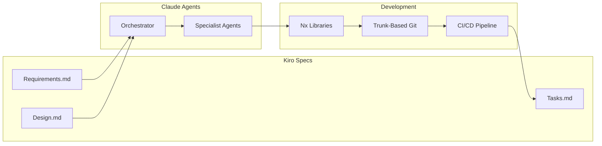
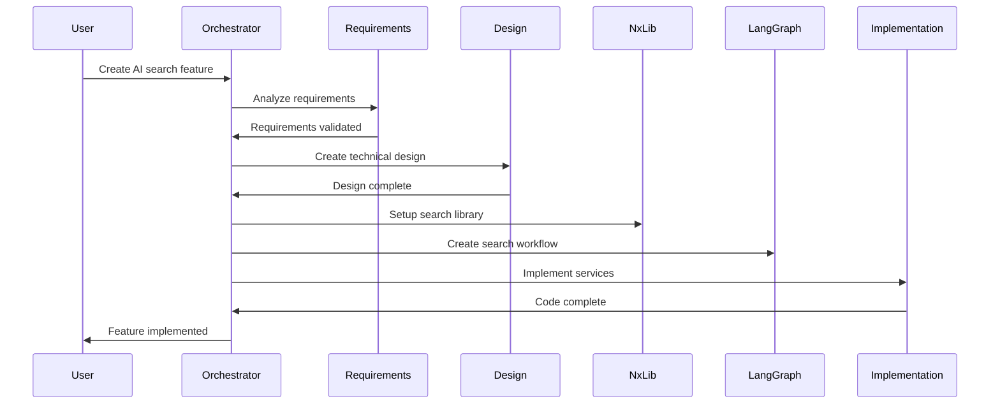

# Complete Agent System Integration Guide

## 🚀 Quick Start

This guide shows how to use the Claude AI Agent System with Kiro spec-driven development for the NestJS AI SaaS Starter ecosystem.

## System Overview



## 📋 Prerequisites

1. **Claude Code** installed and configured
2. **Nx workspace** properly set up
3. **Docker** for running services
4. **Git** configured for trunk-based development
5. **Environment variables** set in `.env`

## 🎯 Step-by-Step Workflow

### Step 1: Create a Kiro Spec

```bash
# Create a new spec for a feature
mkdir -p .kiro/specs/customer-chat
```

Create `.kiro/specs/customer-chat/requirements.md`:
```markdown
# Customer Chat System - Requirements

## Requirement 1: Real-time Chat
**User Story:** As a customer, I want to chat with support agents in real-time

### Acceptance Criteria
1. WHEN customer sends message THEN agent SHALL receive it within 1 second
2. WHEN agent responds THEN customer SHALL see response immediately
3. WHEN connection drops THEN system SHALL automatically reconnect
```

### Step 2: Activate the Agent System

In Claude Code, the agents will automatically detect the new spec and begin processing:

```bash
# The orchestrator agent will:
1. Parse the requirements
2. Assign to requirements-agent
3. Generate design tasks
4. Coordinate implementation
```

### Step 3: Agent Processing Flow

#### Phase 1: Requirements Analysis
The requirements-agent will:
- Extract acceptance criteria
- Identify technical constraints
- Generate test scenarios
- Update requirements.md with details

#### Phase 2: Design
The design-agent will:
- Create system architecture
- Design WebSocket integration
- Plan LangGraph workflow for chat routing
- Update design.md

#### Phase 3: Implementation
Specialist agents will collaborate:
- **langgraph-workflow-agent**: Create chat workflow
- **nx-library-agent**: Set up chat library
- **implementation-agent**: Write the code

### Step 4: Monitor Task Progress

Check task status in `.kiro/specs/customer-chat/tasks.md`:

```markdown
## Implementation Plan

- [x] 1. Analyze chat requirements
  - Status: completed
  - Agent: requirements-agent
  - Time: 2h

- [ ] 2. Design WebSocket architecture
  - Status: in-progress
  - Agent: design-agent
  - Time: 3h
  
- [ ] 3. Implement chat service
  - Status: pending
  - Agent: implementation-agent
  - Dependencies: [2]
```

### Step 5: Code Generation

Agents will generate code following the design:

```typescript
// libs/customer-chat/src/lib/services/chat.service.ts
@Injectable()
export class ChatService {
  constructor(
    @InjectChromaDB() private chromaDB: ChromaDBService,
    private workflowService: WorkflowGraphBuilderService,
  ) {}

  async routeMessage(message: ChatMessage): Promise<void> {
    // Implementation generated by agents
  }
}
```

### Step 6: Trunk-Based Development

Agents follow trunk-based practices:

```bash
# Agent creates short-lived branch
git checkout -b feat/spec-chat-websocket

# Commits frequently
git commit -m "feat(chat): implement WebSocket gateway [SPEC-CHAT-001]"

# Pushes for CI validation
git push origin feat/spec-chat-websocket

# Merges quickly after approval
```

## 🤖 Working with Agents

### Invoking Specific Agents

You can explicitly request specific agents:

```markdown
@nx-library-agent: Create a new library for payment processing
@langgraph-workflow-agent: Design a multi-agent customer service workflow
@testing-agent: Generate comprehensive tests for the auth module
```

### Agent Collaboration Example

For complex features, agents work together:



## 📁 Project Structure After Agent Processing

```
nestjs-ai-saas-starter/
├── .kiro/
│   ├── specs/
│   │   └── customer-chat/
│   │       ├── requirements.md  # Detailed requirements
│   │       ├── design.md        # Technical design
│   │       └── tasks.md         # Task tracking
│   └── task-management/
│       └── TASK-SYSTEM.md       # Task management docs
├── .claude/
│   ├── agents/                  # Agent configurations
│   └── AGENT-SYSTEM.md          # Agent system docs
├── libs/
│   └── customer-chat/           # Generated library
│       ├── src/
│       │   └── lib/
│       │       ├── services/    # Generated services
│       │       ├── workflows/    # LangGraph workflows
│       │       └── gateways/     # WebSocket gateways
│       └── project.json         # Nx configuration
└── .github/
    └── workflows/               # CI/CD pipelines
```

## 🔄 Continuous Integration

Agents automatically integrate with CI/CD:

```yaml
# .github/workflows/agent-ci.yml
name: Agent-Driven CI

on:
  push:
    branches: [main, 'feat/spec-*']

jobs:
  validate-spec:
    runs-on: ubuntu-latest
    steps:
      - name: Validate spec compliance
        run: npm run spec:validate
      
      - name: Check task completion
        run: npm run task:check
      
      - name: Run affected tests
        run: npx nx affected -t test
```

## 📊 Monitoring Agent Performance

### Dashboard Commands

```bash
# View agent activity
npm run agent:status

# Check task velocity
npm run task:dashboard

# Monitor spec progress
npm run spec:progress

# Generate reports
npm run agent:report
```

### Sample Dashboard Output

```
═══════════════════════════════════════════
       AGENT SYSTEM DASHBOARD
═══════════════════════════════════════════

📋 SPECS
├── customer-chat: 75% complete
├── payment-system: 30% complete
└── analytics: planning

🤖 AGENTS
├── requirements-agent: idle
├── design-agent: processing payment-system
├── implementation-agent: working on 3 tasks
└── testing-agent: validating customer-chat

📈 METRICS
├── Tasks Today: 12 completed, 5 in-progress
├── Avg Completion: 2.5 hours
├── Test Coverage: 85%
└── Build Success: 98%

⚠️ BLOCKERS
└── payment-system: Waiting for API specs
```

## 🛠️ Troubleshooting

### Common Issues and Solutions

#### 1. Agent Not Responding
```bash
# Check agent status
ls -la .claude/agents/

# Verify agent configuration
cat .claude/agents/kiro-orchestrator.md

# Check for syntax errors in spec files
npm run spec:lint
```

#### 2. Task Stuck in Progress
```bash
# Check task dependencies
npm run task:deps TASK-001

# Force task reassignment
npm run task:reassign TASK-001 --agent=implementation-agent

# View task logs
npm run task:logs TASK-001
```

#### 3. Spec Validation Failures
```bash
# Validate spec format
npm run spec:validate customer-chat

# Check for missing sections
npm run spec:check customer-chat

# Auto-fix common issues
npm run spec:fix customer-chat
```

## 🎓 Best Practices

### 1. Writing Effective Specs
- **Clear Requirements**: Use EARS notation for acceptance criteria
- **Measurable Success**: Define quantifiable metrics
- **Complete Context**: Include all necessary background

### 2. Agent Interaction
- **Be Specific**: Give agents clear, detailed instructions
- **Provide Context**: Include relevant spec IDs and task references
- **Validate Output**: Review agent-generated code before merging

### 3. Task Management
- **Small Tasks**: Break large features into smaller tasks
- **Clear Dependencies**: Explicitly define task relationships
- **Regular Updates**: Keep task status current

### 4. Code Quality
- **Follow Standards**: Agents follow coding standards by default
- **Test Coverage**: Ensure 80%+ coverage
- **Documentation**: Keep specs and code docs in sync

## 🚦 Getting Started Checklist

- [ ] Clone the repository
- [ ] Install dependencies: `npm install`
- [ ] Set up environment variables in `.env`
- [ ] Start Docker services: `npm run dev:services`
- [ ] Initialize agent system: Agents auto-activate in Claude Code
- [ ] Create your first spec in `.kiro/specs/`
- [ ] Watch agents process the spec automatically
- [ ] Monitor task progress in tasks.md
- [ ] Review generated code
- [ ] Run tests: `npm test`
- [ ] Merge to main when ready

## 📚 Additional Resources

### Documentation
- [Kiro Spec-Driven Development](https://kiro.dev/docs/specs/)
- [Claude Code Sub-Agents](https://docs.anthropic.com/en/docs/claude-code/sub-agents)
- [Nx Monorepo Guide](https://nx.dev/getting-started/intro)
- [Trunk-Based Development](.github/TRUNK-BASED-DEVELOPMENT.md)

### Configuration Files
- Agent System: `.claude/AGENT-SYSTEM.md`
- Task Management: `.kiro/task-management/TASK-SYSTEM.md`
- Individual Agents: `.claude/agents/*.md`
- Trunk-Based Workflow: `.github/TRUNK-BASED-DEVELOPMENT.md`

### Commands Reference
```bash
# Spec management
npm run spec:create <name>    # Create new spec
npm run spec:validate <name>  # Validate spec
npm run spec:status           # View all specs

# Task management  
npm run task:list             # List all tasks
npm run task:start <id>       # Start a task
npm run task:complete <id>    # Complete a task

# Agent operations
npm run agent:status          # Agent status
npm run agent:logs            # View agent logs
npm run agent:report          # Generate report

# Development
npm run dev:services          # Start Docker services
npm run build:libs           # Build libraries
npm run test                 # Run tests
```

## 🎉 Success!

You now have a fully integrated AI-driven development system that:
- ✅ Follows Kiro spec-driven development
- ✅ Uses specialized Claude sub-agents
- ✅ Manages tasks automatically
- ✅ Implements trunk-based development
- ✅ Integrates with Nx monorepo
- ✅ Provides continuous validation

Start creating specs and watch the AI agents bring them to life!

---

*For support or questions, refer to the individual documentation files or create an issue in the repository.*