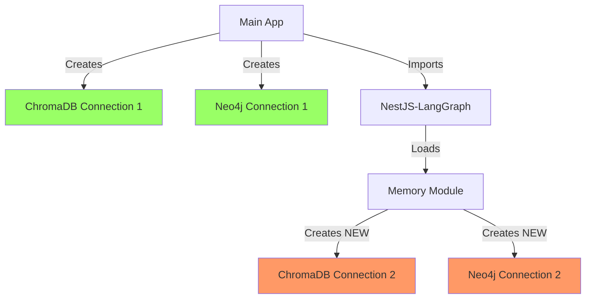
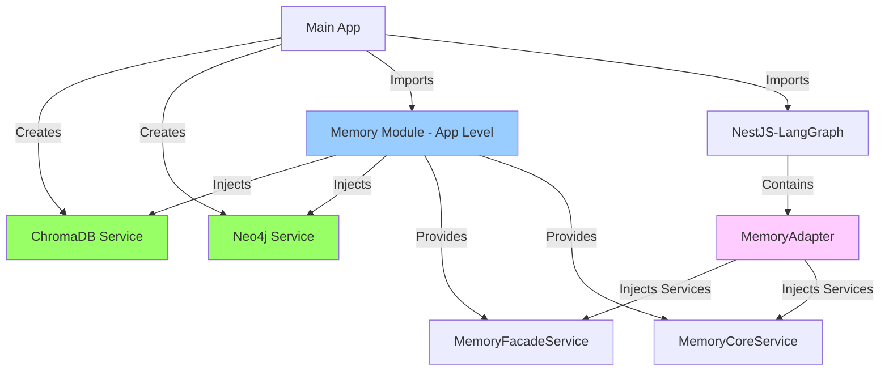

# Memory Module Refactoring Plan - Option B: App-Level Memory Module

## Executive Summary

The memory module in the NestJS-LangGraph library currently creates duplicate database connections, violating architectural principles. This document outlines the refactoring plan to move the sophisticated memory module from being a child module to an app-level module, preserving all functionality while fixing the connection duplication issue.

## Current Problem

### Architecture Violation



### Issues

1. **Duplicate Connections**: Two separate connection pools to the same databases
2. **Resource Waste**: Double memory and connection overhead
3. **Tight Coupling**: nestjs-langgraph depends on specific database implementations
4. **Publishing Problems**: Can't publish nestjs-langgraph independently
5. **Configuration Duplication**: Database configs needed in multiple places

## Root Cause Analysis

The memory module (`@langgraph-modules/memory`) directly imports and creates:

- `ChromaDBModule.forRoot(config.chromadb)`
- `Neo4jModule.forRoot(config.neo4j)`

This happens because:

- Memory module was designed as a standalone module
- It doesn't know about existing database connections
- Module loading happens during NestJS-LangGraph initialization
- Can't access parent app services due to module hierarchy

## Chosen Solution: App-Level Memory Module (Option B)

### Why This Approach?

After analyzing the codebase, we discovered:

1. **Sophisticated Memory Module Exists**: The current `@libs/langgraph-modules/memory` has 6 specialized services with excellent architecture
2. **MemoryAdapter Already Provides Interface**: The `nestjs-langgraph` library already has a `MemoryAdapter` that acts as a bridge
3. **No Inter-Module Dependencies**: Other langgraph-modules don't directly use the memory module
4. **Simple Fix**: Moving the module to app-level solves all issues without losing functionality

### New Architecture



## Implementation Steps

### Phase 1: Copy Memory Module to App Level

#### 1.1 Copy Module Structure

```bash
# Create new location for memory module at app level
mkdir -p apps/nestjs-ai-saas-starter-demo/src/modules/memory

# Copy the entire memory module
cp -r libs/langgraph-modules/memory/src/* apps/nestjs-ai-saas-starter-demo/src/modules/memory/
```

#### 1.2 Module Structure After Move

```
apps/nestjs-ai-saas-starter-demo/src/modules/memory/
├── memory.module.ts
├── interfaces/
│   └── memory.interface.ts
├── services/
│   ├── memory-core.service.ts
│   ├── memory-facade.service.ts
│   ├── semantic-search.service.ts
│   └── summarization.service.ts
├── health/
│   └── memory-health.service.ts
└── errors/
    └── memory-errors.ts
```

### Phase 2: Modify Memory Module to Use Injected Services

#### 2.1 Update Memory Module

```typescript
// apps/nestjs-ai-saas-starter-demo/src/modules/memory/memory.module.ts

import { DynamicModule, Module, Provider } from '@nestjs/common';
import { ConfigModule } from '@nestjs/config';
import { HttpModule } from '@nestjs/axios';

// Import services (no database module imports!)
import { MemoryConfig } from './interfaces/memory.interface';
import { MemoryCoreService } from './services/memory-core.service';
import { MemoryFacadeService } from './services/memory-facade.service';
import { SemanticSearchService } from './services/semantic-search.service';
import { SummarizationService } from './services/summarization.service';
import { MemoryHealthService } from './health/memory-health.service';

/**
 * Memory module that uses injected ChromaDB and Neo4j services from the main app
 * No longer creates its own database connections
 */
@Module({})
export class MemoryModule {
  /**
   * Configure memory module WITHOUT database connections
   * Uses existing ChromaDB and Neo4j services via dependency injection
   */
  public static forRoot(config?: Partial<MemoryConfig>): DynamicModule {
    const memoryConfig: MemoryConfig = {
      storage: { type: 'vector', vector: { provider: 'chromadb', config: {} } },
      enableSemanticSearch: true,
      enableAutoSummarization: true,
      ...config,
    };

    const providers: Provider[] = [
      {
        provide: 'MEMORY_CONFIG',
        useValue: memoryConfig,
      },
      // Core memory services that use injected database services
      MemoryCoreService,
      MemoryFacadeService,
      SemanticSearchService,
      SummarizationService,
      MemoryHealthService,
    ];

    return {
      module: MemoryModule,
      imports: [
        ConfigModule,
        HttpModule,
        // NO ChromaDBModule.forRoot() - uses injected service
        // NO Neo4jModule.forRoot() - uses injected service
      ],
      providers,
      exports: [
        MemoryFacadeService,     // Primary high-level memory interface
        MemoryCoreService,        // For MemoryAdapter compatibility
        SemanticSearchService,    // Advanced search capabilities
        SummarizationService,     // LLM-based summarization
        MemoryHealthService,      // Health checks and monitoring
        // Also export with string tokens for MemoryAdapter
        {
          provide: 'MemoryFacadeService',
          useExisting: MemoryFacadeService,
        },
        {
          provide: 'MemoryCoreService',
          useExisting: MemoryCoreService,
        },
      ],
    };
  }
}
```

#### 2.2 Update Service Imports

Update each service to use injected services instead of creating connections:

```typescript
// apps/nestjs-ai-saas-starter-demo/src/modules/memory/services/memory-core.service.ts

import { Injectable, Logger } from '@nestjs/common';
import { ChromaDBService } from '@hive-academy/nestjs-chromadb';
import { Neo4jService } from '@hive-academy/nestjs-neo4j';

@Injectable()
export class MemoryCoreService {
  private readonly logger = new Logger(MemoryCoreService.name);
  
  constructor(
    // Services are injected from the main app module
    private readonly chromadb: ChromaDBService,
    private readonly neo4j: Neo4jService,
    // ... other dependencies
  ) {}
  
  // All methods remain the same - no changes needed!
  // The services work exactly the same way
}
```

### Phase 3: Update Application Module

```typescript
// apps/nestjs-ai-saas-starter-demo/src/app/app.module.ts

import { Module } from '@nestjs/common';
import { ConfigModule, ConfigService } from '@nestjs/config';

// Library imports
import { ChromaDBModule } from '@hive-academy/nestjs-chromadb';
import { Neo4jModule } from '@hive-academy/nestjs-neo4j';

// Module imports
import { DocumentsModule } from '../modules/documents/documents.module';
import { GraphModule } from '../modules/graph/graph.module';
import { HealthModule } from '../modules/health/health.module';
import { MemoryModule } from '../modules/memory/memory.module';  // NEW: App-level memory

@Module({
  imports: [
    ConfigModule.forRoot({
      isGlobal: true,
      envFilePath: '.env',
    }),

    // ChromaDB Module - Single instance
    ChromaDBModule.forRootAsync({
      imports: [ConfigModule],
      useFactory: async (configService: ConfigService) => ({
        // ... existing config
      }),
      inject: [ConfigService],
    }),

    // Neo4j Module - Single instance
    Neo4jModule.forRootAsync({
      imports: [ConfigModule],
      inject: [ConfigService],
      useFactory: (configService: ConfigService) => ({
        // ... existing config
      }),
    }),

    // Memory Module - Now at app level, uses injected services
    MemoryModule.forRoot({
      enableSemanticSearch: true,
      enableAutoSummarization: true,
      retention: {
        maxEntries: 10000,
        maxAge: 30 * 24 * 60 * 60 * 1000, // 30 days
      },
    }),

    // Feature Modules
    DocumentsModule,
    GraphModule,
    HealthModule,
  ],
  exports: [
    // Export MemoryModule so other modules can use it
    MemoryModule,
  ],
})
export class AppModule {}
```

### Phase 4: Remove Memory from Child Module Imports

```typescript
// libs/nestjs-langgraph/src/lib/providers/child-module-imports.providers.ts

// In getRequiredModules method, remove memory module loading:
private getRequiredModules(options: LangGraphModuleOptions): [string, any][] {
  const modules: [string, any][] = [];

  // Map options to module configurations
  if (options.checkpoint?.enabled) {
    modules.push(['checkpoint', options.checkpoint]);
  }
  // REMOVED: memory module loading
  // if (options.memory) {
  //   modules.push(['memory', options.memory]);
  // }
  if (options.multiAgent) {
    modules.push(['multi-agent', options.multiAgent]);
  }
  // ... other modules

  return modules;
}
```

### Phase 5: Update Supervisor Agent Configuration

```typescript
// libs/demo/supervisor-agent/src/lib/config/supervisor-agent.config.ts

export const getSupervisorAgentConfig = (): LangGraphModuleOptions => ({
  // ... other config

  // REMOVE or COMMENT OUT memory configuration
  // Memory is now handled at app level, not through child modules
  // memory: {
  //   enabled: process.env.MEMORY_ENABLED !== 'false',
  //   chromadb: { ... },
  //   neo4j: { ... },
  // },

  // ... rest of config
});
```

### Phase 6: Update Supervisor Agent Module

```typescript
// libs/demo/supervisor-agent/src/lib/supervisor-agent.module.ts

import { Module } from '@nestjs/common';
import { NestjsLanggraphModule } from '@hive-academy/nestjs-langgraph';
import { getSupervisorAgentConfig } from './config/supervisor-agent.config';
import { SupervisorCoordinationWorkflow } from './workflows/supervisor-coordination.workflow';

@Module({
  imports: [
    NestjsLanggraphModule.forRootAsync({
      useFactory: getSupervisorAgentConfig,
    }),
    // Memory services will be available via DI from app module
  ],
  providers: [SupervisorCoordinationWorkflow],
  exports: [SupervisorCoordinationWorkflow],
})
export class SupervisorAgentModule {}
```

### Phase 7: Verify MemoryAdapter Still Works

The existing `MemoryAdapter` in nestjs-langgraph will continue to work:

```typescript
// libs/nestjs-langgraph/src/lib/adapters/memory.adapter.ts
// NO CHANGES NEEDED - This already works with injected services!

@Injectable()
export class MemoryAdapter {
  constructor(
    @Optional() @Inject('MemoryFacadeService')
    private readonly memoryFacade?: any,
    @Optional() @Inject('MemoryCoreService')
    private readonly memoryCoreService?: any
  ) {}
  
  // The adapter will now receive the services from app-level memory module
  // Everything continues to work seamlessly!
}
```

## Migration Strategy

### Step 1: Prepare (No Breaking Changes)

1. Copy memory module to `apps/nestjs-ai-saas-starter-demo/src/modules/memory/`
2. Update imports in memory services to remove database module creation
3. Add MemoryModule to app.module.ts imports
4. Test that existing functionality still works

### Step 2: Verify Single Connections

1. Start the application
2. Check logs for database connections
3. Verify only ONE ChromaDB connection
4. Verify only ONE Neo4j connection
5. Test memory operations work correctly

### Step 3: Cleanup

1. Remove memory configuration from supervisor-agent.config.ts
2. Remove memory module from child-module-imports.providers.ts
3. Optionally archive old memory module at `libs/langgraph-modules/memory` 
4. Update documentation

## Testing Checklist

- [ ] Memory module loads at app level
- [ ] No duplicate database connections in logs
- [ ] MemoryAdapter receives injected services
- [ ] Supervisor agent can use memory via MemoryAdapter
- [ ] Memory operations work correctly:
  - [ ] Store memory entries
  - [ ] Retrieve memories
  - [ ] Semantic search works
  - [ ] Summarization works
- [ ] ChromaDB collections created properly
- [ ] Neo4j relationships stored correctly
- [ ] Memory health checks pass
- [ ] No regression in existing features

## Benefits of This Approach

### 1. **Preserves Investment** ✅
- Keeps ALL sophisticated memory functionality
- No need to rewrite 6 services
- Maintains existing interfaces and patterns

### 2. **Fixes Connection Issue** ✅
- Single ChromaDB connection
- Single Neo4j connection
- Shared across all modules

### 3. **Clean Architecture** ✅
- Memory at same level as databases (app level)
- nestjs-langgraph remains database-agnostic
- Clear separation of concerns

### 4. **Simpler Implementation** ✅
- Mostly copy-paste with minor import changes
- MemoryAdapter continues to work unchanged
- No new interfaces needed

### 5. **Flexibility** ✅
- Easy to swap memory implementations
- Apps can choose to use memory or not
- Can still publish nestjs-langgraph independently

### 6. **Better Developer Experience** ✅
- Memory module is visible at app level
- Easier to understand and debug
- Follows NestJS conventions

## Future Enhancements

### 1. **Publish as Separate Package**
Once stable, the memory module could be published as:
- `@hive-academy/memory-module`
- Apps would import and configure it
- Could support multiple storage backends

### 2. **Multiple Memory Providers**
- Redis-based provider for caching
- PostgreSQL provider for SQL queries
- MongoDB provider for document storage

### 3. **Memory Strategies**
- LRU eviction
- Importance-based retention
- Automatic summarization
- Cross-thread memory sharing

## Conclusion

This refactoring moves the sophisticated memory module from being a dynamically-loaded child module to a properly configured app-level module. This solves the duplicate connection issue while preserving all functionality. The implementation is straightforward and can be done incrementally without breaking existing code.

The key insight is that we don't need to replace the memory module with a simpler SharedMemoryService - we can keep all the sophisticated functionality and just change WHERE it's configured. This is a much simpler and better solution.