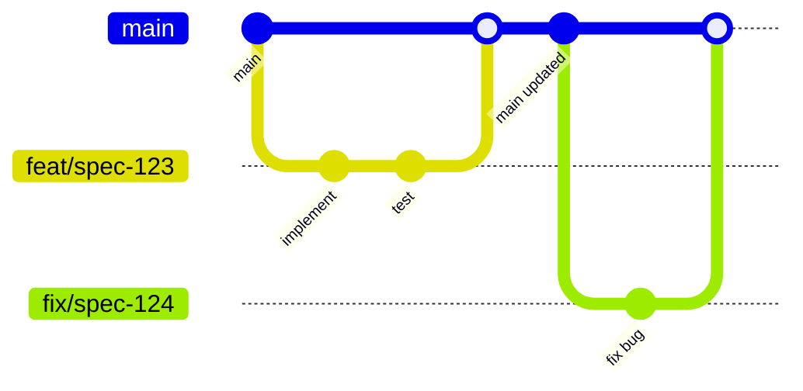
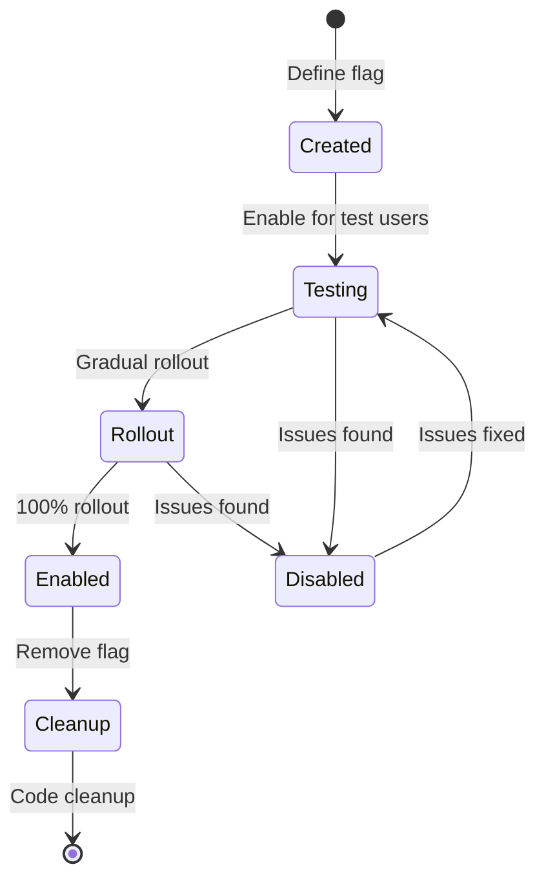

# Trunk-Based Development Workflow

## Overview

This document defines the trunk-based development workflow for the NestJS AI SaaS Starter, integrated with Kiro specs and Claude AI agents.

## Core Principles

### 1. Single Source of Truth

- **Main branch** (`main`) is the single source of truth
- Always production-ready
- All development flows through main
- No long-lived feature branches

### 2. Continuous Integration

- Merge to main multiple times per day
- Automated testing on every commit
- Immediate feedback on integration issues
- Fast feedback loops

### 3. Feature Flags

- Incomplete features behind flags
- Gradual rollout capabilities
- A/B testing support
- Quick rollback without code changes

## Branch Strategy



### Branch Types

| Type    | Pattern                          | Lifetime   | Purpose         |
| ------- | -------------------------------- | ---------- | --------------- |
| main    | `main`                           | Permanent  | Production code |
| feature | `feat/spec-{id}-{description}`   | < 24 hours | New features    |
| fix     | `fix/spec-{id}-{description}`    | < 4 hours  | Bug fixes       |
| review  | `review/spec-{id}-{description}` | < 2 hours  | Code review     |

### Branch Rules

```yaml
# .github/branch-protection.yml
protection_rules:
  main:
    required_reviews: 1
    dismiss_stale_reviews: true
    require_up_to_date: true
    required_checks:
      - build
      - test
      - lint
      - coverage
    enforce_admins: false
    restrictions:
      users: []
      teams: ['developers']
```

## Development Workflow

### 1. Start Work on Task

```bash
# Get latest main
git checkout main
git pull origin main

# Create short-lived branch
git checkout -b feat/spec-123-user-auth

# Work on feature
npm run dev
```

### 2. Continuous Integration

```bash
# Commit frequently (multiple times per day)
git add .
git commit -m "feat(auth): implement JWT token generation"

# Keep branch updated with main
git fetch origin main
git rebase origin main

# Push for CI validation
git push origin feat/spec-123-user-auth
```

### 3. Feature Flags for Incomplete Work

```typescript
// libs/shared/src/lib/feature-flags.ts
export enum FeatureFlags {
  NEW_AUTH_SYSTEM = 'new-auth-system',
  AI_WORKFLOW_V2 = 'ai-workflow-v2',
  ADVANCED_SEARCH = 'advanced-search',
}

// Implementation with feature flag
@Injectable()
export class AuthService {
  async authenticate(credentials: Credentials) {
    if (await this.featureFlags.isEnabled(FeatureFlags.NEW_AUTH_SYSTEM)) {
      return this.newAuthFlow(credentials);
    }
    return this.legacyAuthFlow(credentials);
  }
}
```

### 4. Automated Testing

```yaml
# .github/workflows/ci.yml
name: Continuous Integration

on:
  push:
    branches: [main]
  pull_request:
    branches: [main]

jobs:
  validate:
    runs-on: ubuntu-latest
    steps:
      - uses: actions/checkout@v3

      - name: Setup Node.js
        uses: actions/setup-node@v3
        with:
          node-version: '20'
          cache: 'npm'

      - name: Install dependencies
        run: npm ci

      - name: Run affected tests
        run: npx nx affected -t test --base=origin/main

      - name: Run affected lint
        run: npx nx affected -t lint --base=origin/main

      - name: Run affected build
        run: npx nx affected -t build --base=origin/main

      - name: Check coverage
        run: npx nx affected -t test --coverage --base=origin/main

      - name: Validate feature flags
        run: npm run validate:feature-flags
```

### 5. Code Review Process

```yaml
# .github/pull_request_template.md
## Task Reference
- Kiro Spec: [SPEC-XXX]
- Task ID: [TASK-XXX]

## Changes
- [ ] Implementation matches spec requirements
- [ ] Tests added/updated
- [ ] Documentation updated
- [ ] Feature flag added (if incomplete)

## Validation
- [ ] All CI checks passing
- [ ] Coverage maintained/improved
- [ ] No console.logs or debug code
- [ ] Follows coding standards

## Agent Review
- Agent: [agent-name]
- Validation: [PASSED/FAILED]
- Feedback: [agent-feedback]
```

### 6. Merge to Main

```bash
# After approval, merge immediately
git checkout main
git pull origin main
git merge --no-ff feat/spec-123-user-auth
git push origin main

# Or use GitHub merge button with squash
```

## Feature Flag Management

### Configuration

```typescript
// libs/shared/src/lib/config/feature-flags.config.ts
export interface FeatureFlagConfig {
  name: string;
  enabled: boolean;
  rolloutPercentage?: number;
  enabledFor?: string[]; // User IDs or roles
  expiresAt?: Date;
}

@Injectable()
export class FeatureFlagService {
  private flags = new Map<string, FeatureFlagConfig>();

  async isEnabled(flag: FeatureFlags, context?: { userId?: string; role?: string }): Promise<boolean> {
    const config = this.flags.get(flag);

    if (!config) return false;
    if (!config.enabled) return false;
    if (config.expiresAt && new Date() > config.expiresAt) return false;

    // Check user-specific enablement
    if (context?.userId && config.enabledFor?.includes(context.userId)) {
      return true;
    }

    // Check rollout percentage
    if (config.rolloutPercentage) {
      return this.checkRolloutPercentage(context?.userId, config.rolloutPercentage);
    }

    return config.enabled;
  }
}
```

### Flag Lifecycle



## Continuous Deployment

### Auto-deploy to Staging

```yaml
# .github/workflows/deploy-staging.yml
name: Deploy to Staging

on:
  push:
    branches: [main]

jobs:
  deploy:
    runs-on: ubuntu-latest
    steps:
      - uses: actions/checkout@v3

      - name: Build Docker image
        run: |
          docker build -t ${{ secrets.REGISTRY }}/app:${{ github.sha }} .
          docker push ${{ secrets.REGISTRY }}/app:${{ github.sha }}

      - name: Deploy to staging
        run: |
          kubectl set image deployment/app \
            app=${{ secrets.REGISTRY }}/app:${{ github.sha }} \
            --namespace=staging

      - name: Run smoke tests
        run: npm run test:smoke -- --url=https://staging.example.com

      - name: Notify team
        uses: 8398a7/action-slack@v3
        with:
          status: ${{ job.status }}
          text: 'Deployed to staging: ${{ github.sha }}'
```

### Production Release

```yaml
# .github/workflows/deploy-production.yml
name: Deploy to Production

on:
  workflow_dispatch:
    inputs:
      version:
        description: 'Version to deploy'
        required: true

jobs:
  deploy:
    runs-on: ubuntu-latest
    environment: production
    steps:
      - name: Validate version
        run: |
          # Ensure version exists in staging
          kubectl get deployment/app \
            --namespace=staging \
            -o jsonpath='{.spec.template.spec.containers[0].image}' | \
            grep ${{ github.event.inputs.version }}

      - name: Deploy to production
        run: |
          kubectl set image deployment/app \
            app=${{ secrets.REGISTRY }}/app:${{ github.event.inputs.version }} \
            --namespace=production

      - name: Monitor deployment
        run: |
          kubectl rollout status deployment/app --namespace=production

      - name: Run health checks
        run: npm run test:health -- --url=https://api.example.com
```

## Monitoring & Metrics

### Branch Age Monitoring

```typescript
// scripts/monitor-branches.ts
async function monitorBranches() {
  const branches = await git.branch(['--remote']);
  const now = Date.now();

  for (const branch of branches.all) {
    if (branch.startsWith('origin/feat/') || branch.startsWith('origin/fix/')) {
      const lastCommit = await git.log([branch, '-1']);
      const age = now - new Date(lastCommit.latest.date).getTime();
      const ageHours = age / (1000 * 60 * 60);

      if (ageHours > 24) {
        console.warn(`⚠️ Branch ${branch} is ${ageHours.toFixed(1)} hours old`);
        await notifyTeam({
          branch,
          age: ageHours,
          lastCommit: lastCommit.latest,
        });
      }
    }
  }
}
```

### Deployment Frequency

```typescript
// Track deployment metrics
interface DeploymentMetrics {
  deploymentsPerDay: number;
  leadTime: number; // Time from commit to production
  mttr: number; // Mean time to recovery
  changeFailureRate: number;
}

async function trackDeployment(deployment: Deployment) {
  await metrics.record({
    type: 'deployment',
    environment: deployment.environment,
    timestamp: new Date(),
    commitSha: deployment.commitSha,
    duration: deployment.duration,
    status: deployment.status,
  });
}
```

## Best Practices

### 1. Commit Messages

Follow conventional commits with spec references:

```bash
feat(auth): implement JWT refresh tokens [SPEC-123]
fix(search): correct vector similarity calculation [SPEC-124]
test(workflow): add integration tests for approval flow [SPEC-125]
docs(api): update authentication endpoints [SPEC-126]
```

### 2. Pre-commit Hooks

```bash
# .husky/pre-commit
#!/bin/sh
. "$(dirname "$0")/_/husky.sh"

# Run tests for changed files
npx nx affected -t test --base=main

# Run linting
npx nx affected -t lint --base=main

# Check branch age
node scripts/check-branch-age.js

# Validate feature flags
npm run validate:feature-flags
```

### 3. Daily Practices

#### Morning

1. Pull latest main
2. Review overnight CI results
3. Check branch age report
4. Plan day's integration points

#### During Development

1. Commit at least every 2 hours
2. Push for CI validation
3. Rebase if main has changed
4. Use feature flags for WIP

#### End of Day

1. Push all work (even WIP)
2. Create draft PR if not ready
3. Update task status in Kiro specs
4. No uncommitted work locally

## Rollback Procedures

### Feature Flag Rollback

```typescript
// Immediate rollback without deployment
await featureFlagService.disable(FeatureFlags.PROBLEMATIC_FEATURE);

// Gradual rollback
await featureFlagService.updateRollout(FeatureFlags.PROBLEMATIC_FEATURE, {
  rolloutPercentage: 0,
  enabledFor: ['qa-team'],
});
```

### Code Rollback

```bash
# Revert a problematic merge
git revert -m 1 <merge-commit-sha>
git push origin main

# Or reset if caught immediately (dangerous)
git reset --hard <last-good-commit>
git push --force-with-lease origin main
```

## Success Metrics

| Metric                | Target                | Measure                |
| --------------------- | --------------------- | ---------------------- |
| Integration Frequency | > 3/day per developer | Git commits to main    |
| Branch Age            | < 24 hours            | Automated monitoring   |
| Build Success Rate    | > 95%                 | CI pipeline metrics    |
| Deployment Frequency  | > 1/day               | Production deployments |
| Lead Time             | < 4 hours             | Commit to production   |
| MTTR                  | < 1 hour              | Incident resolution    |
| Test Coverage         | > 80%                 | Coverage reports       |
| Feature Flag Usage    | 100% for new features | Code review validation |

## Tools & Integration

### Required Tools

- Git hooks (Husky)
- Feature flag service (LaunchDarkly/Unleash)
- CI/CD (GitHub Actions)
- Monitoring (Datadog/New Relic)
- Deployment (Kubernetes/Docker)

### Agent Integration

- Agents follow trunk-based practices
- Automatic branch creation and management
- Feature flag integration in generated code
- Continuous validation against main

This workflow ensures rapid, safe delivery of features while maintaining code quality and system stability.
