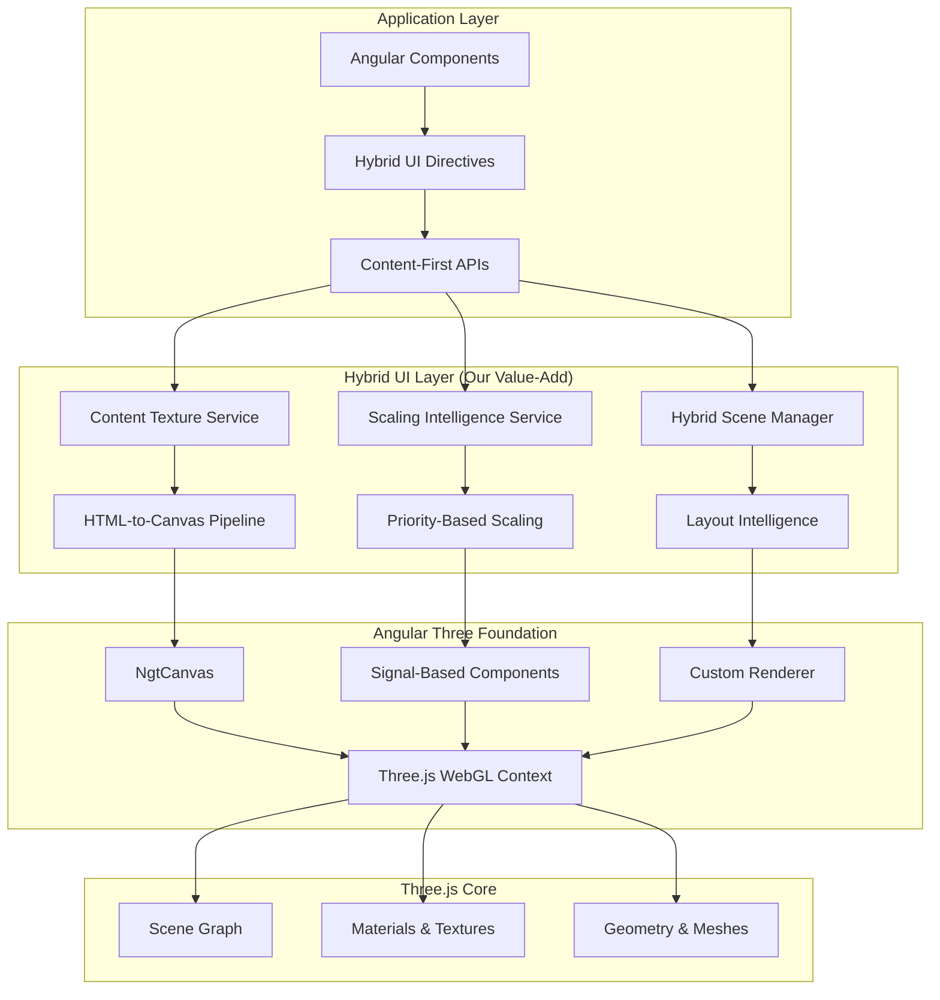

# Angular Hybrid 3D-UI Framework v2.0

## Product Requirements Document: Angular Three Foundation Integration

---

### Document Information

- **Version**: 1.0
- **Date**: September 16, 2025
- **Author**: Development Team
- **Status**: Draft
- **Project Code**: `hybrid-ui-v2`

---

## Executive Summary

This PRD outlines the strategic refactoring of our existing Angular Hybrid 3D-UI Framework to leverage Angular Three as the foundational layer while preserving and enhancing our core differentiator: HTML-to-3D texture conversion for content-first hybrid interfaces. This migration will modernize our architecture, improve performance, and provide better developer experience while maintaining our unique value proposition.

### Key Objectives

1. **Modernize Architecture**: Adopt Angular Three's signal-based, custom renderer approach
2. **Preserve Core Value**: Maintain and enhance HTML-to-3D conversion capabilities
3. **Improve DX**: Provide better TypeScript support and declarative APIs
4. **Enhance Performance**: Leverage Angular Three's optimizations and our intelligent scaling
5. **Future-Proof**: Build on a maintained, growing ecosystem

---

## Current State Analysis

### Strengths of Current Implementation

- **Unique HTML-to-3D Pipeline**: Convert any HTML element to interactive 3D textures
- **Content-First Philosophy**: Intelligent priority-based scaling system
- **Comprehensive Service Architecture**: Well-structured service layers
- **Performance Optimizations**: LOD, culling, and smart texture management
- **Declarative API**: `*content3D` directive for easy HTML-to-3D conversion

### Technical Debt & Limitations

- **Custom Three.js Integration**: Manual scene/renderer management
- **Change Detection Issues**: Zone.js conflicts with render loops
- **Limited Ecosystem**: No access to Three.js community tools
- **Maintenance Overhead**: Custom implementations of common 3D patterns
- **Angular Version Dependencies**: Tight coupling to specific Angular versions

### Core Components to Preserve

```
angular-hybrid-ui/
├── core/services/
│   ├── content-texture.service.ts      # ✅ Essential - HTML to texture conversion
│   ├── scaling-intelligence.service.ts # ✅ Essential - Priority-based scaling
│   └── hybrid-ui.service.ts           # 🔄 Refactor - Scene management
├── directives/
│   └── content-3d.directive.ts        # 🔄 Refactor - HTML-to-3D conversion
├── components/
│   ├── hybrid-scene.component.ts      # 🔄 Refactor - Scene container
│   └── card-3d.component.ts          # 🔄 Refactor - Specific implementations
└── types/
    └── hybrid-ui.types.ts             # 🔄 Extend - Type definitions
```

---

## Vision & Strategic Goals

### Vision Statement

Create the industry's most powerful content-first 3D UI framework for Angular, combining Angular Three's modern architecture with our unique HTML-to-3D conversion capabilities to enable seamless hybrid 2D/3D interfaces.

### Strategic Goals

#### 1. **Foundation Modernization**

- Adopt Angular Three as the core 3D rendering layer
- Leverage signal-based reactivity throughout the system
- Implement custom renderer benefits for performance

#### 2. **Value Proposition Enhancement**

- Expand HTML-to-3D conversion capabilities
- Improve content-first intelligent scaling algorithms
- Add advanced texture management and caching

#### 3. **Developer Experience Excellence**

- Provide best-in-class TypeScript integration
- Create intuitive declarative APIs
- Establish comprehensive documentation and examples

#### 4. **Performance Leadership**

- Combine Angular Three's optimizations with our intelligent systems
- Implement advanced LOD and culling strategies
- Optimize for mobile and low-power devices

#### 5. **Ecosystem Integration**

- Enable use of Angular Three Soba components
- Support postprocessing effects
- Maintain compatibility with Three.js ecosystem

---

## Target Architecture

### Architecture Overview



### Core Architecture Principles

#### 1. **Layered Architecture**

- **Angular Three Foundation**: Handle core 3D rendering, scene management, and signal reactivity
- **Hybrid UI Enhancement Layer**: Our unique HTML-to-3D and content-first capabilities
- **Application API Layer**: Simplified, declarative interfaces for end users

#### 2. **Signal-First Reactivity**

- All state management through Angular signals
- Reactive HTML-to-texture updates
- Signal-driven layout recalculations

#### 3. **Service Architecture**

```typescript
interface HybridUIArchitecture {
  foundation: {
    angularThree: 'NgtCanvas + Signal Components';
    customRenderer: 'Direct Three.js manipulation';
    signalSystem: 'Angular 19+ signals';
  };

  hybridLayer: {
    contentConversion: 'HTML → Canvas → Three.js Texture';
    intelligentScaling: 'Priority-based size calculations';
    layoutManagement: 'Automatic spatial arrangements';
    interactionSystem: '3D ↔ DOM event bridging';
  };

  applicationAPI: {
    declarativeDirectives: '*content3D, *hybrid3D';
    componentLibrary: 'Pre-built 3D UI components';
    configurationSystem: 'Type-safe configuration objects';
  };
}
```

---

## Feature Requirements

### Phase 1: Foundation Migration (MVP)

#### 1.1 Angular Three Integration

**Priority**: P0 (Blocking)
**Effort**: 3-4 weeks

**Requirements**:

- [ ] Integrate Angular Three v3 as core dependency
- [ ] Migrate existing scene management to `NgtCanvas`
- [ ] Convert service layer to signal-based architecture
- [ ] Maintain existing public API compatibility

**Acceptance Criteria**:

- All existing functionality works with Angular Three foundation
- Performance matches or exceeds current implementation
- No breaking changes to public APIs

#### 1.2 Content Texture Service Modernization

**Priority**: P0 (Blocking)
**Effort**: 2-3 weeks

**Requirements**:

- [ ] Enhance HTML-to-canvas conversion pipeline
- [ ] Implement signal-reactive texture updates
- [ ] Add advanced caching strategies
- [ ] Support dynamic content updates

**Technical Specifications**:

```typescript
interface ContentTextureServiceV2 {
  // Signal-based texture generation
  generateTexture(element: HTMLElement): Signal<THREE.CanvasTexture>;

  // Reactive updates
  watchElement(element: HTMLElement): Signal<boolean>;

  // Advanced caching
  cache: {
    strategy: 'lru' | 'size-based' | 'time-based';
    maxMemory: number;
    maxTextures: number;
  };

  // Performance optimizations
  options: {
    enableMipmaps: boolean;
    textureFormat: THREE.PixelFormat;
    anisotropy: number;
    generateMipmaps: boolean;
  };
}
```

#### 1.3 Scaling Intelligence Enhancement

**Priority**: P0 (Blocking)
**Effort**: 2 weeks

**Requirements**:

- [ ] Convert to signal-based calculations
- [ ] Enhance priority-based scaling algorithms
- [ ] Add viewport-aware scaling
- [ ] Implement responsive 3D layouts

### Phase 2: Enhanced Features (Extended MVP)

#### 2.1 Advanced Directive System

**Priority**: P1 (Important)
**Effort**: 2-3 weeks

**Requirements**:

- [ ] Create new `*hybrid3D` directive with Angular Three integration
- [ ] Maintain backward compatibility with `*content3D`
- [ ] Add declarative animation support
- [ ] Implement advanced interaction patterns

**API Design**:

```typescript
// New declarative API
@Component({
  template: `
    <ngt-canvas>
      <!-- Our enhanced directive on top of Angular Three -->
      <div *hybrid3D="{
        priority: 'primary',
        layout: 'card',
        animation: 'float',
        interaction: { hover: 'scale', click: 'focus' }
      }" class="content-card">
        <h2>{{ title }}</h2>
        <p>{{ description }}</p>
      </div>

      <!-- Native Angular Three components for traditional 3D -->
      <ngt-mesh [position]="[0, 0, 5]">
        <ngt-box-geometry *args="[1, 1, 1]" />
        <ngt-mesh-standard-material color="blue" />
      </ngt-mesh>
    </ngt-canvas>
  `
})
```

#### 2.2 Component Library Expansion

**Priority**: P1 (Important)
**Effort**: 3-4 weeks

**Requirements**:

- [ ] Create pre-built hybrid UI components
- [ ] Implement 3D form controls
- [ ] Build navigation components
- [ ] Add data visualization components

**Component Specifications**:

```typescript
interface HybridComponentLibrary {
  layout: {
    'hybrid-grid': 'Responsive 3D grid layouts';
    'hybrid-stack': 'Layered depth arrangements';
    'hybrid-carousel': '3D content carousels';
  };

  interactive: {
    'hybrid-button': '3D interactive buttons';
    'hybrid-card': 'Content cards with depth';
    'hybrid-modal': '3D modal dialogs';
  };

  data: {
    'hybrid-chart': '3D data visualizations';
    'hybrid-timeline': 'Temporal 3D layouts';
    'hybrid-tree': 'Hierarchical 3D structures';
  };
}
```

### Phase 3: Advanced Capabilities (Post-MVP)

#### 3.1 Performance Optimization Suite

**Priority**: P1 (Important)
**Effort**: 2-3 weeks

**Requirements**:

- [ ] Implement advanced LOD for HTML textures
- [ ] Add intelligent culling for content elements
- [ ] Optimize texture memory management
- [ ] Implement quality scaling for mobile devices

#### 3.2 Animation & Interaction System

**Priority**: P2 (Nice to Have)
**Effort**: 3-4 weeks

**Requirements**:

- [ ] Declarative animation system for HTML-to-3D elements
- [ ] Physics-based interactions using Angular Three Cannon/Rapier
- [ ] Gesture support for touch devices
- [ ] Advanced transition systems

#### 3.3 Developer Tools & Debugging

**Priority**: P2 (Nice to Have)
**Effort**: 2 weeks

**Requirements**:

- [ ] Chrome DevTools extension for 3D debugging
- [ ] Performance monitoring dashboard
- [ ] Visual scene inspector
- [ ] HTML-to-3D conversion debugger

---

## Technical Specifications

### Dependencies & Requirements

#### Core Dependencies

```json
{
  "dependencies": {
    "@angular/core": "^19.0.0",
    "angular-three": "^3.x",
    "three": "^0.170.0",
    "@angular-three/soba": "^3.x",
    "@angular-three/postprocessing": "^3.x"
  },
  "peerDependencies": {
    "@angular/common": "^19.0.0",
    "@angular/platform-browser": "^19.0.0"
  }
}
```

#### System Requirements

- **Angular**: 19.0+ (for signals support)
- **TypeScript**: 5.5+
- **Node.js**: 18+
- **WebGL**: 2.0 support required
- **Browser Support**: Modern browsers (Chrome 88+, Firefox 85+, Safari 14+)

### API Design Specifications

#### 1. Enhanced Hybrid UI Service

```typescript
@Injectable({ providedIn: 'root' })
export class HybridUIServiceV2 {
  // Angular Three integration
  private readonly ngtCanvas = inject(NgtCanvas, { optional: true });
  private readonly store = inject(NgtStore);

  // Signal-based state
  readonly elements = signal(new Map<string, HybridElement3D>());
  readonly activeElement = signal<string | null>(null);
  readonly performance = signal<PerformanceMetrics>({
    fps: 60,
    textureMemory: 0,
    elementCount: 0,
  });

  // Enhanced content conversion
  addHybridElement(element: HTMLElement, config: HybridElementConfigV2): Signal<string | null>;

  // Layout intelligence
  updateLayout(sceneId: string, layout: LayoutConfigV2): Signal<boolean>;

  // Performance monitoring
  readonly optimizationSuggestions = computed(() => {
    const perf = this.performance();
    const suggestions: OptimizationSuggestion[] = [];

    if (perf.fps < 30) {
      suggestions.push({
        type: 'performance',
        priority: 'high',
        message: 'Consider reducing texture quality or element count',
      });
    }

    return suggestions;
  });
}
```

#### 2. Modern Hybrid Element Configuration

```typescript
interface HybridElementConfigV2 extends HybridElementConfig {
  // Angular Three integration
  angularThree?: {
    parentGroup?: string;
    renderOrder?: number;
    layers?: number;
  };

  // Enhanced content conversion
  content?: {
    watchForChanges?: boolean;
    updateTriggers?: ('resize' | 'mutation' | 'animation')[];
    quality?: 'low' | 'medium' | 'high' | 'ultra';
    format?: 'webp' | 'png' | 'jpeg';
  };

  // Advanced animations
  animations?: {
    enter?: AnimationConfig;
    exit?: AnimationConfig;
    hover?: AnimationConfig;
    focus?: AnimationConfig;
    custom?: Record<string, AnimationConfig>;
  };

  // Responsive behavior
  responsive?: {
    mobile?: Partial<HybridElementConfigV2>;
    tablet?: Partial<HybridElementConfigV2>;
    desktop?: Partial<HybridElementConfigV2>;
  };
}
```

#### 3. Declarative Template API

```typescript
// Enhanced directive with Angular Three integration
@Directive({
  selector: '[hybrid3D]',
  standalone: true,
})
export class Hybrid3DDirective implements OnInit, OnDestroy {
  // Configuration inputs
  config = input<HybridElementConfigV2>();
  priority = input<ContentPriority>(ContentPriority.SECONDARY);
  animation = input<AnimationConfig>();

  // Signal outputs
  element3D = output<Signal<HybridElement3D>>();
  ready = output<boolean>();
  error = output<Error>();

  // Integration with Angular Three
  private readonly ngtStore = inject(NgtStore);
  private readonly scene = this.ngtStore.get('scene');

  // Enhanced functionality
  updateContent(): Signal<boolean>;
  optimizeTexture(): Signal<boolean>;
  getPerformanceMetrics(): Signal<ElementPerformanceMetrics>;
}
```

### Performance Specifications

#### Texture Management

- **Memory Budget**: Max 256MB for texture cache
- **Quality Scaling**: Automatic based on device capabilities
- **Update Strategy**: Incremental updates for changed content only
- **Compression**: WebP support where available, PNG fallback

#### Rendering Performance

- **Target FPS**: 60fps on desktop, 30fps on mobile
- **LOD Strategy**: Distance-based quality reduction
- **Culling**: Frustum + occlusion culling for HTML elements
- **Batching**: Group similar HTML textures for efficient rendering

#### Memory Management

- **Automatic Cleanup**: Dispose unused textures after 30 seconds
- **Reference Counting**: Track texture usage across elements
- **Memory Monitoring**: Real-time memory usage tracking
- **Emergency Cleanup**: Automatic quality reduction under memory pressure

---

## Implementation Strategy

### Migration Approach: Gradual Transition

#### Phase 1: Parallel Implementation (Weeks 1-4)

1. **Create New Module Structure**

   ```
   angular-hybrid-ui-v2/
   ├── core/
   │   ├── angular-three-integration/
   │   ├── services-v2/
   │   └── types-v2/
   ├── compatibility/
   │   └── v1-adapter.service.ts
   └── examples/
       └── migration-examples/
   ```

2. **Build Angular Three Foundation**

   - Implement base `NgtCanvas` wrapper
   - Create signal-based service layer
   - Build compatibility adapters

3. **Migrate Core Services**
   - Port `ContentTextureService` to signals
   - Enhance `ScalingIntelligenceService`
   - Refactor `HybridUIService` for Angular Three

#### Phase 2: Feature Parity (Weeks 5-8)

1. **Directive System Migration**

   - Create new `*hybrid3D` directive
   - Maintain `*content3D` compatibility
   - Implement feature parity

2. **Component Library**

   - Port existing components
   - Add Angular Three enhancements
   - Create new hybrid components

3. **Performance Optimization**
   - Implement new caching strategies
   - Add intelligent LOD
   - Optimize texture pipeline

#### Phase 3: Enhancement & Polish (Weeks 9-12)

1. **Advanced Features**

   - Animation system enhancement
   - Interaction improvements
   - Developer tools

2. **Documentation & Examples**

   - Comprehensive API documentation
   - Migration guides
   - Example applications

3. **Testing & Validation**
   - Performance benchmarking
   - Cross-browser testing
   - Production validation

### Risk Mitigation

#### Technical Risks

| Risk                               | Probability | Impact | Mitigation Strategy                                       |
| ---------------------------------- | ----------- | ------ | --------------------------------------------------------- |
| Angular Three compatibility issues | Medium      | High   | Extensive compatibility testing, fallback implementations |
| Performance regression             | Low         | High   | Continuous benchmarking, performance budgets              |
| Migration complexity               | High        | Medium | Phased approach, compatibility layers                     |
| Ecosystem dependency               | Medium      | Medium | Pin versions, prepare fallbacks                           |

#### Timeline Risks

| Risk                        | Probability | Impact | Mitigation Strategy                    |
| --------------------------- | ----------- | ------ | -------------------------------------- |
| Scope creep                 | High        | Medium | Clear MVP definition, phase gates      |
| Technical debt accumulation | Medium      | Low    | Regular refactoring, code reviews      |
| Resource constraints        | Medium      | High   | Flexible timeline, priority management |

---

## Success Metrics

### Technical Metrics

#### Performance Benchmarks

- **Rendering Performance**: ≥95% of current FPS performance
- **Memory Usage**: ≤90% of current memory footprint
- **Bundle Size**: ≤110% of current bundle size
- **Texture Generation**: ≤80% of current generation time

#### Developer Experience Metrics

- **API Simplicity**: ≤50% lines of code for common use cases
- **TypeScript Coverage**: 100% type safety
- **Build Time**: ≤120% of current build times
- **Error Rate**: ≤50% of current runtime errors

### Business Metrics

#### Adoption Metrics

- **Migration Rate**: 80% of internal projects migrated within 6 months
- **Developer Satisfaction**: ≥8.5/10 in surveys
- **Documentation Usage**: ≥1000 monthly documentation views
- **Community Engagement**: ≥50 GitHub stars, ≥10 contributors

#### Quality Metrics

- **Bug Rate**: ≤2 bugs per 1000 lines of code
- **Test Coverage**: ≥90% code coverage
- **Performance Regression**: 0 performance regressions in production
- **Security Issues**: 0 high-severity security vulnerabilities

---

## Development Timeline

### Phase 1: Foundation (Weeks 1-4)

**Milestone**: Angular Three Integration Complete

- **Week 1**: Project setup, Angular Three integration
- **Week 2**: Core service migration to signals
- **Week 3**: Content texture service enhancement
- **Week 4**: Compatibility layer and testing

**Deliverables**:

- Working Angular Three foundation
- Signal-based service architecture
- Basic compatibility with v1 API

### Phase 2: Feature Development (Weeks 5-8)

**Milestone**: Feature Parity Achieved

- **Week 5**: New directive system implementation
- **Week 6**: Component library migration
- **Week 7**: Performance optimization implementation
- **Week 8**: Integration testing and refinement

**Deliverables**:

- Complete directive system
- Migrated component library
- Performance optimizations
- Comprehensive test suite

### Phase 3: Enhancement & Launch (Weeks 9-12)

**Milestone**: Production Ready Release

- **Week 9**: Advanced features implementation
- **Week 10**: Documentation and examples
- **Week 11**: Final testing and polish
- **Week 12**: Release preparation and launch

**Deliverables**:

- Advanced animation system
- Complete documentation
- Migration guides
- Production-ready v2.0 release

---

## Resource Requirements

### Development Team

- **Lead Developer** (1.0 FTE): Architecture, core services, Angular Three integration
- **Frontend Developer** (1.0 FTE): Components, directives, UI implementation
- **Performance Engineer** (0.5 FTE): Optimization, testing, benchmarking
- **Technical Writer** (0.25 FTE): Documentation, examples, migration guides

### Infrastructure

- **Development Environment**: Enhanced with Angular 19, Node.js 18+
- **Testing Infrastructure**: Cross-browser testing, performance monitoring
- **CI/CD Pipeline**: Automated testing, deployment, package publishing
- **Documentation Platform**: Enhanced docs site, example playground

### External Dependencies

- **Angular Three Team**: Coordinate on compatibility, report issues
- **Community Support**: Engage with Three.js community for best practices
- **Beta Testing**: Recruit volunteer projects for early testing

---

## Conclusion

This refactoring represents a strategic investment in the future of our Angular Hybrid 3D-UI Framework. By building on Angular Three's modern foundation while preserving our unique HTML-to-3D conversion capabilities, we'll create a best-in-class solution that combines the benefits of both approaches.

The phased approach ensures minimal disruption to existing users while enabling us to deliver enhanced capabilities. The focus on compatibility and migration tools will ease the transition for existing projects, while the modern architecture will attract new users and contributors.

This initiative positions us at the forefront of Angular 3D development, combining proven concepts with cutting-edge technology to create something truly unique in the ecosystem.

---

### Appendices

#### A. Current vs. Target Architecture Comparison

#### B. Performance Benchmarking Methodology

#### C. Migration Checklist for Existing Projects

#### D. API Compatibility Matrix

#### E. Community Engagement Strategy
