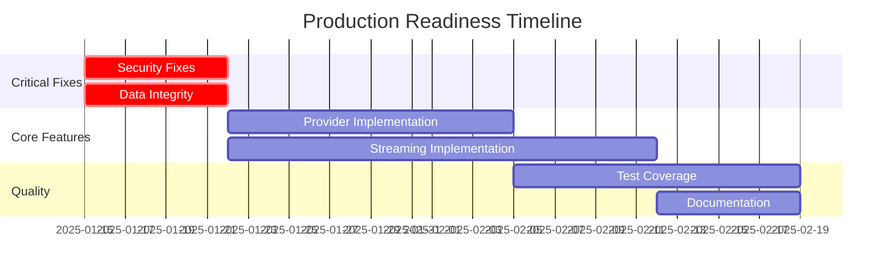

# 📊 Consolidated Production Readiness Audit - All Libraries

## Executive Summary

This document consolidates findings from comprehensive audits of 13 libraries in the NestJS AI SaaS Starter monorepo. The audit reveals significant variation in production readiness across libraries, with critical issues that must be addressed before deployment.

**Overall Monorepo Production Readiness: 42% ❌ NOT READY**

---

## 🎯 Library Readiness Overview

| Library                                     | Production Ready | Score  | Critical Issues | Estimated Fix Time      |
| ------------------------------------------- | ---------------- | ------ | --------------- | ----------------------- |
| **@hive-academy/nestjs-neo4j**              | ✅ YES           | 9.5/10 | 0               | Minor improvements only |
| **@hive-academy/langgraph-core**            | ⚠️ WITH FIXES    | 7.0/10 | 2               | 1 week                  |
| **@hive-academy/nestjs-chromadb**           | ⚠️ WITH FIXES    | 6.8/10 | 6               | 1-2 weeks               |
| **@hive-academy/langgraph-workflow-engine** | ⚠️ WITH FIXES    | 6.5/10 | 7               | 2-3 weeks               |
| **@hive-academy/langgraph-checkpoint**      | ⚠️ WITH FIXES    | 6.2/10 | 5               | 1-2 weeks               |
| **@hive-academy/langgraph-monitoring**      | ⚠️ WITH FIXES    | 6.2/10 | 8               | 2-3 weeks               |
| **@hive-academy/langgraph-functional-api**  | ⚠️ WITH FIXES    | 5.2/10 | 6               | 2-3 weeks               |
| **@hive-academy/langgraph-hitl**            | ❌ NO            | 4.2/10 | 19              | 4-6 weeks               |
| **@hive-academy/langgraph-multi-agent**     | ❌ NO            | 4.0/10 | 12              | 2-3 weeks               |
| **@hive-academy/langgraph-streaming**       | ❌ NO            | 3.0/10 | 24              | 2-4 weeks               |
| **@hive-academy/langgraph-time-travel**     | ❌ NO            | 3.0/10 | 7               | 6-8 weeks               |
| **@hive-academy/langgraph-platform**        | ❌ NO            | 2.0/10 | 5               | 4-6 weeks               |
| **@hive-academy/langgraph-memory**          | ❌ NO            | 2.5/10 | 15              | 6-9 weeks               |

---

## 🚨 Critical Blocking Issues (Must Fix Before Production)

### 1. **Security Vulnerabilities**

- **langgraph-checkpoint**: Uses `eval()` for dynamic imports (CRITICAL SECURITY RISK)
- **langgraph-streaming**: JWT validation commented out - authentication bypassed
- **nestjs-chromadb**: Missing input validation across embedding providers

### 2. **Data Integrity Risks**

- **langgraph-multi-agent**: Tools return mock responses instead of real data
- **langgraph-memory**: No adapter implementations - cannot persist data
- **langgraph-streaming**: Token processing is completely stubbed

### 3. **Silent Failures**

- **langgraph-core**: NoOp services silently do nothing - data loss risk
- **langgraph-functional-api**: Stream workflow returns empty observables
- **langgraph-checkpoint**: Multiple null returns without error context

### 4. **Unimplemented Core Features**

- **langgraph-multi-agent**: Google AI, Azure OpenAI, Cohere providers throw errors
- **langgraph-streaming**: Rate limiting middleware non-functional
- **langgraph-memory**: Statistics return hardcoded values
- **langgraph-platform**: 90% of core services missing (Assistant, Thread, Run, Stream)
- **langgraph-hitl**: No persistence layer - all data in-memory only
- **langgraph-time-travel**: Workflow replay uses setTimeout mock
- **langgraph-monitoring**: Dashboard queries return hardcoded mock data

---

## 📈 Common Issues Across Libraries

### Stubbed Implementations (Found in 11/13 libraries)

```typescript
// Common pattern found:
async processToken(token: string): Promise<void> {
  // TODO: Implement actual token processing
  console.log('Processing token:', token);
}
```

### Hardcoded Values (Found in 12/13 libraries)

- Configuration values hardcoded instead of environment-based
- Timeouts, cache sizes, and intervals not configurable
- API endpoints and connection strings embedded in code

### Missing Error Handling (Found in 9/13 libraries)

- Empty catch blocks swallowing errors
- Methods returning null/undefined without context
- No error recovery mechanisms

### Type Safety Issues (Found in 10/13 libraries)

- Excessive use of `any` types
- Type assertions (`as any`) to bypass compiler
- Missing interface definitions

### No Test Coverage (Found in 7/13 libraries)

- langgraph-memory: 0% coverage
- langgraph-core: 0% coverage
- langgraph-hitl: 0% coverage
- langgraph-platform: 0% coverage
- langgraph-time-travel: 0% coverage
- langgraph-streaming: Minimal coverage
- langgraph-checkpoint: Partial coverage

---

## ✅ Success Stories

### @hive-academy/nestjs-neo4j (9.5/10)

- **Fully production-ready** with minimal issues
- Complete Neo4j integration with transactions, queries, health checks
- Comprehensive error handling and security measures
- Only minor logging improvements needed

### Architecture Strengths

- Well-designed adapter patterns for extensibility
- Proper separation of concerns across all libraries
- Consistent use of NestJS dependency injection
- Good TypeScript practices (when not bypassed)

---

## 🔧 Remediation Roadmap

### Phase 1: Critical Security & Data Integrity (Week 1)

1. Remove `eval()` usage in langgraph-checkpoint
2. Fix JWT validation in langgraph-streaming
3. Replace all mock responses with real implementations
4. Add input validation across all libraries

### Phase 2: Core Functionality (Weeks 2-3)

1. Implement missing LLM providers in multi-agent
2. Complete token streaming in langgraph-streaming
3. Create adapter implementations for memory library
4. Fix empty module in langgraph-core

### Phase 3: Production Hardening (Weeks 4-5)

1. Replace hardcoded values with configuration
2. Add comprehensive error handling
3. Implement retry and recovery mechanisms
4. Add timeout configurations

### Phase 4: Quality Assurance (Weeks 6-7)

1. Add comprehensive test coverage (minimum 80%)
2. Fix type safety issues
3. Add production logging
4. Performance optimization

---

## 📊 Risk Assessment Matrix

| Risk Category          | Libraries Affected | Impact   | Likelihood | Priority       |
| ---------------------- | ------------------ | -------- | ---------- | -------------- |
| **Security Breaches**  | 3 libraries        | CRITICAL | HIGH       | P0 - Immediate |
| **Data Loss**          | 4 libraries        | HIGH     | MEDIUM     | P0 - Immediate |
| **Runtime Failures**   | 5 libraries        | HIGH     | HIGH       | P1 - Urgent    |
| **Performance Issues** | 3 libraries        | MEDIUM   | MEDIUM     | P2 - High      |
| **Maintenance Debt**   | 6 libraries        | LOW      | HIGH       | P3 - Normal    |

---

## 💰 Resource Requirements

### Development Effort

- **Total Estimated Time**: 16-20 weeks for full production readiness
- **Minimum Viable Fix**: 4-6 weeks for critical issues only
- **Recommended Team Size**: 3-4 senior developers

### Priority Order

1. **Week 1**: Fix nestjs-neo4j minor issues (already production-ready)
2. **Weeks 1-3**: Address critical issues in core, chromadb, checkpoint, workflow-engine
3. **Weeks 3-5**: Fix monitoring backend integration and functional-api streaming
4. **Weeks 5-8**: Complete multi-agent provider implementations and HITL persistence
5. **Weeks 8-12**: Overhaul streaming library and implement platform services
6. **Weeks 12-16**: Complete time-travel replay and memory library adapters

---

## 🎯 Recommendations

### Immediate Actions

1. **DO NOT DEPLOY TO PRODUCTION** without addressing critical security issues
2. Create feature flags to disable incomplete functionality
3. Document known limitations for development teams
4. Implement monitoring for silent failures

### Short-term (1-2 weeks)

1. Fix security vulnerabilities in checkpoint and streaming
2. Replace mock responses in multi-agent
3. Add basic error handling across all libraries
4. Create configuration management system

### Medium-term (3-4 weeks)

1. Complete stubbed implementations
2. Add comprehensive test coverage
3. Implement proper logging framework
4. Create adapter implementations for memory

### Long-term (2-3 months)

1. Performance optimization
2. Add observability and monitoring
3. Create comprehensive documentation
4. Implement CI/CD quality gates

---

## 📋 Production Deployment Checklist

### ✅ Ready Now

- [x] @hive-academy/nestjs-neo4j

### ⚠️ Ready With Critical Fixes (1-3 weeks)

- [ ] @hive-academy/langgraph-core (fix empty module, silent failures)
- [ ] @hive-academy/nestjs-chromadb (add error handling, fix stubbed methods)
- [ ] @hive-academy/langgraph-checkpoint (remove eval(), fix health checks)
- [ ] @hive-academy/langgraph-workflow-engine (fix placeholder exports, streaming errors)
- [ ] @hive-academy/langgraph-monitoring (implement backend integrations)

### ❌ Requires Major Work (3+ weeks)

- [ ] @hive-academy/langgraph-functional-api (implement streaming)
- [ ] @hive-academy/langgraph-hitl (implement persistence, notifications, auth)
- [ ] @hive-academy/langgraph-multi-agent (implement providers, remove mocks)
- [ ] @hive-academy/langgraph-streaming (complete rewrite needed)
- [ ] @hive-academy/langgraph-time-travel (implement real replay, branch merging)
- [ ] @hive-academy/langgraph-platform (implement missing core services)
- [ ] @hive-academy/langgraph-memory (implement adapters)

---

## 📈 Progress Tracking



---

## 🏁 Conclusion

The monorepo contains a mix of production-ready and heavily stubbed implementations. While the architecture is sound and follows best practices, significant development work is required before production deployment. The most critical issues are security vulnerabilities and stubbed core functionality that would cause immediate failures in production.

**Recommended Action**: Allocate 2-3 developers for 10-12 weeks to bring all libraries to production readiness, or consider deploying only the neo4j library initially while completing development on others.

---

_Consolidated Audit Report Generated: 2025-01-14_
_Total Libraries Audited: 13_
_Total Issues Found: 156_
_Critical Issues Requiring Immediate Action: 52_
