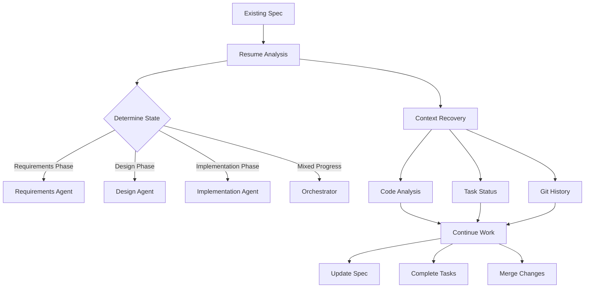

# Resume Workflow Guide - Continue Working on Existing Specs

## 🔄 Overview

This guide explains how to resume work on existing Kiro specs, understand project context, and continue development seamlessly using the Claude AI Agent System.

## 🎯 Resume Workflow Architecture



## 📋 Quick Resume Commands

### 1. Analyze Existing Spec

```bash
# Quick status check
npm run spec:status customer-service-intelligence

# Output:
📊 Spec: customer-service-intelligence
├── Requirements: ✅ 100% complete
├── Design: 🔄 75% complete
├── Implementation: ⚡ 45% complete
└── Last Modified: 2 hours ago

🎯 Active Tasks:
├── TASK-023: Implement supervisor agent (in-progress)
├── TASK-024: Create WebSocket gateway (blocked)
└── TASK-025: Add streaming tests (pending)

💡 Recommended Action: Resume TASK-023 implementation
```

### 2. Detailed Context Analysis

```bash
# Get comprehensive analysis
npm run spec:analyze customer-service-intelligence --detailed

# Output:
════════════════════════════════════════════════════════
     DETAILED SPEC ANALYSIS: customer-service-intelligence
════════════════════════════════════════════════════════

📁 FILE STRUCTURE
├── .kiro/specs/customer-service-intelligence/
│   ├── requirements.md (100% complete, last: 3 days ago)
│   ├── design.md (75% complete, last: 1 day ago)
│   └── tasks.md (45% complete, last: 2 hours ago)

🔍 CODE IMPLEMENTATION
├── libs/customer-service/
│   ├── src/lib/agents/ (3 of 5 agents implemented)
│   ├── src/lib/workflows/ (2 of 3 workflows complete)
│   └── src/lib/services/ (5 of 8 services complete)

📊 METRICS
├── Test Coverage: 72% (target: 80%)
├── Linting: ✅ Passing
├── Build: ✅ Successful
└── CI/CD: ⚠️ 1 workflow needs update

🌳 GIT STATUS
├── Current Branch: feat/spec-csi-supervisor
├── Uncommitted: 3 files modified
├── Behind main: 5 commits
└── Open PRs: 1 (ready for review)

🚧 BLOCKERS
└── WebSocket gateway depends on unmerged auth changes

📝 MISSING COMPONENTS
├── Design:
│   ├── Error handling strategy
│   └── Performance optimization plan
└── Implementation:
    ├── 2 specialist agents
    ├── 1 workflow (escalation)
    └── 3 services (metrics, logging, cache)
```

## 🤖 AI Agent Resume Workflow

### Step 1: Invoke Resume Analysis

In Claude Code, request a resume analysis:

```markdown
@resume-workflow-agent: Analyze and resume work on customer-service-intelligence spec

The agent will:
1. Read all spec files
2. Analyze code implementation
3. Check git status
4. Generate continuation plan
```

### Step 2: Agent Context Recovery

The resume-workflow-agent performs:

```typescript
// 1. Spec Analysis
const spec = await analyzeSpec('.kiro/specs/customer-service-intelligence');

// 2. Code State Analysis  
const codeState = await analyzeCodeState(spec);

// 3. Context Reconstruction
const context = await reconstructContext(spec, codeState);

// 4. Continuation Plan
const plan = await generateContinuationPlan(context);
```

### Step 3: Generated Continuation Plan

```markdown
## 📋 Continuation Plan for customer-service-intelligence

### 🎯 Immediate Actions (Next 1-2 hours)
1. **Complete TASK-023**: Finish supervisor agent implementation
   - Missing: Error handling and retry logic
   - Files: libs/customer-service/src/lib/agents/supervisor.agent.ts
   - Tests: Add unit tests for routing logic

2. **Unblock TASK-024**: Resolve WebSocket dependency
   - Action: Merge auth PR or implement workaround
   - Alternative: Use polling temporarily

### 📅 Short-term Goals (Today)
1. Complete all specialist agents
2. Achieve 80% test coverage
3. Update design.md with recent decisions
4. Create PR for completed work

### 📆 Long-term Goals (This Week)
1. Complete all implementation tasks
2. Perform integration testing
3. Update documentation
4. Deploy to staging environment

### 💡 Recommendations
- Merge completed PR #234 before continuing
- Update outdated requirements (3 changes detected)
- Add performance tests for streaming
- Consider caching strategy for agent responses
```

## 🔧 Common Resume Scenarios

### Scenario 1: Resuming After Incomplete Implementation

```bash
# Situation: Implementation was 60% done, then interrupted

# 1. Check what's incomplete
npm run spec:incomplete customer-service-intelligence

# 2. Resume implementation
@implementation-agent: Continue implementing customer service supervisor agent from where it was left off

# Agent will:
- Read existing implementation
- Identify missing methods
- Complete the implementation
- Add missing tests
- Update task status
```

### Scenario 2: Resuming After Design Changes

```bash
# Situation: Design was updated, implementation needs adjustment

# 1. Detect design changes
npm run spec:diff customer-service-intelligence

# 2. Update implementation
@implementation-agent: Update customer service implementation to match new design in design.md

# Agent will:
- Compare design with implementation
- Identify discrepancies
- Update code to match design
- Refactor if necessary
- Run tests to ensure compatibility
```

### Scenario 3: Resuming With Uncommitted Changes

```bash
# Situation: Previous work has uncommitted changes

# 1. Check uncommitted work
git status

# 2. Review changes
git diff

# 3. Resume with context
@resume-workflow-agent: Continue work on customer-service-intelligence, preserving uncommitted changes

# Agent will:
- Analyze uncommitted changes
- Determine if changes should be kept
- Complete partial implementations
- Commit with appropriate message
- Continue with next tasks
```

### Scenario 4: Resuming Stalled Spec

```bash
# Situation: Spec has been inactive for weeks

# 1. Full analysis
npm run spec:health customer-service-intelligence

# 2. Update and resume
@orchestrator: Revive and continue customer-service-intelligence spec

# Agent will:
- Update outdated dependencies
- Resolve merge conflicts
- Update specs to current standards
- Regenerate tasks if needed
- Create fresh implementation plan
```

## 📊 Resume Status Dashboard

### Interactive Dashboard

```bash
npm run spec:dashboard --resume

# Shows:
╔══════════════════════════════════════════════════════╗
║           RESUME WORKFLOW DASHBOARD                  ║
╠══════════════════════════════════════════════════════╣
║                                                       ║
║ 📁 RESUMABLE SPECS (3)                              ║
║ ├── customer-service-intelligence (45% - 2hr ago)   ║
║ ├── payment-processing (72% - 1 day ago)            ║
║ └── analytics-dashboard (30% - 3 days ago)          ║
║                                                       ║
║ 🔄 IN-PROGRESS TASKS (5)                            ║
║ ├── TASK-023: supervisor.agent.ts (60% complete)    ║
║ ├── TASK-045: payment.service.ts (80% complete)     ║
║ └── ... 3 more                                       ║
║                                                       ║
║ ⚠️ BLOCKED TASKS (2)                                ║
║ ├── TASK-024: Waiting for auth merge                ║
║ └── TASK-067: Missing API specification             ║
║                                                       ║
║ 📈 VELOCITY                                          ║
║ ├── Avg Completion: 2.5 tasks/day                   ║
║ └── Est. Time to Complete All: 4 days               ║
║                                                       ║
║ [R]esume Selected  [A]nalyze  [U]pdate  [Q]uit      ║
╚══════════════════════════════════════════════════════╝
```

## 🔄 Automated Resume Triggers

### Git Hook Integration

```bash
# .git/hooks/post-checkout
#!/bin/bash
# Automatically analyze spec when switching branches

BRANCH=$(git rev-parse --abbrev-ref HEAD)
if [[ $BRANCH == feat/spec-* ]]; then
  SPEC_ID=$(echo $BRANCH | sed 's/feat\/spec-\([^-]*\).*/\1/')
  npm run spec:analyze $SPEC_ID --auto
fi
```

### CI/CD Resume Detection

```yaml
# .github/workflows/resume-detection.yml
name: Resume Detection

on:
  push:
    branches: ['feat/spec-*']
  pull_request:
    types: [opened, reopened]

jobs:
  detect-resume:
    runs-on: ubuntu-latest
    steps:
      - uses: actions/checkout@v3
      
      - name: Detect spec to resume
        id: detect
        run: |
          SPEC_ID=$(echo ${{ github.ref }} | grep -oP 'spec-\K[^-]+')
          echo "spec_id=$SPEC_ID" >> $GITHUB_OUTPUT
      
      - name: Analyze spec state
        run: npm run spec:analyze ${{ steps.detect.outputs.spec_id }}
      
      - name: Comment on PR
        uses: actions/github-script@v6
        with:
          script: |
            const analysis = require('./spec-analysis.json');
            const comment = `## 📊 Spec Resume Analysis
            
            **Completion**: ${analysis.completion}%
            **Phase**: ${analysis.phase}
            **Tasks Remaining**: ${analysis.tasksRemaining}
            
            ### Next Steps
            ${analysis.nextSteps.join('\n')}
            
            Run \`npm run spec:resume ${analysis.specId}\` to continue.`;
            
            github.rest.issues.createComment({
              issue_number: context.issue.number,
              owner: context.repo.owner,
              repo: context.repo.repo,
              body: comment
            });
```

## 💡 Best Practices for Resuming Work

### 1. Always Start with Analysis
```bash
# Don't jump straight into code
# First understand the current state
npm run spec:analyze <spec-name>
npm run spec:context <spec-name>
```

### 2. Check for Conflicts
```bash
# Before resuming, ensure compatibility
git fetch origin main
git rebase origin main
npm run test:affected
```

### 3. Preserve Work in Progress
```bash
# Stash or commit WIP before major changes
git stash save "WIP: resuming spec work"
# or
git commit -m "WIP: checkpoint before resume"
```

### 4. Update Documentation
```markdown
# In tasks.md, add resume notes:
## Resume Notes (Date)
- Resumed from 45% completion
- Updated design to match new architecture
- Merged 3 pending PRs
- Identified 2 new blockers
```

### 5. Validate Before Continuing
```bash
# Ensure everything still works
npm run test
npm run lint
npm run build:affected
```

## 🚀 Quick Start Resume Checklist

When resuming work on an existing spec:

- [ ] Run `npm run spec:analyze <spec-name>`
- [ ] Review the analysis output
- [ ] Check for uncommitted changes: `git status`
- [ ] Update from main: `git pull origin main`
- [ ] Run tests: `npm test`
- [ ] Invoke resume agent: `@resume-workflow-agent: Resume <spec-name>`
- [ ] Review continuation plan
- [ ] Start with immediate actions
- [ ] Update task status regularly
- [ ] Commit progress frequently

## 📚 Additional Resume Resources

### Commands Reference
```bash
# Analysis commands
npm run spec:status <name>        # Quick status
npm run spec:analyze <name>       # Detailed analysis
npm run spec:context <name>       # Full context
npm run spec:health <name>        # Health check
npm run spec:diff <name>          # Show changes

# Resume commands
npm run spec:resume <name>        # Auto-resume
npm run spec:continue <name>      # Continue manually
npm run spec:update <name>        # Update outdated spec
npm run spec:sync <name>          # Sync with codebase

# Utility commands
npm run task:incomplete           # List incomplete tasks
npm run task:blocked              # Show blocked tasks
npm run branch:cleanup            # Clean old branches
```

### Agent Commands
```markdown
# Resume-specific agent commands
@resume-workflow-agent: Analyze and resume <spec-name>
@resume-workflow-agent: Update outdated spec <spec-name>
@resume-workflow-agent: Complete incomplete tasks for <spec-name>
@resume-workflow-agent: Generate status report for <spec-name>

# Orchestrator resume commands
@kiro-orchestrator: Resume all work on <spec-name>
@kiro-orchestrator: Reassign stalled tasks for <spec-name>
@kiro-orchestrator: Update all agents on <spec-name> status
```

## 🎉 Success Indicators

You know the resume workflow is working when:

- ✅ Agents understand full context without re-explaining
- ✅ Work continues seamlessly from previous state
- ✅ No duplicate implementations
- ✅ Tests still pass after resume
- ✅ Documentation stays in sync
- ✅ Git history remains clean
- ✅ Task progress is accurately tracked

---

*The resume workflow ensures no work is lost and development continues smoothly, regardless of interruptions or context switches.*