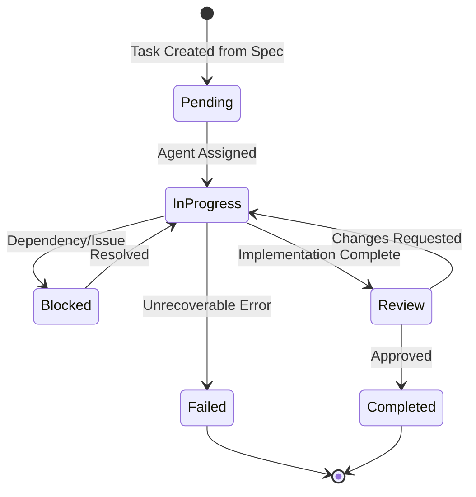

# Kiro Spec-Driven Task Management System

## Overview

This task management system integrates Kiro specs with Claude AI agents to provide automated, intelligent task tracking and execution for the NestJS AI SaaS Starter ecosystem.

## Task Lifecycle



## Task Structure

```typescript
interface KiroTask {
  // Identification
  id: string; // Unique task ID (e.g., "TASK-001")
  specId: string; // Parent spec ID
  phase: TaskPhase; // requirements | design | implementation

  // Description
  title: string; // Brief task title
  description: string; // Detailed description
  acceptanceCriteria: string[]; // Measurable success criteria

  // Status
  status: TaskStatus; // pending | in-progress | blocked | review | completed | failed
  priority: Priority; // critical | high | medium | low
  complexity: Complexity; // simple | moderate | complex

  // Assignment
  assignedAgent: string; // Agent responsible for task
  estimatedHours: number; // Time estimate
  actualHours?: number; // Actual time spent

  // Dependencies
  dependencies: string[]; // Task IDs this depends on
  blockedBy?: string[]; // Current blockers

  // Implementation
  implementation?: {
    branch: string; // Git branch name
    commits: string[]; // Commit SHAs
    files: string[]; // Modified files
    pullRequest?: string; // PR URL
  };

  // Validation
  validation?: {
    tests: TestResult[]; // Test results
    coverage: number; // Code coverage percentage
    linting: LintResult; // Linting results
    review?: ReviewResult; // Code review feedback
  };

  // Metadata
  createdAt: Date;
  updatedAt: Date;
  startedAt?: Date;
  completedAt?: Date;
  notes?: string[]; // Additional notes/comments
}
```

## Task Creation from Specs

### Automatic Task Generation

Tasks are automatically generated from Kiro spec files:

```typescript
class TaskGenerator {
  generateFromRequirements(spec: RequirementsSpec): KiroTask[] {
    const tasks: KiroTask[] = [];

    for (const requirement of spec.requirements) {
      // Generate analysis task
      tasks.push({
        id: `TASK-${this.nextId()}`,
        specId: spec.id,
        phase: 'requirements',
        title: `Analyze requirement: ${requirement.title}`,
        description: `Extract and validate acceptance criteria for ${requirement.title}`,
        acceptanceCriteria: ['User stories are complete and clear', 'Acceptance criteria follow EARS notation', 'Dependencies are identified', 'Test scenarios are defined'],
        status: 'pending',
        priority: requirement.priority || 'medium',
        complexity: this.assessComplexity(requirement),
        assignedAgent: 'requirements-agent',
        estimatedHours: 2,
        dependencies: [],
        createdAt: new Date(),
        updatedAt: new Date(),
      });
    }

    return tasks;
  }

  generateFromDesign(spec: DesignSpec): KiroTask[] {
    const tasks: KiroTask[] = [];

    // Generate architecture tasks
    tasks.push({
      id: `TASK-${this.nextId()}`,
      specId: spec.id,
      phase: 'design',
      title: 'Design system architecture',
      description: 'Create high-level architecture diagrams and component structure',
      acceptanceCriteria: ['Architecture diagram created', 'Component interfaces defined', 'Data flow documented', 'Integration points identified'],
      status: 'pending',
      priority: 'high',
      complexity: 'complex',
      assignedAgent: 'design-agent',
      estimatedHours: 4,
      dependencies: spec.requirementTasks,
      createdAt: new Date(),
      updatedAt: new Date(),
    });

    // Generate data model tasks
    tasks.push({
      id: `TASK-${this.nextId()}`,
      specId: spec.id,
      phase: 'design',
      title: 'Design data models',
      description: 'Create database schemas and TypeScript interfaces',
      acceptanceCriteria: ['Database schemas defined', 'TypeScript interfaces created', 'Relationships documented', 'Validation rules specified'],
      status: 'pending',
      priority: 'high',
      complexity: 'moderate',
      assignedAgent: 'design-agent',
      estimatedHours: 3,
      dependencies: [],
      createdAt: new Date(),
      updatedAt: new Date(),
    });

    return tasks;
  }

  generateFromImplementation(spec: ImplementationSpec): KiroTask[] {
    const tasks: KiroTask[] = [];

    for (const feature of spec.features) {
      // Generate implementation task
      tasks.push({
        id: `TASK-${this.nextId()}`,
        specId: spec.id,
        phase: 'implementation',
        title: `Implement ${feature.name}`,
        description: feature.description,
        acceptanceCriteria: feature.acceptanceCriteria,
        status: 'pending',
        priority: feature.priority,
        complexity: feature.complexity,
        assignedAgent: this.selectAgent(feature),
        estimatedHours: this.estimateHours(feature),
        dependencies: feature.dependencies,
        createdAt: new Date(),
        updatedAt: new Date(),
      });

      // Generate test task
      tasks.push({
        id: `TASK-${this.nextId()}`,
        specId: spec.id,
        phase: 'implementation',
        title: `Test ${feature.name}`,
        description: `Create unit and integration tests for ${feature.name}`,
        acceptanceCriteria: ['Unit tests achieve 80% coverage', 'Integration tests pass', 'Edge cases tested', 'Error scenarios handled'],
        status: 'pending',
        priority: feature.priority,
        complexity: 'simple',
        assignedAgent: 'testing-agent',
        estimatedHours: 2,
        dependencies: [`implement-${feature.id}`],
        createdAt: new Date(),
        updatedAt: new Date(),
      });
    }

    return tasks;
  }
}
```

## Task Execution Workflow

### 1. Task Assignment

```typescript
class TaskAssigner {
  async assignTask(task: KiroTask): Promise<void> {
    // Select appropriate agent based on task type
    const agent = this.selectAgent(task);

    // Prepare task context
    const context = {
      task,
      spec: await this.loadSpec(task.specId),
      dependencies: await this.loadDependencies(task.dependencies),
      workspace: this.getWorkspaceInfo(),
    };

    // Assign to agent
    await this.agentOrchestrator.assign(agent, context);

    // Update task status
    task.status = 'in-progress';
    task.assignedAgent = agent;
    task.startedAt = new Date();
    await this.updateTask(task);
  }

  private selectAgent(task: KiroTask): string {
    // Agent selection logic based on task characteristics
    if (task.phase === 'requirements') return 'requirements-agent';
    if (task.phase === 'design') return 'design-agent';

    if (task.title.includes('workflow')) return 'langgraph-workflow-agent';
    if (task.title.includes('vector') || task.title.includes('embedding')) return 'chromadb-vector-agent';
    if (task.title.includes('graph') || task.title.includes('relationship')) return 'neo4j-graph-agent';
    if (task.title.includes('test')) return 'testing-agent';
    if (task.title.includes('deploy') || task.title.includes('CI/CD')) return 'devops-agent';

    return 'implementation-agent';
  }
}
```

### 2. Task Execution

```typescript
class TaskExecutor {
  async executeTask(task: KiroTask, agent: Agent): Promise<TaskResult> {
    try {
      // Pre-execution checks
      await this.validateDependencies(task);
      await this.checkResources(task);

      // Execute task
      const result = await agent.execute(task);

      // Validate result
      await this.validateResult(result, task.acceptanceCriteria);

      // Update task with results
      task.implementation = {
        branch: result.branch,
        commits: result.commits,
        files: result.modifiedFiles,
        pullRequest: result.pullRequest,
      };

      task.validation = {
        tests: result.testResults,
        coverage: result.coverage,
        linting: result.lintingResults,
      };

      task.status = 'review';
      await this.updateTask(task);

      return result;
    } catch (error) {
      task.status = 'blocked';
      task.blockedBy = [error.message];
      await this.updateTask(task);
      throw error;
    }
  }
}
```

### 3. Task Review

```typescript
class TaskReviewer {
  async reviewTask(task: KiroTask): Promise<ReviewResult> {
    const review = {
      taskId: task.id,
      passed: true,
      feedback: [],
      requiredChanges: [],
    };

    // Check acceptance criteria
    for (const criterion of task.acceptanceCriteria) {
      const result = await this.checkCriterion(criterion, task);
      if (!result.passed) {
        review.passed = false;
        review.feedback.push(result.feedback);
        review.requiredChanges.push(result.requiredChange);
      }
    }

    // Check code quality
    if (task.validation) {
      if (task.validation.coverage < 80) {
        review.passed = false;
        review.feedback.push('Code coverage below 80%');
        review.requiredChanges.push('Increase test coverage');
      }

      if (task.validation.linting.errors > 0) {
        review.passed = false;
        review.feedback.push('Linting errors found');
        review.requiredChanges.push('Fix linting errors');
      }
    }

    // Update task status
    task.status = review.passed ? 'completed' : 'in-progress';
    task.validation.review = review;

    if (review.passed) {
      task.completedAt = new Date();
      task.actualHours = this.calculateActualHours(task);
    }

    await this.updateTask(task);
    return review;
  }
}
```

## Task Tracking File Format

Tasks are tracked in `.kiro/specs/*/tasks.md`:

```markdown
# Implementation Plan

## Phase 1: Requirements Analysis

- [x] 1. Analyze user authentication requirements

  - **Status**: completed
  - **Agent**: requirements-agent
  - **Time**: 2h (estimated) / 1.5h (actual)
  - **Files**:
    - .kiro/specs/auth-system/requirements.md
  - **Validation**:
    - ✅ All acceptance criteria defined
    - ✅ Test scenarios created
    - ✅ Dependencies identified

- [ ] 2. Define authorization requirements
  - **Status**: in-progress
  - **Agent**: requirements-agent
  - **Time**: 3h (estimated)
  - **Dependencies**: [1]
  - **Blockers**: Need clarification on role hierarchy

## Phase 2: Design

- [ ] 3. Design authentication architecture
  - **Status**: pending
  - **Agent**: design-agent
  - **Time**: 4h (estimated)
  - **Dependencies**: [1, 2]
  - **Acceptance Criteria**:
    - [ ] JWT token strategy defined
    - [ ] Session management designed
    - [ ] Security considerations documented

## Phase 3: Implementation

- [ ] 4. Implement JWT authentication service
  - **Status**: pending
  - **Agent**: implementation-agent
  - **Time**: 6h (estimated)
  - **Dependencies**: [3]
  - **Branch**: feat/auth-jwt-service
  - **Files to modify**:
    - libs/auth/src/lib/services/jwt.service.ts
    - libs/auth/src/lib/services/jwt.service.spec.ts
```

## Task Dashboard

### Real-time Status View

```typescript
interface TaskDashboard {
  summary: {
    total: number;
    completed: number;
    inProgress: number;
    blocked: number;
    pending: number;
  };

  velocity: {
    tasksPerDay: number;
    averageCompletionTime: number;
    estimateAccuracy: number;
  };

  byPhase: {
    requirements: TaskSummary;
    design: TaskSummary;
    implementation: TaskSummary;
  };

  byAgent: {
    [agentName: string]: {
      assigned: number;
      completed: number;
      averageTime: number;
      successRate: number;
    };
  };

  blockers: {
    taskId: string;
    reason: string;
    duration: number;
    severity: 'critical' | 'high' | 'medium' | 'low';
  }[];

  upcoming: KiroTask[];
  recentlyCompleted: KiroTask[];
}
```

## Integration with CI/CD

### Automated Task Updates

```yaml
# .github/workflows/task-update.yml
name: Update Task Status

on:
  pull_request:
    types: [opened, synchronize, closed]

  workflow_run:
    workflows: ['CI']
    types: [completed]

jobs:
  update-task:
    runs-on: ubuntu-latest
    steps:
      - uses: actions/checkout@v3

      - name: Extract Task ID from PR
        id: task
        run: |
          TASK_ID=$(echo "${{ github.event.pull_request.title }}" | grep -oP 'TASK-\d+')
          echo "task_id=$TASK_ID" >> $GITHUB_OUTPUT

      - name: Update Task Status
        run: |
          if [ "${{ github.event.pull_request.merged }}" == "true" ]; then
            npm run task:complete ${{ steps.task.outputs.task_id }}
          elif [ "${{ github.event.action }}" == "opened" ]; then
            npm run task:start ${{ steps.task.outputs.task_id }}
          fi

      - name: Update Validation Results
        if: github.event.workflow_run.conclusion == 'success'
        run: |
          npm run task:validate ${{ steps.task.outputs.task_id }} \
            --tests=${{ github.event.workflow_run.conclusion }} \
            --coverage=${{ env.COVERAGE }}
```

## Task Commands

### CLI Integration

```bash
# View all tasks
npm run task:list

# View tasks by status
npm run task:list --status=in-progress

# View tasks by agent
npm run task:list --agent=implementation-agent

# Start a task
npm run task:start TASK-001

# Complete a task
npm run task:complete TASK-001

# Block a task
npm run task:block TASK-001 --reason="Missing dependency"

# Generate tasks from spec
npm run task:generate --spec=auth-system

# View task dashboard
npm run task:dashboard

# Export task report
npm run task:report --format=markdown > task-report.md
```

## Automation Rules

### Task Prioritization

```typescript
class TaskPrioritizer {
  prioritize(tasks: KiroTask[]): KiroTask[] {
    return tasks.sort((a, b) => {
      // Critical tasks first
      if (a.priority !== b.priority) {
        return this.priorityValue(b.priority) - this.priorityValue(a.priority);
      }

      // Tasks with no dependencies first
      if (a.dependencies.length !== b.dependencies.length) {
        return a.dependencies.length - b.dependencies.length;
      }

      // Simpler tasks first (quick wins)
      if (a.complexity !== b.complexity) {
        return this.complexityValue(a.complexity) - this.complexityValue(b.complexity);
      }

      // Older tasks first (FIFO)
      return a.createdAt.getTime() - b.createdAt.getTime();
    });
  }
}
```

### Automatic Task Creation

```typescript
class TaskAutomation {
  @OnEvent('spec.updated')
  async handleSpecUpdate(event: SpecUpdatedEvent) {
    // Generate new tasks for added requirements
    const newTasks = this.taskGenerator.generateFromSpec(event.spec);

    // Remove tasks for deleted requirements
    const obsoleteTasks = this.findObsoleteTasks(event.spec);

    // Update existing tasks for modified requirements
    const updatedTasks = this.updateExistingTasks(event.spec);

    // Apply changes
    await this.taskRepository.bulkUpdate([...newTasks, ...updatedTasks]);

    await this.taskRepository.bulkDelete(obsoleteTasks);
  }

  @OnEvent('pr.merged')
  async handlePRMerged(event: PRMergedEvent) {
    // Find associated task
    const task = await this.findTaskByPR(event.prUrl);

    if (task) {
      // Mark task as completed
      task.status = 'completed';
      task.completedAt = new Date();
      task.implementation.pullRequest = event.prUrl;

      await this.taskRepository.update(task);

      // Trigger dependent tasks
      await this.triggerDependentTasks(task.id);
    }
  }
}
```

## Best Practices

1. **Atomic Tasks**: Keep tasks small and focused
2. **Clear Criteria**: Define measurable acceptance criteria
3. **Dependency Management**: Explicitly track dependencies
4. **Time Tracking**: Monitor estimated vs actual time
5. **Regular Updates**: Keep task status current
6. **Blocker Resolution**: Address blockers quickly
7. **Continuous Validation**: Validate against specs continuously

This comprehensive task management system ensures smooth, automated workflow from spec to implementation.
