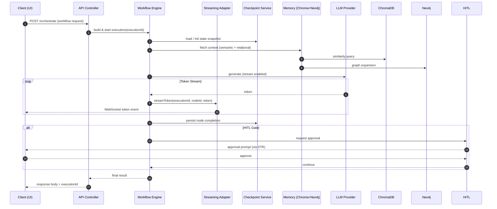
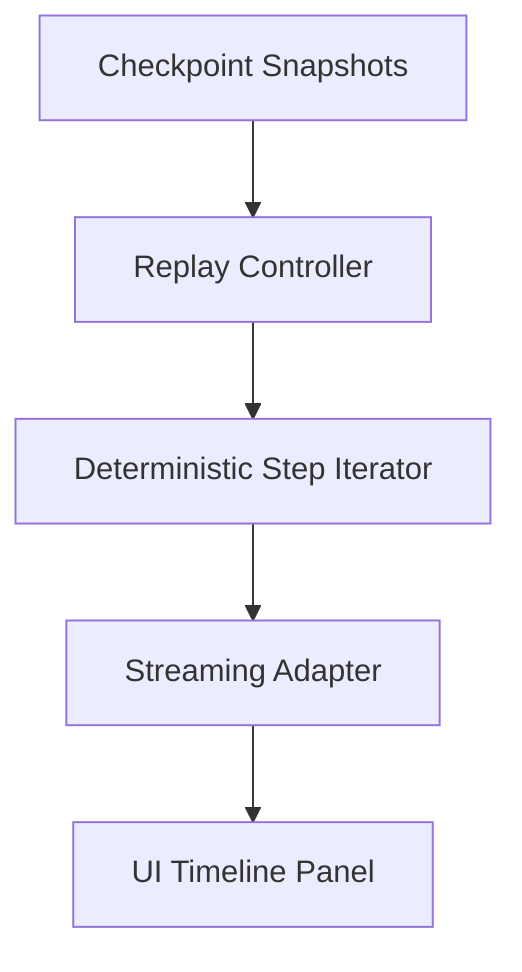

# 05 – Architecture Overview (Draft)

> Status: v0.1 (draft)
> Scope: Concise, judge-friendly explanation of how the platform’s libraries compose into a cohesive AI agent runtime (workflows, streaming, memory, safety, durability) while remaining modular & publishable.
> Audience: Hackathon judges (technical) + prospective contributors.

---

## 1. Executive Summary

The platform implements a **layered, optional-capability AI agent architecture** on top of NestJS + LangGraph. Each capability (streaming, checkpointing, multi-agent coordination, memory fusion, human approval, replay, monitoring) is isolated in its own library with **interface-driven DI** and **no-op fallbacks** so applications assemble only what they need. This yields:

- Modularity: All cross-cutting features can be toggled without code changes.
- Resilience: Checkpoint + replay + streaming enable durable interactive workflows.
- Extensibility: Adapter interfaces allow future providers (vector DBs, embedding engines, websocket transports) without breaking consumers.
- Developer Velocity: Functional + decorator APIs reduce graph boilerplate.

---

## 2. Layered Architecture

```text
┌─────────────────────────────────────────────────────────────┐
│                    User Interfaces (API/UI)                 │
│   - REST / WebSocket Gateway / (future) GraphQL endpoints   │
└─────────────────────────────────────────────────────────────┘
                 │        ▲          ▲            ▲
                 │        │          │            │ (Observability / Metrics)
                 ▼        │          │            │
┌─────────────────────────────────────────────────────────────┐
│         Orchestration & Coordination Layer                  │
│  workflow-engine · multi-agent · functional-api decorators  │
└─────────────────────────────────────────────────────────────┘
                 │        ▲
                 ▼        │ (Events / Progress / Tokens)
┌─────────────────────────────────────────────────────────────┐
│       Cross-Cutting Runtime Services                        │
│  streaming · checkpoint · hitl · monitoring · time-travel   │
└─────────────────────────────────────────────────────────────┘
                 │        ▲
                 ▼        │ (Context Retrieval / Persistence)
┌─────────────────────────────────────────────────────────────┐
│            Domain & Memory Abstractions                     │
│          memory · platform (external assistants)            │
└─────────────────────────────────────────────────────────────┘
                 │        ▲
                 ▼        │ (Data Access Interfaces)
┌─────────────────────────────────────────────────────────────┐
│     Persistence Adapters & Intelligence Sources             │
│        chromadb (semantic) · neo4j (relationships)          │
└─────────────────────────────────────────────────────────────┘
                 │
                 ▼
┌─────────────────────────────────────────────────────────────┐
│                Core Contracts & Types (core)                │
│    Shared DI tokens · streaming interfaces · base types     │
└─────────────────────────────────────────────────────────────┘
```

**Key Principle:** Each upper layer depends only on _interfaces_ from below; concrete implementations are injected at the application boundary.

---

## 3. Core Architectural Pillars

| Pillar                  | Libraries                 | Purpose                            | Differentiator                                     | Optional via DI                  |
| ----------------------- | ------------------------- | ---------------------------------- | -------------------------------------------------- | -------------------------------- |
| Execution Orchestration | workflow-engine           | Build & run LangGraph workflows    | Seamless composition of all cross-cutting services | Yes (no-op defaults)             |
| Real-Time Experience    | streaming                 | Token / event / progress streaming | Method-level decorators + adapter                  | Yes (no-op)                      |
| Durability & Replay     | checkpoint · time-travel  | Persist + rewind execution state   | Restart after failure with identical stream replay | Yes                              |
| Unified Context         | memory · chromadb · neo4j | Semantic + relational fusion       | Cascade retrieval pattern (vector → graph)         | Yes (memory gracefully degrades) |
| Safety & Control        | hitl                      | Human approval gates               | Declarative gating w/ timeout strategies           | Yes                              |

---

## 4. Runtime Flow (Happy Path)



---

## 5. Streaming DI Adapter Pattern (Summary)

| Concern              | Implementation                                       | Fallback               | Benefit                           |
| -------------------- | ---------------------------------------------------- | ---------------------- | --------------------------------- |
| Interface Definition | `langgraph-core` (`IStreamingService`)               | `NoOpStreamingService` | Zero overhead when disabled       |
| Concrete Services    | `langgraph-streaming` (token + event + WS bridge)    | –                      | Separation of concerns            |
| Consumer Injection   | `workflow-engine.forRootAsync({ streamingAdapter })` | Omit adapter           | Feature toggle without code edits |
| Decorators           | `@StreamToken` / `@StreamEvent` / `@StreamProgress`  | Silent no-op           | Declarative UX                    |

The pattern mirrors checkpoint integration for consistency, reducing cognitive load.

---

## 6. Module Interaction Matrix

| From / Uses     | core | streaming     | checkpoint | memory | chromadb   | neo4j      | hitl | multi-agent | time-travel | monitoring | workflow-engine     |
| --------------- | ---- | ------------- | ---------- | ------ | ---------- | ---------- | ---- | ----------- | ----------- | ---------- | ------------------- |
| workflow-engine | ✅   | 🔄 (optional) | 🔄         | 🔄     | via memory | via memory | 🔄   | 🔄          | 🔄          | 🔄         | –                   |
| multi-agent     | ✅   | 🔄            | (planned)  | 🔄     | via memory | via memory | 🔄   | –           | –           | 🔄         | ✅ (integrates)     |
| hitl            | ✅   | 🔄            | –          | –      | –          | –          | –    | –           | –           | 🔄         | via streaming hooks |
| memory          | ✅   | –             | –          | –      | ✅         | ✅         | –    | –           | –           | –          | via consumers       |
| time-travel     | ✅   | 🔄            | ✅         | –      | –          | –          | –    | –           | –           | –          | via checkpoint      |
| monitoring      | ✅   | 🔄            | 🔄         | 🔄     | 🔄         | 🔄         | 🔄   | 🔄          | 🔄          | –          | cross-cutting       |

Legend: ✅ direct dependency · 🔄 optional via DI · – not applicable.

---

## 7. Optional Capability Toggle Strategy

1. **Interface Tokens** live in `core`.
2. **No-Op Implementations** exported for each cross-cutting feature.
3. **Module Factories** (`forRoot` / `forRootAsync`) accept optional concrete implementations.
4. **Application Wiring** decides which capabilities are live per environment.

Result: Build once → deploy multiple footprint variants (lean vs full-featured) without drift.

---

## 8. Error Handling & Durability

| Failure Scenario            | Mitigation                                      | Library Involved             | User Impact                         |
| --------------------------- | ----------------------------------------------- | ---------------------------- | ----------------------------------- |
| LLM stream interrupted      | Partial tokens safe; state checkpointed         | checkpoint · streaming       | Resume without losing progress      |
| Node logic exception        | Node boundary wraps & persists failure snapshot | workflow-engine · checkpoint | Debug + replay available            |
| WebSocket disconnect        | Buffer + re-hydration on reconnect (planned)    | streaming                    | User receives missed terminal state |
| Approval timeout            | Auto-escalation / fallback path                 | hitl                         | Workflow completes safely           |
| Memory provider unavailable | Graceful degradation to available source        | memory                       | Reduced enrichment only             |

---

## 9. Replay & Time Travel

`time-travel` replays an execution using **stored checkpoint snapshots** and re-emits the original streaming sequence (tokens + progress) for forensic inspection or demo amplification.



---

## 10. Unified Memory Retrieval Pattern

Algorithm (cascade):

1. Vector similarity query (Chroma) for semantic grounding.
2. Graph expansion (Neo4j) on entities extracted from top-K chunks.
3. De-duplication + relevance ranking.
4. Structured context object returned to workflow nodes.

Benefits: Balanced _semantic recall_ + _relational precision_.

---

## 11. Deployment Topology

| Environment         | Components                                                                                 | Notes                                        |
| ------------------- | ------------------------------------------------------------------------------------------ | -------------------------------------------- |
| Local Dev           | API, WebSocket Gateway, ChromaDB (Docker), Neo4j (Docker), Redis (optional), UI            | Fast iteration; streaming enabled            |
| Demo / Hackathon    | Same as Local + Preloaded Sample Data                                                      | Predictable demo flows                       |
| Production (Future) | Horizontally scaled API pods + Dedicated WS gateway + Managed Neo4j + Managed vector store | DI tokens allow polyglot datastore migration |

**Horizontal Scale Considerations:**

- Streaming: Move to shared pub/sub (Redis) for token fan-out.
- Checkpoint: External durable store (Postgres / Redis) behind adapter.
- Memory: Caching layer for hot embeddings / graph traversals.

---

## 12. Observability Hooks (Forward Plan)

| Signal           | Emitted From      | Planned Destination            |
| ---------------- | ----------------- | ------------------------------ |
| token_stream     | streaming adapter | WebSocket + (future) event bus |
| node_progress    | workflow-engine   | UI progress panel + metrics    |
| approval_request | hitl              | Notification system            |
| checkpoint_save  | checkpoint        | Audit log store                |
| replay_event     | time-travel       | Developer tooling panel        |

---

## 13. Security & Safety Considerations (Planned Enhancements)

| Area            | Current                  | Planned                                         |
| --------------- | ------------------------ | ----------------------------------------------- |
| PII Filtering   | Manual prompt hygiene    | Token filter hook in streaming decorators       |
| Access Control  | Nest guards at API layer | Capability-scoped tokens (workflows, approvals) |
| Audit Trail     | Checkpoint snapshots     | Immutable event journal (append-only)           |
| Rate Protection | External (reverse proxy) | Adaptive concurrency controller                 |

---

## 14. Extensibility Patterns

| Pattern            | Example                 | Outcome                                   |
| ------------------ | ----------------------- | ----------------------------------------- |
| Adapter Injection  | StreamingServiceAdapter | Swap transport / buffering logic          |
| Optional Providers | NoOpCheckpointService   | Feature toggles without branching code    |
| Decorator Metadata | @StreamToken            | Cross-cutting concerns remain declarative |
| Cascade Retrieval  | Memory fused providers  | Pluggable retrieval heuristics            |
| Replay Abstraction | TimeTravelService       | Deterministic historical debugging        |

---

## 15. Architectural Differentiators (Judge Highlights)

1. **Uniform DI Adapter Pattern** across _all_ cross-cutting concerns → dramatic configurability.
2. **Replayable Real-Time Workflows**: Time-travel + streaming synergy for post hoc inspection.
3. **Memory Fusion Strategy**: Semantic + graph context cascade vs single-store vanilla RAG.
4. **Human Gating Without Lock-In**: HITL can be removed with zero code churn.
5. **Incremental Hardening Path**: Monitoring + security scaffolds outlined (credibility for future scale).

---

## 16. Open Work (Pre-Demo Priorities)

| Priority | Item                                                                                 | Status        |
| -------- | ------------------------------------------------------------------------------------ | ------------- |
| 🔴       | Replace console logging in workflow-engine with injected streaming (if any remnants) | Pending audit |
| 🔴       | Multi-agent → streaming wiring                                                       | Planned       |
| 🟡       | HITL streaming events                                                                | Planned       |
| 🟡       | Monitoring sample metric emission                                                    | Planned       |
| 🟡       | Minimal replay PoC UI hook                                                           | Deferred      |

---

## 17. How This Maps to Judging Criteria

| Criterion             | Evidence                                                            | Doc Ref           |
| --------------------- | ------------------------------------------------------------------- | ----------------- |
| Innovation            | Memory fusion + replayable streaming + declarative token decorators | Sections 10, 9, 5 |
| Implementation Depth  | Layered DI + no-op strategy + adapter uniformity                    | Sections 2, 5, 14 |
| Reliability & Quality | Checkpoint + replay + optional degradation paths                    | Sections 8, 9     |
| Extensibility         | Adapter matrix & patterns                                           | Sections 5, 14    |
| Presentation Clarity  | Pillars + sequence + tables                                         | Sections 3, 4, 15 |

---

## 18. Next Steps

1. Wire multi-agent + HITL modules into streaming adapter.
2. Add token filter + batching metrics to reinforce quality narrative.
3. Update root `README.md` architecture section with distilled (non-redundant) highlights.
4. Create demo script referencing sequence diagram IDs (1–n) for narration.
5. Produce a single hero diagram (condensed) for pitch deck.

---

Prepared for: Hackathon Architecture Narrative Acceleration.
