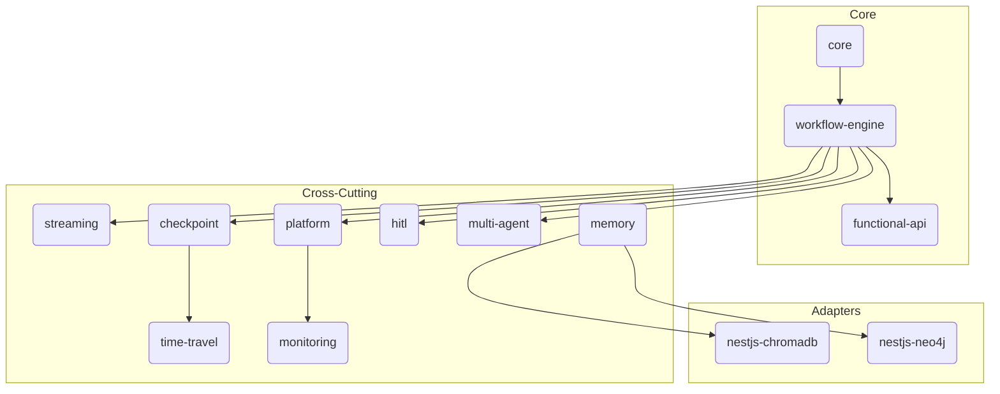
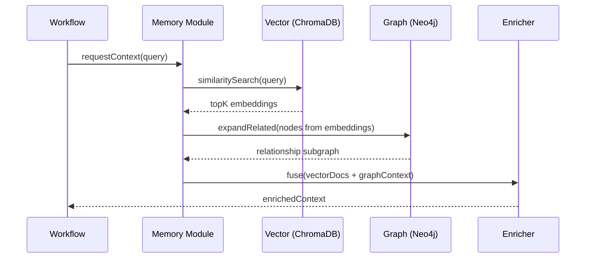
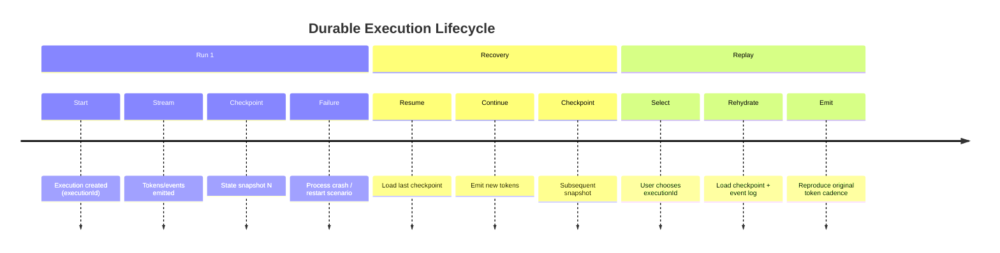

# Architecture Diagrams

> Visual representations (Mermaid) of key platform structures. These are intentionally concise for hackathon presentation clarity.

## Module Dependency (Logical Layering)

## Memory Fusion Retrieval Flow

## Checkpoint + Replay Timeline

## Notes

- Arrows show conceptual dependencies, not necessarily direct TypeScript imports (DI boundaries abstract some edges).
- `platform` aggregates registration glue; avoid importing it back into leaf modules.
- Replay leverages checkpoint state + persisted event/timeline records (spec in progress).
