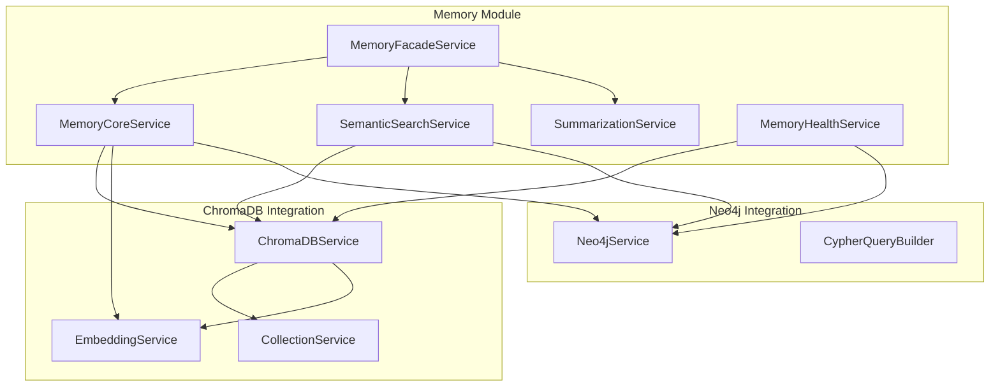

# @agentic-memory

A comprehensive memory management library for LangGraph applications, providing hybrid vector and graph storage capabilities with semantic search, relationship tracking, and intelligent summarization.

## Features

- 🧠 **Hybrid Memory Storage** - Combines ChromaDB vector storage with Neo4j graph relationships
- 🔍 **Semantic Search** - Advanced search combining vector similarity and graph relationships
- 📝 **Intelligent Summarization** - LLM-powered conversation summarization with multiple strategies
- 🔗 **Relationship Tracking** - Automatic memory relationship detection and graph storage
- 🏥 **Health Monitoring** - Comprehensive health checks and metrics
- ⚡ **Performance Optimized** - Timeout handling, retry logic, and graceful degradation
- 🛡️ **Error Resilience** - Comprehensive error handling with fallback strategies
- 🎯 **Type Safe** - Full TypeScript support with comprehensive type definitions

## Installation

```bash
npm install @agentic-memory
```

## Quick Start

### 1. Import and Configure the Module

```typescript
import { Module } from '@nestjs/common';
import { AgenticMemoryModule } from '@agentic-memory';

@Module({
  imports: [
    AgenticMemoryModule.forRoot({
      chromadb: {
        connection: {
          host: 'localhost',
          port: 8000,
        },
        embedding: {
          provider: 'openai',
          apiKey: process.env.OPENAI_API_KEY,
        },
      },
      neo4j: {
        uri: 'bolt://localhost:7687',
        username: 'neo4j',
        password: 'password',
        database: 'neo4j',
      },
      memory: {
        enableSemanticSearch: true,
        enableAutoSummarization: true,
      },
    }),
  ],
})
export class AppModule {}
```

### 2. Use the Memory Services

```typescript
import { Injectable } from '@nestjs/common';
import { MemoryFacadeService, SemanticSearchService } from '@agentic-memory';

@Injectable()
export class ConversationService {
  constructor(private readonly memoryFacade: MemoryFacadeService, private readonly semanticSearch: SemanticSearchService) {}

  async storeMessage(threadId: string, content: string, userId?: string) {
    return this.memoryFacade.store(
      threadId,
      content,
      {
        type: 'conversation',
        source: 'user',
        importance: 0.7,
      },
      userId
    );
  }

  async searchMemories(query: string, threadId: string) {
    return this.semanticSearch.hybridSearch({
      query,
      threadIds: [threadId],
      limit: 10,
      minRelevance: 0.6,
    });
  }

  async getConversationContext(query: string, threadId: string, userId?: string) {
    return this.memoryFacade.searchForContext(query, threadId, userId);
  }
}
```

## Architecture

The memory module follows a hybrid architecture that combines the strengths of vector databases and graph databases:



### Service Responsibilities

- **MemoryFacadeService**: High-level orchestration and public API
- **MemoryCoreService**: Core memory operations with hybrid storage
- **SemanticSearchService**: Advanced search combining vector and graph data
- **SummarizationService**: LLM-based conversation summarization
- **MemoryHealthService**: Health checks and monitoring

## Configuration

### Basic Configuration

```typescript
AgenticMemoryModule.forRoot({
  chromadb: {
    connection: {
      host: 'localhost',
      port: 8000,
    },
    embedding: {
      provider: 'openai',
      apiKey: process.env.OPENAI_API_KEY,
      model: 'text-embedding-ada-002',
    },
  },
  neo4j: {
    uri: 'bolt://localhost:7687',
    username: 'neo4j',
    password: 'password',
    database: 'neo4j',
  },
  memory: {
    enableSemanticSearch: true,
    enableAutoSummarization: true,
    retention: {
      maxAge: 30 * 24 * 60 * 60 * 1000, // 30 days
      maxPerThread: 1000,
      maxTotal: 10000,
    },
  },
});
```

### Async Configuration

```typescript
AgenticMemoryModule.forRootAsync({
  imports: [ConfigModule],
  useFactory: async (configService: ConfigService) => ({
    chromadb: {
      connection: {
        host: configService.get('CHROMA_HOST'),
        port: configService.get('CHROMA_PORT'),
      },
      embedding: {
        provider: 'openai',
        apiKey: configService.get('OPENAI_API_KEY'),
      },
    },
    neo4j: {
      uri: configService.get('NEO4J_URI'),
      username: configService.get('NEO4J_USERNAME'),
      password: configService.get('NEO4J_PASSWORD'),
    },
    memory: {
      enableSemanticSearch: true,
      enableAutoSummarization: true,
    },
  }),
  inject: [ConfigService],
});
```

## API Reference

### MemoryFacadeService

The main service for memory operations:

```typescript
// Store a memory
const memory = await memoryFacade.store(
  'thread-123',
  'User asked about pricing',
  {
    type: 'conversation',
    source: 'user',
    importance: 0.8,
    tags: ['pricing', 'question'],
  },
  'user-456'
);

// Search memories
const results = await memoryFacade.search({
  query: 'pricing information',
  threadIds: ['thread-123'],
  limit: 10,
  minRelevance: 0.6,
});

// Get conversation context
const context = await memoryFacade.searchForContext('What did we discuss about pricing?', 'thread-123', 'user-456');

// Summarize conversation
const summary = await memoryFacade.summarize('thread-123', messages, {
  strategy: 'progressive',
  maxMessages: 50,
});
```

### SemanticSearchService

Advanced search capabilities:

```typescript
// Hybrid search (vector + graph)
const results = await semanticSearch.hybridSearch({
  query: 'machine learning concepts',
  threadIds: ['thread-123'],
  includeRelated: true,
  relationshipDepth: 2,
  boostRelated: 0.3,
});

// Context-aware search
const contextResults = await semanticSearch.contextAwareSearch('explain neural networks', 'thread-123', 'user-456');

// Find similar memories
const similar = await semanticSearch.findSimilarMemories('memory-id-123', 5, 0.7);
```

### SummarizationService

LLM-powered summarization:

```typescript
// Create summary with different strategies
const summary = await summarizationService.createSummary(messages, {
  strategy: 'progressive', // 'batch', 'sliding-window'
  maxMessages: 50,
  preserveImportant: true,
  customPrompt: 'Focus on technical decisions made',
});
```

### MemoryHealthService

Health monitoring:

```typescript
// Comprehensive health check
const health = await memoryHealth.isHealthy('memory');

// Quick ping
const ping = await memoryHealth.ping('memory');

// Detailed metrics
const metrics = await memoryHealth.getMetrics();
```

## Memory Types

The library supports different types of memories:

- **conversation**: Regular conversation messages
- **summary**: Auto-generated conversation summaries
- **fact**: Important factual information
- **context**: Contextual information for understanding
- **preference**: User preferences and settings
- **custom**: Application-specific memory types

## Error Handling

The library provides comprehensive error handling with specific error types:

```typescript
import { MemoryStorageError, MemoryRelationshipError, MemoryEmbeddingError, MemorySummarizationError, isMemoryError } from '@agentic-memory';

try {
  await memoryFacade.store(threadId, content);
} catch (error) {
  if (isMemoryError(error)) {
    console.log('Memory operation failed:', error.getDetailedMessage());
    console.log('Context:', error.context);
  }
}
```

## Performance Features

### Timeout Handling

All operations have configurable timeouts:

```typescript
// Configure timeouts in environment or config
MEMORY_TIMEOUT_CHROMADB = 30000; // 30 seconds
MEMORY_TIMEOUT_NEO4J = 15000; // 15 seconds
MEMORY_TIMEOUT_EMBEDDING = 20000; // 20 seconds
```

### Graceful Degradation

- ChromaDB failures: Falls back to basic storage without embeddings
- Neo4j failures: Continues with vector-only operations
- Embedding failures: Stores content without semantic search

### Retry Logic

- Embedding operations: Automatic retry with exponential backoff
- Transient failures: Configurable retry attempts
- Circuit breaker patterns for external services

## Health Checks

Integrate with NestJS Terminus for health monitoring:

```typescript
import { Module } from '@nestjs/common';
import { TerminusModule } from '@nestjs/terminus';
import { MemoryHealthService } from '@agentic-memory';

@Module({
  imports: [TerminusModule],
  providers: [MemoryHealthService],
})
export class HealthModule {}
```

## Testing

### Unit Testing

```typescript
import { Test } from '@nestjs/testing';
import { MemoryFacadeService } from '@agentic-memory';

describe('MemoryFacadeService', () => {
  let service: MemoryFacadeService;

  beforeEach(async () => {
    const module = await Test.createTestingModule({
      providers: [
        {
          provide: MemoryFacadeService,
          useValue: {
            store: jest.fn(),
            search: jest.fn(),
          },
        },
      ],
    }).compile();

    service = module.get<MemoryFacadeService>(MemoryFacadeService);
  });

  it('should store memory', async () => {
    const mockMemory = { id: '1', content: 'test' };
    jest.spyOn(service, 'store').mockResolvedValue(mockMemory);

    const result = await service.store('thread-1', 'test content');
    expect(result).toEqual(mockMemory);
  });
});
```

## Migration Guide

### From Previous Versions

The refactored memory module provides backward compatibility for the public API while internally using ChromaDB and Neo4j services:

```typescript
// Old way (still works)
const memory = await memoryService.store(threadId, content);

// New way (recommended)
const memory = await memoryFacade.store(threadId, content, metadata, userId);
```

## Best Practices

1. **Use Appropriate Memory Types**: Choose the right memory type for your use case
2. **Set Importance Scores**: Use importance scores to prioritize memories
3. **Tag Memories**: Use tags for efficient filtering and organization
4. **Monitor Health**: Implement health checks in production
5. **Handle Errors**: Use the provided error types for proper error handling
6. **Configure Timeouts**: Set appropriate timeouts for your use case

## Building

Run `nx build memory` to build the library.

## Running unit tests

Run `nx test agentic-memory` to execute the unit tests via [Jest](https://jestjs.io).

## License

This project is licensed under the MIT License.
