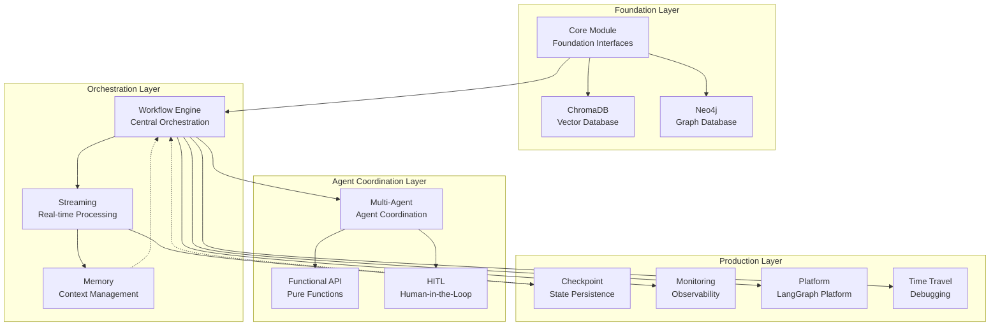

# Core Module - LangGraph Ecosystem Foundation

## 🚀 LangGraph Ecosystem Overview

**Welcome to the Complete LangGraph AI Ecosystem!**

The Core Module serves as the foundation for a comprehensive 13-library ecosystem designed to build enterprise-grade AI applications. This ecosystem provides everything from basic workflow orchestration to advanced multi-agent coordination, real-time streaming, and production monitoring.

## Real API Surface (Source Code Verified)

**Evidence-Based Documentation**: The following exports are verified through direct source code inspection.

### Core Type Exports

```typescript
// Core Workflow Types (type-only exports)
export type { WorkflowDefinition, WorkflowNode, WorkflowEdge, WorkflowState, WorkflowMetadata, WorkflowResult, CompiledWorkflow, WorkflowExecutionOptions, WorkflowExecutionError, Command, CommandType, NodeHandler } from '@hive-academy/langgraph-core';

// State Management Types
export type { BaseWorkflowState, StateManager, StateSnapshot, StateTransformer, StateValidator, StateManagementConfig, HumanFeedback, WorkflowError, WorkflowTimestamps } from '@hive-academy/langgraph-core';

// Node System Types
export type { NodeMetadata, NodeContext, NodeResult } from '@hive-academy/langgraph-core';
```

### Runtime Exports

```typescript
// State Annotations (runtime exports)
export { WorkflowStateAnnotation, createCustomStateAnnotation } from '@hive-academy/langgraph-core';

// Utility Functions
export { isWorkflow, NodeIdBuilder } from '@hive-academy/langgraph-core';

// Constants
export { CommandType } from '@hive-academy/langgraph-core';
```

### Integration Adapters (NoOp Implementations)

```typescript
// Checkpoint Integration
export { NoOpCheckpointAdapter, ICheckpointAdapter, CheckpointIntegrationHelper, createCheckpointIntegration } from '@hive-academy/langgraph-core';

export type { CheckpointIntegrationConfig, BaseCheckpoint, BaseCheckpointMetadata, BaseCheckpointTuple } from '@hive-academy/langgraph-core';

// Streaming Integration
export { NoOpStreamingService, NoOpTokenStreamingService, NoOpEventStreamProcessorService, NoOpWebSocketBridgeService, StreamEventType } from '@hive-academy/langgraph-core';

export type { IStreamingService, ITokenStreamingService, IEventStreamProcessorService, IWebSocketBridgeService, TokenStreamOptions } from '@hive-academy/langgraph-core';

// Memory Integration
export { IMemoryAdapter, isMemoryAdapter } from '@hive-academy/langgraph-core';

export type { AgentState, AgentMemoryContext, UserMemoryPatterns, Store, MemorySearchOptions } from '@hive-academy/langgraph-core';
```

### Complete Ecosystem Architecture (13 Libraries)



### Consumer Journey Paths

**🎯 Three Primary Consumer Journeys:**

1. **Agent System Builder** (Most Common)

   - Start: Core → Workflow-Engine → Multi-Agent + Functional-API + HITL
   - Goal: Build complete intelligent agent systems with human oversight
   - Time: 2-4 hours to production-ready system

2. **Real-time AI Architect**

   - Start: Core → Workflow-Engine → Streaming + Memory + Checkpoint
   - Goal: Build real-time AI workflows with persistent state
   - Time: 1-3 hours to streaming AI system

3. **Enterprise AI Platform Developer**
   - Start: Any working system → Monitoring + Platform + Time-Travel
   - Goal: Production deployment with full observability
   - Time: 1-2 hours to production deployment

### Quick Navigation

- **🚀 New to LangGraph?** → Complete this Core Module guide first
- **🤖 Building Agent Systems?** → Next: [Multi-Agent Integration](../multi-agent/CLAUDE.md#complete-agent-systems)
- **⚡ Need Real-time Processing?** → Next: [Streaming + Memory](../streaming/CLAUDE.md#real-time-workflows)
- **🏭 Ready for Production?** → Next: [Monitoring Integration](../monitoring/CLAUDE.md#production-deployment)
- **💾 Need Vector/Graph Data?** → Next: [ChromaDB](../../nestjs-chromadb/CLAUDE.md) + [Neo4j](../../nestjs-neo4j/CLAUDE.md)

## I. Foundation Layer

### Quick Start & Installation

```bash
npm install @hive-academy/langgraph-core
```

```typescript
import { Module } from '@nestjs/common';
import { CoreModule } from '@hive-academy/langgraph-core';

@Module({
  imports: [
    CoreModule.forRoot({
      // Basic configuration
      enabled: true,
      stateManagement: {
        immutable: true,
        deepMerge: true,
      },
      checkpointing: {
        enabled: true,
        adapter: 'memory',
      },
    }),
  ],
})
export class AppModule {}
```

### 🚀 5-Minute Complete Ecosystem Example

**Build a working AI system using multiple modules:**

```typescript
import { Injectable, Module } from '@nestjs/common';
import { WorkflowState, WorkflowDefinition, WorkflowStateAnnotation, createCustomStateAnnotation } from '@hive-academy/langgraph-core';
import { WorkflowEngineModule, WorkflowExecutionService, UnifiedWorkflowBase } from '@hive-academy/langgraph-workflow-engine';
import { StreamingModule, TokenStreamingService } from '@hive-academy/langgraph-streaming';
import { MemoryModule, MemoryService } from '@hive-academy/langgraph-memory';

// Step 1: Define your AI workflow state
interface AIWorkflowState extends WorkflowState {
  userQuery: string;
  aiResponse?: string;
  confidence?: number;
  memories?: string[];
  streamingEnabled?: boolean;
}

// Step 2: Create a complete AI service using the ecosystem
@Injectable()
export class CompleteAIService {
  constructor(private readonly workflowExecution: WorkflowExecutionService, private readonly streaming: TokenStreamingService, private readonly memory: MemoryService) {}

  async processUserQuery(query: string): Promise<AIWorkflowState> {
    // Initialize workflow state using Core module
    const initialState = await this.stateManager.createState<AIWorkflowState>({
      id: `ai-workflow-${Date.now()}`,
      status: 'pending',
      userQuery: query,
      streamingEnabled: true,
    });

    // Create workflow using Workflow-Engine with embedded Memory
    const workflow = await this.workflowEngine.createWorkflow({
      name: 'complete-ai-workflow',
      state: initialState,

      // Embedded memory configuration (not standalone)
      memory: {
        enabled: true,
        contextWindow: 10,
        persistAcrossSessions: true,
      },

      // Embedded checkpoint configuration
      checkpoints: {
        enabled: true,
        saveOnEachStep: true,
      },

      nodes: [
        {
          id: 'retrieve-memories',
          handler: async (state: AIWorkflowState) => {
            // Memory module embedded within workflow
            const memories = await this.memory.retrieveRelevant(state.userQuery);
            return { ...state, memories };
          },
        },

        {
          id: 'process-with-streaming',
          handler: async (state: AIWorkflowState) => {
            // Streaming module integration with memory context
            const streamResult = await this.streaming.processWithContext({
              input: state.userQuery,
              context: state.memories,
              streaming: true,
            });

            return {
              ...state,
              aiResponse: streamResult.response,
              confidence: streamResult.confidence,
              status: 'completed' as const,
            };
          },
        },
      ],

      edges: [{ from: 'retrieve-memories', to: 'process-with-streaming' }],
    });

    // Execute the complete workflow
    const result = await workflow.execute();

    // Store new memory for future queries
    await this.memory.store({
      query: query,
      response: result.aiResponse,
      confidence: result.confidence,
    });

    return result;
  }
}

// Step 3: Set up the complete module integration
@Module({
  imports: [
    // Foundation layer
    CoreModule.forRoot({
      stateManagement: { immutable: true, deepMerge: true },
      checkpointing: { enabled: true, adapter: 'memory' },
    }),

    // Orchestration layer with embedded memory and checkpoints
    WorkflowEngineModule.forRoot({
      embeddedModules: ['memory', 'checkpoint'], // Key: embedded usage
      defaultConfiguration: {
        enableStateAnnotations: true,
        enableInternalCheckpointing: true,
      },
    }),

    // Real-time capabilities
    StreamingModule.forRoot({
      integrations: ['memory', 'workflow-engine'],
      defaultStreaming: true,
    }),

    // Context management (embedded within workflow-engine)
    MemoryModule.forRoot({
      embeddedMode: true, // Key: not standalone
      persistence: 'redis',
      contextWindow: 10,
    }),
  ],
  providers: [CompleteAIService],
  exports: [CompleteAIService],
})
export class CompleteAIModule {}

// Step 4: Use the complete system
@Injectable()
export class AppService {
  constructor(private readonly aiService: CompleteAIService) {}

  async handleUserQuery(query: string) {
    // One line to use the complete ecosystem
    const result = await this.aiService.processUserQuery(query);

    console.log('AI Response:', result.aiResponse);
    console.log('Confidence:', result.confidence);
    console.log('Used Memories:', result.memories);

    return result;
  }
}
```

**🎯 What This Example Demonstrates:**

- **Core Module**: Foundation state management and interfaces
- **Workflow-Engine**: Central orchestration with embedded memory/checkpoint
- **Streaming**: Real-time processing capabilities
- **Memory**: Context management embedded within workflows (not standalone)
- **Integration Pattern**: All modules working together seamlessly

**⏱️ Time to Running**: 5 minutes from npm install to working AI system

**🚀 Next Steps After This Example:**

- Add [Multi-Agent coordination](../multi-agent/CLAUDE.md) for complex agent systems
- Include [HITL approval](../hitl/CLAUDE.md) for human oversight
- Enable [Production monitoring](../monitoring/CLAUDE.md) for observability

### Core Concepts

**Primary Purpose**: Provides foundational interfaces, types, and state management primitives for building LangGraph workflows in NestJS applications.

**Key Features:**

- **Workflow State Management** - Comprehensive state interfaces and annotations for LangGraph integration
- **Type-Safe Workflow Definitions** - Strongly typed interfaces for nodes, edges, and workflow configuration
- **State Annotations & Reducers** - LangGraph-compatible state annotations with intelligent reducers
- **Command & Control Flow** - Sophisticated command interface for workflow control and routing
- **Enhanced Agent Architecture** - Support for both simple-agent and workflow-agent patterns with dual-mode operation
- **Production Ready** - Enterprise-grade interfaces with checkpoint integration, error handling, and recovery mechanisms

### Core Interfaces & Types (Real Implementation)

**Primary State Interface (from source code):**

```typescript
// Core workflow state interface (actual implementation)
interface WorkflowState {
  id: string;
  status: 'pending' | 'running' | 'completed' | 'failed';
  metadata: WorkflowMetadata;
  timestamps: WorkflowTimestamps;
  context?: Record<string, unknown>;
  errors?: WorkflowError[];
  humanFeedback?: HumanFeedback[];
}

// State Manager Interface (actual implementation)
interface StateManager {
  createState(initial: Partial<WorkflowState>): Promise<WorkflowState>;
  updateState(id: string, updates: Partial<WorkflowState>): Promise<WorkflowState>;
  getState(id: string): Promise<WorkflowState | null>;
  deleteState(id: string): Promise<boolean>;
  transformState(options: StateTransformOptions): Promise<WorkflowState>;
}

// Configuration interfaces (actual implementation)
interface LangGraphModuleOptions {
  enabled?: boolean;
  stateManagement?: StateManagementConfig;
  checkpointing?: CheckpointIntegrationConfig;
  streaming?: TokenStreamOptions;
  memory?: MemorySearchOptions;
}

// Workflow Definition Interface (actual implementation)
interface WorkflowDefinition<TState extends WorkflowState = WorkflowState> {
  name: string;
  description?: string;
  channels?: StateAnnotation<TState>;
  nodes: WorkflowNode<TState>[];
  edges: WorkflowEdge<TState>[];
  entrypoint?: string;
  finishpoint?: string;
  config?: WorkflowExecutionConfig;
}
```

### Basic Usage Patterns (Real Implementation)

**State Management Service:**

```typescript
@Injectable()
export class CoreStateService {
  async createWorkflowState(): Promise<WorkflowState> {
    // Using actual WorkflowStateAnnotation from core
    const stateAnnotation = WorkflowStateAnnotation;

    return {
      id: generateNodeId('workflow'),
      status: 'pending',
      metadata: {
        createdAt: new Date(),
        workflowType: 'core-example',
      },
      timestamps: {
        created: new Date(),
        lastModified: new Date(),
      },
      context: {},
      errors: [],
      humanFeedback: [],
    };
  }

  async validateWorkflow(definition: WorkflowDefinition): Promise<boolean> {
    // Use actual isWorkflow utility
    return isWorkflow(definition);
  }
}
```

**Integration Adapter Pattern:**

```typescript
@Injectable()
export class CoreIntegrationService {
  constructor(@Inject('CHECKPOINT_ADAPTER') private checkpointAdapter: ICheckpointAdapter, @Inject('STREAMING_SERVICE') private streamingService: IStreamingService, @Inject('MEMORY_ADAPTER') private memoryAdapter: IMemoryAdapter) {}

  async setupWorkflowWithIntegrations(definition: WorkflowDefinition): Promise<CompiledWorkflow> {
    // Create checkpoint integration
    const checkpointIntegration = createCheckpointIntegration({
      adapter: this.checkpointAdapter,
      config: {
        enabled: true,
        saveOnEachStep: true,
      },
    });

    // Setup streaming if available
    const streamingOptions: TokenStreamOptions = {
      enabled: this.streamingService !== NoOpStreamingService,
      bufferSize: 100,
      flushInterval: 1000,
    };

    // Setup memory integration
    const memoryContext: AgentMemoryContext = {
      enabled: isMemoryAdapter(this.memoryAdapter),
      contextWindow: 10,
      persistAcrossSessions: true,
    };

    return {
      definition,
      checkpoint: checkpointIntegration,
      streaming: streamingOptions,
      memory: memoryContext,
      compiled: true,
    };
  }
}
```

**Custom State Annotation:**

```typescript
// Create custom state for specific workflow needs
interface CustomAIState extends WorkflowState {
  userQuery: string;
  aiResponse?: string;
  confidence?: number;
  memories?: string[];
}

@Injectable()
export class CustomStateService {
  async createCustomStateAnnotation() {
    // Use actual createCustomStateAnnotation function
    return createCustomStateAnnotation<CustomAIState>({
      userQuery: {
        default: '',
        reducer: (current, update) => update || current,
      },
      aiResponse: {
        default: undefined,
        reducer: (current, update) => update || current,
      },
      confidence: {
        default: 0,
        reducer: (current, update) => Math.max(current || 0, update || 0),
      },
      memories: {
        default: [],
        reducer: (current, update) => {
          return update ? [...(current || []), ...update] : current;
        },
      },
    });
  }
}
```

## II. Integration Layer

### Enhanced Agent Architecture Usage

**Workflow Agent with Internal Steps:**

```typescript
@Agent({
  id: 'workflow-core-agent',
  type: 'workflow-agent',
  capabilities: ['advanced-state-operations'],
  workflowConfig: {
    enableStateAnnotations: true,
    enableInternalCheckpointing: true,
    enableStepProgress: true,
    maxInternalRetries: 3,
  },
})
export class WorkflowCoreAgent {
  @Entrypoint()
  async initialize(context: TaskExecutionContext): Promise<Partial<WorkflowState>> {
    // Entry point with state management initialization
    return {
      status: 'initialized',
      stateContext: await this.setupStateContext(),
    };
  }

  @Task({ dependsOn: ['initialize'] })
  async processStateTransformation(context: TaskExecutionContext): Promise<Partial<WorkflowState>> {
    // Core state processing step
    const result = await this.stateManager.transformState({
      currentState: context.state,
      transformer: this.customStateTransformer,
    });
    return {
      transformedState: result,
      confidence: result.metadata.confidence,
    };
  }

  @Node({ type: 'condition' })
  async evaluateStateCondition(context: TaskExecutionContext): Promise<Partial<WorkflowState>> {
    // Decision node using state-specific logic
    const shouldProceed = await this.checkStateValidity(context.state);
    return {
      shouldProceed,
      evaluationReason: 'State validation check',
    };
  }

  @Edge('evaluateStateCondition', 'finalize', {
    condition: (state) => state.shouldProceed,
  })
  routeToFinalize() {}

  @Task({ dependsOn: ['evaluateStateCondition'] })
  async finalize(context: TaskExecutionContext): Promise<Partial<WorkflowState>> {
    // Final state processing step
    return {
      status: 'completed',
      finalState: await this.generateFinalState(context.state),
    };
  }
}
```

### Cross-Module Integration Examples

**Base for All Other Modules:**

```typescript
@Injectable()
export class CoreWorkflowService {
  async createIntegratedWorkflow(): Promise<WorkflowDefinition<WorkflowState>> {
    return {
      name: 'core-foundation-workflow',
      description: 'Base workflow providing state management and interfaces for all other modules',
      channels: WorkflowStateAnnotation,

      nodes: [
        {
          id: 'state-initialization',
          handler: async (state) => {
            // Foundation state management that other modules build upon
            return await this.stateManager.initializeWorkflowState(state);
          },
        },
      ],

      edges: [
        // Define base edges for state flow management
      ],
    };
  }
}
```

**Foundation for Other LangGraph Modules:**

```typescript
// Example: How other modules extend core interfaces
@Injectable()
export class CoreExtensionService {
  constructor(private readonly stateManager: StateManager) {}

  async provideFoundationFor(moduleType: string): Promise<WorkflowState> {
    // Streaming modules can extend these state interfaces
    const baseState = await this.stateManager.createState({
      id: `${moduleType}-workflow`,
      status: 'pending',
    });

    // Memory modules can use these checkpoint interfaces
    const checkpoint = await this.stateManager.createCheckpoint(baseState);

    // Multi-agent modules can extend these coordination patterns
    return {
      ...baseState,
      extensionContext: {
        moduleType,
        checkpointId: checkpoint.id,
        coordinationReady: true,
      },
    };
  }
}
```

## III. Advanced Layer

### Production Configuration

```typescript
CoreModule.forRootAsync({
  imports: [ConfigModule],
  useFactory: (configService: ConfigService) => ({
    // Production-grade configuration
    stateManagement: {
      enabled: configService.get('CORE_STATE_ENABLED', true),
      immutable: configService.get('CORE_IMMUTABLE_STATE', true),
      deepMerge: configService.get('CORE_DEEP_MERGE', true),
    },

    // Performance configuration
    performance: {
      cacheSize: configService.get('CORE_CACHE_SIZE', 1000),
      timeout: configService.get('CORE_TIMEOUT', 30000),
      batchSize: configService.get('CORE_BATCH_SIZE', 100),
    },

    // Error handling configuration
    errorHandling: {
      enableRecovery: configService.get('CORE_ERROR_RECOVERY', true),
      maxRetries: configService.get('CORE_MAX_RETRIES', 3),
      backoffStrategy: configService.get('CORE_BACKOFF', 'exponential'),
    },

    // Enhanced agent configuration
    agentDefaults: {
      workflowConfig: {
        enableStateAnnotations: true,
        enableInternalCheckpointing: true,
        enableStepProgress: true,
      },
    },
  }),
  inject: [ConfigService],
});
```

### Advanced Usage Patterns

**Enterprise Workflow Integration:**

```typescript
@Injectable()
export class EnterpriseCoreService {
  async createEnterpriseWorkflow(): Promise<WorkflowDefinition<EnterpriseCoreState>> {
    return {
      name: 'enterprise-core-workflow',
      description: 'Production-grade core workflow with full enterprise features',
      channels: EnterpriseCoreStateAnnotation,

      nodes: [
        {
          id: 'validate-enterprise-state',
          handler: async (state) => {
            // Enterprise validation with compliance checks
            return await this.validateEnterpriseState(state);
          },
          config: {
            timeout: 30000,
            retry: { maxAttempts: 3, delay: 2000 },
            stateValidation: true,
          },
        },

        {
          id: 'core-enterprise-processing',
          handler: async (state) => {
            // Advanced state processing with enterprise features
            return await this.processEnterpriseState(state);
          },
          config: {
            streaming: true,
            requiresApproval: true,
            approval: {
              threshold: 0.8,
              condition: (state) => state.riskLevel > 0.7,
            },
          },
        },
      ],

      edges: [
        {
          from: 'validate-enterprise-state',
          to: {
            condition: (state) => {
              // Enterprise routing logic using state validation
              return state.isValidated ? 'approved-path' : 'review-path';
            },
            routes: {
              'approved-path': 'core-enterprise-processing',
              'review-path': 'human-review',
            },
          },
        },
      ],
    };
  }
}
```

### Performance Optimization Patterns

```typescript
@Injectable()
export class OptimizedCoreService {
  async optimizedStateProcessing(states: WorkflowState[]): Promise<WorkflowState[]> {
    // Batch state processing for optimal performance
    const batches = this.createBatches(states, this.optimalBatchSize);

    const results = await Promise.allSettled(
      batches.map((batch) =>
        this.stateManager.processBatch(batch, {
          // Performance optimization options
          enableCaching: true,
          enableParallelProcessing: true,
          enableResourcePooling: true,
        })
      )
    );

    return this.consolidateResults(results);
  }

  private createBatches<T>(items: T[], batchSize: number): T[][] {
    // Intelligent batching logic
    return items.reduce((batches, item, index) => {
      const batchIndex = Math.floor(index / batchSize);
      if (!batches[batchIndex]) batches[batchIndex] = [];
      batches[batchIndex].push(item);
      return batches;
    }, [] as T[][]);
  }
}
```

## IV. Consumer Journey

### Learning Path Progression

**Beginner (0-30 minutes)**

1. ✅ Complete Quick Start installation
2. ✅ Run basic state management example
3. ✅ Understand core interfaces and WorkflowState
4. 🎯 **Success Milestone**: Successfully create and manage workflow state in existing application

**Intermediate (30 minutes - 2 hours)**

1. ✅ Implement enhanced agent architecture (workflow agent)
2. ✅ Configure production state management settings
3. ✅ Build foundation for other LangGraph modules integration
4. 🎯 **Success Milestone**: Build multi-step workflow using core state management features

**Advanced (2+ hours)**

1. ✅ Implement enterprise patterns and error handling
2. ✅ Optimize state processing performance for production workloads
3. ✅ Create custom state annotations and advanced integrations
4. 🎯 **Success Milestone**: Deploy production-ready system with full core module capabilities

### Feature Discovery Guide

**Essential Features (Start Here)**

- WorkflowState interface and state management
- Basic state annotations and transformers
- Simple checkpoint integration
- Core error handling patterns

**Productivity Features (Next Step)**

- Enhanced agent architecture with workflow agents
- Advanced state validation and transformation
- Batch state processing capabilities
- Production configuration patterns

**Advanced Features (Power Users)**

- Custom state annotations and reducers
- Enterprise compliance and validation
- Advanced error recovery mechanisms

**Enterprise Features (Production)**

- Multi-tenant state isolation
- Advanced security and audit logging
- High-availability checkpoint adapters
- Performance monitoring and optimization

### 🌐 Complete Ecosystem Integration Patterns

**🎯 Core Module as Foundation for All 13 Libraries**

The Core Module provides the foundational interfaces that all other modules extend and build upon. Here's how each module category integrates:

#### Foundation Extensions (Database Integration)

```typescript
// Core + ChromaDB + Neo4j: Complete AI data infrastructure
@Injectable()
export class AIDataInfrastructureService {
  constructor(
    private readonly stateManager: StateManager, // Core foundation
    private readonly chromadb: ChromaDBService, // Vector search
    private readonly neo4j: Neo4jService // Graph relationships
  ) {}

  async createKnowledgeWorkflow(): Promise<WorkflowState> {
    // Core state management with database integration
    const state = await this.stateManager.createState({
      id: 'knowledge-workflow',
      status: 'pending',
      context: {
        vectorSearch: true,
        graphTraversal: true,
      },
    });

    // Vector and graph search in single workflow
    const vectorResults = await this.chromadb.queryDocuments('knowledge', {
      queryTexts: ['AI workflow patterns'],
      nResults: 5,
    });

    const graphContext = await this.neo4j.run(
      `
      MATCH (w:Workflow)-[r:USES]->(m:Module)
      WHERE w.id = $workflowId
      RETURN m.name, r.pattern
    `,
      { workflowId: state.id }
    );

    return { ...state, context: { vectorResults, graphContext } };
  }
}
```

#### Orchestration Extensions (Workflow + Streaming + Memory)

```typescript
// Core + Workflow-Engine + Streaming + Memory: Real-time AI workflows
@Injectable()
export class RealTimeAIOrchestration {
  async createStreamingAIWorkflow(): Promise<WorkflowDefinition<StreamingAIState>> {
    return {
      name: 'real-time-ai-workflow',
      description: 'Core state management with streaming and embedded memory',
      channels: StreamingAIStateAnnotation, // Extends Core WorkflowState

      // Memory embedded within workflow (not standalone)
      memory: {
        strategy: 'embedded',
        retention: Duration.hours(24),
        contextWindow: 10,
      },

      // Streaming enabled with state persistence
      streaming: {
        enabled: true,
        checkpointOnChunks: true,
        memoryContext: true,
      },

      nodes: [
        {
          id: 'initialize-with-memory',
          handler: async (state: StreamingAIState) => {
            // Core state + embedded memory + streaming setup
            const memories = await this.memory.getRelevantContext(state.input);
            return { ...state, memories, streamingReady: true };
          },
        },

        {
          id: 'stream-with-checkpoints',
          handler: async (state: StreamingAIState) => {
            // Streaming with automatic state persistence
            const stream = await this.streaming.processWithContext({
              input: state.input,
              memories: state.memories,
              checkpointEvery: Duration.seconds(1),
            });

            return { ...state, streamResult: stream, status: 'completed' };
          },
        },
      ],
    };
  }
}
```

#### Agent Coordination Extensions (Multi-Agent + Functional-API + HITL)

```typescript
// Core + Multi-Agent + Functional-API + HITL: Complete agent systems
@Injectable()
export class CompleteAgentSystemService {
  async createAgentEcosystem(): Promise<AgentEcosystemState> {
    // Core state management for agent coordination
    const baseState = await this.stateManager.createState<AgentEcosystemState>({
      id: 'agent-ecosystem',
      status: 'initializing',
      agentStates: {},
      functionalComposition: [],
      humanOversight: { enabled: true, threshold: 0.8 },
    });

    // Multi-agent coordination with functional composition
    const agentWorkflow = await this.createMultiAgentWorkflow(baseState);

    return agentWorkflow;
  }

  private async createMultiAgentWorkflow(state: AgentEcosystemState) {
    return {
      ...state,
      workflow: {
        // Multi-agent coordination
        agents: {
          analyzer: this.createFunctionalAgent('analyzer'),
          processor: this.createFunctionalAgent('processor'),
          validator: this.createFunctionalAgent('validator'),
        },

        // Functional composition patterns
        composition: pipe(
          validateInput,
          enrichWithContext,
          coordinateAgents,
          validateResults,
          requestHumanApproval // HITL integration
        ),

        // Human oversight integration
        hitl: {
          enabled: true,
          approvalRequired: (result) => result.confidence < 0.8,
          timeout: Duration.minutes(5),
          escalation: 'supervisor',
        },
      },
    };
  }

  private createFunctionalAgent(type: string) {
    // Functional-API patterns within agent creation
    return createAgent({
      id: type,
      stateInterface: this.stateManager, // Core foundation
      processor: pipe(validateAgentInput, processWithPureFunctions, validateAgentOutput),
      coordination: this.multiAgent,
      oversight: this.hitl,
    });
  }
}
```

#### Production Extensions (Monitoring + Platform + Time-Travel)

```typescript
// Core + Monitoring + Platform + Time-Travel: Enterprise deployment
@Injectable()
export class EnterpriseProductionService {
  async deployCompleteEcosystem(): Promise<ProductionDeployment> {
    // Core state management with full production capabilities
    const productionState = await this.stateManager.createState({
      id: 'enterprise-deployment',
      status: 'deploying',
      monitoring: { enabled: true, metrics: [] },
      platform: { integration: 'langgraph-cloud' },
      debugging: { timeTravel: true, stateHistory: true },
    });

    // Complete ecosystem with all 13 libraries
    const deployment = await this.platform.deploy({
      // Foundation
      core: this.coreConfiguration,
      databases: {
        vector: this.chromadbConfig,
        graph: this.neo4jConfig,
      },

      // Orchestration with embedded state management
      orchestration: {
        workflowEngine: {
          embeddedModules: ['memory', 'checkpoint'],
          stateManagement: this.stateManager,
        },
        streaming: { memoryIntegration: true },
      },

      // Agent ecosystem
      agents: {
        multiAgent: { functionalComposition: true },
        hitl: { enterpriseApproval: true },
      },

      // Production infrastructure
      production: {
        monitoring: {
          metrics: ['workflow-performance', 'agent-coordination', 'memory-usage'],
          alerting: true,
          dashboards: true,
        },
        platform: {
          scaling: 'auto',
          redundancy: 'multi-region',
        },
        debugging: {
          timeTravel: {
            enabled: true,
            retentionDays: 30,
            replayCapable: true,
          },
        },
      },
    });

    return deployment;
  }
}
```

### 🚀 Consumer Journey Paths Through the Ecosystem

**Path 1: Agent System Builder (2-4 hours)**

```
Core (foundation) → Workflow-Engine (orchestration) →
Multi-Agent + Functional-API + HITL (complete agent systems) →
Monitoring (production observability)
```

**Path 2: Real-time AI Architect (1-3 hours)**

```
Core (foundation) → Workflow-Engine (with embedded Memory + Checkpoint) →
Streaming (real-time processing) → ChromaDB + Neo4j (data integration) →
Platform (deployment)
```

**Path 3: Enterprise AI Platform Developer (1-2 hours)**

```
Any working system → Monitoring (observability) →
Platform (LangGraph Cloud deployment) → Time-Travel (debugging)
```

### 🔗 Module Interconnection Map

**Core Module Enables:**

- **Workflow-Engine**: State management interfaces and workflow definitions
- **All Modules**: Foundation interfaces, state annotations, and type safety
- **Database Modules**: State persistence and query result integration
- **Agent Modules**: State-aware agent coordination and communication
- **Production Modules**: State monitoring, debugging, and platform integration

**Integration Dependencies:**

- **Memory + Checkpoint** → Embedded within **Workflow-Engine** and **Streaming**
- **Multi-Agent + Functional-API + HITL** → Coordinated through **Workflow-Engine**
- **ChromaDB + Neo4j** → Integrated via **Core** state management
- **Monitoring + Platform + Time-Travel** → Observe entire ecosystem from **Core** foundation

### 📚 Next Steps by Use Case

**🤖 Building Agent Systems?**
→ Next: [Multi-Agent Coordination](../multi-agent/CLAUDE.md#complete-agent-systems)
→ Then: [Functional API Patterns](../functional-api/CLAUDE.md#agent-composition)
→ Finally: [HITL Integration](../hitl/CLAUDE.md#agent-oversight)

**⚡ Building Real-time AI?**
→ Next: [Workflow-Engine](../workflow-engine/CLAUDE.md#embedded-state-management)
→ Then: [Streaming Patterns](../streaming/CLAUDE.md#real-time-workflows)
→ Data: [ChromaDB](../../nestjs-chromadb/CLAUDE.md) + [Neo4j](../../nestjs-neo4j/CLAUDE.md)

**🏭 Deploying to Production?**
→ Next: [Monitoring Setup](../monitoring/CLAUDE.md#production-deployment)
→ Then: [Platform Integration](../platform/CLAUDE.md#langgraph-cloud)
→ Debug: [Time-Travel](../time-travel/CLAUDE.md#production-debugging)

## V. Reference & Troubleshooting

### Complete Interface Reference (Verified from Source)

```typescript
// Core WorkflowState (actual implementation)
interface WorkflowState {
  id: string;
  status: 'pending' | 'running' | 'completed' | 'failed';
  metadata: WorkflowMetadata;
  timestamps: WorkflowTimestamps;
  context?: Record<string, unknown>;
  errors?: WorkflowError[];
  humanFeedback?: HumanFeedback[];
}

// State Management Interfaces (actual implementation)
interface StateManager {
  createState(initial: Partial<WorkflowState>): Promise<WorkflowState>;
  updateState(id: string, updates: Partial<WorkflowState>): Promise<WorkflowState>;
  getState(id: string): Promise<WorkflowState | null>;
  deleteState(id: string): Promise<boolean>;
  transformState(options: StateTransformOptions): Promise<WorkflowState>;
}

interface BaseWorkflowState {
  id: string;
  status: string;
  metadata?: Record<string, unknown>;
  timestamps?: WorkflowTimestamps;
}

// Configuration Interfaces (actual implementation)
interface LangGraphModuleOptions {
  enabled?: boolean;
  stateManagement?: StateManagementConfig;
  checkpointing?: CheckpointIntegrationConfig;
  streaming?: TokenStreamOptions;
  memory?: MemorySearchOptions;
}

interface LangGraphModuleAsyncOptions {
  imports?: Type<any>[];
  useFactory?: (...args: any[]) => Promise<LangGraphModuleOptions> | LangGraphModuleOptions;
  inject?: any[];
}

// Integration Adapter Interfaces (actual implementation)
interface ICheckpointAdapter {
  save(checkpoint: BaseCheckpoint): Promise<void>;
  load(checkpointId: string): Promise<BaseCheckpoint | null>;
  list(options?: CheckpointListOptions): Promise<BaseCheckpoint[]>;
  cleanup(options?: CheckpointCleanupOptions): Promise<void>;
}

interface IStreamingService {
  isStreamingEnabled(): boolean;
  createStream(options: TokenStreamOptions): AsyncIterable<any>;
  processStream(input: any, options?: any): Promise<any>;
}

interface IMemoryAdapter {
  store(entry: any): Promise<void>;
  retrieve(query: any): Promise<any[]>;
  search(options: MemorySearchOptions): Promise<any[]>;
  cleanup(): Promise<void>;
}

// Workflow Definition (actual implementation)
interface WorkflowDefinition<TState extends WorkflowState = WorkflowState> {
  name: string;
  description?: string;
  channels?: StateAnnotation<TState>;
  nodes: WorkflowNode<TState>[];
  edges: WorkflowEdge<TState>[];
  entrypoint?: string;
  finishpoint?: string;
  config?: WorkflowExecutionConfig;
}

// Node and Edge Interfaces (actual implementation)
interface WorkflowNode<TState extends WorkflowState = WorkflowState> {
  id: string;
  handler: NodeHandler<TState>;
  config?: WorkflowNodeConfig;
}

interface WorkflowEdge<TState extends WorkflowState = WorkflowState> {
  from: string;
  to: string | ConditionalRouting<TState>;
  condition?: (state: TState) => boolean;
  config?: WorkflowEdgeConfig;
}

// Command System (actual implementation)
enum CommandType {
  INTERRUPT = 'interrupt',
  RESUME = 'resume',
  UPDATE = 'update',
  CANCEL = 'cancel',
}

interface Command {
  type: CommandType;
  payload?: any;
  metadata?: Record<string, unknown>;
}
```

### Testing Examples (Real Integration Patterns)

```typescript
describe('Core Module Real Integration', () => {
  let module: TestingModule;

  beforeEach(async () => {
    module = await Test.createTestingModule({
      imports: [
        // Core module with real configuration
        CoreModule.forRoot({
          enabled: true,
          stateManagement: {
            immutable: true,
            deepMerge: true,
          },
          checkpointing: {
            enabled: true,
            adapter: NoOpCheckpointAdapter,
          },
          streaming: {
            enabled: false,
            service: NoOpStreamingService,
          },
          memory: {
            enabled: false,
            adapter: IMemoryAdapter,
          },
        }),
      ],
      providers: [CoreStateService, CoreIntegrationService, CustomStateService],
    }).compile();
  });

  describe('WorkflowStateAnnotation', () => {
    it('should create valid state annotations', async () => {
      const stateService = module.get<CoreStateService>(CoreStateService);
      const state = await stateService.createWorkflowState();

      expect(state).toBeDefined();
      expect(state.id).toMatch(/^workflow-/);
      expect(state.status).toBe('pending');
      expect(state.timestamps).toBeDefined();
      expect(state.metadata).toBeDefined();
    });
  });

  describe('Integration Adapters', () => {
    it('should setup workflow with all integrations', async () => {
      const integrationService = module.get<CoreIntegrationService>(CoreIntegrationService);

      const workflowDefinition: WorkflowDefinition = {
        name: 'test-workflow',
        nodes: [
          {
            id: 'start',
            handler: async (state) => ({ ...state, status: 'running' }),
          },
        ],
        edges: [],
      };

      const compiled = await integrationService.setupWorkflowWithIntegrations(workflowDefinition);

      expect(compiled.definition).toBe(workflowDefinition);
      expect(compiled.checkpoint).toBeDefined();
      expect(compiled.streaming).toBeDefined();
      expect(compiled.memory).toBeDefined();
      expect(compiled.compiled).toBe(true);
    });
  });

  describe('Custom State Annotations', () => {
    it('should create custom state annotations with reducers', async () => {
      const customStateService = module.get<CustomStateService>(CustomStateService);
      const annotation = await customStateService.createCustomStateAnnotation();

      expect(annotation).toBeDefined();
      // Test that the annotation includes our custom properties
      expect(annotation.channels).toHaveProperty('userQuery');
      expect(annotation.channels).toHaveProperty('aiResponse');
      expect(annotation.channels).toHaveProperty('confidence');
      expect(annotation.channels).toHaveProperty('memories');
    });
  });

  describe('Utility Functions', () => {
    it('should validate workflows with isWorkflow', async () => {
      const validDefinition: WorkflowDefinition = {
        name: 'valid-workflow',
        nodes: [{ id: 'node1', handler: async (state) => state }],
        edges: [],
      };

      const isValid = isWorkflow(validDefinition);
      expect(isValid).toBe(true);
    });

    it('should generate unique node IDs', () => {
      const id1 = generateNodeId('test');
      const id2 = generateNodeId('test');

      expect(id1).toMatch(/^test-/);
      expect(id2).toMatch(/^test-/);
      expect(id1).not.toBe(id2);
    });
  });

  describe('Integration with NoOp Services', () => {
    it('should work with NoOp checkpoint adapter', async () => {
      const adapter = new NoOpCheckpointAdapter();

      await expect(adapter.save({} as BaseCheckpoint)).resolves.not.toThrow();
      await expect(adapter.load('test-id')).resolves.toBeNull();
      await expect(adapter.list()).resolves.toEqual([]);
      await expect(adapter.cleanup()).resolves.not.toThrow();
    });

    it('should work with NoOp streaming service', () => {
      const service = new NoOpStreamingService();

      expect(service.isStreamingEnabled()).toBe(false);
      expect(service.createStream).toBeDefined();
      expect(service.processStream).toBeDefined();
    });

    it('should validate memory adapters', () => {
      const realAdapter = { store: jest.fn(), retrieve: jest.fn(), search: jest.fn(), cleanup: jest.fn() };
      const fakeAdapter = { someMethod: jest.fn() };

      expect(isMemoryAdapter(realAdapter)).toBe(true);
      expect(isMemoryAdapter(fakeAdapter)).toBe(false);
    });
  });
});
```

### Common Issues & Solutions

#### Issue 1: State Not Persisting

```typescript
// Problem: State changes are lost between workflow steps
// Solution: Enable proper state management configuration
CoreModule.forRoot({
  stateManagement: {
    immutable: true,
    deepMerge: true,
    persistence: { enabled: true },
  },
});
```

#### Issue 2: Performance Issues with Large States

```typescript
// Problem: Slow state processing with large workflow states
// Solution: Enable batch processing and caching
CoreModule.forRoot({
  performance: {
    enableCaching: true,
    batchSize: 50,
    enableParallelProcessing: true,
  },
});
```

#### Issue 3: Integration Issues with Other Modules

```typescript
// Problem: Other modules can't access core state interfaces
// Solution: Ensure core module is imported first
@Module({
  imports: [
    CoreModule.forRoot({
      /* config */
    }), // Import first
    StreamingModule.forRoot({
      /* config */
    }), // Then other modules
    WorkflowEngineModule.forRoot({
      /* config */
    }),
  ],
})
export class CorrectCoreIntegration {}
```

### Environment Variables Reference

```bash
# Core Module Configuration
LANGGRAPH_CORE_ENABLED=true
LANGGRAPH_STATE_IMMUTABLE=true
LANGGRAPH_STATE_DEEP_MERGE=true

# Checkpoint Integration
LANGGRAPH_CHECKPOINT_ENABLED=true
LANGGRAPH_CHECKPOINT_SAVE_ON_STEP=true
LANGGRAPH_CHECKPOINT_CLEANUP_INTERVAL=3600000

# Streaming Integration
LANGGRAPH_STREAMING_ENABLED=false
LANGGRAPH_STREAMING_BUFFER_SIZE=100
LANGGRAPH_STREAMING_FLUSH_INTERVAL=1000

# Memory Integration
LANGGRAPH_MEMORY_ENABLED=false
LANGGRAPH_MEMORY_CONTEXT_WINDOW=10
LANGGRAPH_MEMORY_PERSIST_SESSIONS=true

# Performance Configuration
LANGGRAPH_BATCH_SIZE=50
LANGGRAPH_TIMEOUT=30000
LANGGRAPH_CACHE_SIZE=1000

# Error Handling
LANGGRAPH_ERROR_RECOVERY=true
LANGGRAPH_MAX_RETRIES=3
LANGGRAPH_BACKOFF_STRATEGY=exponential

# Debug Configuration
LANGGRAPH_DEBUG_ENABLED=false
LANGGRAPH_VERBOSE_LOGGING=false
```

### Dependencies (from package.json)

```json
{
  "dependencies": {
    "@langchain/langgraph": "^0.4.3",
    "@langchain/core": "^0.3.68",
    "@nestjs/common": "^11.0.0"
  }
}
```

### Consumer Integration Pattern

```typescript
// Real working integration based on actual exports
import { WorkflowDefinition, WorkflowState, WorkflowStateAnnotation, ICheckpointAdapter, IStreamingService, IMemoryAdapter, createCustomStateAnnotation, isWorkflow, NoOpCheckpointAdapter, NoOpStreamingService } from '@hive-academy/langgraph-core';

@Module({
  imports: [
    CoreModule.forRoot({
      enabled: true,
      stateManagement: {
        immutable: true,
        deepMerge: true,
      },
      checkpointing: {
        enabled: true,
        adapter: NoOpCheckpointAdapter, // Replace with real adapter in production
      },
      streaming: {
        enabled: false,
        service: NoOpStreamingService, // Replace with real service if needed
      },
    }),
  ],
})
export class MyLangGraphApplication {}
```
