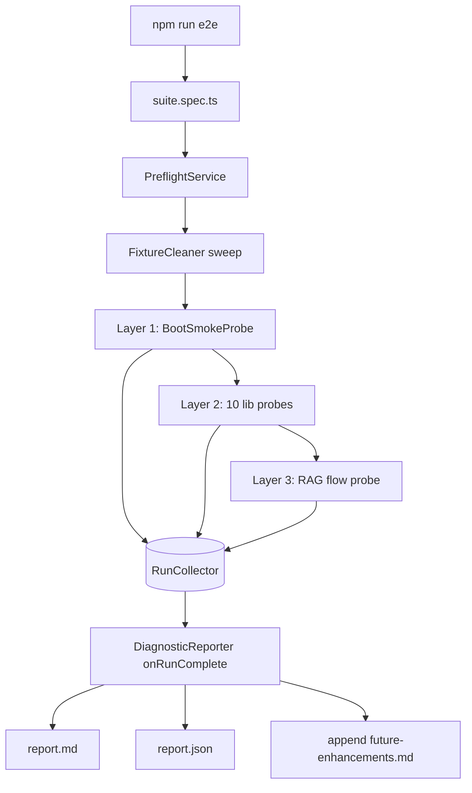

# Implementation Plan — TASK_2025_063 (E2E Diagnostic Test Suite)

**Architect**: software-architect
**Date**: 2026-05-15
**Status**: Ready for team-leader decomposition
**Inputs read**: `context.md`, `task-description.md`, `research-report.md`, repo `CLAUDE.md`.

---

## 1. App Structure

**Final name**: `apps/e2e-diagnostics` (clearer intent than `e2e-suite`; avoids confusion with the existing Playwright-style `dev-brand-ui-e2e`).

**Generator**: `nx g @nx/node:application e2e-diagnostics --framework=none --bundler=none --unitTestRunner=jest --linter=eslint --no-interactive`. After scaffold, **delete** the generated `build`, `serve`, and any webpack/esbuild configs. Keep only `test`, `lint`, `typecheck`.

**Justification for Jest (over Vitest)**: matches `apps/dev-brand-api/jest.config.ts` and the repo-wide `@nx/jest/preset` registration (`nx.json:66`). Introducing Vitest would add a second SWC config, second ESLint plugin, second preset — cost not justified for a single diagnostic app. Reaffirms research recommendation §1.

### Directory layout

```
apps/e2e-diagnostics/
├── project.json              # only test/lint/typecheck targets
├── jest.config.ts            # mirrors dev-brand-api pattern
├── tsconfig.json             # strict; extends repo base
├── tsconfig.spec.json
├── .spec.swcrc               # copied from dev-brand-api
├── src/
│   ├── contracts/
│   │   ├── probe.contract.ts          # Probe + ProbeResult interfaces
│   │   ├── run-context.ts             # RunContext (runId, namespace())
│   │   └── report.types.ts            # SuiteReport, LayerReport types
│   ├── services/
│   │   ├── run-collector.service.ts   # accumulates ProbeResults
│   │   ├── preflight.service.ts       # service reachability checks
│   │   └── fixture-cleaner.service.ts # namespace prefix sweep
│   ├── reporting/
│   │   ├── diagnostic-reporter.ts     # custom Jest reporter
│   │   ├── markdown-renderer.ts       # ProbeResult[] → report.md
│   │   └── json-renderer.ts           # ProbeResult[] → report.json
│   ├── probes/
│   │   ├── layer-1-boot/
│   │   │   └── dev-brand-api-boot.probe.ts
│   │   ├── layer-2-libs/
│   │   │   ├── chromadb.probe.ts
│   │   │   ├── neo4j.probe.ts
│   │   │   ├── workflow-engine.probe.ts
│   │   │   ├── memory.probe.ts
│   │   │   ├── hitl.probe.ts
│   │   │   ├── adapters-sqlite.probe.ts
│   │   │   ├── monitoring.probe.ts
│   │   │   ├── core.probe.ts
│   │   │   ├── platform.probe.ts          # emits MISSING/SKIPPED
│   │   │   └── langgraph-angular.probe.ts # emits SKIPPED (out-of-scope reason)
│   │   └── layer-3-rag/
│   │       └── full-rag-flow.probe.ts
│   ├── harness/
│   │   ├── nest-boot.ts             # NestFactory wrappers
│   │   └── service-clients.ts       # raw chroma/neo4j/redis clients
│   └── suite.spec.ts                # single Jest entry — orchestrates all layers
└── reports/                          # gitignored; written per run
    └── <ISO-timestamp>/
        ├── report.md
        └── report.json
```

### project.json targets

```jsonc
{
  "name": "e2e-diagnostics",
  "$schema": "../../node_modules/nx/schemas/project-schema.json",
  "projectType": "application",
  "sourceRoot": "apps/e2e-diagnostics/src",
  "implicitDependencies": ["dev-brand-api"],
  "targets": {
    "test": {
      "executor": "@nx/jest:jest",
      "options": {
        "jestConfig": "apps/e2e-diagnostics/jest.config.ts",
        "passWithNoTests": false,
        "runInBand": true
      }
    },
    "lint": { "executor": "@nx/eslint:lint" },
    "typecheck": {
      "executor": "nx:run-commands",
      "options": { "command": "tsc -p apps/e2e-diagnostics/tsconfig.json --noEmit" }
    }
  }
}
```

`jest.config.ts` mirrors `apps/dev-brand-api/jest.config.ts` with two additions: `testTimeout: 600_000` (10 min ceiling, matches Req NFR perf budget) and `reporters: ['default', '<rootDir>/src/reporting/diagnostic-reporter.ts']`.

### Root package.json

Single entry per Req 5.1: `"e2e": "nx test e2e-diagnostics"`. No other root-level changes.

---

## 2. Probe Contract

`src/contracts/probe.contract.ts`:

```typescript
export type LibraryId =
  | 'nestjs-chromadb'
  | 'nestjs-neo4j'
  | 'langgraph-angular'
  | 'langgraph-core'
  | 'langgraph-memory'
  | 'langgraph-hitl'
  | 'langgraph-monitoring'
  | 'langgraph-platform'
  | 'langgraph-workflow-engine'
  | 'langgraph-adapters'
  | 'dev-brand-api';

export interface RunContext {
  readonly runId: string;
  namespace(suffix: string): string; // → `e2e-${runId}-${suffix}`
  readonly preflight: Readonly<Record<'chromadb' | 'neo4j' | 'redis', 'ready' | 'unreachable'>>;
}

export type ProbeResult =
  | { status: 'PASS'; name: string; layer: 1 | 2 | 3; suspectedLib: LibraryId; durationMs: number }
  | {
      status: 'FAIL';
      name: string;
      layer: 1 | 2 | 3;
      suspectedLib: LibraryId;
      durationMs: number;
      error: { message: string; stack: string };
    }
  | { status: 'SKIPPED'; name: string; layer: 1 | 2 | 3; suspectedLib: LibraryId; reason: string }
  | {
      status: 'MISSING';
      name: string;
      layer: 1 | 2 | 3;
      suspectedLib: LibraryId;
      expected: string;
      observedIn: string;
    };

export interface Probe {
  readonly name: string;
  readonly layer: 1 | 2 | 3;
  readonly suspectedLib: LibraryId;
  run(ctx: RunContext): Promise<ProbeResult>;
}
```

Strict TS, no `any`, no re-exports. Discriminated union ensures FAIL always carries stack (Req 5.3) and MISSING always carries `expected`+`observedIn` (Req 5.4).

---

## 3. Three Layer Modules

### Layer 1 — Boot Smoke (`dev-brand-api-boot.probe.ts`)

- Uses `NestFactory.create(AppModule)` from `apps/dev-brand-api/src/app/app.module.ts` — real composition root, no test fakes (Req 2.1).
- Calls `app.init()` + hits `/api/health` via `supertest` against the running instance (Req 2.2).
- Enumerates registered modules via `app.get(ModulesContainer)` (Nest internal but stable API) → emits one PASS row per module with `Date.now()` timing (Req 2.3).
- Wraps `app.init()` in try/catch; on throw, traverses error chain to identify offending module by matching stack frames against `libs/**` paths → emits FAIL with `suspectedLib` set (Req 2.4).
- `afterAll` → `app.close()` (Req 2.5).

### Layer 2 — Per-Lib Probes (one file per probe)

Each implements `Probe`. Each uses `NestFactory.createApplicationContext(AppModule)` (no HTTP overhead) and resolves its target service via DI. Each owns a namespace via `ctx.namespace(probeName)`.

| Probe             | Action                                                                                                                                      | Cleanup                                  |
| ----------------- | ------------------------------------------------------------------------------------------------------------------------------------------- | ---------------------------------------- |
| chromadb          | create collection `ctx.namespace('chroma')`, ingest 1 doc with OpenAI embed, query, assert non-empty match (Req 3.1)                        | delete collection                        |
| neo4j             | create `(:E2E_${runId} {id})`-[:LINKS]->`(:E2E_${runId})`, traverse, delete (Req 3.2)                                                       | `MATCH (n:E2E_${runId}) DETACH DELETE n` |
| workflow-engine   | compile a 2-node StateGraph, stream-invoke, assert `start` + `end` markers present (Req 3.3)                                                | none (in-memory)                         |
| memory            | `memoryService.store` + `memoryService.retrieve`, deep-equal payload (Req 3.4)                                                              | delete entry by namespace                |
| hitl              | see §8 below (Req 3.5)                                                                                                                      | SQLite in-memory; discarded              |
| adapters-sqlite   | instantiate SQLite checkpointer (in-memory), write checkpoint, read back (Req 3.6). Redis/Postgres → future-enhancements.                   | none                                     |
| monitoring        | emit a counter, query the in-memory collector, assert (Req 3.7)                                                                             | none                                     |
| core              | instantiate a state annotation, hydrate, assert shape (Req 3.10)                                                                            | none                                     |
| platform          | check for any exported testable surface; if none → `MISSING` result with `expected: 'public platform integration surface'` (Req 3.8 + 3.11) | n/a                                      |
| langgraph-angular | always returns `SKIPPED` with reason `'browser-only library; requires separate Angular harness'` (Req 3.9)                                  | n/a                                      |

### Layer 3 — Full RAG Flow (`full-rag-flow.probe.ts`)

Single probe that orchestrates the full pipeline using real services through `dev-brand-api`'s existing `RAGPipelineService` (or equivalent — discovered in `apps/dev-brand-api/src/app/services/`):

1. **Ingest** a synthetic 200-word document → Chroma collection `ctx.namespace('rag')`.
2. **Entity-extract** to Neo4j with label `E2E_${runId}_Entity`.
3. **Query** with a natural-language question whose answer is derivable from the document.
4. **Orchestrate** via workflow-engine; assert workflow ran without thrown errors and the final answer string is non-empty (Req 4.3 — minimum bar per architect's call).
5. **Cleanup**: delete collection + `MATCH (n:E2E_${runId}_Entity) DETACH DELETE n` (Req 4.4).
6. **Step-level failure tagging**: each numbered step wrapped in its own try/catch → FAIL result names which step (`ingest|embed|extract|query|orchestrate|answer`) and tags the suspected lib (Req 4.5).

If `OPENAI_API_KEY` missing → SKIPPED with explicit reason (Req NFR-reliability).

---

## 4. RunCollector Service

`src/services/run-collector.service.ts` — a plain class (NestJS `@Injectable()` available but not required since probes call it directly):

```typescript
export class RunCollector {
  private readonly results: ProbeResult[] = [];
  collect(result: ProbeResult): void {
    this.results.push(result);
  }
  snapshot(): readonly ProbeResult[] {
    return [...this.results];
  }
  summary(): {
    total: number;
    pass: number;
    fail: number;
    skipped: number;
    missing: number;
    durationMs: number;
  };
}
```

Singleton, instantiated once in `suite.spec.ts` `beforeAll`, exposed to probes via constructor injection. After all probes run, the custom Jest reporter reads `collector.snapshot()` and renders both files.

---

## 5. Custom Jest Reporter

`src/reporting/diagnostic-reporter.ts` implements Jest's `Reporter` interface. Key hooks:

- `onRunStart()` → record run start timestamp; create `reports/<ISO-timestamp>/` directory.
- `onTestCaseResult(test, testCaseResult)` → no-op (probes write to collector directly; Jest pass/fail is a coarse-grained outer wrapper).
- `onRunComplete()` → read collector snapshot via a module-level export, render `report.md` (via `markdown-renderer.ts`) + `report.json` (via `json-renderer.ts`) atomically.

Markdown format follows research §3 skeleton verbatim. JSON sidecar shape:

```typescript
interface SuiteReport {
  runId: string;
  startedAt: string;
  finishedAt: string;
  preflight: RunContext['preflight'];
  results: ProbeResult[];
  summary: ReturnType<RunCollector['summary']>;
}
```

Timestamped folder per run satisfies Req 5.6 (no silent overwrite).

---

## 6. Service Preflight

`src/services/preflight.service.ts` runs in `beforeAll` of `suite.spec.ts`:

- **ChromaDB**: `GET http://localhost:8000/api/v2/heartbeat` (5s timeout).
- **Neo4j**: `driver.verifyConnectivity()` via `neo4j-driver`.
- **Redis**: `client.ping()` via `ioredis`.

Each returns `'ready' | 'unreachable'`. Result populates `RunContext.preflight`. **Probes whose required service is `unreachable` immediately return `SKIPPED` with reason `"service unreachable: <name>"`** (Req NFR-reliability — distinguishes infra fault from library fault, never FAIL).

---

## 7. Fixture Isolation

- Single `runId = randomUUID()` generated once in `beforeAll`.
- All fixture names prefixed `e2e-${runId}-...` via `ctx.namespace()`.
- **Pre-test sweep** (`fixture-cleaner.service.ts`, in `beforeAll` after preflight): scans Chroma collections + Neo4j labels matching `e2e-*` whose embedded timestamp segment is >24h old → deletes. Crash-safe garbage collection per research §2.
- **Post-test best-effort** (`afterAll`): each probe's cleanup runs in try/catch; failures logged but never fail the suite (cleanup is best-effort, sweep is the safety net).

---

## 8. HITL Probe Specifics

`src/probes/layer-2-libs/hitl.probe.ts`:

1. Bootstrap via `NestFactory.createApplicationContext(AppModule)`.
2. Resolve `WorkflowResumptionService` (verified: `libs/langgraph-modules/workflow-engine/src/lib/services/workflow-resumption.service.ts:120-151`).
3. Use the SQLite in-memory checkpointer from `@hive-academy/langgraph-adapters` (Req 3.6 adapter choice).
4. Launch a minimal workflow class registered in the app that calls `interrupt()` in a node decorated with `@RequiresApproval` — capture `threadId` from initial invocation.
5. Assert interrupt state via `graph.getState({ configurable: { thread_id } })` and verify `state.tasks[0].interrupts` non-empty (LangGraph native).
6. Resume: `await resumptionService.resumeWorkflow('TheWorkflowClass', threadId, { decision: 'approve' })`.
7. Assert returned state contains post-approval fields → PASS, else FAIL with stack.

In-repo reference mirror: `libs/langgraph-modules/hitl/src/lib/services/human-approval.service.ts:156-280` (verified — exact production pattern).

---

## 9. Findings Handling

Probes detecting missing API surface emit `MISSING` result (not FAIL). After each suite run, a **post-run hook** in the Jest reporter appends to `task-tracking/TASK_2025_063/future-enhancements.md`:

```markdown
## Findings — Run <ISO-timestamp>

### MISSING — @hive-academy/langgraph-core: `generateId` export

- **Library**: langgraph-core
- **Expected**: named export `generateId` from package root
- **Observed**: not exported (verified against built `dist/`)
- **Recommended task**: add export + minimal spec
```

Reporter is **append-only** to `future-enhancements.md` — never overwrites prior findings (Req 6.1, 6.5). The diagnostic instrument never patches libraries (Req 6.4 — only `apps/e2e-diagnostics/**` and `task-tracking/TASK_2025_063/**` are touched).

---

## Data Flow (mermaid)



---

## 10. Task Decomposition Hints (for team-leader)

Proposed ~10 atomic, git-verifiable tasks:

1. **Scaffold `apps/e2e-diagnostics`** via `@nx/node` generator; strip build/serve targets; copy jest.config + .spec.swcrc from dev-brand-api; add `e2e` script to root package.json. Verify `nx lint e2e-diagnostics` passes on empty src.
2. **Implement contracts** (`probe.contract.ts`, `run-context.ts`, `report.types.ts`) — strict TS, discriminated unions, zero `any`.
3. **Implement RunCollector + PreflightService + FixtureCleaner** with unit tests against running docker services.
4. **Implement DiagnosticReporter + markdown/JSON renderers**; verify with hand-fed `ProbeResult[]` fixture that report.md + report.json land in timestamped folder.
5. **Implement Layer 1 boot-smoke probe**; verify against running dev-brand-api modules.
6. **Implement Layer 2 ChromaDB + Neo4j probes** (lowest risk, exercise the 2 DB libs directly).
7. **Implement Layer 2 workflow-engine + core + monitoring + memory probes**.
8. **Implement Layer 2 HITL probe + adapters-sqlite probe** (most complex — mirrors `human-approval.service.ts:156-280`).
9. **Implement Layer 2 platform (MISSING) + langgraph-angular (SKIPPED) probes** and findings append logic to `future-enhancements.md`.
10. **Implement Layer 3 full RAG flow probe** + integration smoke run; populate initial `future-enhancements.md` with any discovered gaps.

Each task = one git commit (pending user approval per Req 7). All tasks confined to `apps/e2e-diagnostics/**` + `task-tracking/TASK_2025_063/**` (verifiable via `git diff --stat`).

---

**Ready for team-leader decomposition**
