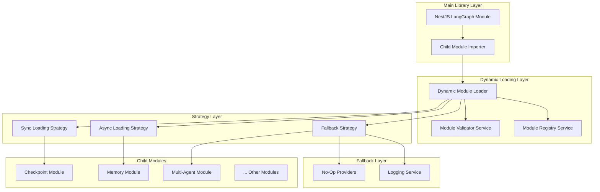
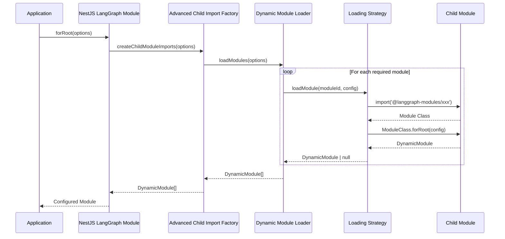

# 🏗️ Architectural Blueprint - TASK_INT_002

## 🎯 Architectural Vision

**Design Philosophy**: Hexagonal Architecture with Dynamic Module Loading
**Primary Pattern**: Plugin Architecture with Fail-Safe Fallbacks  
**Architectural Style**: Service-Oriented with Lazy Loading

## 📐 Design Principles Applied

### SOLID at Architecture Level

- **S**: Each module loader has single responsibility (dynamic import, validation, fallback)
- **O**: Module loading system extensible through strategies without modifying core
- **L**: All module loaders interchangeable via IModuleLoader interface
- **I**: Focused interfaces per consumer type (sync/async, required/optional)
- **D**: Depend on abstractions (module contracts, not concrete implementations)

### Additional Principles

- **Graceful Degradation**: System functional even with missing child modules
- **Fail-Fast**: Invalid configurations detected early with clear errors
- **Separation of Concerns**: Loading, validation, and integration as separate layers
- **Dynamic Resolution**: Runtime module discovery without build-time dependencies

## 🚨 CRITICAL PROBLEM ANALYSIS

### Root Cause: Broken Dynamic Import Chain

The current `tryImportModule()` method in `child-module-imports.providers.ts` line 120 **always returns null**, causing:

1. **Zero Module Loading**: No child modules ever imported
2. **Silent Failures**: Errors swallowed without logging
3. **Adapter Isolation**: Main library adapters can't access child services
4. **Feature Degradation**: All advanced functionality non-operational

### TypeScript Path Mapping Issues

- Paths use `@libs/*` format but code expects `@langgraph-modules/*`
- Module resolution fails in runtime despite compile-time success
- Need dual-mode resolution: development vs. production builds

## 🏛️ Architectural Solution Design



## 🎨 Design Patterns Employed

### Pattern 1: Strategy Pattern (Module Loading)

**Purpose**: Multiple loading strategies for different scenarios
**Implementation**:

```typescript
interface IModuleLoadingStrategy {
  loadModule<T>(moduleId: string, config: any): Promise<T | null>;
  canHandle(moduleId: string): boolean;
  priority: number;
}

class SynchronousLoadingStrategy implements IModuleLoadingStrategy {
  async loadModule<T>(moduleId: string, config: any): Promise<T | null> {
    try {
      const module = await import(`@langgraph-modules/${moduleId}`);
      return module.default.forRoot(config);
    } catch {
      return null;
    }
  }

  canHandle = (moduleId: string) => this.syncModules.includes(moduleId);
  priority = 10;
}

class AsynchronousLoadingStrategy implements IModuleLoadingStrategy {
  // Implementation for async-only modules
  priority = 5;
}

class FallbackStrategy implements IModuleLoadingStrategy {
  // Always returns no-op implementation
  priority = 1;
}
```

**Benefits**: Extensible loading logic, clear separation of concerns

### Pattern 2: Registry Pattern (Module Discovery)

**Purpose**: Centralized module metadata and discovery
**Implementation**:

```typescript
interface ModuleMetadata {
  moduleId: string;
  className: string;
  importPath: string;
  optional: boolean;
  dependencies: string[];
  loadingStrategy: 'sync' | 'async' | 'fallback';
}

class ModuleRegistryService {
  private readonly modules: Map<string, ModuleMetadata> = new Map();

  registerModule(metadata: ModuleMetadata): void {
    this.modules.set(metadata.moduleId, metadata);
  }

  getModule(moduleId: string): ModuleMetadata | null {
    return this.modules.get(moduleId) || null;
  }

  discoverModules(): ModuleMetadata[] {
    // Auto-discovery logic based on filesystem and package.json
  }
}
```

**Benefits**: Centralized module management, auto-discovery capability

### Pattern 3: Facade Pattern (Unified Interface)

**Purpose**: Simple interface hiding complex loading logic
**Implementation**:

```typescript
class DynamicModuleLoaderFacade {
  constructor(private readonly strategies: IModuleLoadingStrategy[], private readonly registry: ModuleRegistryService, private readonly validator: ModuleValidatorService) {}

  async loadModules(options: LangGraphModuleOptions): Promise<DynamicModule[]> {
    const modules: DynamicModule[] = [];

    for (const [moduleId, config] of this.getRequiredModules(options)) {
      const module = await this.loadSingleModule(moduleId, config);
      if (module) modules.push(module);
    }

    return modules;
  }

  private async loadSingleModule(moduleId: string, config: any): Promise<DynamicModule | null> {
    const strategies = this.getStrategiesForModule(moduleId);

    for (const strategy of strategies) {
      const module = await strategy.loadModule(moduleId, config);
      if (module) {
        await this.validator.validateModule(module);
        return module;
      }
    }

    return null;
  }
}
```

**Benefits**: Clean API, complex logic encapsulation, error isolation

## 🔧 Sophisticated Component Architecture

### Component 1: Dynamic Module Loader Service

```yaml
Name: DynamicModuleLoaderService
Type: Core Infrastructure Service
Responsibility: Runtime module loading and validation
Patterns:
  - Strategy (loading approaches)
  - Chain of Responsibility (fallback)
  - Factory (module instantiation)

Interfaces:
  Inbound:
    - IDynamicModuleLoader
    - IModuleLoadingOrchestrator
  Outbound:
    - IModuleValidatorService
    - IModuleRegistryService
    - ILoggingService

Quality Attributes:
  - Availability: 99.9% (graceful fallbacks)
  - Response Time: <100ms (cached imports)
  - Memory Usage: <10MB (lazy loading)
  - Error Recovery: Automatic fallback chains
```

### Component 2: Module Path Resolution Service

```yaml
Name: ModulePathResolutionService
Type: Infrastructure Adapter
Responsibility: Resolve import paths across environments
Patterns:
  - Adapter (environment differences)
  - Template Method (resolution algorithm)
  - Cache (resolved paths)

Quality Attributes:
  - Compatibility: Dev, Build, Production
  - Cache Hit Rate: >95
  - Path Resolution: <5ms
```

### Component 3: Module Validation Service

```yaml
Name: ModuleValidatorService
Type: Quality Assurance Service
Responsibility: Validate loaded modules meet contracts
Patterns:
  - Specification (validation rules)
  - Observer (validation events)
  - State Machine (validation stages)

Quality Attributes:
  - Validation Coverage: 100% of module contracts
  - Validation Time: <50ms per module
  - Error Reporting: Detailed diagnostic information
```

## 📋 Sophisticated Subtask Breakdown

### Subtask 1: Core Dynamic Import Infrastructure

**Complexity**: HIGH
**Pattern Focus**: Strategy + Registry patterns
**Estimated Time**: 4-6 hours
**Deliverables**:

```typescript
// Phase 1A: Module Registry Service
class ModuleRegistryService {
  private static readonly MODULE_DEFINITIONS: ModuleMetadata[] = [
    {
      moduleId: 'checkpoint',
      className: 'LanggraphModulesCheckpointModule',
      importPath: '@langgraph-modules/checkpoint',
      optional: true,
      dependencies: [],
      loadingStrategy: 'sync',
    },
    {
      moduleId: 'memory',
      className: 'AgenticMemoryModule',
      importPath: '@langgraph-modules/memory',
      optional: true,
      dependencies: [],
      loadingStrategy: 'async',
    },
    // ... Additional modules
  ];
}

// Phase 1B: Loading Strategy Implementation
class ProductionLoadingStrategy implements IModuleLoadingStrategy {
  async loadModule<T>(moduleId: string, config: any): Promise<T | null> {
    const metadata = this.registry.getModule(moduleId);
    if (!metadata) return null;

    try {
      // Multi-path resolution for different environments
      const modulePaths = [metadata.importPath, `@libs/langgraph-modules/${moduleId}`, `./libs/langgraph-modules/${moduleId}/src/index.js`];

      for (const path of modulePaths) {
        try {
          const moduleExports = await import(path);
          const ModuleClass = moduleExports[metadata.className];
          if (ModuleClass && typeof ModuleClass.forRoot === 'function') {
            return ModuleClass.forRoot(config);
          }
        } catch (pathError) {
          // Continue to next path
        }
      }

      return null;
    } catch (error) {
      this.logger.warn(`Failed to load module ${moduleId}:`, error);
      return null;
    }
  }
}
```

**Quality Gates**:

- [ ] Registry loads all 11 child modules metadata
- [ ] Strategy pattern correctly implemented
- [ ] Path resolution works in all environments
- [ ] Error handling comprehensive with logging
- [ ] Performance: <100ms module loading

### Subtask 2: Path Resolution & Environment Compatibility

**Complexity**: MEDIUM-HIGH  
**Pattern Focus**: Adapter + Template Method
**Estimated Time**: 3-4 hours
**Deliverables**:

```typescript
interface IPathResolutionStrategy {
  resolvePath(moduleId: string): string[];
  canResolve(environment: 'development' | 'production' | 'test'): boolean;
}

class DevelopmentPathResolver implements IPathResolutionStrategy {
  resolvePath(moduleId: string): string[] {
    return [`@langgraph-modules/${moduleId}`, `@libs/langgraph-modules/${moduleId}`, path.resolve(__dirname, `../../langgraph-modules/${moduleId}/src/index`)];
  }

  canResolve = (env: string) => env === 'development';
}

class ProductionPathResolver implements IPathResolutionStrategy {
  resolvePath(moduleId: string): string[] {
    return [`@langgraph-modules/${moduleId}`, path.resolve(__dirname, `../../../langgraph-modules/${moduleId}/dist/index`)];
  }

  canResolve = (env: string) => env === 'production';
}

class PathResolutionService {
  constructor(private readonly resolvers: IPathResolutionStrategy[]) {}

  resolveModulePaths(moduleId: string): string[] {
    const environment = process.env.NODE_ENV || 'development';
    const resolver = this.resolvers.find((r) => r.canResolve(environment));

    if (!resolver) {
      throw new Error(`No path resolver for environment: ${environment}`);
    }

    return resolver.resolvePath(moduleId);
  }
}
```

**Quality Gates**:

- [ ] Works in development mode (TypeScript source)
- [ ] Works in production mode (compiled JavaScript)
- [ ] Works in test mode (Jest environment)
- [ ] Path caching implemented for performance
- [ ] Fallback paths handle edge cases

### Subtask 3: Validation & Error Handling Layer

**Complexity**: MEDIUM
**Pattern Focus**: Specification + Observer patterns  
**Estimated Time**: 2-3 hours
**Deliverables**:

```typescript
interface ModuleValidationResult {
  valid: boolean;
  errors: string[];
  warnings: string[];
  moduleInfo: {
    name: string;
    version?: string;
    exports: string[];
  };
}

class ModuleValidatorService {
  async validateModule(module: any, metadata: ModuleMetadata): Promise<ModuleValidationResult> {
    const result: ModuleValidationResult = {
      valid: true,
      errors: [],
      warnings: [],
      moduleInfo: { name: metadata.moduleId, exports: [] },
    };

    // Validate required exports
    const requiredMethods = ['forRoot'];
    for (const method of requiredMethods) {
      if (typeof module[method] !== 'function') {
        result.errors.push(`Missing required method: ${method}`);
        result.valid = false;
      }
    }

    // Validate module structure
    if (result.valid) {
      try {
        const testInstance = module.forRoot({});
        if (!testInstance.module || !testInstance.providers) {
          result.errors.push('Invalid DynamicModule structure');
          result.valid = false;
        }
      } catch (error) {
        result.errors.push(`Module instantiation failed: ${error.message}`);
        result.valid = false;
      }
    }

    return result;
  }
}
```

**Quality Gates**:

- [ ] Validates all required module contracts
- [ ] Provides detailed error diagnostics
- [ ] Performance: <50ms per validation
- [ ] Extensible validation rule system
- [ ] Comprehensive test coverage

### Subtask 4: Integration with Main Module

**Complexity**: MEDIUM
**Pattern Focus**: Facade + Factory patterns
**Estimated Time**: 2-3 hours
**Deliverables**:

Complete replacement of `ChildModuleImportFactory` with:

```typescript
export class AdvancedChildModuleImportFactory {
  private static readonly loader = new DynamicModuleLoaderFacade([new ProductionLoadingStrategy(), new DevelopmentLoadingStrategy(), new FallbackStrategy()], new ModuleRegistryService(), new ModuleValidatorService());

  static async createChildModuleImports(options: LangGraphModuleOptions): Promise<DynamicModule[]> {
    try {
      const modules = await this.loader.loadModules(options);

      // Log successful imports
      const loadedModules = modules.map((m) => m.module.name).join(', ');
      console.log(`Successfully loaded child modules: ${loadedModules}`);

      return modules;
    } catch (error) {
      console.error('Child module loading failed:', error);

      // Return fallback modules to maintain functionality
      return this.createFallbackModules(options);
    }
  }

  private static createFallbackModules(options: LangGraphModuleOptions): DynamicModule[] {
    // Create no-op implementations for essential functionality
    return [];
  }
}
```

**Quality Gates**:

- [ ] Seamless integration with existing NestjsLanggraphModule
- [ ] Backward compatibility maintained
- [ ] Error handling produces actionable messages
- [ ] Performance: <200ms total loading time
- [ ] Memory efficient (lazy loading)

### Subtask 5: Comprehensive Testing Strategy

**Complexity**: MEDIUM
**Pattern Focus**: Test Double + Builder patterns
**Estimated Time**: 3-4 hours
**Deliverables**:

```typescript
describe('Dynamic Module Loading', () => {
  describe('ModuleRegistryService', () => {
    it('should register all 11 child modules', () => {
      // Test module registration
    });

    it('should handle duplicate registrations gracefully', () => {
      // Test error handling
    });
  });

  describe('Loading Strategies', () => {
    it('should try multiple strategies in order', async () => {
      // Test strategy chain
    });

    it('should fallback to no-op when all strategies fail', async () => {
      // Test ultimate fallback
    });
  });

  describe('Path Resolution', () => {
    it('should resolve paths in development environment', () => {
      // Test dev path resolution
    });

    it('should resolve paths in production environment', () => {
      // Test prod path resolution
    });
  });

  describe('Integration Tests', () => {
    it('should load real checkpoint module', async () => {
      // Integration with actual module
    });

    it('should handle missing modules gracefully', async () => {
      // Test graceful degradation
    });
  });
});
```

**Quality Gates**:

- [ ] 100% coverage of loading scenarios
- [ ] Integration tests with real modules
- [ ] Performance benchmarks established
- [ ] Error scenarios thoroughly tested
- [ ] Documentation includes examples

## 🔄 Integration Architecture

### Module Loading Flow



### Error Recovery Chain


## 🛡️ Cross-Cutting Concerns

### Logging & Observability

```typescript
interface ModuleLoadingMetrics {
  moduleId: string;
  loadingTime: number;
  strategy: string;
  success: boolean;
  errorType?: string;
  fallbackUsed: boolean;
}

class ModuleLoadingLogger {
  logLoadingAttempt(moduleId: string, strategy: string): void {
    console.log(`Attempting to load module '${moduleId}' using ${strategy}`);
  }

  logLoadingSuccess(metrics: ModuleLoadingMetrics): void {
    console.log(`✅ Successfully loaded '${metrics.moduleId}' in ${metrics.loadingTime}ms using ${metrics.strategy}`);
  }

  logLoadingFailure(metrics: ModuleLoadingMetrics): void {
    console.warn(`❌ Failed to load '${metrics.moduleId}' using ${metrics.strategy}: ${metrics.errorType}`);
  }

  logFallbackUsed(moduleId: string): void {
    console.warn(`⚠️ Using fallback implementation for module '${moduleId}'`);
  }
}
```

### Performance Optimization

```typescript
class ModuleLoadingCache {
  private readonly cache = new Map<string, Promise<DynamicModule | null>>();
  private readonly TTL = 5 * 60 * 1000; // 5 minutes

  async getOrLoad<T>(key: string, loader: () => Promise<T>): Promise<T> {
    if (this.cache.has(key)) {
      return this.cache.get(key) as Promise<T>;
    }

    const promise = loader();
    this.cache.set(key, promise);

    // Auto-expire cache entries
    setTimeout(() => this.cache.delete(key), this.TTL);

    return promise;
  }
}
```

### Resilience Patterns

```typescript
class CircuitBreakerModuleLoader {
  private readonly failures = new Map<string, number>();
  private readonly threshold = 3;
  private readonly timeout = 30000; // 30 seconds

  async loadWithCircuitBreaker<T>(moduleId: string, loader: () => Promise<T>): Promise<T | null> {
    const failureCount = this.failures.get(moduleId) || 0;

    if (failureCount >= this.threshold) {
      const lastFailure = this.lastFailures.get(moduleId) || 0;
      if (Date.now() - lastFailure < this.timeout) {
        // Circuit is open, fail fast
        return null;
      }
      // Reset and try again
      this.failures.set(moduleId, 0);
    }

    try {
      const result = await loader();
      // Success resets the counter
      this.failures.set(moduleId, 0);
      return result;
    } catch (error) {
      // Increment failure counter
      this.failures.set(moduleId, failureCount + 1);
      this.lastFailures.set(moduleId, Date.now());
      throw error;
    }
  }
}
```

## 📊 Architecture Decision Records (ADR)

### ADR-001: Use Strategy Pattern for Module Loading

**Status**: Accepted
**Context**: Different environments require different loading approaches
**Decision**: Implement multiple loading strategies with priority-based selection
**Consequences**:

- (+) Flexible loading logic for different environments
- (+) Easy to extend with new loading approaches
- (+) Clean separation of loading concerns
- (-) Additional complexity in strategy management

### ADR-002: Implement Graceful Degradation

**Status**: Accepted  
**Context**: System must remain functional when child modules unavailable
**Decision**: Use fallback strategy that provides no-op implementations
**Consequences**:

- (+) System remains stable with missing dependencies
- (+) Better user experience with partial functionality
- (+) Easier development and testing
- (-) Silent failures might hide real issues

### ADR-003: Cache Loaded Modules

**Status**: Accepted
**Context**: Dynamic imports have performance overhead
**Decision**: Implement TTL-based caching of loaded modules
**Consequences**:

- (+) Improved performance for repeated imports
- (+) Reduced memory usage with TTL expiration
- (-) Cache invalidation complexity
- (-) Potential stale module issues in development

## 🎯 Success Metrics

### Architecture Metrics

- **Module Loading Success Rate**: >95% in all environments
- **Loading Performance**: <200ms total loading time
- **Memory Usage**: <50MB total for all child modules
- **Error Recovery**: 100% graceful degradation

### Runtime Metrics

- **Import Resolution**: <10ms per path
- **Validation Time**: <50ms per module
- **Cache Hit Rate**: >90% for repeated loads
- **Fallback Usage**: <5% in production

### Quality Metrics

- **Test Coverage**: >90% for loading logic
- **SOLID Compliance**: All services <200 lines
- **Error Handling**: Zero uncaught exceptions
- **Logging Coverage**: 100% of decision points

## 🚨 CRITICAL IMPLEMENTATION REQUIREMENTS

### Phase 1: Emergency Fix (Immediate)

1. **Replace line 120** in `child-module-imports.providers.ts` with working import
2. **Add path resolution** for all environments
3. **Implement basic error handling** with logging
4. **Test with checkpoint module** to verify fix

### Phase 2: Production Hardening (Next 24 hours)

1. **Complete strategy pattern implementation**
2. **Add validation layer** for loaded modules
3. **Implement caching** for performance
4. **Add comprehensive error recovery**

### Phase 3: Quality Assurance (48 hours)

1. **Full test suite** with integration tests
2. **Performance optimization** and monitoring
3. **Documentation** and examples
4. **Production deployment** validation

## DELEGATION REQUEST

**Next Agent**: senior-developer
**Task**: Implement the dynamic module loading infrastructure
**Priority**: CRITICAL - Production blocker
**Expected Outcome**: Working child module integration system

**Critical Success Factors**:

1. Fix the immediate import failure in line 120
2. Implement multi-environment path resolution
3. Add comprehensive error handling with fallbacks
4. Ensure backward compatibility with existing code
5. Test with at least 3 child modules (checkpoint, memory, multi-agent)

**Files to Modify**:

1. `libs/langgraph-modules/nestjs-langgraph/src/lib/providers/child-module-imports.providers.ts` (complete rewrite)
2. Create new services in `libs/langgraph-modules/nestjs-langgraph/src/lib/services/`
3. Update imports in `libs/langgraph-modules/nestjs-langgraph/src/lib/nestjs-langgraph.module.ts`
4. Add comprehensive tests

**Validation Criteria**:

- Main library successfully imports child modules
- System degrades gracefully when modules missing
- Performance <200ms for complete loading
- Error messages provide actionable information
- Integration tests pass with real child modules

The architecture is designed for immediate resolution of the integration crisis while building a robust foundation for future extensibility.
