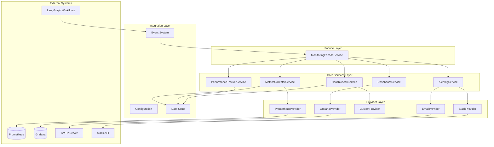

# 🏗️ Architectural Blueprint - TASK_INT_004

## 🎯 Architectural Vision

**Design Philosophy**: Event-Driven Observability with Domain-Driven Design
**Primary Pattern**: Hexagonal Architecture with Monitoring-Specific Adapters
**Architectural Style**: Layered Service-Oriented with Facade Pattern
**Integration Strategy**: Push-Pull Hybrid with Backend Agnostic Design

## 📐 Design Principles Applied

### SOLID at Architecture Level

- **Single Responsibility**: Each service manages one observability concern
- **Open/Closed**: Backend providers extensible through factory pattern
- **Liskov Substitution**: All monitoring backends implement common interfaces
- **Interface Segregation**: Focused interfaces per monitoring domain
- **Dependency Inversion**: Depend on monitoring abstractions, not implementations

### Monitoring-Specific Principles

- **Minimal Overhead**: <5% performance impact on host workflows
- **Backend Agnostic**: Support Prometheus, DataDog, custom backends
- **Graceful Degradation**: System continues if monitoring fails
- **Non-Invasive**: Monitoring doesn't affect core business logic
- **Real-Time Visibility**: Sub-second metric collection and alerting

## 🏛️ Architectural Diagram



## 🎨 Design Patterns Employed

### Pattern 1: Facade Pattern (MonitoringFacadeService)

**Purpose**: Unified interface for complex monitoring subsystem
**Implementation**:

```typescript
interface IMonitoringFacade {
  // Metrics operations
  recordMetric(name: string, value: number, tags?: MetricTags): Promise<void>;
  recordTimer(name: string, duration: number, tags?: MetricTags): Promise<void>;
  
  // Health operations  
  registerHealthCheck(name: string, check: HealthCheckFunction): Promise<void>;
  getSystemHealth(): Promise<HealthStatus>;
  
  // Alert operations
  createAlertRule(rule: AlertRule): Promise<string>;
  triggerAlert(alert: Alert): Promise<void>;
  
  // Dashboard operations
  getDashboardData(query: DashboardQuery): Promise<DashboardData>;
}
```

**Benefits**: Single entry point, simplified client integration, consistent API

### Pattern 2: Strategy Pattern (Backend Providers)

**Purpose**: Interchangeable monitoring backends
**Implementation**:

```typescript
interface MonitoringBackend {
  initialize(config: BackendConfig): Promise<void>;
  recordMetric(metric: Metric): Promise<void>;
  query(query: MetricQuery): Promise<MetricResult[]>;
  health(): Promise<boolean>;
}

class PrometheusBackend implements MonitoringBackend { }
class DataDogBackend implements MonitoringBackend { }
class CustomBackend implements MonitoringBackend { }
```

**Benefits**: Runtime backend selection, easy testing with mocks, vendor independence

### Pattern 3: Observer Pattern (Event-Driven Metrics)

**Purpose**: Non-invasive workflow monitoring
**Implementation**:

```typescript
interface WorkflowEventObserver {
  onWorkflowStarted(event: WorkflowStartedEvent): Promise<void>;
  onWorkflowCompleted(event: WorkflowCompletedEvent): Promise<void>;
  onNodeExecuted(event: NodeExecutedEvent): Promise<void>;
  onError(event: ErrorEvent): Promise<void>;
}
```

**Benefits**: Loose coupling, automatic metric collection, extensible monitoring

### Pattern 4: Factory Pattern (Provider Creation)

**Purpose**: Dynamic monitoring provider instantiation
**Implementation**:

```typescript
interface MonitoringProviderFactory {
  createMetricsProvider(type: string, config: ProviderConfig): MetricsProvider;
  createAlertProvider(type: string, config: ProviderConfig): AlertProvider;
  createHealthProvider(type: string, config: ProviderConfig): HealthProvider;
}
```

**Benefits**: Configuration-driven setup, type safety, dependency injection compatibility

### Pattern 5: Decorator Pattern (Automatic Instrumentation)

**Purpose**: Transparent performance monitoring
**Implementation**:

```typescript
@TrackPerformance({ 
  metricPrefix: 'workflow.node',
  trackMemory: true,
  alertThreshold: 30000 
})
async executeNode(state: WorkflowState): Promise<WorkflowState> {
  // Business logic - monitoring is transparent
}
```

**Benefits**: Zero-overhead abstraction, consistent instrumentation, optional activation

## 🔧 Component Architecture

### Component 1: MonitoringFacadeService

```yaml
Name: MonitoringFacadeService
Type: Facade Service
Responsibility: Unified monitoring interface and orchestration
Lines of Code: <150 (facade pattern keeps it minimal)

Patterns Applied:
  - Facade (primary)
  - Dependency Injection
  - Command Pattern (for complex operations)

Interfaces:
  Inbound:
    - IMonitoringFacade (main client interface)
    - IMonitoringOrchestrator (internal coordination)
  Outbound:  
    - IMetricsCollector
    - IAlertingService
    - IHealthCheck
    - IPerformanceTracker
    - IDashboard

Dependencies:
  - MetricsCollectorService
  - AlertingService  
  - HealthCheckService
  - PerformanceTrackerService
  - DashboardService
  - ConfigService (for backend configuration)

Quality Attributes:
  - Latency: <10ms method call overhead
  - Availability: 99.9% (must not block workflows)
  - Maintainability: Single point of change for client API
```

### Component 2: MetricsCollectorService

```yaml
Name: MetricsCollectorService
Type: Core Domain Service
Responsibility: Advanced metrics collection and aggregation
Lines of Code: <180

Patterns Applied:
  - Strategy (for different metric types)
  - Batch Processing (for performance)
  - Circuit Breaker (for backend failures)

Key Features:
  - Counter, Gauge, Histogram, Timer metrics
  - Metric tagging and labeling
  - Batch aggregation (configurable intervals)
  - Multiple backend support (Prometheus, custom)
  - Memory-efficient metric storage
  - Automatic metric pruning

Interfaces:
  Inbound:
    - IMetricsCollector (service interface)
    - IMetricsAggregator (batch processing)
  Outbound:
    - IMetricsBackend (backend abstraction)
    - IMetricsStorage (local storage)

Quality Attributes:
  - Throughput: 10,000+ metrics/minute
  - Memory: <100MB for 24h of metrics
  - Latency: <5ms per metric record
```

### Component 3: AlertingService

```yaml
Name: AlertingService  
Type: Core Business Service
Responsibility: Rule-based alerting and multi-channel notifications
Lines of Code: <190

Patterns Applied:
  - Rule Engine (for alert conditions)
  - Chain of Responsibility (for notification channels)
  - Rate Limiting (for alert cooldowns)

Key Features:
  - Configurable alert rules (threshold, trend, anomaly)
  - Multiple notification channels (email, Slack, webhook)
  - Alert grouping and deduplication
  - Escalation policies
  - Alert history and acknowledgment
  - Template-based alert formatting

Interfaces:
  Inbound:
    - IAlertingService (main interface)
    - IAlertRuleEngine (rule evaluation)
  Outbound:
    - INotificationProvider (channel abstraction)
    - IAlertStorage (alert history)

Quality Attributes:
  - Response Time: <30 seconds alert delivery
  - Reliability: 99.95% notification delivery
  - Scalability: Support for 1000+ alert rules
```

### Component 4: HealthCheckService

```yaml
Name: HealthCheckService
Type: Infrastructure Service  
Responsibility: System health monitoring and dependency validation
Lines of Code: <170

Patterns Applied:
  - Health Check (standardized pattern)
  - Composite (for aggregated health)
  - Timeout (for dependency checks)

Key Features:
  - Comprehensive dependency monitoring
  - Configurable health check intervals
  - Health status aggregation
  - Detailed failure reporting
  - Health history tracking
  - Integration with alerting system

Interfaces:
  Inbound:
    - IHealthCheckService (main interface)
    - IHealthRegistry (check registration)
  Outbound:
    - IHealthCheck (individual check interface)
    - IDependencyMonitor (external service checks)

Quality Attributes:
  - Availability: Must not fail if dependencies fail
  - Response Time: <5 seconds for full health check
  - Accuracy: 99.9% correct health assessment
```

### Component 5: PerformanceTrackerService

```yaml
Name: PerformanceTrackerService
Type: Analytics Service
Responsibility: Performance metrics analysis and anomaly detection
Lines of Code: <185

Patterns Applied:
  - Sliding Window (for trend analysis)
  - Statistical Analysis (for baselines)
  - Observer (for performance events)

Key Features:
  - Workflow execution performance tracking
  - Statistical baseline establishment
  - Anomaly detection (statistical and rule-based)
  - Performance trend analysis
  - Resource utilization monitoring
  - Capacity planning insights

Interfaces:
  Inbound:
    - IPerformanceTracker (main interface)
    - IPerformanceAnalyzer (analysis operations)
  Outbound:
    - IPerformanceStorage (metrics storage)
    - IStatisticalEngine (analysis algorithms)

Quality Attributes:
  - Accuracy: 95% anomaly detection precision
  - Latency: <100ms performance analysis
  - Storage: Efficient time-series data handling
```

### Component 6: DashboardService

```yaml
Name: DashboardService
Type: Presentation Service
Responsibility: Dashboard data aggregation and visualization support
Lines of Code: <160

Patterns Applied:
  - Query Builder (for metric queries)
  - Data Transformation (for visualization formats)
  - Caching (for performance)

Key Features:
  - Real-time dashboard data queries
  - Time-series data aggregation
  - Multiple visualization format support
  - Query optimization and caching
  - Dashboard configuration management
  - Export capabilities (JSON, CSV)

Interfaces:
  Inbound:
    - IDashboardService (main interface)
    - IDashboardQuery (query operations)
  Outbound:
    - IMetricsQuery (data retrieval)
    - IDashboardBackend (external dashboard systems)

Quality Attributes:
  - Response Time: <2 seconds for dashboard queries
  - Data Freshness: Real-time (< 30 second lag)
  - Scalability: Support for 50+ concurrent dashboards
```

## 📋 Sophisticated Subtask Breakdown

### Subtask 1: Core Interfaces and Type Definitions (Complexity: HIGH)

**Pattern Focus**: Interface Segregation and Type Safety
**Duration**: 2-3 hours
**Deliverables**:

```typescript
// Core monitoring interfaces
export interface IMonitoringFacade {
  recordMetric(name: string, value: number, tags?: MetricTags): Promise<void>;
  recordTimer(name: string, duration: number, tags?: MetricTags): Promise<void>;
  recordCounter(name: string, increment?: number, tags?: MetricTags): Promise<void>;
  recordGauge(name: string, value: number, tags?: MetricTags): Promise<void>;
  recordHistogram(name: string, value: number, tags?: MetricTags): Promise<void>;
  
  registerHealthCheck(name: string, check: HealthCheckFunction): Promise<void>;
  getSystemHealth(): Promise<HealthStatus>;
  getServiceHealth(serviceName: string): Promise<ServiceHealth>;
  
  createAlertRule(rule: AlertRule): Promise<string>;
  updateAlertRule(ruleId: string, updates: Partial<AlertRule>): Promise<void>;
  deleteAlertRule(ruleId: string): Promise<void>;
  getActiveAlerts(): Promise<Alert[]>;
  
  queryMetrics(query: MetricQuery): Promise<MetricData[]>;
  getDashboardData(dashboardId: string): Promise<DashboardData>;
  createDashboard(config: DashboardConfig): Promise<string>;
}

// Comprehensive type definitions
export interface MetricTags {
  [key: string]: string | number | boolean;
}

export interface Metric {
  name: string;
  type: MetricType;
  value: number;
  tags: MetricTags;
  timestamp: Date;
  unit?: string;
}

export type MetricType = 'counter' | 'gauge' | 'histogram' | 'timer' | 'summary';

export interface AlertRule {
  id: string;
  name: string;
  description: string;
  condition: AlertCondition;
  severity: AlertSeverity;
  channels: NotificationChannel[];
  cooldownPeriod: number;
  enabled: boolean;
  metadata?: Record<string, unknown>;
}

export interface HealthStatus {
  overall: HealthState;
  services: Record<string, ServiceHealth>;
  timestamp: Date;
  uptime: number;
}

export type HealthState = 'healthy' | 'degraded' | 'unhealthy';
```

**Quality Gates**:
- [ ] All interfaces follow ISP (Interface Segregation Principle)
- [ ] Zero 'any' types used
- [ ] Comprehensive type coverage for all monitoring domains
- [ ] TypeScript strict mode compliant

### Subtask 2: MonitoringFacadeService Implementation (Complexity: MEDIUM)

**Pattern Focus**: Facade Pattern with Dependency Injection
**Duration**: 3-4 hours
**Dependencies**: Subtask 1 (interfaces)
**Deliverables**:

```typescript
@Injectable()
export class MonitoringFacadeService implements IMonitoringFacade {
  constructor(
    private readonly metricsCollector: IMetricsCollector,
    private readonly alerting: IAlertingService,
    private readonly healthCheck: IHealthCheck,
    private readonly performance: IPerformanceTracker,
    private readonly dashboard: IDashboard,
    private readonly logger: Logger
  ) {}

  async recordMetric(name: string, value: number, tags?: MetricTags): Promise<void> {
    try {
      await this.metricsCollector.collect(name, value, tags);
      await this.performance.trackMetricCollection(name, value);
    } catch (error) {
      this.logger.error(`Failed to record metric ${name}:`, error);
      // Monitoring failures must not affect business logic
    }
  }

  async registerHealthCheck(name: string, check: HealthCheckFunction): Promise<void> {
    return this.healthCheck.register(name, check);
  }

  async createAlertRule(rule: AlertRule): Promise<string> {
    const ruleId = await this.alerting.createRule(rule);
    await this.recordMetric('monitoring.alert_rules.created', 1, {
      rule_name: rule.name,
      severity: rule.severity
    });
    return ruleId;
  }
}
```

**Quality Gates**:
- [ ] Service under 150 lines (facade should be minimal)
- [ ] All service calls wrapped in try-catch (monitoring can't break workflows)
- [ ] Proper error logging without re-throwing
- [ ] Interface compliance verified

### Subtask 3: MetricsCollectorService Implementation (Complexity: HIGH)

**Pattern Focus**: Strategy Pattern for Backend Flexibility
**Duration**: 4-5 hours  
**Dependencies**: Subtask 1, 2
**Deliverables**:

```typescript
@Injectable()
export class MetricsCollectorService implements IMetricsCollector {
  private readonly backends = new Map<string, IMetricsBackend>();
  private readonly metricBuffer = new Map<string, Metric[]>();
  private readonly batchConfig: BatchConfig;

  constructor(
    private readonly config: MonitoringConfig,
    private readonly logger: Logger
  ) {
    this.batchConfig = {
      maxBatchSize: config.metrics?.batchSize || 100,
      flushInterval: config.metrics?.flushInterval || 30000,
      maxBufferSize: config.metrics?.maxBufferSize || 10000
    };
    this.initializeBackends();
    this.startBatchProcessor();
  }

  async collect(name: string, value: number, tags?: MetricTags): Promise<void> {
    const metric: Metric = {
      name,
      type: this.inferMetricType(name),
      value,
      tags: tags || {},
      timestamp: new Date()
    };

    // Buffer for batch processing
    await this.bufferMetric(metric);
    
    // Record collection performance
    await this.recordCollectionMetrics(metric);
  }

  private async bufferMetric(metric: Metric): Promise<void> {
    const buffer = this.metricBuffer.get(metric.name) || [];
    buffer.push(metric);
    
    if (buffer.length > this.batchConfig.maxBatchSize) {
      await this.flushBuffer(metric.name, buffer);
      this.metricBuffer.set(metric.name, []);
    } else {
      this.metricBuffer.set(metric.name, buffer);
    }
  }

  private async flushBuffer(metricName: string, metrics: Metric[]): Promise<void> {
    const promises = Array.from(this.backends.values()).map(backend =>
      this.safeBackendOperation(() => backend.recordBatch(metrics))
    );
    
    await Promise.allSettled(promises);
  }

  private async safeBackendOperation<T>(operation: () => Promise<T>): Promise<T | null> {
    try {
      return await operation();
    } catch (error) {
      this.logger.warn('Backend operation failed:', error);
      return null;
    }
  }
}
```

**Quality Gates**:
- [ ] Service under 180 lines
- [ ] Batch processing implemented for performance
- [ ] All backend operations wrapped in error handling
- [ ] Memory usage controlled (buffer limits)
- [ ] Performance overhead measured and documented

### Subtask 4: AlertingService Implementation (Complexity: HIGH)

**Pattern Focus**: Rule Engine with Chain of Responsibility
**Duration**: 4-5 hours
**Dependencies**: Subtasks 1-3
**Deliverables**:

```typescript
@Injectable()
export class AlertingService implements IAlertingService {
  private readonly rules = new Map<string, AlertRule>();
  private readonly cooldowns = new Map<string, Date>();
  private readonly notificationChain = new Map<string, INotificationProvider>();

  constructor(
    private readonly metricsQuery: IMetricsQuery,
    private readonly config: MonitoringConfig,
    private readonly logger: Logger
  ) {
    this.initializeNotificationProviders();
    this.startRuleEvaluator();
  }

  async createRule(rule: AlertRule): Promise<string> {
    this.validateRule(rule);
    this.rules.set(rule.id, rule);
    
    this.logger.info(`Alert rule created: ${rule.name}`, {
      ruleId: rule.id,
      severity: rule.severity,
      channels: rule.channels.length
    });
    
    return rule.id;
  }

  @Interval(30000) // Evaluate every 30 seconds
  private async evaluateRules(): Promise<void> {
    const activeRules = Array.from(this.rules.values()).filter(rule => rule.enabled);
    
    for (const rule of activeRules) {
      try {
        const shouldAlert = await this.evaluateRule(rule);
        
        if (shouldAlert && !this.isInCooldown(rule.id)) {
          await this.triggerAlert(rule);
          this.setCooldown(rule.id, rule.cooldownPeriod);
        }
      } catch (error) {
        this.logger.error(`Rule evaluation failed for ${rule.name}:`, error);
      }
    }
  }

  private async evaluateRule(rule: AlertRule): Promise<boolean> {
    const condition = rule.condition;
    const metricData = await this.metricsQuery.query({
      metric: condition.metric,
      timeRange: condition.timeWindow,
      aggregation: condition.aggregation
    });

    if (!metricData.length) return false;

    const value = this.aggregateMetricData(metricData, condition.aggregation);
    return this.evaluateCondition(value, condition);
  }

  private async triggerAlert(rule: AlertRule): Promise<void> {
    const alert: Alert = {
      id: this.generateAlertId(),
      ruleId: rule.id,
      name: rule.name,
      severity: rule.severity,
      message: await this.formatAlertMessage(rule),
      timestamp: new Date(),
      metadata: await this.gatherAlertContext(rule)
    };

    // Send to all configured channels
    const notificationPromises = rule.channels.map(channelName => {
      const provider = this.notificationChain.get(channelName);
      return provider ? this.safeNotification(provider, alert) : Promise.resolve();
    });

    await Promise.allSettled(notificationPromises);
    
    this.logger.warn(`Alert triggered: ${alert.name}`, {
      alertId: alert.id,
      severity: alert.severity,
      channels: rule.channels
    });
  }
}
```

**Quality Gates**:
- [ ] Service under 190 lines
- [ ] Rule engine performs efficiently (<10ms per rule)
- [ ] All notification channels handle failures gracefully
- [ ] Cooldown mechanism prevents alert spam
- [ ] Alert context provides actionable information

### Subtask 5: HealthCheckService Implementation (Complexity: MEDIUM)

**Pattern Focus**: Composite Health Checks with Registry
**Duration**: 3-4 hours
**Dependencies**: Subtasks 1-4
**Deliverables**:

```typescript
@Injectable()
export class HealthCheckService implements IHealthCheck {
  private readonly healthChecks = new Map<string, HealthCheckFunction>();
  private readonly healthCache = new Map<string, ServiceHealth>();
  private readonly cacheTimeout = 30000; // 30 seconds

  constructor(
    private readonly alerting: IAlertingService,
    private readonly config: MonitoringConfig,
    private readonly logger: Logger
  ) {
    this.registerDefaultChecks();
    this.startHealthMonitoring();
  }

  async register(name: string, check: HealthCheckFunction): Promise<void> {
    this.healthChecks.set(name, check);
    this.logger.debug(`Health check registered: ${name}`);
  }

  async getSystemHealth(): Promise<HealthStatus> {
    const healthChecks = Array.from(this.healthChecks.entries());
    const healthResults = await Promise.allSettled(
      healthChecks.map(([name, check]) => this.executeHealthCheck(name, check))
    );

    const services: Record<string, ServiceHealth> = {};
    let overallState: HealthState = 'healthy';

    healthResults.forEach(([name, result], index) => {
      const serviceName = healthChecks[index][0];
      
      if (result.status === 'fulfilled') {
        services[serviceName] = result.value;
        if (result.value.state !== 'healthy') {
          overallState = overallState === 'healthy' ? result.value.state : 'unhealthy';
        }
      } else {
        services[serviceName] = {
          state: 'unhealthy',
          error: result.reason.message,
          lastCheck: new Date(),
          responseTime: 0
        };
        overallState = 'unhealthy';
      }
    });

    return {
      overall: overallState,
      services,
      timestamp: new Date(),
      uptime: process.uptime()
    };
  }

  private async executeHealthCheck(name: string, check: HealthCheckFunction): Promise<ServiceHealth> {
    const cachedHealth = this.healthCache.get(name);
    if (cachedHealth && this.isCacheValid(cachedHealth.lastCheck)) {
      return cachedHealth;
    }

    const startTime = Date.now();
    
    try {
      const isHealthy = await Promise.race([
        check(),
        this.timeout(5000) // 5 second timeout
      ]);

      const responseTime = Date.now() - startTime;
      const health: ServiceHealth = {
        state: isHealthy ? 'healthy' : 'degraded',
        lastCheck: new Date(),
        responseTime
      };

      this.healthCache.set(name, health);
      return health;
    } catch (error) {
      const health: ServiceHealth = {
        state: 'unhealthy',
        error: error.message,
        lastCheck: new Date(),
        responseTime: Date.now() - startTime
      };

      this.healthCache.set(name, health);
      return health;
    }
  }

  @Interval(60000) // Check every minute
  private async monitorSystemHealth(): Promise<void> {
    const health = await this.getSystemHealth();
    
    if (health.overall !== 'healthy') {
      await this.alerting.triggerSystemHealthAlert(health);
    }
  }
}
```

**Quality Gates**:
- [ ] Service under 170 lines
- [ ] Health checks complete within 5 seconds
- [ ] Caching prevents excessive health checking
- [ ] Failed health checks don't crash the service
- [ ] Integration with alerting system works correctly

### Subtask 6: PerformanceTrackerService and DashboardService (Complexity: MEDIUM)

**Pattern Focus**: Statistical Analysis and Query Optimization
**Duration**: 3-4 hours each
**Dependencies**: All previous subtasks
**Deliverables**: Similar detailed implementations following SOLID principles

## 🔄 Integration Architecture

### Event-Driven Monitoring Integration

```typescript
// Workflow event integration
@Injectable()
export class WorkflowMonitoringListener {
  constructor(private monitoring: IMonitoringFacade) {}

  @EventPattern('workflow.*.started')
  async onWorkflowStarted(event: WorkflowStartedEvent): Promise<void> {
    await this.monitoring.recordCounter('workflow.executions.started', 1, {
      workflowName: event.workflowName,
      threadId: event.threadId
    });
  }

  @EventPattern('workflow.*.completed')
  async onWorkflowCompleted(event: WorkflowCompletedEvent): Promise<void> {
    await this.monitoring.recordTimer('workflow.execution.duration', 
      event.duration, {
        workflowName: event.workflowName,
        success: event.success
      });
  }
}
```

### Backend Provider Integration

```typescript
// Prometheus backend implementation
@Injectable()
export class PrometheusBackend implements IMetricsBackend {
  private registry: prometheus.Registry;
  private metrics = new Map<string, prometheus.Metric>();

  async initialize(config: BackendConfig): Promise<void> {
    this.registry = new prometheus.Registry();
    prometheus.collectDefaultMetrics({ register: this.registry });
  }

  async recordBatch(metrics: Metric[]): Promise<void> {
    for (const metric of metrics) {
      const prometheusMetric = this.getOrCreateMetric(metric);
      this.updateMetric(prometheusMetric, metric);
    }
  }
}
```

## 🛡️ Cross-Cutting Concerns

### Error Handling Strategy

```typescript
// Monitoring must never break business logic
abstract class MonitoringServiceBase {
  protected async safeOperation<T>(
    operation: () => Promise<T>,
    fallback?: T
  ): Promise<T | undefined> {
    try {
      return await operation();
    } catch (error) {
      this.logger.warn('Monitoring operation failed:', error);
      return fallback;
    }
  }
}
```

### Configuration Management

```typescript
export interface MonitoringConfig {
  enabled: boolean;
  metrics: {
    backend: 'prometheus' | 'datadog' | 'custom';
    batchSize: number;
    flushInterval: number;
    retention: string;
  };
  alerting: {
    enabled: boolean;
    evaluationInterval: number;
    defaultCooldown: number;
    channels: NotificationChannelConfig[];
  };
  healthChecks: {
    enabled: boolean;
    interval: number;
    timeout: number;
  };
  performance: {
    trackingEnabled: boolean;
    anomalyDetection: boolean;
    baselineWindow: string;
  };
}
```

## 📊 Architecture Decision Records (ADR)

### ADR-001: Use Facade Pattern for Client Interface

**Status**: Accepted
**Context**: Multiple monitoring services need unified client interface
**Decision**: Implement MonitoringFacadeService as single entry point
**Consequences**:
- (+) Simplified client integration
- (+) Consistent error handling
- (-) Additional layer of abstraction

### ADR-002: Event-Driven Metric Collection

**Status**: Accepted  
**Context**: Non-invasive workflow monitoring required
**Decision**: Use NestJS event system for automatic metric collection
**Consequences**:
- (+) Zero code changes to existing workflows
- (+) Loose coupling between monitoring and business logic
- (-) Potential event processing overhead

### ADR-003: Backend-Agnostic Architecture

**Status**: Accepted
**Context**: Multiple monitoring backends needed (Prometheus, DataDog, etc.)
**Decision**: Abstract backend implementations behind interfaces
**Consequences**:
- (+) Vendor independence
- (+) Easy testing with mocks
- (-) Additional abstraction complexity

## 🎯 Success Metrics

### Technical Metrics

- **Performance Overhead**: <5% impact on workflow execution
- **Throughput**: 10,000+ metrics per minute handling
- **Response Time**: <100ms for facade operations
- **Memory Usage**: <100MB for 24 hours of metrics
- **Error Rate**: <0.1% monitoring operation failures

### Quality Metrics

- **Code Coverage**: 80% minimum
- **Service Size**: All services <200 lines
- **Type Safety**: Zero 'any' types
- **SOLID Compliance**: All principles verified
- **Documentation**: Complete interface documentation

## 🚀 Implementation Strategy

### Phase 1: Foundation (Subtasks 1-2)
- Core interfaces and type definitions
- MonitoringFacadeService implementation
- **Duration**: 5-7 hours

### Phase 2: Core Services (Subtasks 3-4)
- MetricsCollectorService with batching
- AlertingService with rule engine
- **Duration**: 8-10 hours

### Phase 3: Supporting Services (Subtasks 5-6)
- HealthCheckService with dependency monitoring
- PerformanceTrackerService with anomaly detection
- DashboardService with query optimization
- **Duration**: 6-9 hours

### Phase 4: Integration & Testing
- Backend provider implementations
- Integration tests with real monitoring systems
- Performance testing under load
- **Duration**: 4-6 hours

## DELEGATION REQUEST

**Next Agent**: senior-developer
**Task**: Implement core monitoring interfaces and MonitoringFacadeService
**Expected Outcome**: 
- Complete interfaces/monitoring.interface.ts with all types
- Functional MonitoringFacadeService under 150 lines
- Provider configuration following NestJS patterns
- Full TypeScript safety (zero 'any' types)

**Critical Success Factors**:
1. Follow exact SOLID principles outlined above
2. Use Checkpoint module as architectural reference
3. Maintain <5% performance overhead requirement
4. Ensure graceful degradation (monitoring failures don't break workflows)

**Files to Create/Update**:
- `libs/langgraph-modules/monitoring/src/lib/interfaces/monitoring.interface.ts`
- `libs/langgraph-modules/monitoring/src/lib/core/monitoring-facade.service.ts`
- `libs/langgraph-modules/monitoring/src/lib/langgraph-modules/monitoring.module.ts`

The architecture is designed for production-grade observability with enterprise-level scalability and reliability.