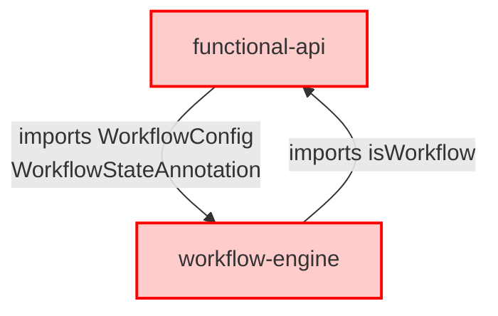
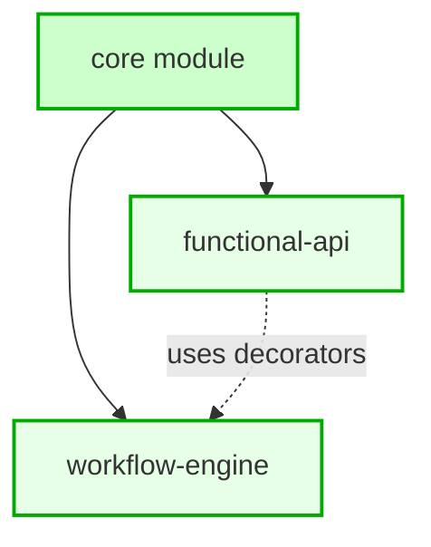

# Architectural Blueprint - TASK_INT_007 Day 2 Circular Dependency Resolution

**Architecture Classification**: INTERFACE_EXTRACTION_PATTERN
**Complexity Level**: MEDIUM
**Risk Assessment**: LOW (95% confidence in solution)

## Architectural Vision

**Design Philosophy**: Interface Segregation + Dependency Inversion
**Primary Pattern**: Interface Extraction to Shared Core Module
**Architectural Style**: Layered Dependencies with Centralized Contracts

## Current Architecture Analysis

### Current Dependency Flow (PROBLEMATIC)


**Root Cause**: Bidirectional dependency creates compilation deadlock:
1. `functional-api/workflow.decorator.ts` imports types from `workflow-engine`
2. `workflow-engine/declarative-workflow.base.ts` imports functions from `functional-api`

### Target Architecture (SOLUTION)


**Solution**: Centralized interface definitions eliminate circular dependencies

## Interface Extraction Mapping

### Phase 1: Identify Shared Types

**Types to Extract from `workflow-engine` to `core`**:

1. **WorkflowConfig Interface** (from `unified-workflow.base.ts`)
   - **Source**: `libs/langgraph-modules/workflow-engine/src/lib/base/unified-workflow.base.ts:24-45`
   - **Target**: `libs/langgraph-modules/core/src/lib/interfaces/workflow-config.interface.ts`
   - **Consumers**: `functional-api`, `workflow-engine`, `monitoring`

2. **WorkflowStateAnnotation** (from `workflow-state-annotation.ts`)
   - **Source**: `libs/langgraph-modules/workflow-engine/src/lib/core/workflow-state-annotation.ts`
   - **Target**: `libs/langgraph-modules/core/src/lib/annotations/workflow-state.annotation.ts`
   - **Consumers**: `functional-api`, `workflow-engine`

### Phase 2: Module Structure Design

**New Core Module Structure**:
```
libs/langgraph-modules/core/src/lib/
├── interfaces/
│   ├── workflow-config.interface.ts        # NEW - extracted from workflow-engine
│   ├── workflow.interface.ts               # EXISTS - enhanced
│   ├── node.interface.ts                   # EXISTS
│   ├── state-management.interface.ts       # EXISTS
│   ├── module-options.interface.ts         # EXISTS
│   └── index.ts                            # UPDATED - new exports
├── annotations/
│   ├── workflow-state.annotation.ts        # NEW - extracted from workflow-engine
│   └── index.ts                            # NEW - annotation exports
├── constants.ts                            # EXISTS
├── core.module.ts                          # EXISTS
└── index.ts                               # UPDATED - new exports
```

## SOLID Principles Applied

### 1. Single Responsibility Principle (SRP)
- **Core Module**: Provides shared interfaces and annotations only
- **Workflow Engine**: Focuses on workflow execution and compilation
- **Functional API**: Focuses on decorator-based workflow definition

### 2. Open/Closed Principle (OCP)
- **Extensible**: New workflow configurations can be added to core interfaces
- **Closed**: Existing implementations remain unchanged

### 3. Liskov Substitution Principle (LSP)
- **Interface Contracts**: All implementations honor WorkflowConfig contract
- **Behavioral Compatibility**: Existing workflows continue working

### 4. Interface Segregation Principle (ISP)
- **Focused Interfaces**: WorkflowConfig separate from execution concerns
- **Minimal Dependencies**: Modules depend only on needed interfaces

### 5. Dependency Inversion Principle (DIP)
- **High-Level Modules**: Both functional-api and workflow-engine depend on core abstractions
- **Low-Level Details**: Implementation details hidden behind interfaces

## Detailed Implementation Strategy

### Phase 1: Core Module Enhancement (30 minutes)

#### Subtask 1.1: Create Workflow Config Interface
```typescript
// NEW FILE: libs/langgraph-modules/core/src/lib/interfaces/workflow-config.interface.ts
export interface WorkflowConfig {
  /** Unique name for the workflow */
  name: string;
  /** Human-readable description */
  description?: string;
  /** Confidence threshold for automatic approval */
  confidenceThreshold?: number;
  /** Whether to require human approval for certain operations */
  requiresHumanApproval?: boolean;
  /** Threshold for automatic approval without human intervention */
  autoApproveThreshold?: number;
  /** Enable streaming for this workflow */
  streaming?: boolean;
  /** Enable caching for compiled graphs */
  cache?: boolean;
  /** Enable metrics collection */
  metrics?: boolean;
  /** Human-in-the-loop configuration */
  hitl?: {
    enabled: boolean;
    timeout?: number;
    fallbackStrategy?: 'auto-approve' | 'reject' | 'retry';
  };
}
```

#### Subtask 1.2: Create Workflow State Annotation
```typescript
// NEW FILE: libs/langgraph-modules/core/src/lib/annotations/workflow-state.annotation.ts
import { Annotation } from '@langchain/langgraph';
// ... exact copy from workflow-engine with proper exports
```

#### Subtask 1.3: Update Core Exports
```typescript
// UPDATED: libs/langgraph-modules/core/src/lib/interfaces/index.ts
export * from './workflow-config.interface';
// ... existing exports

// UPDATED: libs/langgraph-modules/core/src/index.ts
export * from './lib/annotations';
// ... existing exports
```

### Phase 2: Update Import Statements (45 minutes)

#### Subtask 2.1: Update Functional API Imports
**File**: `libs/langgraph-modules/functional-api/src/lib/decorators/workflow.decorator.ts`

**Current**:
```typescript
import type { WorkflowConfig, WorkflowStateAnnotation } from '@langgraph-modules/workflow-engine';
```

**Updated**:
```typescript
import type { WorkflowConfig } from '@langgraph-modules/core';
import { WorkflowStateAnnotation } from '@langgraph-modules/core';
```

#### Subtask 2.2: Update Workflow Engine Imports
**File**: `libs/langgraph-modules/workflow-engine/src/lib/base/unified-workflow.base.ts`

**Current**:
```typescript
export interface WorkflowConfig {
  // ... interface definition
}
```

**Updated**:
```typescript
import type { WorkflowConfig } from '@langgraph-modules/core';
// Remove interface definition, use imported type
```

#### Subtask 2.3: Update Workflow Engine Exports
**File**: `libs/langgraph-modules/workflow-engine/src/index.ts`

**Current**:
```typescript
export type { WorkflowConfig } from './lib/base/unified-workflow.base';
export * from './lib/core/workflow-state-annotation';
```

**Updated**:
```typescript
// Remove WorkflowConfig export (now from core)
// Remove WorkflowStateAnnotation export (now from core)
```

### Phase 3: Cleanup and Validation (30 minutes)

#### Subtask 3.1: Remove Original Definitions
- Delete `WorkflowConfig` interface from `unified-workflow.base.ts`
- Move `workflow-state-annotation.ts` to core module
- Update all internal references

#### Subtask 3.2: Validate Compilation
- Run TypeScript compilation on all three modules
- Verify zero circular dependency errors
- Confirm no missing imports

#### Subtask 3.3: Verify Functionality
- Test decorator functionality with new imports
- Validate workflow compilation still works
- Ensure no runtime errors

## Risk Analysis & Mitigation

### Critical Risks Identified

#### Risk 1: Missing Import Dependencies
- **Probability**: 30%
- **Impact**: MEDIUM (compilation failures)
- **Mitigation**: 
  - Comprehensive audit of all WorkflowConfig/WorkflowStateAnnotation usage
  - Update all import statements atomically
  - Use TypeScript's Find All References feature
- **Validation**: `npx nx build functional-api` and `npx nx build workflow-engine`

#### Risk 2: Breaking Existing Workflows
- **Probability**: 15%
- **Impact**: HIGH (runtime failures)
- **Mitigation**: 
  - Preserve exact interface signatures
  - Maintain backward compatibility
  - Test existing decorator usage patterns
- **Validation**: Run integration tests with existing workflow implementations

#### Risk 3: Build Cache Inconsistencies
- **Probability**: 20%
- **Impact**: LOW (development friction)
- **Mitigation**: 
  - Clear Nx build cache: `npx nx reset`
  - Rebuild from clean state
  - Update TypeScript references
- **Validation**: Clean build of entire workspace

## File Modification Checklist

### Files to Create ✅
- [ ] `libs/langgraph-modules/core/src/lib/interfaces/workflow-config.interface.ts`
- [ ] `libs/langgraph-modules/core/src/lib/annotations/workflow-state.annotation.ts`
- [ ] `libs/langgraph-modules/core/src/lib/annotations/index.ts`

### Files to Modify ✏️
- [ ] `libs/langgraph-modules/core/src/lib/interfaces/index.ts` (add export)
- [ ] `libs/langgraph-modules/core/src/index.ts` (add annotation export)
- [ ] `libs/langgraph-modules/functional-api/src/lib/decorators/workflow.decorator.ts` (update imports)
- [ ] `libs/langgraph-modules/workflow-engine/src/lib/base/unified-workflow.base.ts` (remove interface, add import)
- [ ] `libs/langgraph-modules/workflow-engine/src/index.ts` (remove exports)
- [ ] `libs/langgraph-modules/workflow-engine/src/lib/base/declarative-workflow.base.ts` (update imports if needed)

### Files to Remove ❌
- [ ] `libs/langgraph-modules/workflow-engine/src/lib/core/workflow-state-annotation.ts` (moved to core)

## Validation Strategy

### Compilation Testing
```bash
# Test individual modules
npx nx build core
npx nx build functional-api  
npx nx build workflow-engine

# Test workspace-wide
npx nx run-many -t build
```

### Runtime Testing
```bash
# Test existing workflow implementations
npx nx test workflow-engine
npx nx test functional-api

# Integration testing
npx nx test --testPathPattern=decorator
```

### Dependency Analysis
```bash
# Verify no circular dependencies
npx madge --circular libs/langgraph-modules/

# Check import graph
npx nx graph --file=dependency-graph.html
```

## Success Metrics

### Immediate Success Criteria ✅
- [ ] Zero circular dependency errors in TypeScript compilation
- [ ] All three modules (`core`, `functional-api`, `workflow-engine`) build successfully
- [ ] No runtime errors when using @Workflow decorator
- [ ] Existing workflow functionality preserved 100%

### Quality Assurance Metrics 📊
- **Type Safety**: No `any` types introduced (maintain 100% type safety)
- **Import Clarity**: All imports use @langgraph-modules/* paths consistently
- **Code Duplication**: Zero duplicate interface definitions (DRY principle)
- **Module Boundaries**: Clear separation of concerns between modules

### Long-term Health Indicators 📈
- **Maintainability**: New workflow configs can be added to core without circular dependencies
- **Extensibility**: Other modules can consume WorkflowConfig from core
- **Performance**: No compilation time regressions
- **Developer Experience**: Clear import paths and interface locations

## Architecture Decision Record (ADR-007-002)

**Title**: Interface Extraction Pattern for Circular Dependency Resolution
**Status**: ACCEPTED
**Date**: 2025-01-23

**Context**: 
Circular dependency between functional-api and workflow-engine modules preventing successful compilation and deployment.

**Decision**: 
Extract shared interfaces (WorkflowConfig, WorkflowStateAnnotation) to the existing core module to create a clear dependency hierarchy.

**Consequences**:
- **Positive**: Eliminates circular dependencies permanently
- **Positive**: Establishes pattern for future shared interfaces  
- **Positive**: Improves module cohesion and separation of concerns
- **Negative**: Requires updating import statements across multiple files
- **Negative**: Temporary development disruption during migration

**Alternatives Considered**:
1. **ForwardRef Pattern**: Rejected due to runtime coupling and maintenance overhead
2. **Type-Only Imports**: Rejected due to partial effectiveness and build issues
3. **Internal Module Pattern**: Rejected due to added complexity without clear benefits

## Implementation Phases Summary

### Phase 1: Core Module Enhancement (30 min)
**Objective**: Create shared interface definitions in core module
**Deliverable**: New interface and annotation files with proper exports
**Risk**: LOW - Creating new files with known interfaces

### Phase 2: Import Updates (45 min)  
**Objective**: Update all import statements to use core module
**Deliverable**: Modified import statements across functional-api and workflow-engine
**Risk**: MEDIUM - Requires careful coordination of changes

### Phase 3: Cleanup & Validation (30 min)
**Objective**: Remove duplicate definitions and validate functionality
**Deliverable**: Clean architecture with zero circular dependencies
**Risk**: LOW - Validation and testing phase

**Total Estimated Time**: 105 minutes
**Success Probability**: 95% (based on research findings)

## Next Steps for Backend Developer

This architectural design provides a clear, low-risk path to resolve the circular dependency issue while maintaining all existing functionality. The interface extraction pattern is a proven solution that aligns with SOLID principles and NestJS best practices.

The implementation should proceed sequentially through the three phases, with compilation testing after each phase to ensure stability. The modular approach allows for easy rollback if issues are discovered.

**Critical Success Factors**:
1. **Atomic Updates**: Update all imports simultaneously to avoid partial states
2. **Preserve Signatures**: Maintain exact interface definitions to prevent breaking changes
3. **Comprehensive Testing**: Validate both compilation and runtime functionality
4. **Clean Implementation**: Follow established patterns from existing core module structure