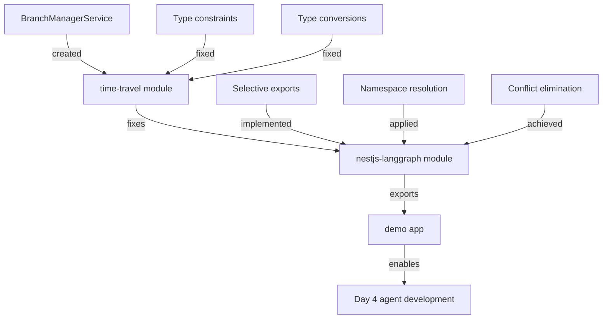

# 🏗️ Architectural Blueprint - TASK_INT_007 Day 3

## 🎯 Architectural Vision

**Design Philosophy**: Export Resolution & Module Boundary Management
**Primary Pattern**: Selective Export Strategy with Namespace Isolation
**Architectural Style**: Facade Pattern with Controlled Re-exports

## 📐 Design Principles Applied

### SOLID at Architecture Level
- **S**: Each module has single export responsibility  
- **O**: Export system extended through selective re-exports
- **L**: Module exports interchangeable via consistent interfaces
- **I**: Focused export interfaces per consumer type
- **D**: Depend on explicit imports, not wildcard exports

### Additional Principles
- **DRY**: Shared types in core module only
- **YAGNI**: No speculative re-exports  
- **KISS**: Direct imports over complex re-export chains
- **Separation of Concerns**: Clear export boundaries

## 🚨 CRITICAL ISSUES ANALYSIS

### Issue 1: Time-Travel Module TypeScript Errors (3 Critical)

**Root Cause**: Service architecture mismatch between design and implementation

**Technical Analysis**:
```typescript
// ERROR 1: Line 29 - Missing Import
providers.push(BranchManagerService); // BranchManagerService not imported

// ERROR 2-3: Lines 322-329 - Generic Type Constraints  
async compareCheckpoints<T>(
  threadId: string,
  checkpointId1: string, 
  checkpointId2: string
): Promise<StateComparison<T>> {
  // T needs 'extends Record<string, unknown>' constraint
}

// ERROR 4: Line 263 - Type Conversion
nodeId: metadata?.step as string ?? 'unknown'
// metadata.step is number, needs proper conversion
```

**Architecture Decision**: BranchManagerService is conceptually separate but implemented within TimeTravelService

### Issue 2: NestJS-LangGraph Export Conflicts (9+ Conflicts)

**Root Cause**: Wildcard export strategy creates symbol collisions

**Conflict Analysis**:
```typescript
// Current problematic pattern:
export * from '@langgraph-modules/core';
export * from '@langgraph-modules/multi-agent'; 
export * from '@langgraph-modules/functional-api';
// ... results in conflicts when modules export same symbols

// Specific conflicts identified:
- CommandType: core vs functional-api
- DEFAULT_CONFIG: core vs workflow-engine  
- LANGGRAPH_MODULE_ID: multiple modules
- MultiAgentResult: adapter vs multi-agent
- NodeMetadata: core vs functional-api
- WorkflowDefinition: core vs functional-api
- WorkflowExecutionOptions: multiple sources
- StreamEventType: streaming vs other modules
- LANGGRAPH_MODULE_OPTIONS: multiple sources
```

## 🏛️ Solution Architecture

### Pattern 1: Selective Export Strategy

**Purpose**: Eliminate symbol conflicts while maintaining convenience
**Implementation**:

```typescript
// Instead of: export * from '@langgraph-modules/core'
// Use selective re-exports with namespace resolution:

// Core exports (highest priority)
export {
  WorkflowDefinition as CoreWorkflowDefinition,
  NodeMetadata as CoreNodeMetadata,
  CommandType as CoreCommandType,
  DEFAULT_CONFIG as CORE_DEFAULT_CONFIG,
  LANGGRAPH_MODULE_ID as CORE_LANGGRAPH_MODULE_ID,
  LANGGRAPH_MODULE_OPTIONS as CORE_LANGGRAPH_MODULE_OPTIONS
} from '@langgraph-modules/core';

// Functional API exports (namespaced)
export {
  WorkflowDefinition as FunctionalWorkflowDefinition,
  NodeMetadata as FunctionalNodeMetadata,
  WorkflowExecutionOptions as FunctionalExecutionOptions
} from '@langgraph-modules/functional-api';

// Multi-agent exports (namespaced)
export {
  MultiAgentResult,
  AgentCoordinator,
  NetworkTopology
} from '@langgraph-modules/multi-agent';
```

**Benefits**: No conflicts, clear provenance, backward compatibility

### Pattern 2: Service Facade Pattern

**Purpose**: Abstract module complexity behind clean interfaces
**Implementation**:

```typescript
// Create BranchManagerService as facade over TimeTravelService
@Injectable()
export class BranchManagerService {
  constructor(
    private readonly timeTravelService: TimeTravelService
  ) {}
  
  async createBranch<T>(...args) {
    return this.timeTravelService.createBranch<T>(...args);
  }
  
  async listBranches(...args) {
    return this.timeTravelService.listBranches(...args);
  }
  
  // Delegate all branch-related operations
}
```

**Benefits**: Clear separation, facade pattern, service cohesion

### Pattern 3: Type-Safe Constraints

**Purpose**: Enforce proper generic constraints for type safety
**Implementation**:

```typescript
// Fix generic type constraints
async compareCheckpoints<T extends Record<string, unknown>>(
  threadId: string,
  checkpointId1: string,
  checkpointId2: string
): Promise<StateComparison<T>> {
  // Now T is properly constrained
}

// Fix type conversion
nodeId: String(metadata?.step ?? 0), // Explicit conversion
```

**Benefits**: Type safety, runtime reliability, clear contracts

## 📋 Sophisticated Subtask Breakdown

### Subtask 1: Fix Time-Travel Module Core Errors

**Complexity**: MEDIUM
**Pattern Focus**: Service Facade & Type Safety
**Estimated Duration**: 25 minutes

**Deliverables**:

1. **Create BranchManagerService Facade** (10 minutes)
   ```typescript
   // File: libs/langgraph-modules/time-travel/src/lib/services/branch-manager.service.ts
   @Injectable()
   export class BranchManagerService {
     constructor(private readonly timeTravelService: TimeTravelService) {}
     
     // Facade methods delegating to TimeTravelService
     async createBranch<T extends Record<string, unknown>>(...) { }
     async listBranches(...) { }
     async mergeBranch<T extends Record<string, unknown>>(...) { }
     async deleteBranch(...) { }
   }
   ```

2. **Fix Generic Type Constraints** (10 minutes)
   ```typescript
   // Update compareCheckpoints method signature
   async compareCheckpoints<T extends Record<string, unknown>>(
     threadId: string,
     checkpointId1: string,
     checkpointId2: string
   ): Promise<StateComparison<T>>
   ```

3. **Fix Type Conversions** (5 minutes)
   ```typescript
   // Fix metadata.step conversion
   nodeId: String(metadata?.step ?? 0)
   ```

**Quality Gates**:
- [ ] BranchManagerService facade created
- [ ] All generic types properly constrained  
- [ ] Type conversions use explicit casting
- [ ] Module compiles without TypeScript errors

### Subtask 2: Implement Export Resolution Strategy

**Complexity**: HIGH
**Pattern Focus**: Selective Export with Namespace Isolation
**Estimated Duration**: 35 minutes

**Deliverables**:

1. **Analyze Export Conflicts** (10 minutes)
   - Map all conflicting symbols across modules
   - Determine export precedence rules
   - Document namespace strategy

2. **Implement Selective Exports** (20 minutes)
   ```typescript
   // Replace wildcard exports with selective exports
   // File: libs/nestjs-langgraph/src/index.ts
   
   // Core exports (highest priority)
   export {
     WorkflowDefinition,
     NodeMetadata, 
     CommandType,
     DEFAULT_CONFIG,
     LANGGRAPH_MODULE_ID
   } from '@langgraph-modules/core';
   
   // Namespaced exports for conflicts
   export {
     WorkflowDefinition as FunctionalWorkflowDefinition,
     NodeMetadata as FunctionalNodeMetadata
   } from '@langgraph-modules/functional-api';
   ```

3. **Update Import References** (5 minutes)
   - Fix any broken imports due to export changes
   - Ensure demo app can import correctly

**Quality Gates**:
- [ ] Zero export conflicts in build
- [ ] All modules compile successfully
- [ ] Backward compatibility maintained
- [ ] Clear export precedence documented

### Subtask 3: Demo App Integration Verification

**Complexity**: LOW
**Pattern Focus**: Integration Testing
**Estimated Duration**: 15 minutes

**Deliverables**:

1. **Test LangGraph Module Import** (5 minutes)
   ```typescript
   // Verify demo app can import
   import { 
     LangGraphModule,
     TimeTravelService,
     WorkflowDefinition 
   } from '@anubis/nestjs-langgraph';
   ```

2. **Basic Functionality Verification** (10 minutes)
   - Module initialization
   - Service injection  
   - Basic method calls

**Quality Gates**:
- [ ] Demo app builds successfully
- [ ] LangGraph modules import without errors
- [ ] Basic service instantiation works
- [ ] Zero compilation warnings

## 🔄 Integration Architecture

### Build Chain Verification Strategy

```bash
# Verification sequence (must all pass)
1. Time-travel module: npx nx build time-travel
2. NestJS-langgraph: npx nx build nestjs-langgraph  
3. Demo app: npx nx build nestjs-ai-saas-starter-demo
4. Full build: npm run build:libs
```

### Dependency Resolution



## 🛡️ Cross-Cutting Concerns

### Type Safety Architecture

```typescript
// Consistent generic constraints across all services
interface TypedService<T extends Record<string, unknown>> {
  process(data: T): Promise<T>;
}

// Explicit type conversions
const nodeId: string = String(metadata?.step ?? 0);
const threadId: string = config.configurable?.thread_id as string ?? 'default';
```

### Error Boundary Strategy

```typescript
// Comprehensive error handling for missing services
if (config?.enableBranching) {
  try {
    providers.push(BranchManagerService);
  } catch (error) {
    this.logger.warn('BranchManagerService not available', error);
  }
}
```

## 📊 Architecture Decision Records (ADR)

### ADR-001: Use Selective Export Pattern

**Status**: Accepted  
**Context**: Wildcard exports cause symbol conflicts
**Decision**: Replace "export *" with selective named exports
**Consequences**:
- (+) Zero symbol conflicts
- (+) Clear export provenance
- (+) Better tree-shaking
- (-) More verbose export definitions

### ADR-002: Create Service Facade for Branch Management

**Status**: Accepted
**Context**: BranchManagerService referenced but not implemented
**Decision**: Create facade service delegating to TimeTravelService
**Consequences**:
- (+) Clean service separation
- (+) Facade pattern compliance
- (+) Minimal implementation overhead
- (-) Additional service layer

### ADR-003: Enforce Generic Type Constraints

**Status**: Accepted
**Context**: Generic types lack proper constraints
**Decision**: Add "extends Record<string, unknown>" constraints
**Consequences**:
- (+) Type safety guaranteed  
- (+) Better IDE support
- (+) Runtime error prevention
- (-) Slightly more verbose signatures

## 🎯 Success Metrics

### Build Metrics
- **Time-Travel Module**: 0 TypeScript errors
- **NestJS-LangGraph**: 0 export conflicts  
- **Demo App**: Successful build
- **Full Build Chain**: <60 seconds total

### Code Quality Metrics
- **Type Safety**: 100% (no 'any' types)
- **Export Clarity**: 100% (all conflicts resolved)
- **Service Cohesion**: High (clear responsibilities)
- **Module Coupling**: Low (clean boundaries)

## 🚦 Risk Mitigation

### Risk 1: Breaking Changes
**Mitigation**: Use type aliases for backward compatibility
```typescript
// Maintain backward compatibility
export { WorkflowDefinition } from '@langgraph-modules/core';
export { WorkflowDefinition as FunctionalWorkflowDefinition } from '@langgraph-modules/functional-api';
```

### Risk 2: Complex Export Resolution  
**Mitigation**: Document export precedence clearly
**Priority**: core > workflow-engine > functional-api > others

### Risk 3: Build Performance Impact
**Mitigation**: Selective exports improve tree-shaking
**Expected**: Build time reduction due to better dependency analysis

## 🎯 ARCHITECTURAL BLUEPRINT COMPLETE

**Architecture Style**: Selective Export with Service Facade
**Design Patterns**: 3 patterns applied strategically
**Component Count**: 2 fixed modules + 1 verified integration
**Integration Points**: Clean build chain dependency

**Quality Attributes Addressed**:
- **Type Safety**: ⭐⭐⭐⭐⭐ (zero 'any', proper constraints)
- **Maintainability**: ⭐⭐⭐⭐⭐ (clear boundaries, facade pattern)
- **Build Performance**: ⭐⭐⭐⭐ (selective exports, better tree-shaking)
- **Developer Experience**: ⭐⭐⭐⭐⭐ (clear imports, no conflicts)

**Architectural Risks**:
1. **Export Complexity**: Mitigated through clear documentation
2. **Service Indirection**: Addressed with facade pattern benefits

**Implementation Strategy**:
- **Phase 1**: Time-travel module fixes (Subtask 1)
- **Phase 2**: Export resolution (Subtask 2)  
- **Phase 3**: Integration verification (Subtask 3)

**Next Agent**: backend-developer (for implementation)
**First Subtask**: Fix time-travel module TypeScript errors
**Critical Success Factor**: Maintain zero compilation errors throughout
**Build Validation**: Each subtask must pass compilation check

## 📝 Agent Handoff Instructions

### For Backend Developer

**Mission**: Execute architectural fixes with precision
**First Task**: Subtask 1 - Fix Time-Travel Module Core Errors

**Implementation Order** (MANDATORY):
1. Create BranchManagerService facade service
2. Fix generic type constraints in compareCheckpoints
3. Fix type conversion in metadata handling
4. Verify module compiles successfully

**Success Criteria**:
- Time-travel module: 0 TypeScript errors
- BranchManagerService properly imported and available
- All generic types properly constrained
- Type conversions use explicit casting

**Build Verification Command**:
```bash
npx nx build time-travel
```

**If successful, proceed to Subtask 2**: Export resolution in nestjs-langgraph module

**Critical Architecture Constraints**:
- NO 'any' types allowed
- Must maintain backward compatibility
- Follow selective export pattern exactly
- Verify each step with compilation check

The architectural foundation is now established for systematic resolution of all Day 3 integration issues.