# 🚀 REVISED Day 4 Implementation Plan - Leverage Our Ferrari

## ❌ CRITICAL ERROR IDENTIFIED

The original Day 4 plan created a basic implementation that completely bypassed our powerful infrastructure built over Days 1-3. This is like "parking the Ferrari in the garage and riding a horse to work!"

## ✅ CORRECTED APPROACH

**Mission**: Build a supervisor agent demo that ACTUALLY USES our sophisticated NestJS-LangGraph orchestration layer and ALL the powerful child modules we've built.

## 🏗️ Correct Architecture

```mermaid
graph TB
    subgraph "Supervisor Agent Demo"
        SA[SupervisorAgentModule]
        SW[SupervisorWorkflow]
        RW[ResearcherWorkflow]
        AW[AnalyzerWorkflow]
    end

    subgraph "NestJS-LangGraph Orchestration Layer"
        NLG[NestjsLanggraphModule.forRoot]
        WGB[WorkflowGraphBuilderService]
        TSS[TokenStreamingService]
        HAS[HumanApprovalService]
    end

    subgraph "Our Powerful Child Modules (The Ferrari!)"
        CHK[CheckpointModule ✅]
        MEM[MemoryModule ✅]
        MAG[MultiAgentModule ✅]
        MON[MonitoringModule ✅]
        TTL[TimeTravelModule ✅]
        STM[StreamingModule ✅]
        HTL[HITLModule ✅]
    end

    SA --> NLG
    NLG --> CHK
    NLG --> MEM
    NLG --> MAG
    NLG --> MON
    NLG --> TTL
    NLG --> STM
    NLG --> HTL

    SW --> WGB
    RW --> WGB
    AW --> WGB
```



## 📋 Implementation Steps

### Step 1: Configure NestJS-LangGraph with ALL Child Modules ✅

**Status**: COMPLETED

```typescript
// SupervisorAgentModule properly imports NestjsLanggraphModule.forRoot()
// with ALL child modules enabled:
- checkpoint: State persistence
- memory: Context management
- multiAgent: Agent coordination
- monitoring: Observability
- timeTravel: Debugging
- streaming: Real-time updates
- hitl: Human approval
```

### Step 2: Create Workflow Using DeclarativeWorkflowBase

```typescript
import { Workflow, Node, Edge, StreamToken, RequiresApproval, DeclarativeWorkflowBase, WorkflowState, Command, CommandType } from '@hive-academy/nestjs-langgraph';

@Workflow({
  name: 'supervisor-coordination',
  pattern: 'supervisor',
  streaming: true,
  hitl: { enabled: true },
})
export class SupervisorCoordinationWorkflow extends DeclarativeWorkflowBase {
  @Node({ type: 'supervisor' })
  @StreamToken({ enabled: true })
  async supervisorNode(state: WorkflowState): Promise<Command<WorkflowState>> {
    // Uses MultiAgentCoordinatorService internally
    const task = state.task;

    if (task.complexity === 'high') {
      return { type: CommandType.GOTO, goto: 'researcher' };
    }
    return { type: CommandType.GOTO, goto: 'analyzer' };
  }

  @Node({ type: 'agent' })
  async researcherNode(state: WorkflowState) {
    // Automatically uses MemoryFacadeService for context
    const memories = await this.memoryService.retrieveContext(state.userId);

    // Execute with CheckpointManagerService tracking
    const research = await this.llm.invoke({
      messages: [...memories, state.prompt],
    });

    // Store in memory for future
    await this.memoryService.storeEntry({
      content: research,
      metadata: { agent: 'researcher' },
    });

    return { ...state, research };
  }

  @Node({ type: 'human' })
  @RequiresApproval({
    confidenceThreshold: 0.8,
    riskThreshold: 'medium',
  })
  async approvalNode(state: WorkflowState) {
    // Uses HumanApprovalService with real streaming
    return { ...state, approved: true };
  }
}
```

### Step 3: Leverage MultiAgentModule Properly

```typescript
import { MultiAgentCoordinatorService } from '@langgraph-modules/multi-agent';

@Injectable()
export class SupervisorAgentService {
  constructor(private readonly coordinator: MultiAgentCoordinatorService, private readonly workflowBuilder: WorkflowGraphBuilderService, private readonly monitoring: MonitoringFacadeService) {}

  async executeSupervisorWorkflow(task: string) {
    // Start monitoring
    const metrics = this.monitoring.startWorkflowMetrics('supervisor-demo');

    // Build workflow from decorators
    const graph = await this.workflowBuilder.buildFromDecorators(SupervisorCoordinationWorkflow, {
      checkpointer: true, // Uses CheckpointModule
      streaming: true, // Uses StreamingModule
      interrupt: { before: ['approvalNode'] }, // Uses HITLModule
    });

    // Execute with full infrastructure
    const result = await graph.invoke({
      task,
      executionId: `exec-${Date.now()}`,
      userId: 'demo-user',
    });

    metrics.recordSuccess();
    return result;
  }
}
```

### Step 4: Console Demo with Real Streaming

```typescript
import { TokenStreamingService } from '@hive-academy/nestjs-langgraph';

export class SupervisorConsoleDemo {
  constructor(private readonly streamingService: TokenStreamingService, private readonly timeTravelService: TimeTravelService) {}

  async runDemo(task: string) {
    console.log('🚀 Starting Supervisor Agent Demo with FULL Infrastructure');
    console.log('✅ CheckpointModule: Active');
    console.log('✅ MemoryModule: Active');
    console.log('✅ MultiAgentModule: Active');
    console.log('✅ MonitoringModule: Active');
    console.log('✅ TimeTravelModule: Active');
    console.log('✅ StreamingModule: Active');
    console.log('✅ HITLModule: Active\n');

    // Execute workflow with streaming
    const executionId = `demo-${Date.now()}`;

    // Initialize token streaming
    await this.streamingService.initializeTokenStream({
      executionId,
      nodeId: 'supervisor',
      config: {
        enabled: true,
        bufferSize: 30,
        format: 'text',
      },
    });

    // Subscribe to streaming events
    this.streamingService.subscribeToTokens(executionId, (token) => {
      process.stdout.write(token.content);
    });

    // Execute workflow
    const result = await this.supervisorService.executeSupervisorWorkflow(task);

    // Show time travel capabilities
    const snapshots = await this.timeTravelService.getSnapshots(executionId);
    console.log(`\n📸 Time Travel: ${snapshots.length} snapshots available for debugging`);

    console.log('\n✅ Demo completed with FULL infrastructure!');
  }
}
```

## 🎯 Key Differences from Original Plan

| Aspect              | ❌ Original (Wrong)                 | ✅ Revised (Correct)                 |
| ------------------- | ----------------------------------- | ------------------------------------ |
| **Approach**        | Created basic services from scratch | Uses NestjsLanggraphModule.forRoot() |
| **Child Modules**   | Imported ZERO modules               | Imports ALL 7 child modules          |
| **LLM Integration** | Direct ChatOpenAI                   | Uses configured LLM provider         |
| **Checkpointing**   | Basic MemorySaver                   | CheckpointManagerService             |
| **Memory**          | None                                | MemoryFacadeService                  |
| **Multi-Agent**     | Manual coordination                 | MultiAgentCoordinatorService         |
| **Monitoring**      | None                                | MonitoringFacadeService              |
| **Time Travel**     | None                                | TimeTravelService                    |
| **Streaming**       | Basic implementation                | TokenStreamingService                |
| **HITL**            | Console prompts                     | HumanApprovalService                 |

## 📊 Success Metrics

### Must Achieve (10/10 Required)

1. ✅ Import NestjsLanggraphModule.forRoot() with ALL child modules
2. ✅ Use DeclarativeWorkflowBase for workflows
3. ✅ Leverage CheckpointManagerService for state
4. ✅ Use MemoryFacadeService for context
5. ✅ Integrate MultiAgentCoordinatorService
6. ✅ Include MonitoringFacadeService metrics
7. ✅ Enable TimeTravelService debugging
8. ✅ Use TokenStreamingService for real-time
9. ✅ Integrate HumanApprovalService for HITL
10. ✅ Console demo shows all features working

## 🚦 Implementation Priority

### Phase 1: Core Workflow (30 min)

- Create SupervisorCoordinationWorkflow extending DeclarativeWorkflowBase
- Define nodes with proper decorators
- Configure edges and routing

### Phase 2: Agent Implementation (30 min)

- Create ResearcherWorkflow with memory integration
- Create AnalyzerWorkflow with monitoring
- Integrate with MultiAgentCoordinatorService

### Phase 3: Streaming & HITL (30 min)

- Configure TokenStreamingService
- Implement approval nodes with HumanApprovalService
- Add WebSocket bridge for real-time updates

### Phase 4: Console Demo (30 min)

- Create demo runner showing all features
- Display real-time streaming
- Show checkpoint/time-travel capabilities
- Demonstrate HITL approval flow

## 🔄 Module Integration Requirements

```typescript
// Required imports from our infrastructure
import { NestjsLanggraphModule } from '@hive-academy/nestjs-langgraph';
import { CheckpointManagerService } from '@langgraph-modules/checkpoint';
import { MemoryFacadeService } from '@langgraph-modules/memory';
import { MultiAgentCoordinatorService } from '@langgraph-modules/multi-agent';
import { MonitoringFacadeService } from '@langgraph-modules/monitoring';
import { TimeTravelService } from '@langgraph-modules/time-travel';
import { TokenStreamingService } from '@hive-academy/nestjs-langgraph';
import { HumanApprovalService } from '@hive-academy/nestjs-langgraph';
```

## ⚠️ Common Pitfalls to Avoid

1. **DON'T** create services from scratch - USE our existing services
2. **DON'T** bypass NestjsLanggraphModule - it's the orchestration layer
3. **DON'T** ignore child modules - they're the powerful features
4. **DON'T** implement basic streaming - USE TokenStreamingService
5. **DON'T** create simple HITL - USE HumanApprovalService

## 🎯 Final Goal

Demonstrate that our 4-day infrastructure investment enables building powerful multi-agent systems with minimal code by leveraging:

- Decorator-based workflow definition
- Automatic service integration
- Built-in streaming, monitoring, and debugging
- Production-ready patterns and error handling

**The supervisor agent demo should showcase the POWER of our infrastructure, not recreate it!**
