# 🏗️ Architectural Blueprint - Day 4 Supervisor Agent Implementation

## 🎯 Architectural Vision

**Design Philosophy**: Multi-Agent Supervisor Pattern with Direct LangGraph SDK Integration
**Primary Pattern**: Supervisor-Worker Architecture with HITL checkpoints  
**Architectural Style**: Event-Driven Coordination with Token Streaming
**Bypass Strategy**: Direct LangGraph SDK usage avoiding broken NestJS wrapper

## 📐 Design Principles Applied

### SOLID at Architecture Level

- **S**: SupervisorAgent coordinates, WorkerAgents execute specific tasks
- **O**: Worker agents extensible through HandoffTool interface  
- **L**: All agents implement AgentNodeFunction contract
- **I**: Focused interfaces for Streaming, HITL, and State management
- **D**: Depend on LangGraph SDK abstractions, not concrete implementations

### Additional Principles  

- **DRY**: Shared agent coordination logic in supervisor base
- **YAGNI**: Console-based demonstration (no UI complexity)
- **KISS**: Direct SDK integration bypassing broken wrapper
- **Separation of Concerns**: Clear agent boundaries with message passing

## 🏛️ Architectural Diagram

```mermaid
graph TB
    subgraph "Console Demo Layer"
        CLI[Console Interface]
        STR[Token Stream Display]
        HIL[HITL Console Prompts]
    end
    
    subgraph "Supervisor Agent"
        SUP[SupervisorAgent]
        RTR[RoutingService]
        AGT[AgentRegistry]
    end
    
    subgraph "Worker Agents"  
        RES[ResearcherAgent]
        ANA[AnalyzerAgent]
        END[END Node]
    end
    
    subgraph "Infrastructure Layer"
        SDK[Direct LangGraph SDK]
        CHK[CheckpointModule ✅]
        TTL[TimeTravelModule ✅]
        STM[StreamingModule ✅]
        HTL[HITLModule ✅]
    end
    
    CLI --> SUP
    SUP --> RTR
    RTR --> RES
    RTR --> ANA
    RES --> SUP
    ANA --> SUP
    SUP --> END
    
    STR --> STM
    HIL --> HTL
    SUP --> SDK
    SDK --> CHK
    SDK --> TTL
```



## 🎨 Design Patterns Employed

### Pattern 1: Supervisor Pattern (LangGraph 2025)

**Purpose**: Coordinate multiple specialized worker agents
**Implementation**:

```typescript
interface SupervisorAgentConfig {
  systemPrompt: string;
  workers: readonly string[];
  routingTool: RoutingTool;
  llm: ChatOpenAI;
}

class SupervisorAgent implements AgentNodeFunction {
  async execute(state: AgentState): Promise<Partial<AgentState>> {
    // Route to appropriate worker based on task analysis
    const routing = await this.routingService.decideNextAgent(state);
    return { next: routing.next, task: routing.task };
  }
}
```

**Benefits**: Centralized coordination, intelligent task routing, scalable worker addition

### Pattern 2: Token Streaming Pattern (Real-time UX)

**Purpose**: Stream LLM responses token by token for responsive UX
**Implementation**:

```typescript
interface TokenStreamingService {
  streamWorkflow(workflow: CompiledWorkflow, state: AgentState): AsyncIterable<StreamUpdate>;
}

class ConsoleTokenRenderer {
  async renderStream(stream: AsyncIterable<StreamUpdate>): Promise<void> {
    for await (const update of stream) {
      if (update.type === 'TOKEN') {
        process.stdout.write(update.data.content); // Live typing effect
      }
    }
  }
}
```

**Benefits**: Responsive user experience, real-time feedback, professional UX feel

### Pattern 3: HITL Checkpoint Pattern (Human Approval)

**Purpose**: Pause execution at critical decision points for human approval
**Implementation**:

```typescript  
interface HITLCheckpoint {
  condition: (state: AgentState) => boolean;
  message: string | ((state: AgentState) => string);
  timeout: number;
}

class HumanApprovalNode {
  async execute(state: AgentState): Promise<Partial<AgentState>> {
    const approved = await this.consoleApproval.promptUser(
      `Approve next action: ${state.task}? (y/n)`,
      30000 // 30s timeout
    );
    return { approvalReceived: approved, waitingForApproval: false };
  }
}
```

**Benefits**: Human oversight, risk mitigation, controlled automation

## 🔧 Component Architecture

### Component 1: SupervisorAgent (Core Coordinator)

```yaml
Name: SupervisorAgent
Type: Multi-Agent Coordinator
Responsibility: Route tasks to appropriate workers
Patterns: 
  - Supervisor Pattern (LangGraph 2025)
  - Command Pattern (routing decisions)
  - Observer Pattern (workflow events)
  
Interfaces:
  Inbound:
    - AgentState (from previous worker or user)
    - RoutingDecision (from routing analysis)
  Outbound:
    - AgentCommand (to workers)
    - WorkflowState (to infrastructure)
    
Quality Attributes:
  - Response Time: <200ms routing decision
  - Throughput: Handle 10+ concurrent workflows
  - Reliability: 99% successful handoffs
  - Maintainability: <150 lines, SOLID compliance
```

### Component 2: StreamingWorkflowRunner (Execution Engine)

```yaml
Name: StreamingWorkflowRunner  
Type: Execution Engine
Responsibility: Execute multi-agent workflows with streaming
Patterns:
  - Facade Pattern (over LangGraph SDK complexity)
  - Strategy Pattern (different streaming modes)
  - Template Method (execution lifecycle)

Interfaces:
  Inbound:
    - WorkflowDefinition (agent network configuration)
    - InitialState (starting context)
  Outbound:
    - AsyncIterable<StreamUpdate> (streaming events)
    - WorkflowResult (final outcome)

Quality Attributes:
  - Latency: <50ms per token stream
  - Memory: <100MB working set
  - Concurrency: Handle 5+ simultaneous workflows  
  - Error Recovery: Graceful failure handling
```

### Component 3: ConsoleHITLInterface (Human Interaction)

```yaml
Name: ConsoleHITLInterface
Type: Human Interface
Responsibility: Handle human approval prompts in console
Patterns:
  - Command Pattern (approval actions)  
  - Observer Pattern (timeout handling)
  - State Pattern (approval states)

Interfaces:
  Inbound:
    - ApprovalRequest (from HITL nodes)
    - TimeoutConfig (approval timeouts)
  Outbound:
    - ApprovalResponse (human decision)
    - TimeoutEvent (approval timeouts)

Quality Attributes:
  - Usability: Clear console prompts
  - Reliability: Timeout handling
  - Responsiveness: <2s prompt display
  - Accessibility: Plain text interface
```

## 📋 Sophisticated Subtask Breakdown

### Subtask 1: Direct LangGraph SDK Setup

**Complexity**: HIGH
**Pattern Focus**: SDK Integration without NestJS wrapper
**Deliverables**:

```typescript
// Direct SDK usage bypassing broken wrapper
import { StateGraph } from '@langchain/langgraph';
import { ChatOpenAI } from '@langchain/openai';
import { MemorySaver } from '@langchain/langgraph';

class DirectLangGraphService {
  private readonly llm = new ChatOpenAI({
    model: 'gpt-4o-mini',
    temperature: 0.1,
    streaming: true, // Enable streaming
  });

  private readonly checkpointer = new MemorySaver();

  createAgentNetwork(config: AgentNetworkConfig): CompiledWorkflow {
    const graph = new StateGraph({
      channels: this.createChannels(),
    });
    
    // Add supervisor and worker nodes
    this.addAgentNodes(graph, config.agents);
    this.addEdges(graph, config.routing);
    
    return graph.compile({ 
      checkpointer: this.checkpointer,
      interruptBefore: config.hitlNodes, // HITL integration
    });
  }
}
```

**Quality Gates**:

- [ ] ChatOpenAI client configured with streaming
- [ ] StateGraph compilation successful
- [ ] Memory checkpointer functional
- [ ] HITL interrupts properly configured

### Subtask 2: Supervisor Agent Implementation

**Complexity**: MEDIUM  
**Pattern Focus**: Multi-agent coordination
**Deliverables**:

```typescript
class SupervisorAgent {
  constructor(
    private readonly workers: AgentDefinition[],
    private readonly llm: ChatOpenAI,
    private readonly routingTool: RoutingTool
  ) {}

  async execute(state: AgentState): Promise<Partial<AgentState>> {
    // Analyze current task and messages
    const context = this.analyzeContext(state);
    
    // Make routing decision using LLM with routing tool
    const routing = await this.llm.withStructuredOutput(RoutingDecisionSchema)
      .invoke([
        new SystemMessage(this.buildSystemPrompt()),
        ...state.messages,
      ]);
    
    // Handle special cases
    if (routing.next === 'FINISH') {
      return { next: '__end__' };
    }
    
    return {
      next: routing.next,
      current: 'supervisor',
      task: routing.task,
      metadata: {
        ...state.metadata,
        routingReasoning: routing.reasoning,
        timestamp: new Date().toISOString(),
      }
    };
  }

  private buildSystemPrompt(): string {
    const workerDescriptions = this.workers
      .map(w => `${w.name}: ${w.description}`)
      .join('\n');
      
    return `You are a supervisor coordinating these workers:
    
${workerDescriptions}

Route the user's request to the most appropriate worker.
Respond with FINISH when the task is complete.`;
  }
}
```

**Quality Gates**:

- [ ] Supervisor routing logic implemented
- [ ] Worker descriptions properly formatted
- [ ] FINISH condition handling
- [ ] State management compliance

### Subtask 3: Worker Agent Implementations

**Complexity**: MEDIUM
**Pattern Focus**: Specialized agent behaviors
**Deliverables**:

```typescript
class ResearcherAgent {
  constructor(private readonly llm: ChatOpenAI) {}
  
  async execute(state: AgentState): Promise<Partial<AgentState>> {
    const researchPrompt = `You are a research agent. Analyze this task:
${state.task}

Provide detailed research findings and recommendations.`;

    const response = await this.llm.invoke([
      new SystemMessage(researchPrompt),
      ...state.messages,
    ]);
    
    return {
      messages: [...state.messages, response],
      current: 'researcher',
      scratchpad: `Research completed: ${response.content}`,
      metadata: {
        ...state.metadata,
        researchCompleted: true,
        timestamp: new Date().toISOString(),
      }
    };
  }
}

class AnalyzerAgent {
  constructor(private readonly llm: ChatOpenAI) {}
  
  async execute(state: AgentState): Promise<Partial<AgentState>> {
    const analysisPrompt = `You are an analysis agent. Analyze this context:
    
Messages: ${state.messages.length} messages
Scratchpad: ${state.scratchpad || 'Empty'}
Task: ${state.task}

Provide detailed analysis and conclusions.`;

    const response = await this.llm.invoke([
      new SystemMessage(analysisPrompt),  
      ...state.messages,
    ]);
    
    return {
      messages: [...state.messages, response],
      current: 'analyzer', 
      confidence: 0.85, // Analysis confidence
      metadata: {
        ...state.metadata,
        analysisCompleted: true,
        timestamp: new Date().toISOString(),
      }
    };
  }
}
```

**Quality Gates**:

- [ ] Two distinct worker agents implemented
- [ ] Proper message handling and state updates
- [ ] Agent-specific logic and prompts
- [ ] Metadata tracking for workflow history

### Subtask 4: Token Streaming Implementation  

**Complexity**: HIGH
**Pattern Focus**: Real-time streaming with console display
**Deliverables**:

```typescript
class TokenStreamingService {
  async streamWorkflow(
    workflow: CompiledWorkflow,
    initialState: AgentState,
    options: { threadId: string }
  ): Promise<AsyncIterable<StreamUpdate>> {
    
    // Return async generator for streaming
    return workflow.stream(initialState, {
      configurable: { thread_id: options.threadId },
      streamMode: ['values', 'updates'] as const, // Multiple modes
    });
  }
}

class ConsoleStreamRenderer {
  async renderWorkflowStream(
    stream: AsyncIterable<StreamUpdate>,
    options: { showMetadata?: boolean } = {}
  ): Promise<void> {
    
    for await (const chunk of stream) {
      if (chunk.type === 'agent_message') {
        // Render streaming tokens with typing effect
        await this.typewriterEffect(chunk.data.content);
      } else if (chunk.type === 'agent_handoff') {
        console.log(`\n🔄 Handing off to: ${chunk.data.next}`);
      } else if (options.showMetadata && chunk.metadata) {
        console.log(`📊 [${chunk.metadata.nodeId}] ${chunk.metadata.timestamp}`);
      }
    }
  }
  
  private async typewriterEffect(content: string): Promise<void> {
    for (const char of content) {
      process.stdout.write(char);
      await new Promise(resolve => setTimeout(resolve, 20)); // 20ms per char
    }
  }
}
```

**Quality Gates**:

- [ ] LangGraph streaming modes configured
- [ ] Console rendering with typewriter effect  
- [ ] Agent handoff notifications
- [ ] Metadata display options

### Subtask 5: HITL Console Interface

**Complexity**: MEDIUM
**Pattern Focus**: Human-in-the-loop approval workflow
**Deliverables**:

```typescript
class ConsoleHITLService {
  async promptApproval(
    request: ApprovalRequest,
    timeout: number = 30000
  ): Promise<ApprovalResponse> {
    
    console.log(`\n⚠️  HUMAN APPROVAL REQUIRED`);
    console.log(`Task: ${request.task}`);
    console.log(`Context: ${request.context}`);
    console.log(`Approve continuation? (y/n/details):`);
    
    return new Promise((resolve, reject) => {
      const readline = require('readline').createInterface({
        input: process.stdin,
        output: process.stdout,
      });
      
      const timer = setTimeout(() => {
        readline.close();
        reject(new Error(`Approval timeout after ${timeout}ms`));
      }, timeout);
      
      readline.question('> ', (answer: string) => {
        clearTimeout(timer);
        readline.close();
        
        const response = answer.toLowerCase().trim();
        if (response === 'y' || response === 'yes') {
          resolve({ approved: true, timestamp: new Date() });
        } else if (response === 'n' || response === 'no') {  
          resolve({ approved: false, reason: 'User rejected', timestamp: new Date() });
        } else if (response === 'details') {
          // Show additional context and re-prompt
          this.showDetails(request).then(() => 
            this.promptApproval(request, timeout)
          ).then(resolve).catch(reject);
        } else {
          console.log('Invalid response. Please enter y/n/details');
          this.promptApproval(request, timeout).then(resolve).catch(reject);
        }
      });
    });
  }
  
  private async showDetails(request: ApprovalRequest): Promise<void> {
    console.log(`\n📋 DETAILED CONTEXT:`);
    console.log(`Agent: ${request.agentId}`);
    console.log(`Confidence: ${request.confidence}%`);
    console.log(`Risk Level: ${request.riskLevel}`);
    console.log(`Previous Steps: ${request.executionPath.join(' → ')}`);
    if (request.alternatives?.length) {
      console.log(`Alternatives: ${request.alternatives.join(', ')}`);
    }
    console.log(''); // Empty line
  }
}

class HITLWorkflowNode {
  constructor(
    private readonly hitlService: ConsoleHITLService,
    private readonly config: HITLNodeConfig
  ) {}
  
  async execute(state: AgentState): Promise<Partial<AgentState>> {
    // Check if approval is needed
    if (this.config.condition && !this.config.condition(state)) {
      return { waitingForApproval: false };
    }
    
    try {
      const approval = await this.hitlService.promptApproval({
        task: state.task || 'Continue workflow',
        context: this.formatContext(state),
        agentId: state.current || 'unknown',
        confidence: (state.confidence || 0) * 100,
        riskLevel: this.assessRisk(state),
        executionPath: this.getExecutionPath(state),
      });
      
      return {
        approvalReceived: approval.approved,
        waitingForApproval: false,
        humanFeedback: {
          approved: approval.approved,
          reason: approval.reason,
          timestamp: approval.timestamp,
        },
        metadata: {
          ...state.metadata,
          hitlDecision: approval.approved ? 'approved' : 'rejected',
          hitlTimestamp: approval.timestamp.toISOString(),
        }
      };
      
    } catch (error) {
      console.log(`\n⏰ Approval timed out. Defaulting to rejection.`);
      return {
        approvalReceived: false,
        waitingForApproval: false,
        error: {
          type: 'timeout',
          message: 'Human approval timed out',
          timestamp: new Date(),
        }
      };
    }
  }
}
```

**Quality Gates**:

- [ ] Console approval prompts functional
- [ ] Timeout handling implemented
- [ ] Detailed context display on request
- [ ] Error handling for timeouts and invalid inputs

### Subtask 6: Complete Demo Integration

**Complexity**: HIGH
**Pattern Focus**: End-to-end workflow demonstration
**Deliverables**:

```typescript
class SupervisorAgentDemo {
  constructor() {
    // Initialize all services with direct LangGraph integration
    this.langGraphService = new DirectLangGraphService();
    this.streamingService = new TokenStreamingService();
    this.hitlService = new ConsoleHITLService();
    this.renderer = new ConsoleStreamRenderer();
  }
  
  async runDemo(userTask: string): Promise<void> {
    console.log('🚀 Starting Supervisor Agent Demo');
    console.log('=====================================');
    console.log(`Task: ${userTask}\n`);
    
    // Create agent network
    const network = this.createAgentNetwork();
    const workflow = this.langGraphService.createAgentNetwork(network);
    
    // Initial state
    const initialState: AgentState = {
      messages: [new HumanMessage(userTask)],
      task: userTask,
      metadata: {
        demoStarted: new Date().toISOString(),
        version: '1.0.0',
      },
    };
    
    // Execute with streaming
    const stream = this.streamingService.streamWorkflow(workflow, initialState, {
      threadId: `demo-${Date.now()}`,
    });
    
    // Render results
    await this.renderer.renderWorkflowStream(stream, {
      showMetadata: true,
    });
    
    console.log('\n✅ Demo completed successfully!');
  }
  
  private createAgentNetwork(): AgentNetworkConfig {
    return {
      id: 'supervisor-demo-network',
      type: 'supervisor',
      agents: [
        {
          id: 'supervisor',
          name: 'Supervisor',
          description: 'Routes tasks to appropriate workers',
          nodeFunction: new SupervisorAgent(/* ... */),
        },
        {
          id: 'researcher', 
          name: 'Researcher',
          description: 'Conducts research and gathers information',
          nodeFunction: new ResearcherAgent(/* ... */),
        },
        {
          id: 'analyzer',
          name: 'Analyzer', 
          description: 'Analyzes data and provides insights',
          nodeFunction: new AnalyzerAgent(/* ... */),
        },
      ],
      config: {
        systemPrompt: MULTI_AGENT_CONSTANTS.DEFAULT_SUPERVISOR_PROMPT,
        workers: ['researcher', 'analyzer'] as const,
        enableForwardMessage: true,
        removeHandoffMessages: false,
      },
      compilationOptions: {
        enableInterrupts: true, // HITL support
        debug: true,
      },
    };
  }
}

// Main entry point
async function main() {
  const demo = new SupervisorAgentDemo();
  
  const userTask = process.argv[2] || 
    'Research the latest trends in AI agents and analyze their impact on software development';
    
  try {
    await demo.runDemo(userTask);
  } catch (error) {
    console.error('❌ Demo failed:', error);
    process.exit(1);
  }
}

if (require.main === module) {
  main();
}
```

**Quality Gates**:

- [ ] End-to-end workflow execution
- [ ] Console interface polished and user-friendly
- [ ] Error handling and graceful failures
- [ ] Integration with all working modules
- [ ] Command-line argument support

## 🔄 Integration Architecture

### Direct LangGraph SDK Integration

```typescript
interface LangGraphIntegration {
  // Bypass broken NestJS wrapper entirely
  sdk: typeof import('@langchain/langgraph');
  llm: ChatOpenAI;
  checkpointer: MemorySaver | SqliteSaver;
  
  // Integration with working modules
  timeTravel: TimeTravelService; // ✅ Working
  checkpoint: CheckpointService; // ✅ Working  
  streaming: TokenStreamingService; // ✅ Working
  hitl: HumanApprovalService; // ✅ Working
}
```

### Streaming Integration

```typescript
interface StreamingIntegration {
  // LangGraph native streaming
  workflowStream: AsyncIterable<any>;
  
  // Console rendering pipeline
  tokenRenderer: ConsoleStreamRenderer;
  
  // Event filtering and transformation
  eventFilters: StreamFilter[];
  eventTransformers: StreamTransformer[];
}
```

## 🛡️ Cross-Cutting Concerns

### Error Handling Architecture

```typescript
class SupervisorErrorHandler {
  async handleError(error: Error, context: AgentState): Promise<Partial<AgentState>> {
    console.error(`❌ Error in ${context.current}:`, error.message);
    
    if (error instanceof MultiAgentError) {
      return this.handleMultiAgentError(error, context);
    } else if (error instanceof OpenAIError) {
      return this.handleLLMError(error, context);
    } else {
      return this.handleGenericError(error, context);
    }
  }
}
```

### Observability Architecture

```typescript  
interface ObservabilityStack {
  console: ConsoleLogger; // Primary output
  workflow: WorkflowTracer; // Execution path tracking
  performance: PerformanceMonitor; // Token/timing metrics
  debug: DebugLogger; // Development insights
}
```

### State Management

```typescript
interface StateManagement {
  // LangGraph native state
  agentState: AgentState;
  
  // Checkpoint persistence  
  checkpointer: MemorySaver;
  
  // Time travel debugging
  branching: BranchManagerService;
}
```

## 📊 Architecture Decision Records (ADR)

### ADR-001: Direct LangGraph SDK Usage

**Status**: Accepted
**Context**: NestJS-LangGraph wrapper has 30+ compilation errors blocking development
**Decision**: Use LangGraph SDK directly, bypass wrapper entirely  
**Consequences**:

- (+) Immediate development capability without fixing wrapper
- (+) Access to full LangGraph feature set
- (+) Better performance without abstraction overhead
- (-) Loss of NestJS dependency injection benefits
- (-) Manual service instantiation required

### ADR-002: Console-Based Demonstration

**Status**: Accepted  
**Context**: Demo app cannot build due to dependencies, limited time for Day 4
**Decision**: Create standalone console demo with rich output formatting
**Consequences**:

- (+) Rapid development and testing capability
- (+) Clear demonstration of streaming and HITL
- (+) No UI complexity or build dependencies
- (-) Less impressive visual presentation
- (-) Console-only interaction model

### ADR-003: Token Streaming via Console Typewriter

**Status**: Accepted
**Context**: Need visible streaming demonstration without WebSocket complexity
**Decision**: Implement typewriter effect in console with async delays
**Consequences**:

- (+) Clear visual demonstration of streaming
- (+) Simple implementation with setTimeout
- (+) Professional UX feeling even in console
- (-) Not suitable for production web applications
- (-) Performance impact from char-by-char delays

## 🎯 Success Metrics

### Architecture Metrics

- **Agent Coordination**: Successful handoffs between supervisor and workers
- **Streaming Latency**: <100ms token display delay
- **HITL Response**: 30s approval timeout with graceful handling
- **Error Recovery**: Graceful failure handling with meaningful messages

### Runtime Metrics

- **Workflow Completion**: End-to-end task completion <5 minutes
- **Memory Usage**: <200MB peak during execution
- **Token Efficiency**: <10K tokens per complete workflow
- **User Experience**: Clear console output with progress indicators

### Quality Metrics

- **Code Quality**: All services <200 lines, SOLID compliance
- **Type Safety**: Zero 'any' types, full TypeScript strict mode
- **Error Handling**: All error paths covered with meaningful messages
- **Integration**: All working modules (time-travel, checkpoint, streaming, hitl) integrated

## 🔄 Implementation Strategy

### Phase 1: Foundation (30 min)

- **Subtask 1**: Direct LangGraph SDK setup
- **Goal**: Working LangGraph client with streaming enabled
- **Output**: DirectLangGraphService with ChatOpenAI and MemorySaver

### Phase 2: Agent Implementation (45 min)  

- **Subtask 2**: Supervisor agent with routing
- **Subtask 3**: Two worker agents (researcher, analyzer)
- **Goal**: Multi-agent coordination working
- **Output**: SupervisorAgent, ResearcherAgent, AnalyzerAgent classes

### Phase 3: Streaming Integration (30 min)

- **Subtask 4**: Token streaming with console display
- **Goal**: Real-time streaming demonstration
- **Output**: TokenStreamingService, ConsoleStreamRenderer

### Phase 4: HITL Integration (30 min)

- **Subtask 5**: Console approval prompts
- **Goal**: Human oversight capability
- **Output**: ConsoleHITLService, HITLWorkflowNode

### Phase 5: Demo Integration (45 min)

- **Subtask 6**: Complete demo with all features  
- **Goal**: End-to-end demonstration
- **Output**: SupervisorAgentDemo with CLI interface

## 🚀 Next Agent Handoff

**Next Agent**: senior-developer
**Priority Subtask**: Create DirectLangGraphService (Phase 1)
**Critical Success Factor**: Bypass broken NestJS wrapper completely
**Integration Requirements**:

- Use working modules: @langgraph-modules/core, @langgraph-modules/checkpoint, @langgraph-modules/streaming, @langgraph-modules/hitl
- Direct import from @langchain/langgraph SDK
- Console-based demonstration approach

**Implementation Location**: Create new standalone demo directory:

- `libs/supervisor-agent-demo/` (new standalone demo)
- Avoid integration with broken nestjs-langgraph module
- Focus on working module integration only

## 🎯 Quality Gates

**Architecture Quality (10/10 required):**

1. **✅ SOLID Compliance**: All services follow SOLID principles
2. **✅ Pattern Implementation**: Supervisor, Streaming, HITL patterns correctly applied
3. **✅ Direct SDK Integration**: No dependency on broken wrapper
4. **✅ Working Module Integration**: Time-travel, checkpoint, streaming, hitl integrated
5. **✅ Type Safety**: Zero 'any' types, full TypeScript strict mode
6. **✅ Error Handling**: Comprehensive error scenarios covered
7. **✅ Console UX**: Professional console interface with streaming
8. **✅ HITL Implementation**: Functional human approval workflow
9. **✅ Performance**: <200MB memory, <100ms token latency
10. **✅ Demonstration**: Complete end-to-end workflow demo

**Critical Success Criteria:**

- Supervisor coordinates multiple workers successfully
- Token streaming visible in console with typewriter effect
- HITL prompts functional with timeout handling
- Integration with all 4 working modules (time-travel ✅, checkpoint ✅, streaming ✅, hitl ✅)
- Standalone demo bypasses all broken integrations

This architecture provides a solid foundation for the first working supervisor agent while staying within the constraints and leveraging all available working infrastructure.
