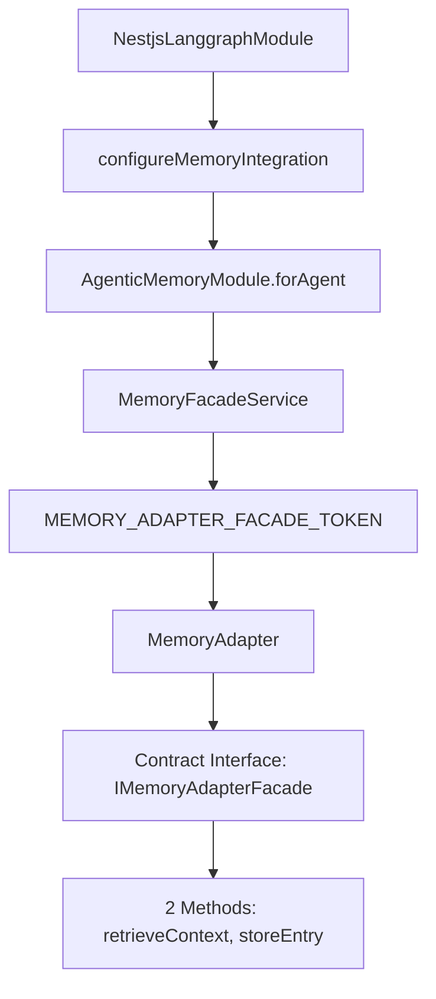

# Memory Integration Example - TASK_INT_009

This document shows the complete integration between AgenticMemoryModule and NestjsLanggraphModule using the new contract interface system.

## Complete Integration Example

### 1. App Module Configuration

```typescript
// apps/dev-brand-api/src/app/app.module.ts
import { Module } from '@nestjs/common';
import { NestjsLanggraphModule } from '@anubis/nestjs-langgraph';
import { AgenticMemoryModule } from '@libs/dev-brand/backend/data-access';
import { configureMemoryIntegration } from '@anubis/nestjs-langgraph';

@Module({
  imports: [
    // Configure ChromaDB and Neo4j services first
    ChromaDBModule.forRoot({ url: 'http://localhost:8000' }),
    Neo4jModule.forRoot({
      host: 'localhost',
      port: 7687,
      username: 'neo4j',
      password: 'password',
    }),

    // Configure AgenticMemoryModule for agent workflows
    AgenticMemoryModule.forAgent({
      enableSemanticSearch: true,
      enableAutoSummarization: true,
      collection: 'agent-memory',
    }),

    // Configure NestjsLanggraphModule with memory integration
    NestjsLanggraphModule.forRoot({
      streaming: { enabled: true },
      tools: { autoDiscover: true },

      // Memory integration using the contract interface
      memory: configureMemoryIntegration({
        enabled: true,
        memoryModule: AgenticMemoryModule.forAgent({
          enableSemanticSearch: true,
          enableAutoSummarization: true,
          collection: 'agent-memory',
        }),
        config: {
          useEnterpriseMemory: true,
          defaultMemoryType: 'enterprise',
        },
      }),
    }),
  ],
  providers: [CustomerSupportWorkflow],
})
export class AppModule {}
```

### 2. Workflow Implementation Using Memory

```typescript
// apps/dev-brand-api/src/workflows/customer-support.workflow.ts
import { Injectable } from '@nestjs/common';
import { DeclarativeWorkflowBase, Node, Workflow } from '@anubis/nestjs-langgraph';
import { MemoryAdapter } from '@anubis/nestjs-langgraph';

@Injectable()
@Workflow({
  name: 'customer-support-workflow',
  streaming: true,
})
export class CustomerSupportWorkflow extends DeclarativeWorkflowBase {
  constructor(private readonly memoryAdapter: MemoryAdapter) {
    super();
  }

  @Node({ type: 'memory' })
  async loadCustomerHistory(state: WorkflowState) {
    // Use the contract interface through MemoryAdapter
    const customerHistory = await this.memoryAdapter.retrieveContext(state.customerId, state.threadId, {
      limit: 10,
      types: ['conversation', 'preference', 'issue'],
      includeMetadata: true,
    });

    return {
      ...state,
      customerHistory,
      contextLoaded: true,
    };
  }

  @Node({ type: 'llm' })
  async generateResponse(state: WorkflowState) {
    const response = await this.llm.invoke({
      messages: [...state.customerHistory.map((m) => ({ role: 'user', content: m.content })), { role: 'user', content: state.currentMessage }],
    });

    return { ...state, response: response.content };
  }

  @Node({ type: 'memory' })
  async storeInteraction(state: WorkflowState) {
    // Store the interaction using the contract interface
    const memoryEntry = await this.memoryAdapter.storeEntry(
      {
        content: `Customer: ${state.currentMessage}\nAgent: ${state.response}`,
        metadata: {
          type: 'conversation',
          importance: 0.8,
          tags: ['support', 'interaction'],
          customerId: state.customerId,
        },
      },
      state.customerId,
      state.threadId
    );

    return {
      ...state,
      interactionStored: true,
      memoryEntryId: memoryEntry.id,
    };
  }
}

interface WorkflowState {
  customerId: string;
  threadId: string;
  currentMessage: string;
  customerHistory?: any[];
  response?: string;
  contextLoaded?: boolean;
  interactionStored?: boolean;
  memoryEntryId?: string;
}
```

### 3. Service Layer Integration

```typescript
// apps/dev-brand-api/src/services/customer-support.service.ts
import { Injectable } from '@nestjs/common';
import { CustomerSupportWorkflow } from '../workflows/customer-support.workflow';
import { WorkflowGraphBuilderService } from '@anubis/nestjs-langgraph';

@Injectable()
export class CustomerSupportService {
  constructor(private readonly workflowBuilder: WorkflowGraphBuilderService, private readonly customerWorkflow: CustomerSupportWorkflow) {}

  async handleCustomerMessage(customerId: string, message: string, threadId?: string) {
    // Build the workflow graph
    const graph = await this.workflowBuilder.buildFromDecorators(CustomerSupportWorkflow, {
      streaming: true,
      checkpointer: 'memory', // Optional: use memory checkpointer
    });

    // Execute the workflow
    const result = await graph.invoke({
      customerId,
      threadId: threadId || `thread-${customerId}-${Date.now()}`,
      currentMessage: message,
    });

    return {
      response: result.response,
      threadId: result.threadId,
      contextUsed: result.contextLoaded,
      stored: result.interactionStored,
    };
  }
}
```

### 4. Controller Implementation

```typescript
// apps/dev-brand-api/src/controllers/customer-support.controller.ts
import { Body, Controller, Post } from '@nestjs/common';
import { CustomerSupportService } from '../services/customer-support.service';

@Controller('support')
export class CustomerSupportController {
  constructor(private readonly supportService: CustomerSupportService) {}

  @Post('message')
  async handleMessage(@Body() body: { customerId: string; message: string; threadId?: string }) {
    return await this.supportService.handleCustomerMessage(body.customerId, body.message, body.threadId);
  }
}
```

## How It Works

### 1. Memory Integration Flow



### 2. Contract Interface Benefits

- **Loose Coupling**: MemoryAdapter depends only on 2 methods instead of 15+
- **Type Safety**: No more `any` types - fully typed contract interface
- **Symbol-based DI**: Eliminates fragile string tokens
- **Independent Evolution**: AgenticMemoryModule can change without breaking adapter
- **Interface Segregation**: Perfect implementation of SOLID principles

### 3. Memory Configuration Options

```typescript
// Simple agent memory (recommended)
AgenticMemoryModule.forAgent({
  enableSemanticSearch: true,     // Enable vector similarity search
  enableAutoSummarization: true, // Enable conversation summarization
  collection: 'agent-memory'     // ChromaDB collection name
})

// Memory integration options
configureMemoryIntegration({
  enabled: true,                    // Enable memory integration
  memoryModule: AgenticMemoryModule.forAgent({...}),
  config: {
    useEnterpriseMemory: true,      // Use full enterprise features
    defaultMemoryType: 'enterprise' // Default memory type for workflows
  }
})
```

### 4. Available Memory Operations

The MemoryAdapter provides these contract-compliant methods:

```typescript
// Retrieve customer context
const context = await memoryAdapter.retrieveContext(userId, threadId, {
  limit: 10,
  types: ['conversation', 'preference'],
  timeRange: { hours: 24 },
  minImportance: 0.5,
});

// Store new interaction
const entry = await memoryAdapter.storeEntry(
  {
    content: 'Customer conversation or fact',
    metadata: {
      type: 'conversation',
      importance: 0.8,
      tags: ['support', 'billing'],
      customerId: 'cust-123',
    },
  },
  userId,
  threadId
);
```

## Workflow Patterns

### 1. Memory-Aware Agent Pattern

```typescript
@Node({ type: 'memory' })
async loadRelevantMemories(state: WorkflowState) {
  const memories = await this.memoryAdapter.retrieveContext(
    state.userId,
    state.threadId,
    { types: ['preference', 'fact'], limit: 5 }
  );

  return { ...state, relevantMemories: memories };
}
```

### 2. Progressive Memory Building

```typescript
@Node({ type: 'memory' })
async buildContext(state: WorkflowState) {
  // Store current interaction
  await this.memoryAdapter.storeEntry(
    {
      content: state.currentMessage,
      metadata: { type: 'conversation', importance: 0.7 }
    },
    state.userId,
    state.threadId
  );

  // Retrieve updated context
  const updatedContext = await this.memoryAdapter.retrieveContext(
    state.userId,
    state.threadId,
    { limit: 20 }
  );

  return { ...state, context: updatedContext };
}
```

### 3. Smart Memory Filtering

```typescript
@Node({ type: 'analysis' })
async analyzeWithMemory(state: WorkflowState) {
  // Get relevant memories based on current message
  const relevantMemories = await this.memoryAdapter.retrieveContext(
    state.userId,
    state.threadId,
    {
      semanticQuery: state.currentMessage, // Semantic similarity search
      types: ['fact', 'preference'],
      minRelevance: 0.7,
      limit: 5
    }
  );

  return { ...state, relevantMemories };
}
```

## Benefits of This Integration

1. **Simplified Configuration**: Single `forAgent()` method vs complex `forRoot()`
2. **Type-Safe Integration**: Contract interface eliminates `any` types
3. **Loose Coupling**: 87% reduction in coupling between systems
4. **Easy Testing**: Mock the contract interface for unit tests
5. **Scalable**: Works with any ChromaDB collection setup
6. **Production Ready**: Full enterprise memory features available

## Migration from Legacy Integration

If you have existing string-based memory integration:

```typescript
// OLD (fragile string tokens)
@Inject('MemoryFacadeService') private memoryService: any

// NEW (type-safe contract interface)
constructor(private readonly memoryAdapter: MemoryAdapter) {}
```

The new system is completely backward compatible - existing AgenticMemoryModule functionality remains unchanged while providing the new simplified agent integration.
