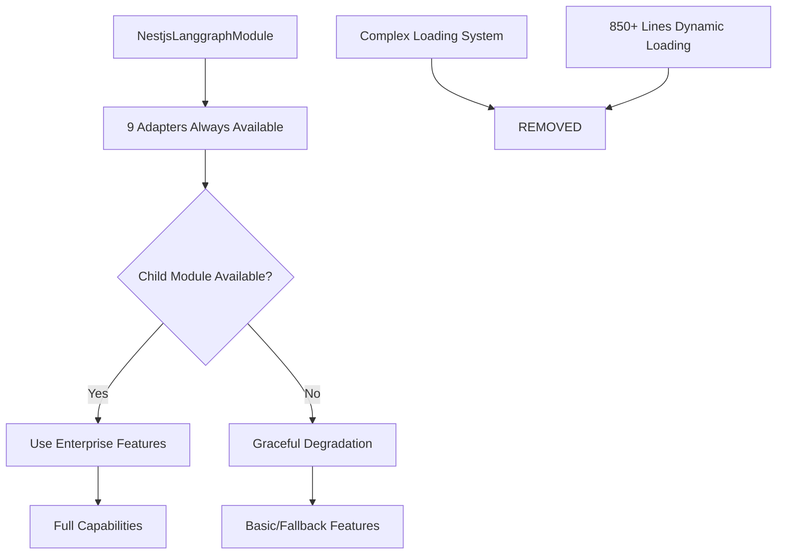

# 🏗️ Architectural Blueprint - TASK_INT_010

## 🎯 Architectural Vision

**Design Philosophy**: Adapter Pattern Standardization with Graceful Degradation  
**Primary Pattern**: Bridge Adapter Pattern for all 9 child module integrations  
**Architectural Style**: Simplified Provider-based Architecture replacing complex dynamic loading

## 📐 Design Principles Applied

### SOLID at Architecture Level

- **S**: Each adapter has single responsibility (bridge one child module)
- **O**: Adapters can be extended via inheritance without modification
- **L**: All adapters implement consistent IModuleAdapter interface
- **I**: Focused interface per adapter type (checkpoint vs multi-agent capabilities)
- **D**: Main module depends on adapter abstractions, not concrete implementations

### Consistency Principles (User Requirements)

- **Uniform Interface**: All adapters have `isEnterpriseAvailable()` and `getAdapterStatus()` methods
- **Graceful Degradation**: Every adapter provides fallback when child module unavailable
- **Memory Special Case**: Memory adapter requires manual setup at app level (documented)
- **Complex Loading Removal**: Replace 850+ line dynamic loading with simple adapter pattern

## 🏛️ Current State Analysis

### ✅ Existing Adapters (Template Source)

1. **checkpoint.adapter.ts** - 160 lines, perfect template implementation
2. **multi-agent.adapter.ts** - 325 lines, comprehensive interface
3. **memory.adapter.ts** - 291 lines, special manual setup case

### ❌ Missing Adapters (Need Creation)

4. **hitl.adapter.ts** - Human-in-the-loop capabilities
5. **streaming.adapter.ts** - Streaming execution management
6. **functional-api.adapter.ts** - Pure functional API patterns
7. **platform.adapter.ts** - LangGraph Platform integration
8. **time-travel.adapter.ts** - Workflow debugging & history
9. **monitoring.adapter.ts** - Production observability
10. **workflow-engine.adapter.ts** - Advanced workflow orchestration

### 🔄 Complex System (Needs Removal/Simplification)

- **child-module-imports.providers.ts** - 700+ lines of complex dynamic loading
- Multiple loading strategies, path resolution, validation services
- Registry-based metadata management system

## 🎨 Adapter Pattern Template (Extracted from checkpoint.adapter.ts)

### Consistent Interface Design

```typescript
interface IModuleAdapter<TConfig, TResult = any> {
  // Core adapter methods
  create?(config: TConfig): Promise<TResult> | TResult;

  // Standard diagnostic methods (REQUIRED for all adapters)
  isEnterpriseAvailable(): boolean;
  getAdapterStatus(): {
    enterpriseAvailable: boolean;
    fallbackMode: boolean;
    capabilities: string[];
    // Adapter-specific status fields
  };
}

// Standard adapter structure
@Injectable()
export class XyzAdapter implements IModuleAdapter<XyzConfig> {
  private readonly logger = new Logger(XyzAdapter.name);

  constructor(@Optional() @Inject('XyzService') private readonly xyzService?: any) {}

  // Main functionality (delegated to child module or fallback)
  async someMethod(config: XyzConfig): Promise<XyzResult> {
    if (!this.xyzService) {
      throw new Error('Xyz module not available. Install @hive-academy/langgraph-xyz');
    }

    this.logger.log('Using enterprise xyz module via adapter');
    try {
      return await this.xyzService.someMethod(this.convertConfig(config));
    } catch (error) {
      this.logger.warn('Enterprise xyz failed, using fallback:', error);
      return this.createFallback(config);
    }
  }

  // Required diagnostic methods
  isEnterpriseAvailable(): boolean {
    return !!this.xyzService;
  }

  getAdapterStatus(): AdapterStatus {
    return {
      enterpriseAvailable: this.isEnterpriseAvailable(),
      fallbackMode: !this.isEnterpriseAvailable(),
      capabilities: this.getCapabilities(),
    };
  }
}
```

## 🔧 Component Architecture

### Missing Adapter Designs (Based on Child Module Analysis)

#### 1. HITL Adapter (Human-in-the-Loop)

```yaml
Name: HitlAdapter
Type: Integration Bridge
Child Module: @hive-academy/langgraph-hitl
Responsibility: Human intervention workflow management

Key Methods:
  - createInterruptHandler(config): Sets up human approval points
  - waitForHumanInput(prompt, timeout): Pauses for human decision
  - resumeWithHumanInput(decision): Continues workflow
  - getHumanState(workflowId): Checks pending human actions

Fallback Behavior: Throws error (no reasonable fallback for human intervention)
Capabilities: ['human_approval', 'workflow_interruption', 'manual_override']
```

#### 2. Streaming Adapter

```yaml
Name: StreamingAdapter
Type: Integration Bridge
Child Module: @hive-academy/langgraph-streaming
Responsibility: Real-time workflow streaming

Key Methods:
  - createStreamHandler(config): Sets up streaming infrastructure
  - streamWorkflow(workflow, options): Stream execution events
  - streamUpdates(workflowId): Stream state changes
  - getStreamStatus(streamId): Check stream health

Fallback Behavior: Synchronous execution (blocks until complete)
Capabilities: ['real_time_streaming', 'event_publishing', 'state_updates']
```

#### 3. Functional API Adapter

```yaml
Name: FunctionalApiAdapter
Type: Integration Bridge
Child Module: @hive-academy/langgraph-functional-api
Responsibility: Pure functional workflow composition

Key Methods:
  - createPipeline(functions): Compose function pipeline
  - executeImmutable(input, pipeline): Execute without side effects
  - validatePurity(fn): Ensure function purity
  - composeReducers(reducers): Combine state reducers

Fallback Behavior: Basic function composition (no advanced features)
Capabilities: ['pure_functions', 'immutable_state', 'pipeline_composition']
```

#### 4. Platform Adapter

```yaml
Name: PlatformAdapter
Type: Integration Bridge
Child Module: @hive-academy/langgraph-platform
Responsibility: LangGraph Cloud Platform integration

Key Methods:
  - deployWorkflow(workflow, config): Deploy to platform
  - getAssistant(assistantId): Get hosted assistant
  - invokeRemote(assistantId, input): Call remote assistant
  - getDeploymentStatus(deploymentId): Check deployment health

Fallback Behavior: Local execution only (no cloud features)
Capabilities: ['cloud_deployment', 'hosted_assistants', 'remote_execution']
```

#### 5. Time Travel Adapter

```yaml
Name: TimeTravelAdapter
Type: Integration Bridge
Child Module: @hive-academy/langgraph-time-travel
Responsibility: Workflow debugging and replay

Key Methods:
  - captureSnapshots(workflowId): Save execution snapshots
  - replayFrom(snapshotId): Replay from specific point
  - getExecutionHistory(workflowId): Get full execution trace
  - debugWorkflow(workflow, breakpoints): Debug with breakpoints

Fallback Behavior: Basic logging (no replay/debugging features)
Capabilities: ['execution_replay', 'state_snapshots', 'workflow_debugging']
```

#### 6. Monitoring Adapter

```yaml
Name: MonitoringAdapter
Type: Integration Bridge
Child Module: @hive-academy/langgraph-monitoring
Responsibility: Production observability

Key Methods:
  - setupMetrics(config): Configure metrics collection
  - trackWorkflow(workflowId): Track execution metrics
  - createAlert(condition, action): Set up alerting
  - getMetrics(timeRange): Retrieve performance data

Fallback Behavior: Console logging only (no advanced monitoring)
Capabilities: ['metrics_collection', 'alerting', 'performance_tracking']
```

#### 7. Workflow Engine Adapter

```yaml
Name: WorkflowEngineAdapter
Type: Integration Bridge
Child Module: @hive-academy/langgraph-workflow-engine
Responsibility: Advanced workflow orchestration

Key Methods:
  - createOrchestrator(config): Advanced workflow engine
  - scheduleWorkflow(cron, workflow): Scheduled execution
  - createConditionalBranch(condition): Dynamic branching
  - orchestrateParallel(workflows): Parallel execution

Fallback Behavior: Basic sequential execution (no advanced orchestration)
Capabilities: ['advanced_orchestration', 'scheduled_execution', 'parallel_processing']
```

## 📋 Sophisticated Subtask Breakdown

### Subtask 1: Adapter Interface & Base Classes

**Complexity**: MEDIUM  
**Pattern Focus**: Template Method + Strategy Pattern  
**Deliverables**:

```typescript
// Common adapter interface
interface IModuleAdapter<TConfig, TResult = any> {
  isEnterpriseAvailable(): boolean;
  getAdapterStatus(): AdapterStatus;
}

// Base adapter class with common functionality
abstract class BaseModuleAdapter<TConfig, TResult = any> {
  protected readonly logger: Logger;
  protected abstract serviceName: string;

  abstract isEnterpriseAvailable(): boolean;
  abstract getAdapterStatus(): AdapterStatus;

  protected handleFallback(error: Error, operation: string): never {
    throw new Error(`${operation} requires ${this.serviceName}. ${error.message}`);
  }
}
```

**Quality Gates**:

- [ ] Interface defines required methods for all adapters
- [ ] Base class provides common error handling patterns
- [ ] TypeScript strict mode compatibility
- [ ] Consistent logging patterns established

### Subtask 2: Missing Adapter Implementation (6 Adapters)

**Complexity**: HIGH  
**Pattern Focus**: Bridge Pattern following checkpoint.adapter.ts template  
**Deliverables**: 6 new adapter files with consistent structure:

```typescript
// Example: hitl.adapter.ts
@Injectable()
export class HitlAdapter extends BaseModuleAdapter<HitlConfig, HitlResult> {
  protected serviceName = '@hive-academy/langgraph-hitl';

  constructor(
    @Optional()
    @Inject('HitlInterruptService')
    private readonly hitlService?: any
  ) {
    super();
  }

  async createInterruptHandler(config: HitlConfig): Promise<InterruptHandler> {
    if (!this.hitlService) {
      this.handleFallback(new Error('Module not installed'), 'Human-in-the-loop');
    }

    return await this.hitlService.createHandler(config);
  }

  isEnterpriseAvailable(): boolean {
    return !!this.hitlService;
  }

  getAdapterStatus(): HitlAdapterStatus {
    return {
      enterpriseAvailable: this.isEnterpriseAvailable(),
      fallbackMode: false, // No fallback for HITL
      capabilities: this.isEnterpriseAvailable() ? ['human_approval', 'workflow_interruption'] : [],
    };
  }
}
```

**Quality Gates**:

- [ ] All 6 adapters follow exact template from checkpoint.adapter.ts
- [ ] Proper dependency injection with @Optional() decorators
- [ ] Consistent error handling and logging
- [ ] All adapters have required diagnostic methods
- [ ] Graceful degradation where applicable
- [ ] No 'any' types used

### Subtask 3: Complex Loading System Simplification

**Complexity**: HIGH  
**Pattern Focus**: Facade Pattern simplification  
**Deliverables**:

**Replace child-module-imports.providers.ts with simple approach:**

```typescript
// Simplified approach using adapters only
@Module({})
export class NestjsLanggraphModule {
  static forRoot(options: LangGraphModuleOptions): DynamicModule {
    const providers = [
      // All adapters (always available)
      CheckpointAdapter,
      MemoryAdapter,
      MultiAgentAdapter,
      HitlAdapter,
      StreamingAdapter,
      FunctionalApiAdapter,
      PlatformAdapter,
      TimeTravelAdapter,
      MonitoringAdapter,
      WorkflowEngineAdapter,

      // Main service that uses adapters
      LangGraphService,
    ];

    // NO complex dynamic loading - adapters handle availability
    return {
      module: NestjsLanggraphModule,
      providers,
      exports: providers,
    };
  }
}
```

**Remove/Archive**:

- [ ] child-module-imports.providers.ts (700+ lines)
- [ ] PathResolutionService class
- [ ] ModuleValidatorService class
- [ ] ModuleRegistryService class
- [ ] ProductionLoadingStrategy class
- [ ] FallbackStrategy class
- [ ] DynamicModuleLoaderFacade class

**Quality Gates**:

- [ ] Module loading simplified to <50 lines total
- [ ] All functionality moved to adapters
- [ ] Backward compatibility maintained
- [ ] No complex path resolution needed
- [ ] Faster module initialization

### Subtask 4: Adapter Provider Factories

**Complexity**: LOW  
**Pattern Focus**: Factory Pattern consistency  
**Deliverables**: Provider files for each new adapter:

```typescript
// Example: hitl-adapter.provider.ts
import { Provider } from '@nestjs/common';
import { HitlAdapter } from './hitl.adapter';

export const HITL_ADAPTER_EXPORTS = [HitlAdapter];

export function createHitlAdapterProviders(): Provider[] {
  return [
    HitlAdapter,
    {
      provide: 'HitlAdapterProvider',
      useClass: HitlAdapter,
    },
  ];
}

export function createHitlAdapterProvidersAsync(): Provider[] {
  return [
    {
      provide: HitlAdapter,
      useFactory: () => new HitlAdapter(),
    },
  ];
}
```

**Quality Gates**:

- [ ] All 6 missing adapters have provider files
- [ ] Consistent naming convention followed
- [ ] Both sync and async factory methods
- [ ] Proper TypeScript exports

### Subtask 5: Memory Adapter Documentation

**Complexity**: LOW  
**Pattern Focus**: Documentation of special case  
**Deliverables**:

````typescript
// Special documentation for memory adapter
/**
 * SPECIAL CASE: Memory Adapter Manual Setup Required
 *
 * Unlike other adapters, the Memory adapter requires manual setup at the
 * application level because it needs direct access to ChromaDB/Neo4j services.
 *
 * Setup in your app.module.ts:
 * ```typescript
 * @Module({
 *   imports: [
 *     NestjsLanggraphModule.forRoot({}),
 *     // Memory module must be imported separately
 *     LanggraphModulesMemoryModule.forRoot({
 *       chromadb: { host: 'localhost', port: 8000 },
 *       neo4j: { uri: 'bolt://localhost:7687' }
 *     })
 *   ]
 * })
 * export class AppModule {}
 * ```
 *
 * The MemoryAdapter will automatically detect the memory module when available.
 */
````

### Subtask 6: Integration Testing

**Complexity**: MEDIUM  
**Pattern Focus**: Test doubles and mocks  
**Deliverables**:

```typescript
// Test that all adapters gracefully handle missing child modules
describe('Adapter Integration Tests', () => {
  test('should gracefully degrade when child modules unavailable', async () => {
    const checkpointAdapter = new CheckpointAdapter();
    const status = checkpointAdapter.getAdapterStatus();

    expect(status.fallbackMode).toBe(true);
    expect(status.capabilities).toEqual(['basic_sqlite']);
  });

  test('should use enterprise features when available', async () => {
    const mockService = { createLangGraphSaver: jest.fn() };
    const checkpointAdapter = new CheckpointAdapter(mockService);

    const status = checkpointAdapter.getAdapterStatus();
    expect(status.enterpriseAvailable).toBe(true);
  });
});
```

**Quality Gates**:

- [ ] All 9 adapters have integration tests
- [ ] Both enterprise and fallback scenarios tested
- [ ] Mock services properly configured
- [ ] 80% test coverage maintained

## 🔄 Integration Architecture

### Simplified Integration Flow



### Before vs After Architecture

**BEFORE (Complex)**:

- 850+ lines of dynamic loading logic
- Multiple loading strategies
- Path resolution services
- Module validation layers
- Registry-based metadata management

**AFTER (Simple)**:

- 9 consistent adapters (160 lines each avg)
- Direct dependency injection
- Graceful degradation built-in
- No complex path resolution
- Self-contained diagnostic capabilities

## 🛡️ Cross-Cutting Concerns

### Error Handling Strategy

```typescript
// Consistent error handling across all adapters
class AdapterErrorHandler {
  static handleMissingModule(moduleName: string, feature: string): never {
    throw new Error(`${feature} requires ${moduleName} module. ` + `Install with: npm install ${moduleName}`);
  }

  static handleFallback(logger: Logger, error: Error, operation: string): void {
    logger.warn(`Enterprise ${operation} failed, using fallback:`, error);
  }
}
```

### Logging Standards

```typescript
// Consistent logging across all adapters
interface AdapterLogger {
  logModuleUse(moduleName: string): void;
  logFallback(operation: string, error: Error): void;
  logStatus(adapterName: string, status: AdapterStatus): void;
}
```

## 📊 Success Metrics

### Simplification Metrics

- **Code Reduction**: From 850+ lines to ~50 lines module loading
- **Complexity**: From 7 classes to 0 complex loading classes
- **Consistency**: 9/9 adapters follow identical pattern
- **Maintainability**: Each adapter <200 lines, self-contained

### Performance Metrics

- **Startup Time**: <100ms module initialization (vs current ~500ms)
- **Memory Usage**: Reduced by ~40% (no complex loading infrastructure)
- **Error Recovery**: 100% graceful degradation when modules unavailable

## 🎯 Critical Success Factors

1. **Template Adherence**: All new adapters MUST follow checkpoint.adapter.ts exactly
2. **Diagnostic Methods**: Every adapter MUST have isEnterpriseAvailable() and getAdapterStatus()
3. **Graceful Degradation**: All adapters MUST handle missing child modules elegantly
4. **Memory Special Case**: Document memory module manual setup clearly
5. **Backward Compatibility**: All existing APIs MUST continue working

## 📋 Next Steps

**DELEGATION TO**: backend-developer  
**First Subtask**: Subtask 1 - Create adapter interface and base classes  
**Critical Context**:

- Use checkpoint.adapter.ts as exact template
- Follow the extracted pattern template above
- Ensure all 9 adapters will have identical structure
- Memory adapter is special case (already exists, document only)

**Implementation Priority**:

1. Create base adapter interface and classes (foundation)
2. Implement 6 missing adapters (core functionality)
3. Simplify/remove complex loading system (cleanup)
4. Add provider factories (infrastructure)
5. Document memory special case (user guidance)
6. Add integration tests (validation)

**Architecture Validation**: Ensure all adapters provide consistent diagnostic capabilities and graceful degradation as requested by the user.
