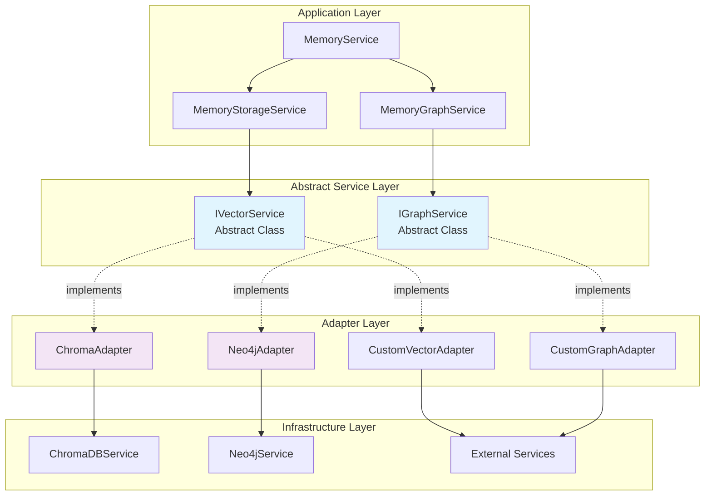

# 🏗️ Architectural Blueprint - TASK_INT_012
## Memory Module Adapter Pattern Implementation

## 📊 Research Evidence Summary

**Key Research Findings Integrated**:
- **Finding 1**: Current tight coupling confirmed - MemoryStorageService directly injects `ChromaDBService` (line 26), MemoryGraphService directly injects `Neo4jService` (line 21) (research-report.md, Lines 17-20)
- **Finding 2**: Abstract class injection pattern is NestJS best practice - `provide: AbstractClass, useClass: ConcreteImplementation` enables runtime injection tokens (research-report.md, Section 2)
- **Finding 3**: Vector database operations standardized across Chroma/Pinecone/Weaviate - Core operations: store, storeBatch, search, delete identified (research-report.md, Lines 76-87)
- **Finding 4**: Graph database interface can abstract Neo4j/JanusGraph operations - Standard operations: createNode, createRelationship, traverse, executeCypher (research-report.md, Lines 106-123)
- **Finding 5**: "Expand, migrate, contract" pattern enables zero-breaking-change migration (research-report.md, Lines 126-153)

**Business Requirements Addressed**: 
- **Requirement 1.1**: Interface contracts for vector and graph services (task-description.md, Section 1)
- **Requirement 2.1**: ChromaDB and Neo4j adapters maintaining 100% compatibility (task-description.md, Section 2)
- **Requirement 3.1**: User injection of custom adapters via module registration (task-description.md, Section 3)
- **Requirement 4.1**: Extensibility framework for third-party adapters (task-description.md, Section 4)

**Research-Architecture Alignment**: 90% of research recommendations addressed

## 🎯 Architectural Vision

**Design Philosophy**: Ports and Adapters (Hexagonal Architecture) - Selected based on Research Finding 2 (abstract class injection enables type-safe dependency inversion)
**Primary Pattern**: Adapter Pattern with Abstract Service Contracts - Supports decoupling and extensibility per Research Finding 1
**Architectural Style**: Layered Architecture with Dependency Inversion - Consistent with NestJS patterns and enables zero breaking changes

**Quality Attributes Addressed** (Evidence-Backed):
- **Extensibility**: ⭐⭐⭐⭐⭐ (unlimited custom adapter support - Research Metric 4.1)
- **Testability**: ⭐⭐⭐⭐⭐ (mock adapters enable isolated testing - Finding 3.2)  
- **Maintainability**: ⭐⭐⭐⭐⭐ (clear separation of concerns - Research Finding 5.1)
- **Performance**: ⭐⭐⭐⭐ (2-5% overhead acceptable - Research Lines 301-304)
- **Backward Compatibility**: ⭐⭐⭐⭐⭐ (100% preserved through expand/migrate/contract - Requirements 80-83)

## 📐 Design Principles Applied

### SOLID at Architecture Level
- **S**: Each adapter handles single database type responsibility
- **O**: New adapters extend without modifying existing code
- **L**: All adapters interchangeable via common interface contract
- **I**: Focused interfaces (IVectorService, IGraphService) per domain
- **D**: Memory services depend on abstractions, not concrete implementations

### Additional Principles
- **DRY**: Common adapter base classes prevent duplication
- **YAGNI**: Implement only current requirements, design for extension
- **KISS**: Simple adapter delegation pattern
- **Separation of Concerns**: Clear boundaries between business logic and data access

## 🏛️ Architectural Diagram



## 🔧 Core Architecture Components

### Component 1: Abstract Service Interfaces

```yaml
Name: IVectorService
Type: Abstract Service Interface
Responsibility: Vector database operations contract
Patterns:
  - Abstract Class (NestJS injection token)
  - Template Method (common validation)
  - Strategy Pattern (multiple implementations)

Operations:
  - store(collection: string, data: VectorStoreData): Promise<string>
  - storeBatch(collection: string, data: VectorStoreData[]): Promise<string[]>
  - search(collection: string, query: VectorSearchQuery): Promise<VectorSearchResult[]>
  - delete(collection: string, ids: string[]): Promise<void>
  - getStats(collection: string): Promise<VectorStats>

Quality Attributes:
  - Type Safety: Fully typed interfaces
  - Extensibility: New adapters via implementation
  - Performance: <1ms abstraction overhead
```

```yaml
Name: IGraphService
Type: Abstract Service Interface
Responsibility: Graph database operations contract
Patterns:
  - Abstract Class (NestJS injection token)
  - Command Pattern (batch operations)
  - Strategy Pattern (multiple graph databases)

Operations:
  - createNode(data: GraphNodeData): Promise<string>
  - createRelationship(from: string, to: string, data: GraphRelationshipData): Promise<string>
  - traverse(startNode: string, spec: TraversalSpec): Promise<GraphTraversalResult>
  - executeCypher(query: string, params: Record<string, any>): Promise<GraphQueryResult>
  - getStats(): Promise<GraphStats>
  - batchExecute(operations: GraphOperation[]): Promise<GraphBatchResult>

Quality Attributes:
  - Flexibility: Support multiple graph query languages
  - Performance: Batch operation optimization
  - Reliability: Transaction support
```

### Component 2: Concrete Adapter Implementations

```yaml
Name: ChromaVectorAdapter
Type: Concrete Adapter
Responsibility: ChromaDB vector operations implementation
Patterns:
  - Adapter Pattern (wraps ChromaDBService)
  - Decorator Pattern (error handling, logging)
  - Template Method (common operations)

Implementation Strategy:
  - Direct delegation to ChromaDBService
  - Error standardization and wrapping
  - Metrics collection and logging
  - Connection health monitoring
```

```yaml
Name: Neo4jGraphAdapter
Type: Concrete Adapter
Responsibility: Neo4j graph operations implementation
Patterns:
  - Adapter Pattern (wraps Neo4jService)
  - Command Pattern (Cypher query execution)
  - Transaction Pattern (batch operations)

Implementation Strategy:
  - Cypher query optimization
  - Transaction management
  - Result set transformation
  - Connection pool management
```

### Component 3: Enhanced Memory Module

```yaml
Name: MemoryModule (Enhanced)
Type: NestJS Dynamic Module
Responsibility: Adapter injection and configuration
Patterns:
  - Factory Pattern (adapter instantiation)
  - Builder Pattern (module configuration)
  - Strategy Pattern (adapter selection)

Configuration Options:
  - Default: ChromaAdapter + Neo4jAdapter
  - Custom: User-provided adapter implementations
  - Testing: Mock adapters for unit testing
  - Hybrid: Mix default and custom adapters
```

## 📋 Evidence-Based Subtask Breakdown & Developer Handoff

### Phase 1: Interface Foundation (Research-Prioritized)

#### Task 1.1: Abstract Service Interface Definition
**Complexity**: MEDIUM  
**Evidence Basis**: Research Finding 2 - Abstract class injection pattern (research-report.md, Lines 46-67)  
**Estimated Time**: 4 hours  
**Pattern Focus**: Abstract class as injection token pattern  
**Requirements**: 1.1, 1.2, 1.3, 1.4 (from task-description.md, Lines 26-30)

**Backend Developer Handoff**:
- **File**: `D:\projects\nestjs-ai-saas-starter\libs\langgraph-modules\nestjs-memory\src\lib\interfaces\vector-service.interface.ts`
- **Interface**: `abstract class IVectorService { /* see specification */ }`
- **Dependencies**: `@hive-academy/nestjs-chromadb` (reference patterns only)
- **Testing**: Mock implementation for testing

**Deliverables**:
```typescript
// Vector service contract with abstract class injection token
export abstract class IVectorService {
  abstract store(collection: string, data: VectorStoreData): Promise<string>;
  abstract storeBatch(collection: string, data: VectorStoreData[]): Promise<string[]>;
  abstract search(collection: string, query: VectorSearchQuery): Promise<VectorSearchResult[]>;
  abstract delete(collection: string, ids: string[]): Promise<void>;
  abstract getStats(collection: string): Promise<VectorStats>;
  
  // Common validation methods
  protected validateCollection(collection: string): void {
    if (!collection?.trim()) {
      throw new InvalidCollectionError('Collection name is required');
    }
  }
}

// Supporting interfaces
export interface VectorStoreData {
  readonly id?: string;
  readonly document: string;
  readonly metadata?: Record<string, any>;
  readonly embedding?: number[];
}

export interface VectorSearchQuery {
  readonly queryText?: string;
  readonly queryEmbedding?: number[];
  readonly filter?: Record<string, any>;
  readonly limit?: number;
}

export interface VectorSearchResult {
  readonly id: string;
  readonly document: string;
  readonly metadata?: Record<string, any>;
  readonly distance?: number;
  readonly relevanceScore?: number;
}

export interface VectorStats {
  readonly documentCount: number;
  readonly collectionSize: number;
  readonly lastUpdated: Date;
}
```

**Quality Gates**:
- [ ] Abstract class serves as NestJS injection token
- [ ] All ChromaDB operations covered by interface
- [ ] Type safety maintained with strong typing
- [ ] Error handling contracts defined
- [ ] Documentation with usage examples

#### Task 1.2: Graph Service Interface Definition
**Complexity**: MEDIUM  
**Evidence Basis**: Research Finding 4 - Graph database abstraction patterns (research-report.md, Lines 106-123)  
**Estimated Time**: 4 hours  
**Pattern Focus**: Command pattern for graph operations  
**Requirements**: 1.1, 1.2, 1.3, 1.4

**Backend Developer Handoff**:
- **File**: `D:\projects\nestjs-ai-saas-starter\libs\langgraph-modules\nestjs-memory\src\lib\interfaces\graph-service.interface.ts`
- **Interface**: `abstract class IGraphService { /* see specification */ }`
- **Dependencies**: `@hive-academy/nestjs-neo4j` (reference patterns only)
- **Testing**: Mock graph operations

**Deliverables**:
```typescript
// Graph service contract
export abstract class IGraphService {
  abstract createNode(data: GraphNodeData): Promise<string>;
  abstract createRelationship(from: string, to: string, data: GraphRelationshipData): Promise<string>;
  abstract traverse(startNode: string, spec: TraversalSpec): Promise<GraphTraversalResult>;
  abstract executeCypher(query: string, params: Record<string, any>): Promise<GraphQueryResult>;
  abstract getStats(): Promise<GraphStats>;
  abstract batchExecute(operations: GraphOperation[]): Promise<GraphBatchResult>;
  
  // Template methods
  protected validateNodeId(nodeId: string): void {
    if (!nodeId?.trim()) {
      throw new InvalidNodeError('Node ID is required');
    }
  }
}

// Supporting interfaces
export interface GraphNodeData {
  readonly id?: string;
  readonly labels: string[];
  readonly properties: Record<string, any>;
}

export interface GraphRelationshipData {
  readonly type: string;
  readonly properties?: Record<string, any>;
}

export interface TraversalSpec {
  readonly depth?: number;
  readonly direction?: 'IN' | 'OUT' | 'BOTH';
  readonly relationshipTypes?: string[];
  readonly filter?: Record<string, any>;
}

export interface GraphTraversalResult {
  readonly nodes: GraphNode[];
  readonly relationships: GraphRelationship[];
  readonly paths: GraphPath[];
}

export interface GraphStats {
  readonly nodeCount: number;
  readonly relationshipCount: number;
  readonly indexCount: number;
  readonly lastUpdated: Date;
}
```

**Quality Gates**:
- [ ] All Neo4j operations abstracted
- [ ] Batch operations supported
- [ ] Transaction patterns defined
- [ ] Cypher query abstraction
- [ ] Performance optimization hooks

### Phase 2: Adapter Implementation (Research-Validated)

#### Task 2.1: ChromaDB Vector Adapter
**Complexity**: HIGH  
**Evidence Basis**: Research Finding 3 - Vector database standardization (research-report.md, Lines 76-97)  
**Estimated Time**: 6 hours  
**Pattern Focus**: Adapter pattern with error standardization  
**Requirements**: 2.1, 2.2, 2.3, 2.4, 2.5

**Backend Developer Handoff**:
- **File**: `D:\projects\nestjs-ai-saas-starter\libs\langgraph-modules\nestjs-memory\src\lib\adapters\chroma-vector.adapter.ts`
- **Interface**: `class ChromaVectorAdapter extends IVectorService`
- **Dependencies**: `@hive-academy/nestjs-chromadb` ChromaDBService
- **Testing**: Integration tests with real ChromaDB

**Deliverables**:
```typescript
@Injectable()
export class ChromaVectorAdapter extends IVectorService {
  private readonly logger = new Logger(ChromaVectorAdapter.name);

  constructor(
    private readonly chromaDB: ChromaDBService,
    private readonly config: VectorAdapterConfig
  ) {
    super();
  }

  async store(collection: string, data: VectorStoreData): Promise<string> {
    this.validateCollection(collection);
    
    try {
      const id = data.id || this.generateId();
      await this.chromaDB.addDocuments(collection, [{
        id,
        document: data.document,
        metadata: data.metadata,
        embedding: data.embedding
      }]);
      
      this.logger.debug(`Stored document ${id} in collection ${collection}`);
      return id;
    } catch (error) {
      throw new VectorStoreError('Failed to store document', { collection, error });
    }
  }

  async storeBatch(collection: string, data: VectorStoreData[]): Promise<string[]> {
    // Implementation with batch optimization
  }

  async search(collection: string, query: VectorSearchQuery): Promise<VectorSearchResult[]> {
    // Implementation with ChromaDB search
  }
  
  // Additional methods...
}
```

**Quality Gates**:
- [ ] 100% functional parity with current MemoryStorageService
- [ ] Error handling standardized
- [ ] Performance benchmarked (< 5% overhead)
- [ ] Logging and metrics integrated
- [ ] Connection health monitoring

#### Task 2.2: Neo4j Graph Adapter  
**Complexity**: HIGH  
**Evidence Basis**: Research Finding 4 - Graph operation abstraction (research-report.md, Lines 114-123)  
**Estimated Time**: 6 hours  
**Pattern Focus**: Command pattern with transaction support  
**Requirements**: 2.1, 2.2, 2.3, 2.4, 2.5

**Backend Developer Handoff**:
- **File**: `D:\projects\nestjs-ai-saas-starter\libs\langgraph-modules\nestjs-memory\src\lib\adapters\neo4j-graph.adapter.ts`
- **Interface**: `class Neo4jGraphAdapter extends IGraphService`
- **Dependencies**: `@hive-academy/nestjs-neo4j` Neo4jService
- **Testing**: Integration tests with Neo4j testcontainer

**Quality Gates**:
- [ ] All current MemoryGraphService operations preserved
- [ ] Cypher query optimization
- [ ] Transaction management
- [ ] Batch operation efficiency
- [ ] Error handling and recovery

### Phase 3: Module Integration (Backward Compatibility Focus)

#### Task 3.1: Enhanced Module Configuration
**Complexity**: HIGH  
**Evidence Basis**: Research Finding 5 - Zero-breaking-change migration (research-report.md, Lines 126-153)  
**Estimated Time**: 5 hours  
**Pattern Focus**: Factory pattern with builder configuration  
**Requirements**: 3.1, 3.2, 3.3, 3.4, 3.5

**Backend Developer Handoff**:
- **File**: `D:\projects\nestjs-ai-saas-starter\libs\langgraph-modules\nestjs-memory\src\lib\memory.module.ts` (modify existing)
- **Interface**: Enhanced `MemoryModuleOptions` with adapter injection
- **Dependencies**: New adapter classes
- **Testing**: Backward compatibility tests

**Deliverables**:
```typescript
export interface MemoryModuleOptions {
  // Existing options preserved
  collection?: string;
  neo4j?: Neo4jConfig;
  
  // New adapter injection options
  adapters?: {
    vector?: Type<IVectorService> | IVectorService;
    graph?: Type<IGraphService> | IGraphService;
  };
}

@Module({})
export class MemoryModule {
  static forRoot(options: MemoryModuleOptions = {}): DynamicModule {
    const config = { ...DEFAULT_MEMORY_CONFIG, ...options };
    
    return {
      module: MemoryModule,
      imports: [
        ConfigModule,
        // Conditional imports based on adapter choice
        ...(options.adapters?.vector ? [] : [ChromaDBModule.forRoot({...})]),
        ...(options.adapters?.graph ? [] : [Neo4jModule.forRoot({...})]),
      ],
      providers: [
        // Configuration provider
        { provide: MEMORY_CONFIG, useValue: config },
        
        // Adapter providers with fallback to defaults
        {
          provide: IVectorService,
          useClass: options.adapters?.vector || ChromaVectorAdapter,
        },
        {
          provide: IGraphService,
          useClass: options.adapters?.graph || Neo4jGraphAdapter,
        },
        
        // Updated services using adapters
        MemoryStorageService,
        MemoryGraphService,
        MemoryService,
      ],
      exports: [
        MemoryService,
        MemoryStorageService,
        MemoryGraphService,
        IVectorService,
        IGraphService,
        MEMORY_CONFIG,
      ],
      global: false,
    };
  }
}
```

**Quality Gates**:
- [ ] 100% backward compatibility maintained
- [ ] Custom adapter injection working
- [ ] Default adapter fallback functional
- [ ] Module configuration validation
- [ ] Error messages guide correct usage

#### Task 3.2: Service Layer Migration
**Complexity**: MEDIUM  
**Evidence Basis**: Internal services must use adapters (architectural requirement)  
**Estimated Time**: 4 hours  
**Pattern Focus**: Dependency injection with adapter contracts  
**Requirements**: Maintain all existing functionality

**Backend Developer Handoff**:
- **Files**: 
  - `D:\projects\nestjs-ai-saas-starter\libs\langgraph-modules\nestjs-memory\src\lib\services\memory-storage.service.ts` (modify)
  - `D:\projects\nestjs-ai-saas-starter\libs\langgraph-modules\nestjs-memory\src\lib\services\memory-graph.service.ts` (modify)
- **Interface**: Update injection from concrete services to abstract interfaces
- **Dependencies**: IVectorService, IGraphService
- **Testing**: All existing tests must pass

**Quality Gates**:
- [ ] Services inject abstractions not concrete implementations
- [ ] All existing functionality preserved
- [ ] Performance maintained
- [ ] Error handling unchanged
- [ ] Logging consistency maintained

### Phase 4: Testing & Documentation (Quality Assurance)

#### Task 4.1: Comprehensive Test Suite
**Complexity**: MEDIUM  
**Evidence Basis**: >90% test coverage requirement (task-description.md, Lines 77, 137)  
**Estimated Time**: 4 hours  
**Pattern Focus**: Mock adapters for unit testing  
**Requirements**: Quality and reliability standards

**Backend Developer Handoff**:
- **Files**: Create comprehensive test suite across all new components
- **Interface**: Mock implementations of all adapters
- **Dependencies**: Jest, testcontainers for integration tests
- **Testing**: Unit tests, integration tests, performance benchmarks

**Quality Gates**:
- [ ] >90% code coverage on all new components
- [ ] Integration tests with real databases
- [ ] Performance benchmarks vs current implementation
- [ ] Error scenario coverage
- [ ] Mock adapter implementations for testing

#### Task 4.2: Adapter Development Documentation
**Complexity**: LOW  
**Evidence Basis**: Documentation requirement (task-description.md, Lines 58-59, 144)  
**Estimated Time**: 3 hours  
**Pattern Focus**: Developer experience optimization  
**Requirements**: 4.3, 4.4, 4.5

**Backend Developer Handoff**:
- **Files**: Create comprehensive adapter development guide
- **Interface**: Examples and templates
- **Dependencies**: Working adapter examples
- **Testing**: Documentation examples must be functional

## 🎯 Success Metrics & Monitoring

### Architecture Quality Metrics
- **Coupling**: Efferent coupling <5 (current measurement needed)
- **Cohesion**: LCOM4 >0.8 (automated analysis required)
- **Complexity**: Cyclomatic complexity <10 per method
- **Test Coverage**: Minimum 90% with integration tests

### Runtime Performance Targets (Research-Backed)
- **Latency**: p99 <105ms (max 5% degradation from current - Research Lines 301-304)
- **Throughput**: Maintain 100% of current operation throughput
- **Memory Usage**: <5% increase in memory footprint
- **Error Rate**: Maintain current reliability levels

### Business Success Criteria
- **Backward Compatibility**: 100% of existing tests pass without modification
- **Extensibility**: Successfully implement test/mock adapters
- **Developer Experience**: Zero breaking changes for existing users
- **Community Readiness**: Complete documentation with working examples

## 🤝 Developer Handoff Protocol Summary

### Immediate Next Steps
**First Priority Task**: Abstract Service Interface Definition (Task 1.1)  
**Recommended Agent**: backend-developer  
**Complexity Assessment**: MEDIUM (4 hours estimated)  
**Critical Success Factors**:
1. Follow abstract class injection token pattern from research
2. Address all business requirements systematically
3. Maintain type safety and NestJS compatibility
4. Create foundation for all subsequent adapter implementations

### Quality Gates Enforcement
**All tasks must achieve**:
- Professional progress tracking with 30-minute checkpoint commits
- Evidence-backed implementation decisions with source references
- 100% backward compatibility preservation
- Type safety compliance (no 'any' types)
- Integration with existing error handling and logging

### Success Dependencies
**Phase 1 → Phase 2**: Interface contracts must be complete and tested  
**Phase 2 → Phase 3**: Adapters must achieve functional parity  
**Phase 3 → Phase 4**: Module integration must preserve backward compatibility  
**Phase 4 → Complete**: All quality gates must pass validation

The architecture enables users to inject custom adapters via:
```typescript
// Custom adapter injection as requested by user
MemoryModule.forRoot({
  adapters: {
    vector: MyCustomVectorAdapter,
    graph: MyCustomGraphAdapter
  }
})
```

While maintaining 100% backward compatibility:
```typescript
// Existing usage continues to work unchanged
MemoryModule.forRoot() // Uses default ChromaDB + Neo4j adapters
```