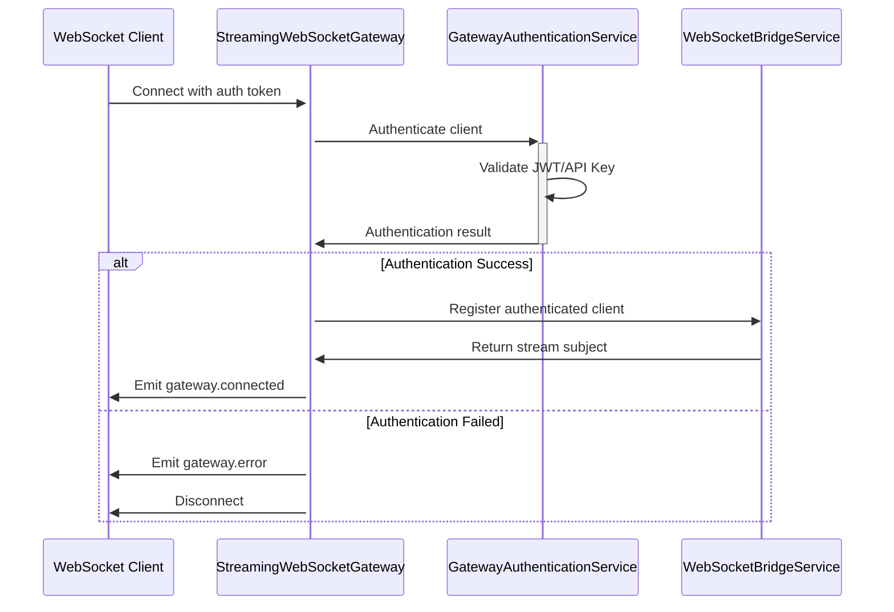

# WebSocket Gateway Integration Architecture

**Project**: TASK_WS_GATEWAY_001  
**Author**: Elite Software Architect  
**Date**: September 12, 2025

## Executive Summary

This document defines the detailed architecture for integrating WebSocket gateway functionality into the existing @hive-academy/langgraph-streaming library. The design leverages the existing WebSocketBridgeService as a proven foundation while adding NestJS WebSocket Gateway patterns for standardized client connectivity, authentication, and room-based streaming.

**Key Innovation**: The @StreamAll decorator will automatically work with WebSocket clients through an Enhanced Gateway Bridge Pattern that maintains full backward compatibility while providing enterprise-grade WebSocket capabilities.

## 1. ARCHITECTURAL OVERVIEW

### 1.1 Design Philosophy

**Enhanced Gateway Bridge Pattern**: Instead of replacing the existing WebSocketBridgeService, we enhance it with a NestJS WebSocketGateway that provides:

- Standardized WebSocket client connectivity (Socket.IO)
- Built-in authentication and authorization
- Type-safe event handling with real-time validation
- Seamless integration with existing streaming infrastructure

### 1.2 Package Boundary Strategy

```mermaid
graph TB
    subgraph "Published Package: @hive-academy/langgraph-streaming"
        subgraph "Gateway Layer (NEW)"
            SWG[StreamingWebSocketGateway]
            GCM[GatewayConnectionManager]
            GAS[GatewayAuthenticationService]
        end

        subgraph "Existing Core Services (ENHANCED)"
            WSBS[WebSocketBridgeService]
            TSS[TokenStreamingService]
            ESPS[EventStreamProcessorService]
        end

        subgraph "Enhanced Configuration (BACKWARD COMPATIBLE)"
            SM[StreamingModule]
            SMO[StreamingModuleOptions]
            WSGO[WebSocketGatewayOptions]
        end

        subgraph "Enhanced Decorators"
            SA[@StreamAll + Gateway Integration]
            ST[@StreamToken]
            SE[@StreamEvent]
            SP[@StreamProgress]
        end
    end

    subgraph "Consumer Applications"
        APP[NestJS App]
        CONFIG[Module Configuration]
        CLIENTS[WebSocket Clients]
    end

    %% Integration Flow
    SWG --> WSBS
    GCM --> WSBS
    SWG --> TSS
    SWG --> ESPS

    %% Configuration Flow
    APP --> SM
    CONFIG --> SMO
    SMO --> WSGO

    %% Client Connectivity
    CLIENTS --> SWG
    SWG --> WSBS

    %% Decorator Integration
    SA -.-> WSBS
    SA -.-> SWG
    WSBS -.-> CLIENTS
```

### 1.3 Backward Compatibility Guarantee

**Legacy Configuration Support**:

```typescript
// EXISTING (continues to work)
StreamingModule.forRoot({
  websocket: { enabled: true, port: 3000 },
  defaultBufferSize: 1000,
});

// ENHANCED (new capabilities)
StreamingModule.forRoot({
  websocket: { enabled: true, port: 3000 }, // Legacy support
  gateway: {
    // New gateway features
    authentication: { required: true },
    rooms: { autoJoin: true },
  },
});
```

## 2. DETAILED COMPONENT DESIGN

### 2.1 StreamingWebSocketGateway

**Core Responsibilities**:

- Handle WebSocket client connections using NestJS patterns
- Authenticate clients based on configurable strategies
- Bridge client events to WebSocketBridgeService
- Manage Socket.IO rooms and namespaces
- Transform stream updates for WebSocket transport

**Key Integration Points**:

```typescript
@WebSocketGateway({ namespace: '/streaming' })
export class StreamingWebSocketGateway implements OnGatewayConnection, OnGatewayDisconnect {
  constructor(
    private readonly webSocketBridgeService: WebSocketBridgeService, // Existing service
    private readonly tokenStreamingService: TokenStreamingService, // Existing service
    private readonly gatewayConnectionManager: GatewayConnectionManager // NEW
  ) {}

  async handleConnection(client: Socket): Promise<void> {
    // 1. Authenticate client (if required)
    // 2. Register with WebSocketBridgeService (leverage existing logic)
    // 3. Setup stream subscriptions
    // 4. Handle room assignments
  }
}
```

### 2.2 Enhanced WebSocketBridgeService Integration

**No Breaking Changes**: The existing WebSocketBridgeService continues to handle:

- Client registry and lifecycle management
- Room-based streaming and event distribution
- Integration with TokenStreamingService and EventStreamProcessor
- Event listening and stream processing

**New Integration Points**:

- Gateway registration callbacks for Socket.IO specific features
- Enhanced metadata handling for authenticated clients
- Room synchronization between WebSocketBridgeService and Socket.IO rooms

### 2.3 @StreamAll Decorator Enhancement

**Automatic Gateway Integration**:

```typescript
// ENHANCED @StreamAll with Gateway Context
@Node({ type: 'llm' })
@StreamAll({
  token: { enabled: true, format: 'text' },
  event: { events: [StreamEventType.NODE_START, StreamEventType.NODE_COMPLETE] },
  progress: { enabled: true, granularity: 'fine' },
  // NEW: Gateway-specific targeting
  gateway: {
    rooms: ['llm-processing', 'real-time'],
    targetClients: ['premium-users'],
    priority: 'high',
    acknowledgment: true,
  },
})
async processWithStreamingAndGateway(state: WorkflowState) {
  // Method automatically streams to WebSocket clients
  // Existing streaming logic unchanged
  // Gateway context automatically applied
  return { result: 'processed' };
}
```

**Implementation Strategy**:

1. Existing decorator logic remains unchanged
2. New gateway metadata stored alongside existing streaming metadata
3. WebSocketBridgeService enhanced to read gateway metadata
4. Automatic room assignment and client targeting based on decorator configuration

## 3. TYPESCRIPT INTERFACE ARCHITECTURE

### 3.1 Configuration Interfaces

```typescript
// BACKWARD COMPATIBLE: Enhanced StreamingModuleOptions
export interface StreamingModuleOptions {
  // Existing options (preserved)
  websocket?: {
    enabled: boolean;
    port?: number;
  };
  defaultBufferSize?: number;

  // NEW: Gateway configuration
  gateway?: WebSocketGatewayOptions;
}

// Comprehensive Gateway Configuration
export interface WebSocketGatewayOptions {
  enabled?: boolean;
  namespace?: string;
  cors?: CorsConfiguration;
  authentication?: AuthenticationConfiguration;
  rooms?: RoomConfiguration;
  rateLimit?: RateLimitConfiguration;
  events?: EventConfiguration;
}
```

### 3.2 Event System Interfaces

```typescript
// Type-Safe Gateway Events
export interface StreamingGatewayEvents {
  'client.connected': ClientConnectionEvent;
  'subscription.created': SubscriptionCreatedEvent;
  'room.joined': RoomJoinedEvent;
  'stream.data': StreamDataEvent;
  'gateway.error': GatewayErrorEvent;
}

// Runtime Validation with Zod
export const ClientSubscriptionConfigSchema = z.object({
  clientId: z.string().min(1),
  eventTypes: z.array(z.nativeEnum(StreamEventType)),
  rooms: z.array(z.string()).optional(),
  executionId: z.string().optional(),
});
```

### 3.3 Generic Streaming Types

```typescript
// Enhanced StreamUpdate for Gateway
export interface GatewayStreamUpdate<T = unknown> extends StreamUpdate<T> {
  targetClients?: string[];
  targetRooms?: string[];
  acknowledgment?: AcknowledgmentConfig;
  priority?: 'low' | 'normal' | 'high' | 'critical';
}
```

## 4. EVENT FLOW ARCHITECTURE

### 4.1 Complete Data Flow: @StreamAll → WebSocket Clients

```mermaid
sequenceDiagram
    participant WN as Workflow Node
    participant SA as @StreamAll Decorator
    participant WSBS as WebSocketBridgeService
    participant SWG as StreamingWebSocketGateway
    participant CLIENT as WebSocket Client

    Note over WN,CLIENT: Execution Phase
    WN->>+SA: Execute decorated method
    SA->>SA: Setup streaming contexts + gateway metadata
    SA->>WN: Execute original method

    Note over WN,CLIENT: Streaming Phase
    WN->>WSBS: Generate stream updates (tokens/events/progress)
    WSBS->>WSBS: Process updates + apply gateway context
    WSBS->>SWG: Forward with gateway metadata (rooms, clients, priority)
    SWG->>SWG: Apply authentication & room filtering
    SWG->>CLIENT: Emit stream.data via Socket.IO

    Note over WN,CLIENT: Room Broadcasting
    WSBS->>SWG: Broadcast to room ('llm-processing')
    SWG->>CLIENT: Send to room members only

    Note over WN,CLIENT: Completion Phase
    WN->>-SA: Method completion
    SA->>WSBS: Cleanup stream contexts
    WSBS->>SWG: Send completion event
    SWG->>CLIENT: Emit stream.complete
```

### 4.2 Authentication Flow



## 5. DEPENDENCY MANAGEMENT STRATEGY

### 5.1 Peer Dependencies

```json
{
  "peerDependencies": {
    "@nestjs/common": "^11.0.0",
    "@nestjs/websockets": "^11.0.0",
    "@nestjs/platform-socket.io": "^11.0.0",
    "socket.io": "^4.7.0",
    "reflect-metadata": "^0.1.13",
    "@nestjs/event-emitter": "^3.0.1",
    "rxjs": "7.8.2"
  }
}
```

### 5.2 Conditional Loading Strategy

```typescript
// Gateway services only loaded when WebSocket is enabled
export class StreamingModule {
  static forRoot(options?: StreamingModuleOptions): DynamicModule {
    const providers: Provider[] = [
      // Always loaded
      TokenStreamingService,
      EventStreamProcessorService,
      WebSocketBridgeService,
    ];

    // Conditionally loaded gateway services
    if (this.isWebSocketEnabled(options)) {
      providers.push(
        StreamingWebSocketGateway,
        GatewayConnectionManager,
        GatewayAuthenticationService,
      );
    }

    return { module: StreamingModule, providers, exports: [...] };
  }
}
```

## 6. TESTING ARCHITECTURE

### 6.1 Testing Strategy Matrix

| Test Type              | Scope                 | Tools                  | Coverage Target    |
| ---------------------- | --------------------- | ---------------------- | ------------------ |
| Unit Tests             | Gateway components    | Jest, @nestjs/testing  | 80%+               |
| Integration Tests      | End-to-end streaming  | Jest, Socket.IO client | Key workflows      |
| Package Tests          | Publishable structure | npm pack, import tests | Build validation   |
| Backward Compatibility | Legacy configuration  | Jest                   | 100% compatibility |

### 6.2 Mock Strategy

```typescript
// Mock WebSocketBridgeService for gateway tests
const createMockWebSocketBridgeService = () => ({
  registerClient: jest.fn().mockReturnValue(new Subject()),
  unregisterClient: jest.fn(),
  subscribeToEvents: jest.fn(),
  joinRoom: jest.fn(),
  leaveRoom: jest.fn(),
});

// Integration test with real Socket.IO
describe('Gateway Integration', () => {
  let app: INestApplication;
  let client: Socket;

  beforeEach(async () => {
    const module = await Test.createTestingModule({
      imports: [StreamingModule.forRoot({ gateway: { enabled: true } })],
    }).compile();

    app = module.createNestApplication();
    await app.listen(0);

    client = io(`http://localhost:${app.getHttpServer().address().port}`);
  });
});
```

## 7. ERROR HANDLING & LOGGING

### 7.1 Error Classification

```typescript
export enum GatewayErrorCode {
  CONNECTION_FAILED = 'GATEWAY_CONNECTION_FAILED',
  AUTHENTICATION_FAILED = 'GATEWAY_AUTHENTICATION_FAILED',
  SUBSCRIPTION_FAILED = 'GATEWAY_SUBSCRIPTION_FAILED',
  RATE_LIMIT_EXCEEDED = 'GATEWAY_RATE_LIMIT_EXCEEDED',
  STREAM_PROCESSING_ERROR = 'GATEWAY_STREAM_PROCESSING_ERROR',
}
```

### 7.2 Logging Integration

```typescript
@Injectable()
export class GatewayLogger {
  private readonly logger = new Logger(GatewayLogger.name);

  logConnection(clientId: string, metadata: Record<string, unknown>): void {
    this.logger.log(`Client connected: ${clientId}`, metadata);
  }

  logStreamEvent(update: StreamUpdate, targetClients: string[]): void {
    this.logger.debug(`Stream event ${update.type} → ${targetClients.length} clients`, { executionId: update.metadata?.executionId });
  }
}
```

## 8. PERFORMANCE CONSIDERATIONS

### 8.1 Optimization Strategy

**Connection Management**:

- Connection pooling with configurable limits
- Automatic cleanup of stale connections
- Memory-efficient client registry

**Stream Processing**:

- Batch processing for high-throughput scenarios
- Configurable buffer sizes per stream type
- Compression for large payloads

**Room Broadcasting**:

- Efficient room membership tracking
- Optimized event distribution algorithms
- Configurable rate limiting per client/room

### 8.2 Monitoring Integration

```typescript
export interface GatewayMetrics {
  totalConnections: number;
  activeStreams: number;
  messageRate: number;
  errorRate: number;
  averageResponseTime: number;
}

@Injectable()
export class GatewayMetricsService {
  collectMetrics(): GatewayMetrics {
    // Integrate with existing monitoring infrastructure
  }
}
```

## 9. SECURITY ARCHITECTURE

### 9.1 Authentication Strategies

```typescript
export interface AuthenticationConfiguration {
  required?: boolean;
  strategy?: 'jwt' | 'api-key' | 'custom';
  jwtSecret?: string;
  apiKeyHeader?: string;
  customValidator?: (client: any, auth: any) => Promise<boolean>;
}
```

### 9.2 Rate Limiting

```typescript
export interface RateLimitConfiguration {
  points?: number; // Requests per duration
  duration?: number; // Duration in seconds
  blockDuration?: number; // Block duration in seconds
  keyGenerator?: (client: any) => string;
}
```

## 10. DEPLOYMENT STRATEGY

### 10.1 Package Release Process

1. **Pre-release Testing**: Validate in isolated environment
2. **Version Management**: Semantic versioning (minor version bump)
3. **Backward Compatibility**: Comprehensive testing with existing configurations
4. **Documentation Updates**: API docs, migration guides, examples
5. **NPM Publishing**: Release with proper tags and changelog

### 10.2 Migration Path

```typescript
// Phase 1: Install with existing configuration
npm install @hive-academy/langgraph-streaming@latest

// Phase 2: Enhanced configuration (optional)
StreamingModule.forRoot({
  // Existing config continues to work
  websocket: { enabled: true },

  // Add new gateway features when ready
  gateway: {
    authentication: { required: true },
    rooms: { autoJoin: true },
  },
});

// Phase 3: Enhanced @StreamAll usage (optional)
@StreamAll({
  token: { enabled: true },
  gateway: { rooms: ['premium'] }, // NEW
})
```

---

## CONCLUSION

This architecture successfully integrates WebSocket gateway functionality into the @hive-academy/langgraph-streaming library while:

✅ **Maintaining 100% backward compatibility**  
✅ **Leveraging existing WebSocketBridgeService foundation**  
✅ **Providing enterprise-grade WebSocket capabilities**  
✅ **Ensuring @StreamAll decorator automatically works with WebSocket clients**  
✅ **Following NestJS best practices and patterns**  
✅ **Maintaining publishable package standards**

The Enhanced Gateway Bridge Pattern provides a robust foundation for real-time streaming capabilities while preserving the existing architecture's strengths and ensuring a smooth upgrade path for existing consumers.
